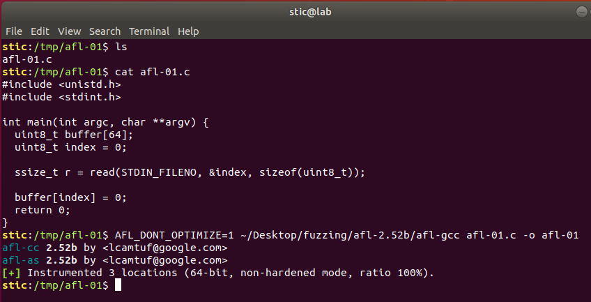
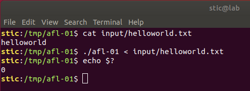
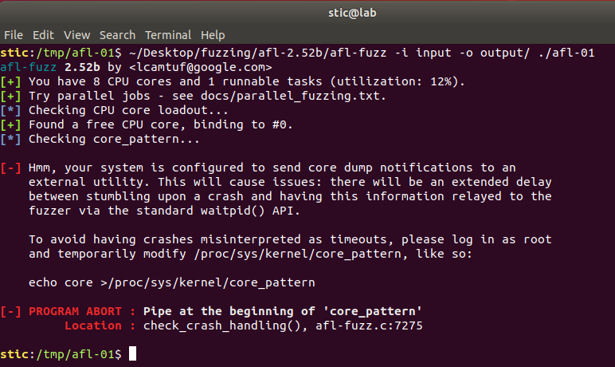
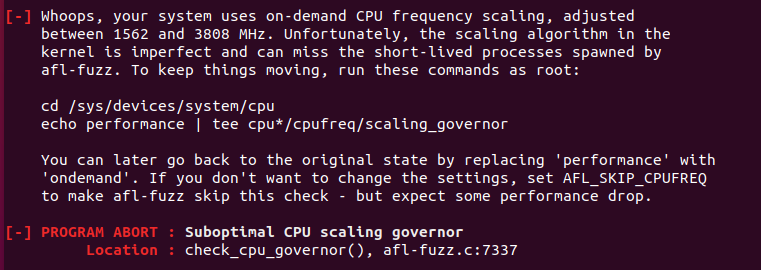
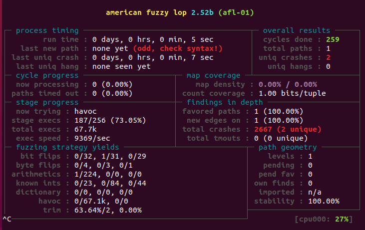
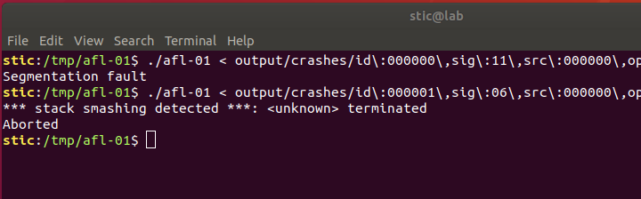

# AFL-01

**Objetivo**: Utilizar AFL para encontrar algún problema de corrupción de memoria en el siguiente programa:

```c
#include <unistd.h>
#include <stdint.h>

// hint: Definir AFL_DONT_OPTIMIZE=1 al momento de compilar!

int main(int argc, char **argv) {
  uint8_t buffer[64];
  uint8_t index = 0;

  ssize_t r = read(STDIN_FILENO, &index, sizeof(uint8_t));

  buffer[index] = 0;
  return 0;
}
```


## Solución

American Fuzzy Lop (AFL) es un fuzzer muy efectivo y muy sofisticado. El fuzzer funciona instrumentando los binarios en prueba con instrucciones adicionales que le permiten hacer más efectivo el proceso de fuzzing. Esto implica, sin embargo, que los binarios deben ser efectivamente instrumentados y para ello AFL provee compiladores afl-gcc y afl-clang.

Habiendo descargado, descomprimido y compilado AFL, lo que debemos hacer entonces es compilar nuestra aplicación utilizando alguno de los compiladores generados. Esto implica, evidentemente, que será necesario contar con el código fuente del programa en prueba. Eventualmente veremos un mecanismo alternativo que permite utilizar AFL para estudiar binarios cerrados. Por el momento, sin embargo, nos limitaremos a estudiar el funcionamiento básico del fuzzer con un programa cuyo código conocemos.

Procedemos entonces a compilar el programa con afl-gcc. Ejecutamos el comando

```bash
AFL_DONT_OPTIMIZE=1 afl-gcc afl-01.c -o afl-01
```

como se muestra en la siguiente captura:



**Nota:** AFL por defecto compila con -O3. En algunas ocasiones (y en especial para ejemplos de juguete como éste) esto puede eliminar posibles casos de error. Pasamos entonces la variable AFL_DONT_OPTIMIZE=1 para indicarle al compilador que deshabilite las optimizaciones al momento de generar el binario.


Antes de ejecutar el fuzzer debemos realizar un paso adicional: debemos crear una o más entradas de ejemplo y colocarlas en algún directorio de solo lectura. También debemos crear un directorio donde el fuzzer colocará los hallazgos. Ejecutamos entonces:

```bash
# Creamos directorios input y output
mkdir input output

# Creamos un caso de prueba simple.
echo "helloworld" > input/helloworld.txt
```

Podemos también verificar que con este caso de prueba nuestro programa funciona correctamente:




Si lanzaramos el fuzzer ahora, veríamos probablemente un mensaje como el siguiente:




Modificamos entonces el archivo `/proc/sys/kernel/core_pattern` tal como indica AFL. Solo para tener en cuenta, el contenido original del archivo es el siguiente:

```
|/usr/share/apport/apport %p %s %c %d %P
```

Ejecutamos entonces

```bash
sudo bash -c "echo core > /proc/sys/kernel/core_pattern"
```

Podemos restaurar el valor original ejecutando

```
sudo bash -c "echo -ne '|/usr/share/apport/apport %p %s %c %d %P' > /proc/sys/kernel/core_pattern"
```


Si ejecutaramos AFL nuevamente podríamos observar probablemente algo como lo siguiente:




A modo de referencia, podemos ejecutar el siguiente comando para verificar los valores actualmente almacenados en los archivos:

```bash
cat /sys/devices/system/cpu/cpu*/cpufreq/scaling_governor
```

En nuestro caso particular, todos los archivos contienen el valor "powersave". Procedemos entonces a ejecutar el comando que sugiere AFL:

```bash
sudo bash -c "echo performance | tee /sys/devices/system/cpu/cpu*/cpufreq/scaling_governor"
```

Para restaurar el valor por defecto, usaríamos entonces

```
sudo bash -c "echo powersave | tee /sys/devices/system/cpu/cpu*/cpufreq/scaling_governor"
```


Ahora sí procedemos a ejecutar el fuzzer. El comando a ejecutar es el siguiente:

```bash
afl-fuzz -i input -o output ./afl-01
```

La opción `-i` le indica al fuzzer que el directorio input es el que contiene los casos de ejemplo; la opción `-o` le indica dónde colocar sus reportes y los archivos necesarios en tiempo de ejecución.

Ejecutamos entonces el comando. No pasan más que unos pocos segundos antes de que el fuzzer encuentre algunos casos de error:



En el directorio output/crash encontramos las entradas que causaron los errores. La primera causa un error de segmentación, mientras que la segunda causa en cambio la corrupción de un canario:




## Importante: recomendación adicional

Para mejorar el rendimiento,  y **para evitar reducir el tiempo de vida del disco debido a la cantidad enorme de escrituras que realiza AFL**, conviene crear un filesystem en memoria. Será allí donde deberemos colocar nuestros archivos de entrada, nuestro directorio de salida, y si es posible también el programa en prueba. Si dicho programa lee archivos de configuración del disco, también puede ser buena idea colocar dicha configuración en este filesystem.

Para crear un filesystem en memoria podemos hacer lo siguiente:

```bash
# Creamos el directorio debajo del cuál estará el filesystem
mkdir /tmp/afl-ramdisk && chmod 600 /tmp/afl-ramdisk

# Montamos un filesystem temporal en /tmp/afl-ramdisk
mount -t tmpfs -o size=512M tmpfs /tmp/afl-ramdisk
```

Luego, solo es cuestión de colocar los archivos relevantes en /tmp/afl-ramdisk (e.g. directorios de input y output, y posiblemente también ejecutables y archivos utilizados por el programa en prueba)

Algo más a tener en cuenta es que la ejecución de AFL puede poner una carga importante sobre el sistema, por períodos posiblemente extensos. No es mala idea entonces monitorear periódicamente el estado del sistema con herramientas como **nmon**.