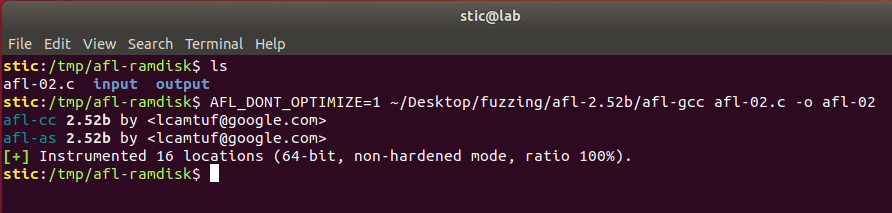
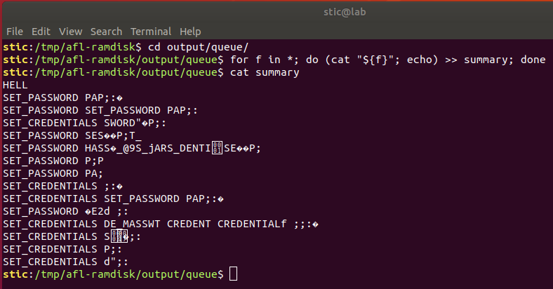
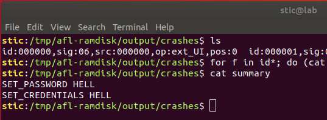

# AFL-02

**Objetivo**: Utilizar AFL para encontrar al menos dos flujos diferentes que causan corrupción de memoria en el siguiente programa:

```c
#include <unistd.h>
#include <stdint.h>
#include <stdio.h>
#include <stddef.h>
#include <string.h>

typedef struct {
  char name[64];
  char address[64];
} profile_t;

typedef struct {
  char username[64];
  char password[64];
  profile_t *profile;
} user_t;

int main(int argc, char **argv) {
  char buffer[256];

  user_t user;
  bzero((void*)&user, sizeof(user_t));

  profile_t profile;
  bzero((void*)&profile, sizeof(profile_t));

  user.profile = &profile;

  ssize_t r = read(STDIN_FILENO, &buffer, 128);

  if (strncmp("SET_CREDENTIALS ", (char*)&buffer, 16) == 0) {
    int x = 0;

    for (int i = 0; buffer[i + 16] != ':'; i++, x++) {
      user.username[i] = buffer[i + 16];
    }
    x++;
    for (int i = 0; buffer[i] != ';'; i++) {
      user.password[i] = buffer[x];
    }
    
  } else if (strncmp("SET_PASSWORD ", (char*)&buffer, 13) == 0) {
    for (int i = 0; buffer[i + 13] != ';'; i++) {
      user.password[i] = buffer[i + 13];
    }
  }
  
}
```


## Solución

Este ejercicio es oportuno para introducir los diccionarios de AFL. Resulta que AFL por sí solo no es tan efectivo al momento de fuzzear formatos con gramática sofisticada. Un mecanismo que puede ayudar en estos casos es el de los diccionarios. Un diccionario es un conjunto de tokens que AFL intentará combinar de diversas formas al momento de generar entradas para el programa en prueba. Combinado con el mecanismo de aprendizaje basado en cobertura de AFL, esto puede ser suficiente para lograr un rendimiento aceptable incluso lidiando con gramáticas complejas como SQL o HTML.


Supongamos entonces que tenemos un ramdisk montado en /tmp/afl-ramdisk. Colocamos allí el código de nuestro programa, compilamos, y creamos también directorios input y output.

```bash
AFL_DONT_OPTIMIZE=1 afl-gcc afl-02.c -o afl-02
```



Procedemos ahora a crear nuestro diccionario. Un diccionario es una lista de pares clave-valor; se puede definir en un archivo de texto, con un token por línea:

```
# mygrammar.dict

set_credentials="SET_CREDENTIALS "
set_password="SET_PASSWORD "
```

Guardaremos el diccionario en /tmp/afl-ramdisk/mygrammar.dict. Adicionalmente, debemos crear un corpus inicial para AFL. Para ver qué tan efectivo es el mecanismo de los diccionarios, creamos un solo caso de prueba con poca cobertura, y que poco tiene que ver con los tokens listados:

```bash
echo HELLOWORLD > input/sample
```


Continuamos ejecutando AFL, pasando la opción adicional -x /tmp/afl-ramdisk/mygrammar.dict para indicarle al fuzzer dónde encontrar el diccionario:

```bash
afl-fuzz -i input -o output -x mygrammar.dict ./afl-02
```


No deberían pasar más que unos pocos segundos antes de que el fuzzer encuentre al menos dos casos de error. Si listamos el contenido de los archivos en el directorio output/queue, veremos que el fuzzer construyó efectivamente varias entradas de prueba en base a los tokens provistos:




En el directorio output/crashes, por otro lado, encontramos los primeros casos de prueba encontrados para cada flujo de error:




Si observamos podremos notar que AFL combina a veces varios tokens en una misma entrada, lo cuál puede ser necesario cuando se trata con gramáticas complejas. Como ya se mencionó antes, el feedback que recibe AFL de su análisis de cobertura puede ser suficiente para que el fuzzer aprenda lo suficiente de la gramática para llegar a estudiar casos interesantes. Por ejemplo,

http://lcamtuf.blogspot.com/2015/04/finding-bugs-in-sqlite-easy-way.html


## Referencias

* http://lcamtuf.coredump.cx/afl/README.txt
* https://github.com/rc0r/afl-fuzz/tree/master/dictionaries
* http://lcamtuf.blogspot.com/2015/04/finding-bugs-in-sqlite-easy-way.html

