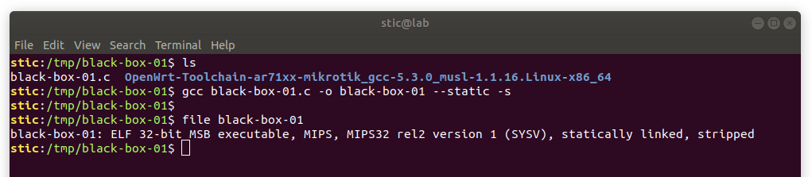
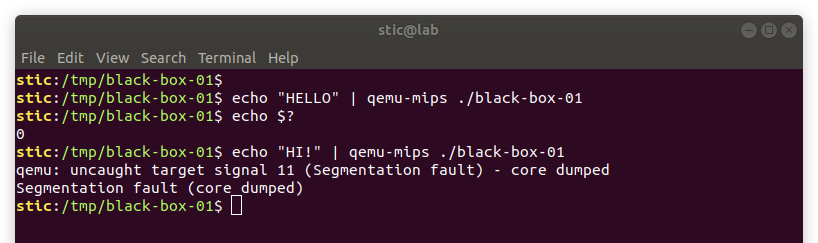
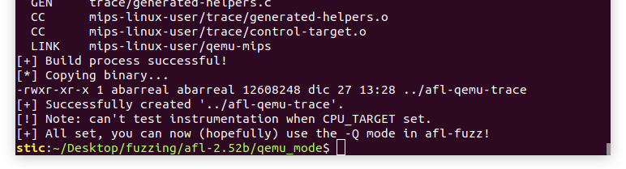
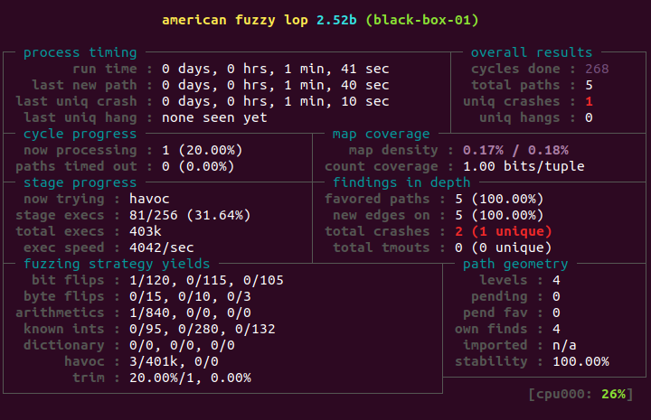

# Black-Box-01

**Obetivo**: Fuzzear el binario MIPS generado a partir del código listado a continuación.

```c
// black-box-01.c

#include <unistd.h>

int main(int argc, char **argv) {
    char buffer[64];
    
    ssize_t r = read(STDIN_FILENO, &buffer, 64);
    
    if (r > 0 && buffer[0] == 'H')
        if (r > 1 && buffer[1] == 'I')
            if (r > 2 && buffer[2] == '!')
                *(char*)(0) = 0;
    
    return 0;
}
```

La idea del ejercicio es no instrumentar el binario, sino trabajar sobre una versión generada por mediante un procedimiento de compilación normal. Para generar un binario para MIPS se recomienda utilizar las toolchains precompiladas de OpenWRT.


## Generación de un binario MIPS

Para generar el binario utilizaremos [esta toolchain](https://archive.openwrt.org/snapshots/trunk/ar71xx/mikrotik/OpenWrt-Toolchain-ar71xx-mikrotik_gcc-5.3.0_musl-1.1.16.Linux-x86_64.tar.bz2), disponible en el sitio de OpenWRT.

```bash
# Creamos un directorio para el ejercicio.
mkdir /tmp/black-box-01 && cd /tmp/black-box-01

## Descargamos la toolchain.
wget https://archive.openwrt.org/snapshots/trunk/ar71xx/mikrotik/OpenWrt-Toolchain-ar71xx-mikrotik_gcc-5.3.0_musl-1.1.16.Linux-x86_64.tar.bz2 .

# Descomprimimos el archivo.
tar xvjf OpenWrt-Toolchain-ar71xx-mikrotik_gcc-5.3.0_musl-1.1.16.Linux-x86_64.tar.bz2
```


Para activar la toolchain utilizamos [este script](https://github.com/mzpqnxow/gdb-static-cross/blob/master/activate-script-helpers/activate-openwrt-toolchain.env) disponible en el repositorio del usuario "mzpqnxow". Simplemente colocamos el script en el directorio debajo del toolchain (en donde están los directorios bin y lib) y desde ese directorio ejecutamos

```bash
source ./activate-openwrt-toolchain.env
```

> Nota: en este caso podría ser necesario también editar el script 
>
> **mips-openwrt-linux-musl-wrapper.sh**
>
> en el directorio bin del toolchain. Lo que hay que hacer concretamente es agregar una línea justo antes del case al final del script. Las últimas líneas del script quedarían entonces como
>
> ```bash
> #
> # Run the cross-tool.
> #
> 
> BINARY=`basename $BINARY` # AGREGAMOS ESTA LÍNEA
> 
> case $BINARY in
>         # El cuerpo del case queda igual
> esac
> 
> exit 0
> ```


Procedemos compilando el programa del ejercicio y verificando que se trata de un binario MIPS.

```bash
# Compilamos
gcc black-box-01.c -o black-box-01 --static -s

# Verificamos que se trata de un ejecutable MIPS
file black-box-01
```




Para ejecutar programas de otras arquitecturas podemos usar **qemu**. Con qemu instalado podemos ejecutar, por ejemplo,

```bash
qemu-mips ./black-box-01
```



Como sería de esperarse, pasar "HI!" por entrada estandar causa un error de segmentación. Con esto ya tenemos un binario MIPS que podemos utilizar para nuestras prácticas de fuzzing.


## Fuzzing

Para fuzzear el binario en modo caja negra podemos usar el modo -Q de AFL. Primero, sin embargo, debemos compilar una versión instrumentada de qemu, que permitirá que AFL aplique su algoritmo de aprendizaje incluso sin haber instrumentado el programa objetivo en sí.

En el subdirectorio qemu_mode, en el directorio de AFL, encontramos un README que nos muestra cómo compilar un qemu instrumentado para la arquitectura que requerimos. Lo que debemos hacer entonces es ejecutar el script build_qemu_support.sh, estableciendo la variable CPU_TARGET.

```bash
CPU_TARGET=mips ./build_qemu_support.sh
```


Si estamos utilizando Linux 18.04 podría darse que la compilación falle; qemu define funciones memfd que entran en conflicto con las definiciones de glibc 2.27. Para resolver el problema podemos aplicar el parche [aquí provisto](http://lists.openembedded.org/pipermail/openembedded-core/2018-January/146949.html).

Concretamente, podemos crear dos archivos configure.diff y memfd.diff en el directorio patches, con los siguientes contenidos respectivamente:

```diff
--- qemu-2.10.0-clean/configure	2017-08-30 13:50:40.000000000 -0300
+++ qemu-2.10.0/configure	2018-12-27 12:50:51.112987645 -0300
@@ -3855,7 +3855,7 @@
 # check if memfd is supported
 memfd=no
 cat > $TMPC << EOF
-#include <sys/memfd.h>
+#include <sys/mman.h>
 
 int main(void)
 {
```

```diff
--- qemu-2.10.0-clean/util/memfd.c	2017-08-30 13:50:41.000000000 -0300
+++ qemu-2.10.0/util/memfd.c	2018-12-27 12:51:31.826268540 -0300
@@ -31,9 +31,7 @@
 
 #include "qemu/memfd.h"
 
-#ifdef CONFIG_MEMFD
-#include <sys/memfd.h>
-#elif defined CONFIG_LINUX
+#if defined CONFIG_LINUX && !defined CONFIG_MEMFD
 #include <sys/syscall.h>
 #include <asm/unistd.h>
```


Luego hay que modificar el script build_qemu_support.sh, agregando un par de líneas en la sección donde se aplican los parches:

```bash
echo "[*] Applying patches..."

patch -p1 <../patches/elfload.diff  	|| exit 1
patch -p1 <../patches/cpu-exec.diff 	|| exit 1
patch -p1 <../patches/syscall.diff  	|| exit 1
patch -p1 <../patches/memfd.diff	    || exit 1 # 1
patch -p1 <../patches/configure.diff    || exit 1 # 2

echo "[+] Patching done."
```


Con esto, si ejecutamos el build script deberíamos ver eventualmente lo siguiente:




El siguiente paso entonces es efectivamente ejecutar el fuzzer para testear nuestro binario. Procederemos entonces como siempre, creando directorios para la entrada, la salida, un caso de prueba básico, y procederemos a ejecutar el fuzzer. Si fueramos a fuzzear por tiempo prolongado también montaríamos un disco virtual en memoria. En cualquier caso, ejecutamos lo siguiente:

```bash
# En el directorio de pruebas creamos los directorios de entrada y salida.
mkdir input output

# Creamos un caso de prueba básico.
echo -ne "hello" > input/sample

# Ejecutamos el fuzzer.
afl-fuzz -i input -o output -m 4096 -Q ./black-box-01
```


Luego de algunos segundos deberíamos notar que AFL encuentra efectivamente un caso de error:



