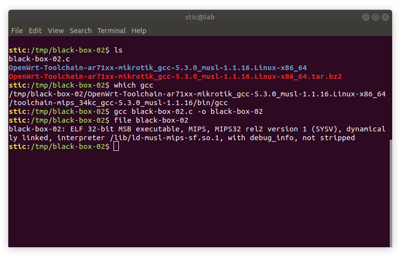
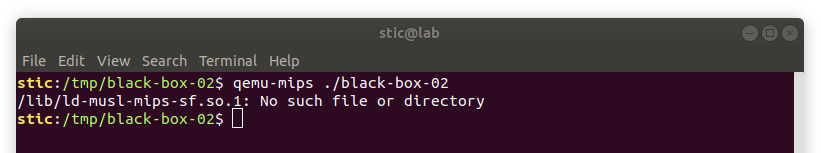
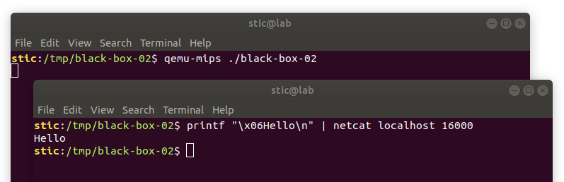
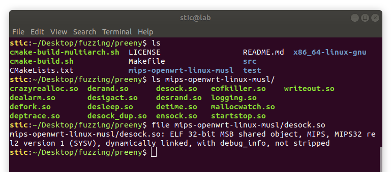
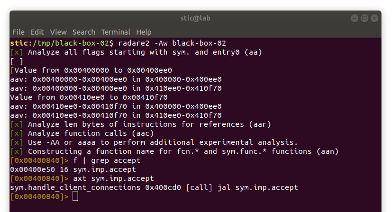
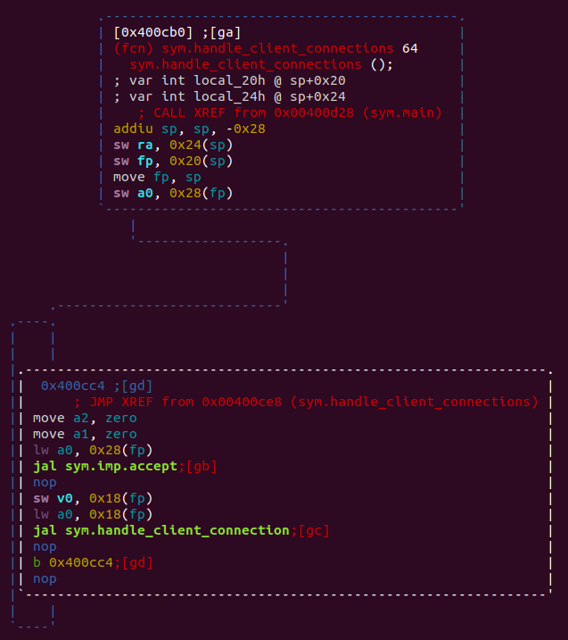
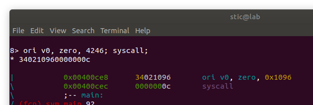
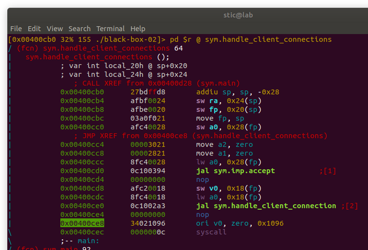
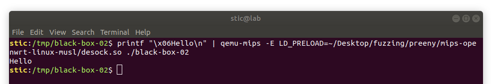
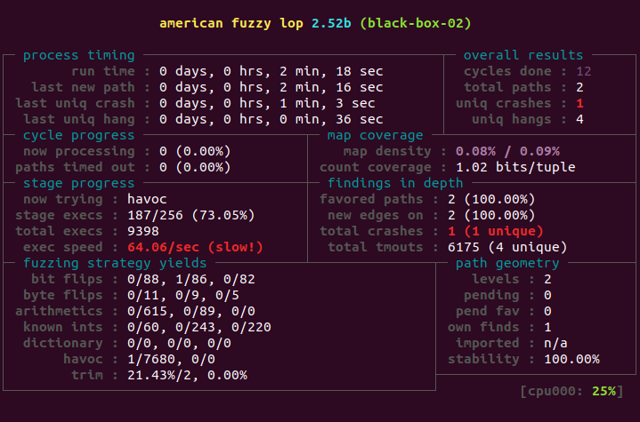

# Black-Box-02

**Objetivo**: Fuzzear un servidor TCP compilado para MIPS, sin instrumentar, utilizando el modo -Q de AFL, y usando también preeny desock. No enlazar estáticamente. 

El código del servidor es el siguiente:

```c
#include <netinet/in.h>
#include <sys/types.h>
#include <sys/socket.h>
#include <unistd.h>
#include <stdint.h>
#include <strings.h>
#include <string.h>

#define PORT 16000
#define CONNECTION_BACKLOG 10

void finish_connection(int socket) {
  shutdown(socket, SHUT_RDWR);
  close(socket);
}

void handle_client_connection(int s_client) {
  uint8_t len = 0;
  uint8_t buffer[64];
    
  // Recibimos un byte que indica la longitud del paquete.
  ssize_t r = recv(s_client, &len, sizeof(uint8_t), 0);
    
  if (r != 1) {
    finish_connection(s_client);
    return;
  }
    
  // Recibimos el cuerpo del mensaje.
  uint8_t total = 0;
  
  while (total < len) {
    r = recv(s_client, &buffer + total, len - total, 0);
      
    if (r < 0) {
      finish_connection(s_client);
      return;
    } else {
      total += r;
    }
  }
   
  // Hacemos eco del cuerpo del mensaje.
  ssize_t s = send(s_client, buffer, len, 0);

  // Finaliza el intercambio de datos y cierra el socket.
  finish_connection(s_client);
}

int initialize_server() {
  struct sockaddr_in server_address;

  // Pone en cero la memoria de la estructura.
  bzero(&server_address, sizeof(server_address));

  // Inicializa el socket que escuchará conexiones.
  int s_listen = socket(AF_INET, SOCK_STREAM, 0);

  // Finaliza la ejecucion en caso de error.
  if (s_listen < 0) {
    return -1;
  }

  server_address.sin_family = AF_INET;
  server_address.sin_addr.s_addr = htonl(INADDR_LOOPBACK);
  server_address.sin_port = htons(PORT);

  // Asocia el descriptor del socket s_listen a la dirección.
  struct sockaddr *addr = (struct sockaddr *)&server_address;
  bind(s_listen, addr, sizeof(server_address));

  // Pone a escuchar el socket.
  listen(s_listen, CONNECTION_BACKLOG);

  // El socket que escucha ya ha sido inicializado y está asociado
  // al puerto PORT en la interfaz local; devolvemos el descriptor.
  return s_listen;
}

void handle_client_connections(int s_listen) {
  for (;;) {
      
    // Acepta una conexión entrante y devuelve el socket.
    int s_client = accept(s_listen, (struct sockaddr*) NULL, NULL);

    // Maneja la conexión del cliente.
    handle_client_connection(s_client);
  }
}

int main(int argc, char **argv) {
  // Inicializa el socket que escuchará por conexiones de clientes.
  int s_listen = initialize_server();

  /*
   * Si el socket fue inicializado correctamente, se aceptan
   * y se manejan las conexiones entrantes.
   */
  if (s_listen > 0) {
    handle_client_connections(s_listen);
  }
}
```


## Solución

Comenzamos compilando el servidor para MIPS y ejecutándolo con Qemu para verificar su correcto funcionamiento. Procedemos tal como se indica en la solución del ejercicio black-box-01: utilizamos una toolchain de OpenWRT para compilar un binario MIPS.



Habiendo generado el binario notaremos que, de intentar ejecutarlo, Qemu reportará (o debería reportar) un error como el siguiente:

```
/lib/ld-musl-mips-sf.so.1: No such file or directory
```




Es decir, Qemu no encuentra la biblioteca musl, una versión más compacta de libc, enlazada por la toolchain que elegimos para generar el binario. Ciertamente, el problema se solucionaría muy fácil recompilando el binario con enlace estático, aunque asumiremos que ésto no es una opción. Cuando estemos fuzzeando firmware será usual no contar con el código fuente, y será usual tener que preparar un entorno de ejecución adecuado para el software que estamos estudiando.

Para preparar dicho entorno en este caso, como se trata de un ejemplo muy sencillo, podemos crear temporalmente symlinks en /lib que apunten a las bibliotecas en el directorio lib de nuestra toolchain:

```bash
# Creamos un symlink a ld-musl-mips-sf.so.1
sudo ln -s /tmp/black-box-02/OpenWrt-Toolchain-ar71xx-mikrotik_gcc-5.3.0_musl-1.1.16.Linux-x86_64/toolchain-mips_34kc_gcc-5.3.0_musl-1.1.16/lib/ld-musl-mips-sf.so.1 /lib

# Creamos un symlink a libgcc_s.so.1
sudo ln -s /tmp/black-box-02/OpenWrt-Toolchain-ar71xx-mikrotik_gcc-5.3.0_musl-1.1.16.Linux-x86_64/toolchain-mips_34kc_gcc-5.3.0_musl-1.1.16/lib/libgcc_s.so.1 /lib
```

En este ejemplo lidiamos con dos bibliotecas y con ningún path absoluto; tampoco lidiamos con IPC más allá de los sockets, de los cuales se encargará preeny. En un caso sencillo como éste usar symlinks es admisible y suficiente. Usualmente, sin embargo, emular un entorno de ejecución real puede ser muy complicado, y solo crear algunos links no bastará para hacer que los programas funcionen correctamente. Hay técnicas alternativas que consisten en restringir el acceso de las aplicaciones a un subárbol del sistema de archivos, proveyéndoles a su vez un directorio raíz falso (e.g. chroot jails). Estas técnicas, sin embargo, pueden requerir preparativos adicionales potencialmente complejos, dependiendo del software que está siendo analizando. Para este ejemplo simplemente ignoraremos los detalles más crudos y nos enfocaremos en el caso ideal simplificado.

Dicho ésto, ya deberíamos poder ejecutar nuestro servidor MIPS:




Si lo que queremos ahora es utilizar preeny, será necesario compilar una versión de la biblioteca para MIPS. Asumiendo el entorno del toolchain activo, podemos ejecutar el siguiente comando en el directorio de preeny:

```bash
CC=gcc make -i
```

Tendremos entonces los correspondientes binarios de preeny, compilados para MIPS:




Si ejecutamos ahora el programa como se indica a continuación deberíamos ver que el servidor toma efectivamente nuestra entrada estándar y la procesa como si proviniera de un socket, mostrando luego la correspondiente salida en la terminal:

```bash
printf "\x06Hello\n" | qemu-mips -E LD_PRELOAD=<ruta desock.so MIPS> ./black-box-02
```


Notaremos, sin embargo, que el programa no termina inmediatamente, sino que se queda en un ciclo infinito esperando entradas adicionales. Recordaremos que en los ejercicios tcp-0x (cuando trabajabamos con código fuente) era necesario modificar el código para que el servidor terminara adecuadamente luego de procesar la entrada, y que no se quedara en un ciclo esperando pedidos adicionales. Si queremos fuzzear nuestro binario será entonces necesario lograr algo similar. Lo que haremos en este caso es parchear el binario en el lugar adecuado, inyectando una llamada a una syscall para que el programa termine satisfactoriamente.

Abriremos entonces nuestro binario con radare2 y buscaremos la llamada a la función accept, encargada de aceptar nuevas conexiones.




Habiendo ubicado la llamada a accept en la función handle_client_connections, analizaremos el flujo de ejecución de la función visualmente. Ejecutamos

```
VV @ sym.handle_client_connections
```




Para que el programa finalice satisfactoriamente, lo que deberíamos hacer entonces es de alguna forma inyectar las instrucciones

```assembly
ori $v0, $0, 4246
syscall
```

luego de la llamada a la función "handle_client_connection". Estas instrucciones ejecutarán la syscall exit_group, finalizando la ejecución del programa. Para llegar al código del syscall nos guiamos por los identificadores definidos en el archivo [syscall_nr.h](https://github.com/hackndev/qemu/blob/master/linux-user/mips/syscall_nr.h) y al [ejemplo con syscalls](https://github.com/hackndev/qemu/blob/master/linux-user/mips/syscall_nr.h), disponibles en el repositorio de Qemu.

Usando funcionalidad adicional de radare2 observaremos que las instrucciones 

```assembly
b 0x400cc4
nop
```

luego de la llamada a "handle_client_connection" se encuentran a partir de la dirección `0x400ce8`. Dado que en MIPS 32 cada instrucción ocupa exactamente 4 bytes, lo que haremos es reemplazar esas dos instrucciones por las otras dos anteriores que ejecutan la syscall exit_group. Ejecutamos

```
s 0x400ce8
```

para ubicarnos en esa dirección. Ejecutaremos luego `V` para entrar a modo visual, y `A` para entrar en modo ensamblador. Escribiremos entonces

```
ori v0, zero, 4246; syscall;
```




Presionaremos enter dos veces y notaremos que el código de nuestro programa habrá sido modificado satisfactoriamente.




Si ejecutamos ahora nuestro programa con desock como lo habíamos hecho previamente, deberíamos observar algo como lo siguiente:



Observamos que nuestro programa finaliza satisfactoriamente luego de procesar una sola entrada. Habiendo preparado nuestro binario, solo es cuestión de ejecutar AFL en modo -Q. Ejecutamos los siguientes comandos para preparar los directorios y una muestra inicial:

```bash
# Creamos el directorio con los datos de entrada.
mkdir input && echo -ne "\x06Hello\n" > input/sample

# Creamos el directorio de salida.
mkdir output

# Ejecutamos AFL -Q
LD_PRELOAD=<ruta desock.so> afl-fuzz -i input -o output -Q -m 4096 ./black-box-02
```

Al ejecutar el fuzzer notaremos que el programa registra muchos timeouts. Esto se debe a que el loop del recv espera recibir una cierta cantidad de bytes antes de continuar, dependiendo de la estructura de la entrada, y habrá muchos casos de prueba en los cuáles la entrada no tendrá la forma adecuada. Una posibilidad para corregir el desperfecto sería parchear también el loop, aunque en general esto puede resultar en falsos positivos. En cualquier caso, para este ejemplo sencillo el fuzzer no debería tardar mucho en encontrar al menos un crash:



Con este procedimiento logramos entonces fuzzear efectivamente un servidor MIPS en modo caja negra, sin contar con código fuente instrumentable.
