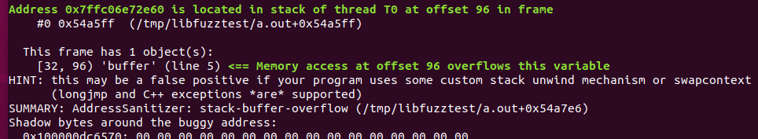

# libFuzzer-01

**Objetivo**: Utilizar libFuzzer para encontrar algún problema de corrupción de memoria en el siguiente código:

```c
#include <stdint.h>

void MyFunction(const uint8_t *input, size_t size) {
    uint8_t buffer[64];
    
    for (int i = 0; i < size; i++) {
        buffer[i] = input[i];
    }
}
```


## Solución

LibFuzzer [1] es una biblioteca que permite implementar fuzzing evolutivo guiado por cobertura. La biblioteca es parte del proyecto Clang y viene ya incorporada a partir de la versión 6.0 del compilador, disponible en los repositorios de Ubuntu.

El modo de operación es el siguiente: libFuzzer se enlaza con el código siendo evaluado y alimenta datos generados por el sistema de generación a dicho código a través de un punto de entrada denominado "función objetivo". Para implementar un fuzzer, entonces, hay que implementar una función objetivo que, provista la entrada generada por el sistema de generación, la procese y la provea adecuadamente a nuestro código a través de la correspondiente interfaz.

Algo importante a tener en cuenta es que libFuzzer requiere poder compilar el código en prueba. A dicho código habrá que agregarle en algún lado una función objetivo que tendrá usualmente una apariencia como la siguiente:

```c
extern "C" int LLVMFuzzerTestOneInput(const uint8_t *Data, size_t Size) {
  DoSomethingWithData(Data, Size); // Interactua con nuestro código
  return 0;
}
```

Algunos detalles a tener en cuenta al momento de definir la función objetivo (ver [1]):

* El motor de fuzzing ejecutará la función objetivo muchas veces con diferentes entradas en el mismo proceso.
* Debe tolerar cualquier tipo de entrada.
* No debe ejecutar exit() para ninguna entrada.
* Puede usar threads, pero idealmente deben unirse al final de la función.
* Debe tan determinista como sea posible. No determinismo (e.g. decisiones aleatorias no basadas en los datos de entrada) harán al fuzzing ineficiente.
* Debe ser rápida. No conviene utilizar complejidad cúbica o mayor, logging, o comsumo excesivo de memoria.
* Idealmente no debe modificar ningún estado global.
* Usualmente, mientras más estrecho el objetivo mejor; por ejemplo, si el sistema en prueba puede parsear varios formatos, particionarlo en muchas funciones objetivo, una por formato.


Luego, para construir el fuzzer hay que compilar usando el compilador Clang, pasando los flags

* `-fsanitize=fuzzer` (requerido)
* `-fsanitize=address` (recomendado en [2]) para habilitar Address Sanitizer (ASAN). Address Sanitizer es un mecanismo que implementa detección de accesos inválidos a memoria en tiempo de ejecución. Esto permite detectar bugs de corrupción de memoria incluso cuando la entrada en cuestión no hubiese ocasionado un error de segmentación o algún otro tipo de crash.
* `-g` (recomendado en [2]) para habilitar información de debug.

Otros flags adicionales sugeridos en [1] son

* Aquellos correspondientes a UBSAN (Undefined Behavior Sanitizer), listados en
  http://clang.llvm.org/docs/UndefinedBehaviorSanitizer.html
* `-fsanitize=memory` para incorporar MSAN (Memory Sanitizer), el cuál se describe en
  http://clang.llvm.org/docs/MemorySanitizer.html


Lo que haremos entonces es agregar a nuestro código original una función objetivo:

```c
#include <stdint.h>
#include <stddef.h>

void MyFunction(const uint8_t *input, size_t size) {
    uint8_t buffer[64];
    
    for (int i = 0; i < size; i++) {
        buffer[i] = input[i];
    }
}

extern int LLVMFuzzerTestOneInput(const uint8_t *data, size_t size) {
  MyFunction(data, size);
  return 0;
}
```


Guardamos el código en un archivo test.c y compilamos entonces ejecutando

```bash
clang -g -fsanitize=address,fuzzer test.c
```


Procedemos ahora a ejecutar el binario a.out generado. Observaremos cómo rápidamente el fuzzer encuentra el caso de error:




## Referencias

[1] libFuzzer: a library for coverage-guided fuzz testing:<br/>https://llvm.org/docs/LibFuzzer.html

[2] Fuzzer Test Suite tutorial:<br/>https://github.com/google/fuzzer-test-suite/blob/master/tutorial/libFuzzerTutorial.md