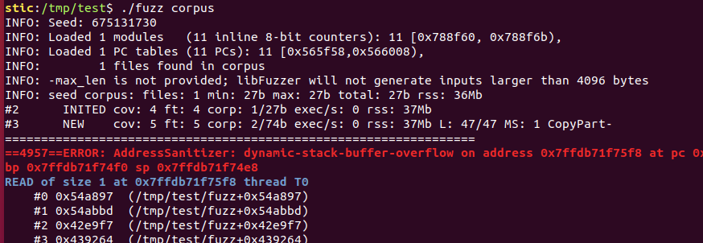
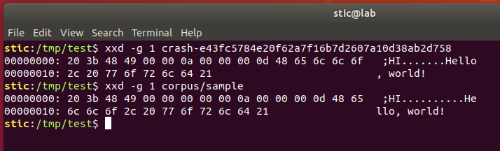

# libFuzzer-02

**Objetivo**: Utilizar libFuzzer y un corpus definido manualmente para encontrar algún problema de corrupción de memoria en el siguiente código:

```c
#include <stdint.h>

int ReplaceInDataSection(uint8_t *buffer, char replace, char replacement) {

    if (buffer[0] != 'H' || buffer[1] != 'I') {
        return -1;
    }

    uint32_t version = *(uint32_t*)(buffer + 4);

    if (version != 10) {
        return -2;
    }

    uint32_t data_size = *(uint32_t*)(buffer + 8);
    uint32_t count = 0;

    uint8_t *data_buffer = buffer + 12;

    for (uint32_t i = 0; i < data_size; i++) {
        if ((char)data_buffer[i] == replace) {
            data_buffer[i] = (uint8_t)replacement;
            count++;
        }
    }
   
    return count;
}
```


## Solución

Observamos que la función espera un bloque de datos, y realizará un cierto procesamiento si este bloque de datos tiene un cierto formato particular. Para utilizar libFuzzer debemos escribir una función objetivo. Consierando que la entrada debe tener un cierto formato particular, podemos ayudar al fuzzer proveyendo también un caso de ejemplo sobre el cuál trabajar.

En principio, nuestra función objetivo podría ser la siguiente:

```c
extern void LLVMFuzzerTestOneInput(const uint8_t *data, size_t size) {
    if (size < 3) return;
    uint8_t buffer[size];
    memcpy(buffer, data, size);
    ReplaceInDataSection(&buffer[2], data[0], data[1]);
}
```


El código del fuzzer queda entonces de la siguiente forma:

```c
// fuzzer.c

#include <stdint.h>
#include <stddef.h>
#include <string.h>

int ReplaceInDataSection(uint8_t *buffer, char replace, char replacement) {

    if (buffer[0] != 'H' || buffer[1] != 'I') {
        return -1;
    }

    uint32_t version = *(uint32_t*)(buffer + 4);

    if (version != 10) {
        return -2;
    }

    uint32_t data_size = *(uint32_t*)(buffer + 8);
    uint32_t count = 0;

    uint8_t *data_buffer = buffer + 12;

    for (uint32_t i = 0; i < data_size; i++) {
        if ((char)data_buffer[i] == replace) {
            data_buffer[i] = (uint8_t)replacement;
            count++;
        }
    }
   
    return count;
}

extern void LLVMFuzzerTestOneInput(const uint8_t *data, size_t size) {
    if (size < 3) return;
    uint8_t buffer[size];
    memcpy(buffer, data, size);
    ReplaceInDataSection(&buffer[2], data[0], data[1]);
}
```


Luego, podemos crear nuestro ejemplo para inicializar libFuzzer; en el directorio donde se encuentra nuestro archivo ejecutamos

```bash
# Creamos el directorio que contendrá las muestras
mkdir corpus

# Creamos una muestra válida
echo -ne " ;HI\x00\x00\x00\x00\x00\x0a\x00\x00\x00\x0dHello, world!" > corpus/sample
```


Procedemos ahora a compilar con Clang

```bash
clang -g -fsanitize=address,fuzzer fuzzer.c -o fuzz
```

y ejecutamos el fuzzer indicando el directorio donde se encuentra nuestro corpus

```bash
./fuzz corpus
```


El fuzzer no debería tardar demasiado en encontrar un crash:



Observamos en el reporte que se encontró, efectivamente, un archivo en el corpus. Adicionalmente, si comparamos la entrada que causó el error con la muestra original, podemos ver qué es lo que hizo el fuzzer precisamente para lograr el crash:



Observamos que el fuzzer solo eliminó algunos bytes de la entrada. En cualquier caso, hay muchos tipos de entradas que podrían haber causado errores; el programa en cuestión no es particularmente robusto.