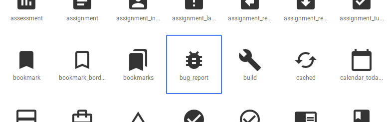
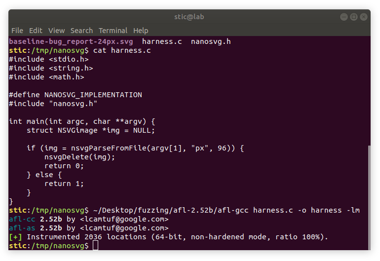
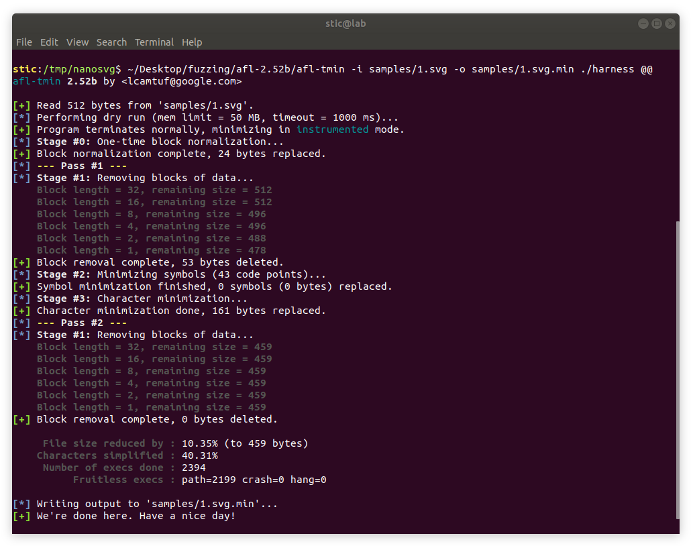
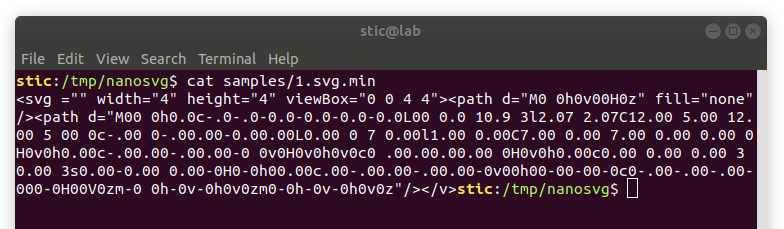
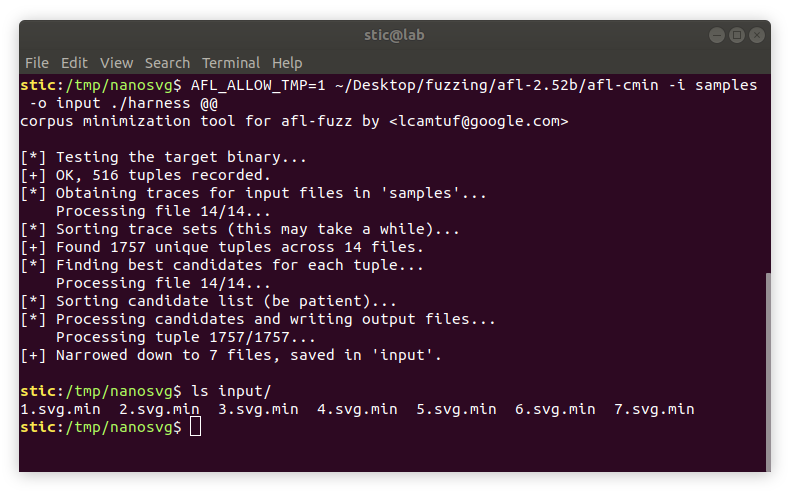
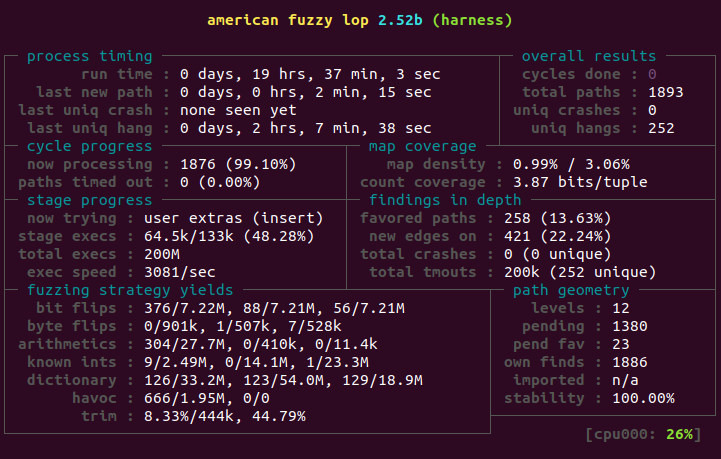
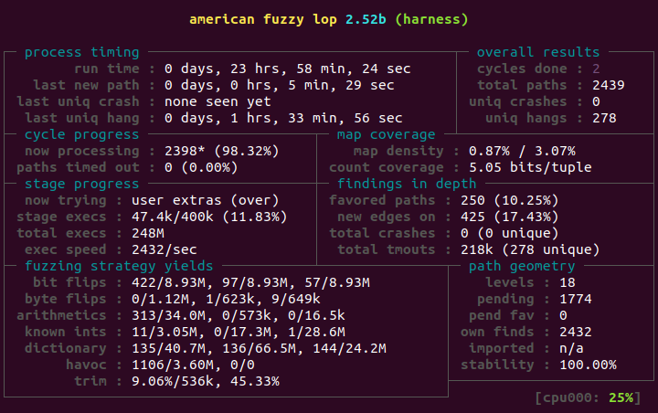

# Fuzzing nanosvg


## Sobre nanosvg

La biblioteca nanosvg (https://github.com/memononen/nanosvg) es un parser sencillo de archivos svg. Se trata de un único archivo .h que puede ser incluido fácilmente en cualquier proyecto. Adicionalmente, en el repositorio se provee un rasterizer, también en un único archivo .h.


## Creando un arnés de pruebas

Para fuzzear la biblioteca utilizaremos AFL. Ya que contamos oportunamente con una función nsvgParseFromFile que recibe como parámetro el nombre de un archivo, la aprovecharemos para introducir una funcionalidad de AFL que hasta el momento no habíamos visto: AFL ofrece la posibilidad de pasarle al programa el path a un archivo que contiene la entrada fuzzeada, en vez de pasar los datos directamente por entrada estándar. Alternativamente, la biblioteca ofrece también una función nsvgParse que trabaja sobre una cadena de bytes. Si bien usar la segunda resultaría probablemente más eficiente que usar la primera, para este ejercicio no nos preocuparemos demasiado por el rendimiento. Si bien introduciremos algunas herramientas para minimizar el conjunto de datos de entrada, no estaremos haciendo esfuerzos activos adicionales por optimizar el proceso de fuzzing. Tampoco estaremos utilizando el modo persistente de AFL, el cuál evaluaremos en algún otro ejercicio. Con esto dicho, nuestro arnés de pruebas podría ser el siguiente:

```c
#include <stdio.h>
#include <string.h>
#include <math.h>

#define NANOSVG_IMPLEMENTATION
#include "nanosvg.h"

int main(int argc, char **argv) {    
    struct NSVGimage *img = NULL;
    
    if (img = nsvgParseFromFile(argv[1], "px", 96)) {
        nsvgDelete(img)
        return 0;
    } else {
        return 1;
    }
}
```


Podemos probar el arnés con un archivo SVG simple: un ícono de Google, por ejemplo.




Descargamos el archivo SVG y lo colocamos en el directorio de pruebas. Colocamos allí todos los archivos y ejecutamos el siguiente comando:

```bash
afl-gcc harness.c -o harness -lm
```




Podemos verificar que el programa funciona correctamente ejecutando

```bash
# Ejecutamos el programa
./harness baseline-bug_report-24px.svg

# Mostramos en pantalla el estado de salida.
echo $?
```

y comprobando que el programa ha retornado 0.

**Nota:** Curiosamente, si pasamos el archivo harness.c en vez del archivo svg, el programa sigue retornando 0. Verificando con el debugger observamos que nsvgParseFromFile retorna un puntero a una imágen con tamaño 0.


## Creando un conjunto de datos de prueba

Para construir un set de datos podemos comenzar recopilando varios archivos SVG, de distintos tamaños y complejidad. Adicionalmente, considerando que se trata de datos estructurados, también resultará conveniente utilizar un diccionario. Ya que un SVG es esencialmente un archivo XML, en principio podemos utilizar el diccionario para XML provisto con AFL. Algunas imágenes de prueba podemos crearlas con [draw.io](https://www.draw.io), aunque resultará conveniente adquirir imágenes de distintas fuentes para tener más variedad en los detalles del formato. Algunos ejemplos básicos se encuentran disponibles en el directorio [samples](samples).


## Minimizando los datos

Contando con el diccionario y con algunas muestras, montamos un disco en memoria y colocamos allí todos los archivos relevantes. Para ello podemos ejecutar los comandos

```bash
# Creamos el directorio
mkdir /tmp/nanosvg && chmod 600 /tmp/nanosvg

# Montamos el ramdisk en /tmp/nanosvg
mount -t tmpfs -o size=2048M tmpfs /tmp/nanosvg

# Copiamos los datos al ramdisk y vamos al directorio en cuestión
cp -r samples /tmp/nanosvg && cd /tmp/nanosvg
```


Con los datos en su lugar, lo que haremos ahora es *minimizar* el conjunto de datos. La minimización se puede llevar a cabo con las herramientas **afl-cmin** y **afl-tmin**. Comenzaremos utilizando afl-tmin, como se muestra a continuación:

```bash
afl-tmin -i samples/1.svg -o samples/1.svg.min ./harness @@
```



Vemos que cerca del final de la ejecución, afl-tmin nos indica que el 40.31% de los caracteres del archivo fueron simplificados; es decir, el 40.31% de los caracteres del archivo original pueden ser eliminados sin afectar el flujo de ejecución causado por los datos de entrada. Si observamos el contenido del archivo 1.svg.min veremos algo como lo siguiente:

```bash
cat samples/1.svg.min
```



Es decir, vemos que AFL ha reemplazado varios bytes por caracteres '0'. Adicionalmente, parecería que nanosvg no tiene en cuenta el tag de cierre del elemento svg, considerando que AFL pudo reemplazarlo por un caracter 'v' sin afectar el flujo de ejecución.

Repetimos ahora el proceso para el resto de las muestras, generando archivos adicionales 2.svg.min hasta 7.svg.min inclusive. Lo que sigue a continuación es utilizar afl-cmin para minimizar los casos de prueba en su conjunto. 

**Nota**: Por defecto AFL no nos permite ejecutar afl-cmin en /tmp. Según la documentación, ésto puede ser un riesgo de seguridad modesto en sistemas multi usuario. Asumiendo un entorno controlado y de confianza podemos definir la variable AFL_ALLOW_TMP; alternativamente, podemos montar nuestro disco en memoria en otro directorio.

En cualquier caso, ejecutamos

```bash
AFL_ALLOW_TMP=1 afl-cmin -i samples -o input ./harness @@
```



Observamos que los archivos minimizados prevalecieron sobre los archivos originales. Otro que eso, parecería ser que no hay solapamiento entre ellos y AFL decidió conservarlos a todos. Con esto ya contamos con un conjunto de datos de prueba que podemos utilizar para fuzzear la biblioteca.


## Ejecutando el fuzzer

Procedemos ahora a fuzzear la biblioteca como lo venimos haciendo.

```bash
mkdir output && afl-fuzz -i input -o output -x xml.dict -t 40 ./harness @@
```

Durante la ejecución, AFL sustituirá el par de caracteres "@@" por la ruta al archivo que contiene la entrada fuzzeada. Es decir, en este caso AFL estará ejecutando nuestro arnés pasandole como primer argumento el nombre del archivo que contiene la entrada mutada.


AFL comienza entonces ejecutando varias pruebas determinísticas que suelen tardar varias horas. Se recomienda dejar al fuzzer corriendo suficiente tiempo para completar un ciclo de fuzzing. Un ciclo de fuzzing es un pase completo por todos los casos de prueba interesantes encontrados hasta el momento. Idealmente, sin embargo, el fuzzer debería ejecutarse por más tiempo inclusive. En la interfaz gráfica, AFL provee varias estadísticas que ayudan a determinar si conviene continuar con el proceso o si conviene cortar. La interfaz gráfica la estaremos estudiando a continuación, aunque no estaremos haciendo más que resumir lo que se menciona en la guía oficial [1].




En la esquina superior izquierda (en el bloque **process timing**) observamos información sobre el tiempo de ejecución (en este caso, 19 horas y media aproximadamente). También vemos hace cuánto tiempo AFL encontró un nuevo camino de ejecución por última vez (aproximadamente dos minutos, en este caso). Adicionalmente, vemos hace cuánto tiempo se detectó algún nuevo crash o algún nuevo hang (algún caso de prueba en el que el programa "colgó").

El bloque **overall results** nos da indicio de los resultados obtenidos hasta el momento. "Total paths" nos indica la cantidad total de caminos de ejecución diferentes encontrados hasta el momento. "Cycles done" nos indica la cantidad de ciclos terminados; el contador se pondrá verde cuando el fuzzer no haya encontrado nuevos caminos por períodos prolongados de tiempo, lo cuál nos indica que probablemente es buen momento para finalizar la ejecución. Las otras dos líneas nos indican la cantidad de crashes únicos y la cantidad de hangs únicos (identificados por el path de ejecución)  encontrados hasta el momento. En la captura vemos que se han encontrado muchos casos que hacen colgar a nanosvg, pero ningún crash.

El bloque **cycle progress** nos indica el progreso dentro del ciclo. En la captura vemos que el fuzzer va por el caso de prueba 1876, y ya está por terminar con el primer ciclo (99.10%). La segunda línea nos indica la cantidad de paths que fueron descartados por terminar consistentemente en timeout, en este caso 0.

El bloque **path geometry** nos indica, entre otras cosas, la cantidad de casos pendientes que no han pasado por el proceso de fuzzing ("pending"), y debajo la cantidad de casos pendientes favorecidos que el fuzzer evaluará en el ciclo corriente ("pend fav"). También hay una métrica sobre la "estabilidad" del proceso. Esencialmente, la estabilidad nos da una medida de qué tan consistente es la respuesta del programa para una misma entrada a través de múltiples ejecuciones. Una estabilidad del 100% nos indica que la respuesta del programa parecería depender exclusivamente de la entrada provista. Una estabilidad baja nos indica que existen factores adicionales que afectan el comportamiento del programa que van más allá de los datos provistos (e.g. valores pseudo aleatorios, cuestiones horarias, etc.)

No entraremos en detalle sobre el resto de los campos; para más información consultar [1]. Con lo que hemos visto, sin embargo, ya tenemos conocimiento básico para monitorear y depurar nuestro proceso de fuzzing en caso de haber problemas. Por ejemplo, supongamos que notamos baja estabilidad. En tal caso, podríamos buscar la causa raíz y modificar el código para que la ejecución sea determinística, lo que haría a AFL más efectivo. Si notamos, por otro lado, que el fuzzer no está encontrando nuevos caminos de ejecución, podemos intentar agregar nuevos casos de prueba o variar el arnés (e.g. fuzzear otras funciones, si es que las hay).


El contador de ciclos en la interfaz de AFL tiene un código de colores. Un color morado nos indica que AFL todavía está encontrando nuevas rutas de ejecución en forma frecuente. A medida que AFL deja de ver nuevas rutas, el contador va cambiando de color. Un contador de color verde nos indica que AFL no ha visto nada nuevo por un período relativamente prolongado; en esa instancia, probablemente conviene terminar la sesión de fuzzing, para quizás agregar nuevos casos, o quizás para variar el arnés. Nosotros simplemente finalizaremos el fuzzing en el siguiente estado:




Vemos que AFL no ha encontrado ningún crash, aunque ha hecho al programa colgar de varias formas diferentes. También observamos que el fuzzer todavía está encontrando nuevos caminos de ejecución, con el último habiendo sido encontrando hace tan solo cinco minutos. En cualquier caso, nosotros lo dejaremos como está, sin ir más lejos. Algo interesante a tener en cuenta es que en el directorio de salida, en el subdirectorio queue, debería haber una gran cantidad considerable de casos de prueba que pueden ser utilizados para alimentar otros fuzzers, y para fuzzear otras bibliotecas similares.

Repasando, en este artículo vimos cómo

* Minimizar un conjunto de datos con afl-tmin y afl-cmin,
* Utilizar "@@" para ejecutar AFL pasando el nombre del archivo con la entrada mutada en el comando de ejecución del programa siendo fuzzeado,
* Interpretar parte de la información provista en la interfaz de AFL para monitorear el rendimiento y el progreso del fuzzer.


## Referencias

[1] Documentación oficial sobre la interfaz gráfica de AFL.<br/>http://lcamtuf.coredump.cx/afl/status_screen.txt

[2] @BrandonPrry, Foxglove Security, *Fuzzing workflows; a fuzz job from start to finish*, Mar. 15, 2016. <br/>https://foxglovesecurity.com/2016/03/15/fuzzing-workflows-a-fuzz-job-from-start-to-finish/

