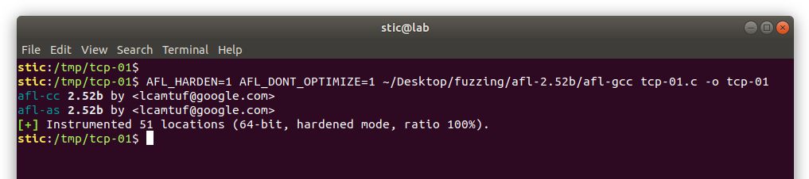
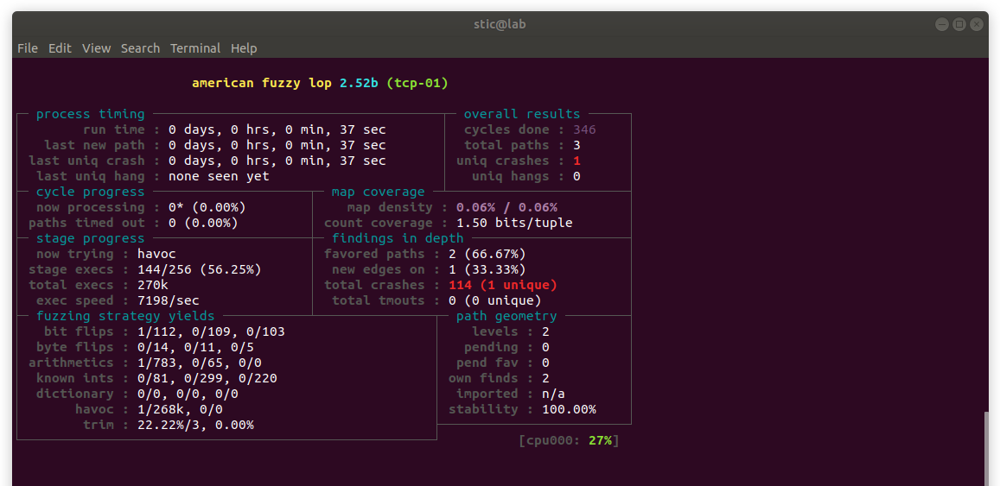
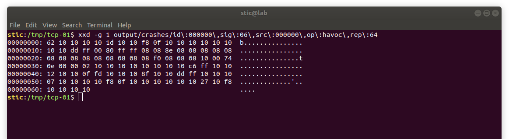
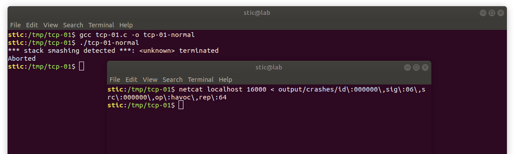

# TCP-01

**Objetivo**: Fuzzear el servidor TCP cuyo código se lista a continuación. Evitar usar herramientas diseñadas para este propósito (e.g. afl-network) o herramientas que lo facilitan (e.g. preeny). Se puede investigar, sin embargo, cómo estas herramientas hacen lo suyo y tratar de emularlo.

```c
#include <netinet/in.h>
#include <sys/types.h>
#include <sys/socket.h>
#include <unistd.h>
#include <stdint.h>
#include <strings.h>
#include <string.h>

#define PORT 16000
#define CONNECTION_BACKLOG 10

void finish_connection(int socket) {
  shutdown(socket, SHUT_RDWR);
  close(socket);
}

void handle_client_connection(int s_client) {
  uint8_t len = 0;
  uint8_t buffer[64];
    
  // Recibimos un byte que indica la longitud del paquete.
  ssize_t r = recv(s_client, &len, sizeof(uint8_t), 0);
    
  if (r != 1) {
    finish_connection(s_client);
    return;
  }
    
  // Recibimos el cuerpo del mensaje.
  uint8_t total = 0;
  
  while (total < len) {
    r = recv(s_client, &buffer + total, len - total, 0);
      
    if (r < 0) {
      finish_connection(s_client);
      return;
    } else {
      total += r;
    }
  }
   
  // Hacemos eco del cuerpo del mensaje.
  ssize_t s = send(s_client, buffer, len, 0);

  // Finaliza el intercambio de datos y cierra el socket.
  finish_connection(s_client);
}

int initialize_server() {
  struct sockaddr_in server_address;

  // Pone en cero la memoria de la estructura.
  bzero(&server_address, sizeof(server_address));

  // Inicializa el socket que escuchará conexiones.
  int s_listen = socket(AF_INET, SOCK_STREAM, 0);

  // Finaliza la ejecucion en caso de error.
  if (s_listen < 0) {
    return -1;
  }

  server_address.sin_family = AF_INET;
  server_address.sin_addr.s_addr = htonl(INADDR_LOOPBACK);
  server_address.sin_port = htons(PORT);

  // Asocia el descriptor del socket s_listen a la dirección.
  struct sockaddr *addr = (struct sockaddr *)&server_address;
  bind(s_listen, addr, sizeof(server_address));

  // Pone a escuchar el socket.
  listen(s_listen, CONNECTION_BACKLOG);

  // El socket que escucha ya ha sido inicializado y está asociado
  // al puerto PORT en la interfaz local; devolvemos el descriptor.
  return s_listen;
}

void handle_client_connections(int s_listen) {
  for (;;) {
      
    // Acepta una conexión entrante y devuelve el socket.
    int s_client = accept(s_listen, (struct sockaddr*) NULL, NULL);

    // Maneja la conexión del cliente.
    handle_client_connection(s_client);
  }
}

int main(int argc, char **argv) {
  // Inicializa el socket que escuchará por conexiones de clientes.
  int s_listen = initialize_server();

  /*
   * Si el socket fue inicializado correctamente, se aceptan
   * y se manejan las conexiones entrantes.
   */
  if (s_listen > 0) {
    handle_client_connections(s_listen);
  }
}
```


## Solución

Una forma relativamente sencilla de fuzzear este servidor particular es la siguiente: lo que haremos es definir nuestras propias implementaciones para las funciones relevantes en sys/socket.h. La función accept, por ejemplo, podría simplemente abrir el archivo con nombre provisto por AFL, y la función recv podría ser simplemente un wrapper sobre read. Funciones como bind o listen pueden no estar implementadas.

La ventaja de esta aproximación es su simpleza,  y es ideal para servidores también simples. Puede no ser tan conveniente cuando se hace una utilización compleja de la las funciones de la API y/o de sus distintos flags. También puede requerir tener cierto conocimiento sobre el funcionamiento interno del servidor, requiriendo hacer quizás cambios precisos en los lugares adecuados, o guardar estado internamente para poder devolver los valores adecuados en los momentos adecuados con el fin de lograr un cierto flujo de ejecución.

En cualquier caso resulta que, oportunamente, gran parte de los símbolos en las bibliotecas del sistema son débiles. Es decir, no es necesario ni modificar las cabeceras, ni definir soft links, ni aplicar ningún hack demasiado sofisticado; solo basta con definir nuestra propia versión de las funciones relevantes que queremos sustituir y con eso será suficiente para que el compilador prefiera nuestras implementaciones sobre las del sistema operativo.

Podríamos entonces definir lo siguiente:

```c
// socket.fuzz.h

#ifndef SOCKET_FUZZ_MOCK_H
#define SOCKET_FUZZ_MOCK_H

#include <sys/types.h>
#include <sys/socket.h>
#include <sys/stat.h>
#include <fcntl.h>
#include <stddef.h>
#include <unistd.h>
#include <stdlib.h>

char *fuzz_file_path = "/dev/null";

int socket(int domain, int type, int procleartocol) {
  return open("/dev/null", O_RDWR);
}

int listen(int sockfd, int backlog) {
  return 0; 
}

int bind(int sockfd, const struct sockaddr *addr, socklen_t addrlen) {
  return 0;
}

int accept(int sockfd, struct sockaddr *addr, socklen_t *addrlen) {
  return open(fuzz_file_path, O_RDWR);
}

ssize_t recv(int sockfd, void *buf, size_t len, int flags) {  
  static int state = 0;
    
  switch(state) {
    case 0:
      state++;
      return read(sockfd, buf, len);
    case 1:
      state++;
      return read(sockfd, buf, len);
    case 2:
      exit(0);    
  }
}

ssize_t send(int sockfd, const void *buf, size_t len, int flags) {
  return (ssize_t)len;
}

#endif
```

Observamos que la llamada a socket devuelve simplemente un file descriptor apuntando a /dev/null. Las llamadas a listen y a bind retornan 0, como si hubiesen sido exitosas. Análogamente, la llamada a write retorna la longitud de lo que se deseaba escribir, como si se hubieran escrito todos los datos correctamente. Finalmente, accept y recv son wrappers sobre open y read, respectivamente. Vemos también que la función recv guarda un estado interno que le permite emular una conversación cliente-servidor. Esto puede ser útil, como se mencionó antes, cuando es necesario proveer los datos en varias etapas, o cuando se requiere llevar al servidor a un estado particular antes de enviar la entrada fuzzeada. Nótese que este fuzzer particular termina el proceso si se intenta leer tres veces del socket; cómo deberá gestionar el estado el fuzzer dependerá del programa concreto que está siendo fuzzeado, y del escenario que se está intentando emular.

Tenemos entonces que la única responsabilidad del usuario del header es primero incluirlo y luego definir apropiadamente el valor de la variable global fuzz_file_path, la cuál deberá apuntar al path del archivo desde el cuál leer la entrada. En el caso de nuestro servidor, podemos modificar main para hacer algo como lo que se muestra a continuación:

```c
#include "socket.fuzz.h"

//...

int main(int argc, char **argv) {
    
  // Cargamos la ruta del archivo que contiene la entrada.
  fuzz_file_path = argv[1];
    
  // Inicializa el socket que escuchará por conexiones de clientes.
  int s_listen = initialize_server();

  /*
   * Si el socket fue inicializado correctamente, se aceptan
   * y se manejan las conexiones entrantes.
   */
  if (s_listen > 0) {
    handle_client_connections(s_listen);
  }
}
```


Con estos ajustes ya estamos en condiciones de utilizar AFL para fuzzear nuestro servidor. Procedemos a compilar el programa con afl-gcc:

```bash
AFL_HARDEN=1 AFL_DONT_OPTIMIZE=1 afl-gcc tcp-01.c -o tcp-01
```




Creamos a continuación los directorios necesarios y creamos también un ejemplo simple para AFL:

```bash
mkdir input output && echo -ne "\x05Hello" > input/sample
```

Recordemos adicionalmente que conviene, en lo posible, colocar los archivos que se pueda en un file system en memoria para minimizar la actividad del disco. 

Con los preparativos listos, procedemos a lanzar el fuzzer:

```bash
afl-fuzz -i input -o output ./tcp-01 @@
```


Como era de esperarse, el fuzzer no tarda mucho en encontrar un caso de error:




Concretamente, la entrada encontrada tiene la siguiente apariencia:




Podemos comprobar que se trata efectivamente de un caso de error válido ejecutando el programa sin modificaciones y pasando la entrada mutada con netcat:



Vemos que la entrada desborda efectivamente el buffer y hace al programa terminar con un error.


## ¿Soluciones alternativas?

Hoy en día no contamos con un mecanismo sólido que nos permita fuzzear servidores con total generalidad. Usualmente, cada proyecto requiere sus ajustes individuales. En [1] y en [2] se detallan otras técnicas que han sido utilizadas para lograr este cometido. Dichas técnicas serán evaluadas y practicadas en ejercicios posteriores.

Un mecanismo más sofisticado aunque en esencia similar al que utilizamos en este ejemplo es el que implementa [preeny](https://github.com/zardus/preeny). Preeny implementa un conjunto de módulos que permiten realizar varias tareas interesantes como eliminar forking, alarmas y manejo de señales. También provee un módulo que permite reemplazar los sockets de red por sockets asociados a la entrada y a la salida estándar. Estaremos estudiando preeny con más detenimiento en ejercicios posteriores.

Existe también un fork de AFL llamado afl-network, que implementa funcionalidad adicional justamente orientada al fuzzing de servicios de red.


## Referencias y lecturas adicionales

[1] J. Hertz, P. Jara-Etinger, & M. Manning, *Ricochet Security Assesment*, Feb. 15, 2016<br/>https://ricochet.im/files/ricochet-ncc-audit-2016-01.pdf

[2] Robert Swiecki's Blog, *Fuzzing TCP Servers*, Jan. 19, 2018.<br/>http://blog.swiecki.net/2018/01/fuzzing-tcp-servers.html

[3] Lolware, *Fuzzing nginx - Hunting vulnerabilities with afl-fuzz*, Apr. 28, 2015<br/>https://lolware.net/2015/04/28/nginx-fuzzing.html