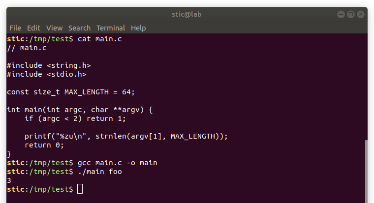
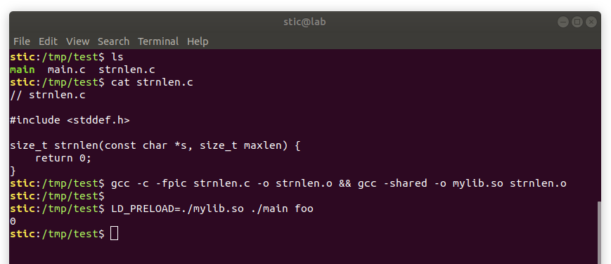
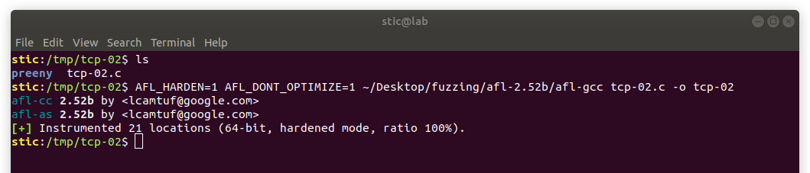
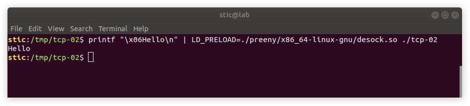

# TCP-02

**Objetivo:** Fuzzear el servidor del ejercicio TCP-01 usando preeny y AFL.


## Solución


#### Preloading

Consideremos el siguiente programa:

```C
// main.c

#include <string.h>
#include <stdio.h>

const size_t MAX_LENGTH = 64;

int main(int argc, char **argv) {
    if (argc < 2) return 1;
    
    printf("%zu\n", strnlen(argv[1], MAX_LENGTH));
    return 0;
}
```

Si compilamos normalmente y ejecutamos, observaremos que el programa hace meramente lo que esperaríamos:




Consideremos ahora el siguiente código:

```c
// strnlen.c

#include <stddef.h>

size_t strnlen(const char *s, size_t maxlen) {
    return 0;
}
```

Compilaremos strnlen.c como una biblioteca compartida con el siguiente comando:

```bash
gcc -c -fpic strnlen.c -o strnlen.o && gcc -shared -o mylib.so strnlen.o
```


Veamos ahora qué ocurre si ejecutamos el siguiente comando:

```bash
LD_PRELOAD=./mylib.so ./main foo
```



Observamos que esta vez la llamada a strnlen retorna 0. Esto se debe a que LD_PRELOAD le provee al linker paths de bibliotecas que debe cargar **antes** que cualquier otra. Este mecanismo nos permite "reemplazar" ciertas funciones, lo cuál puede resultar bastante conveniente al momento de fuzzear el programa.


#### Preeny

Según el README en el [repositorio de preeny](https://github.com/zardus/preeny),

> "Preeny helps you pwn noobs by making it easier to interact with services locally.
> It disables `fork()`, `rand()`, and `alarm()` and, if you want, can convert a server application to a console one using clever/hackish tricks, and can even patch binaries!"


Algunas de las funcionalidades implementadas por Preeny son las siguiente:

* **Defork** & **dealarm**. Estos módulos deshabilitan los forks y las alarmas. El método es muy simple: simplemente se reemplazan las funciones fork y alarm para que retornen siempre 0.
* **Derandomization** (derand & desrand). Este módulo reemplaza las implementaciones de rand y random por una que retorna un valor configurable estableciendo la variable de entorno RAND.
* **Desock**. El módulo desock reemplaza las llamadas a socket, bind, listen y accept en forma tal de hacerlas retornar descriptores sincronizados con la entrada y la salida estándar. En el [issue 10](https://github.com/zardus/preeny/issues/10) del repositorio de preeny se proveen algunos detalles adicionales sobre la implementación.

Preeny puede entonces ser utilizado para facilitar el fuzzing de servicios de red. Por ejemplo, podríamos ejecutar AFL de la siguiente forma:

```bash
LD_PRELOAD=desock.so:defork.so afl-fuzz -i input -o output ./my-forking-server
```


#### Preparando nuestro programa para ser fuzzeado

Si vamos a utilizar preeny para fuzzear nuestro programa, debemos implementar algún mecanismo que permita la finalización del programa; en caso contrario, el programa ejecutará recv o accept indefinidamente y AFL siempre registrará timeout. Haremos primero algunos ajustes a la función handle_client_connection, reemplazándola por la siguiente:

```c
void handle_client_connection(int s_client) {
  uint8_t len = 0;
  uint8_t buffer[64];
    
  // Recibimos un byte que indica la longitud del paquete.
  ssize_t r = recv(s_client, &len, sizeof(uint8_t), 0);
    
  if (r != 1) {
    finish_connection(s_client);
    return;
  }
    
  r = recv(s_client, &buffer, len, 0);
   
  // Hacemos eco del cuerpo del mensaje.
  ssize_t s = send(s_client, buffer, len, 0);

  // Finaliza el intercambio de datos y cierra el socket.
  finish_connection(s_client);
}
```

También modificaremos handle_client_connections para que finalice luego de manejar un solo pedido en vez de seguir aceptando conexiones:

```c
void handle_client_connections(int s_listen) {
  for (;;) {

    // Acepta una conexión entrante y devuelve el socket.
    int s_client = accept(s_listen, (struct sockaddr*) NULL, NULL);

    // Maneja la conexión del cliente.
    handle_client_connection(s_client);
    exit(0);
  }
}
```


#### Fuzzeando el programa

Clonamos el repositorio de preeny y compilamos ejecutando

```bash
# Instalamos dependencias
sudo apt-get install libini-config-dev

# Clonamos repositorio de preeny y compilamos
git clone https://github.com/zardus/preeny.git preeny && cd preeny && make
```


Habiendo terminado el build, procedemos a instrumentar nuestro programa:

```bash
AFL_HARDEN=1 AFL_DONT_OPTIMIZE=1 afl-gcc tcp-02.c -o tcp-02
```



Podemos verificar que nuestro mecanismo funciona correctamente pasandole al programa algún input por entrada estándar y observando la respuesta siendo escrita en la terminal:

```bash
printf "\x06Hello\n" | LD_PRELOAD=./preeny/x86_64-linux-gnu/desock.so ./tcp-02
```




Procedemos finalmente a ejecutar AFL, definiendo también la variable LD_PRELOAD:

```bash
# Creamos los directorios y la muestra.
mkdir input output && printf "\x05Hello" > input/sample

# Lanzamos el fuzzer
LD_PRELOAD=./preeny/x86_64-linux-gnu/desock.so afl-fuzz -i input -o output ./tcp-02
```


Nuevamente, observamos que el fuzzer no tarda mucho en encontrar un error:


## Referencias

[1] Preeny en GitHub.<br/>https://github.com/zardus/preeny

[2] Documentation request: why desock uses threads?<br/>https://github.com/zardus/preeny/issues/10

[3] Copyninja, *Tips for fuzzing network programs with AFL*, May 07, 2017.<br/>https://copyninja.info/blog/afl-and-network-programs.html

[4] Lolware, *Fuzzing nginx - Hunting vulnerabilities with afl-fuzz*, Apr. 28, 2015<br/>https://lolware.net/2015/04/28/nginx-fuzzing.html