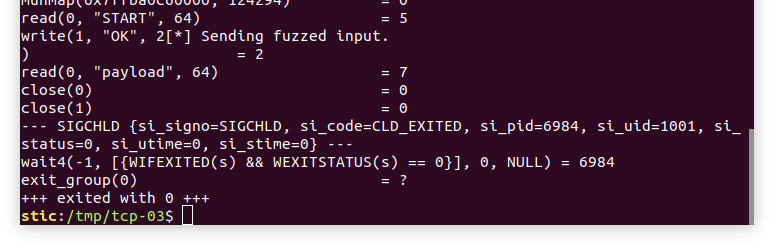
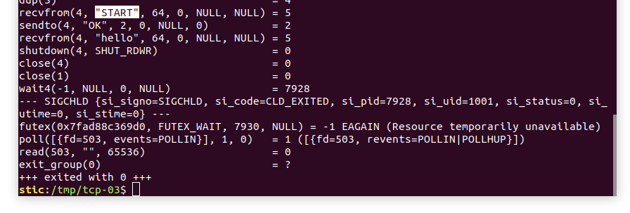
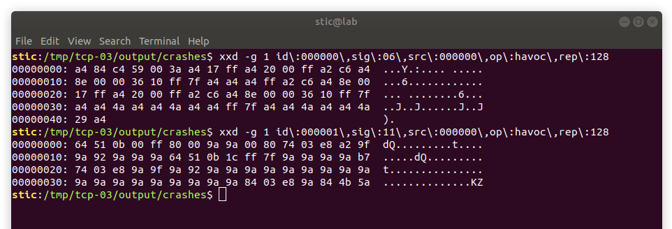
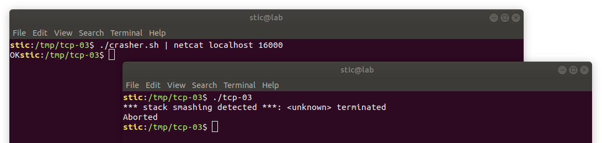
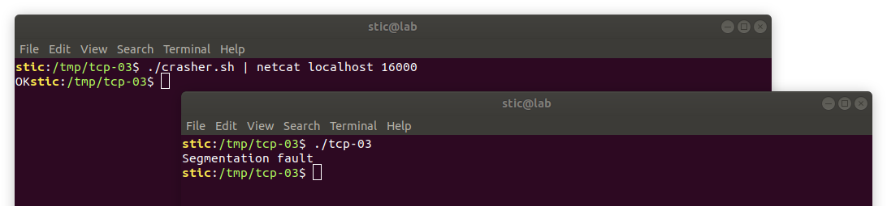

# TCP-03

**Objetivo**: Fuzzear el siguiente servidor TCP usando preeny desock y AFL. Desarrollar algún mecanismo para llevar al servidor a un cierto estado particular previo a enviar la entrada fuzzeada.

```c
#include <netinet/in.h>
#include <sys/types.h>
#include <sys/socket.h>
#include <unistd.h>
#include <stdint.h>
#include <strings.h>
#include <string.h>

#define PORT 16000
#define CONNECTION_BACKLOG 10
#define BUFFER_SIZE 64

void finish_connection(int socket) {
  shutdown(socket, SHUT_RDWR);
  close(socket);
}

void handle_client_connection(int s_client) {
  char buffer[BUFFER_SIZE];
    
  const char *message_ok = "OK\n";
  const char *expect = "START";

  // Recibe los datos correspondientes a la etapa 1.
  ssize_t r = recv(s_client, (char*)&buffer, BUFFER_SIZE, 0);
    
  if (strncmp(expect, (char*)&buffer, strlen(expect)) != 0) {
    finish_connection(s_client);
    return;
  }
    
  // Enviamos ACK.
  send(s_client, message_ok, 2, 0);
    
  // Procesamos los datos correspondientes a la etapa 2.
  bzero((void*)&buffer, BUFFER_SIZE);
  r = recv(s_client, (char*)&buffer, BUFFER_SIZE, 0);
    
  // Vulnerabilidad simple.
  buffer[buffer[BUFFER_SIZE - 1]] = 0;
    
  // Finaliza el intercambio de datos y cierra el socket.
  finish_connection(s_client);
}

int initialize_server() {
  struct sockaddr_in server_address;

  // Pone en cero la memoria de la estructura.
  bzero(&server_address, sizeof(server_address));

  // Inicializa el socket que escuchará conexiones.
  int s_listen = socket(AF_INET, SOCK_STREAM, 0);

  // Finaliza la ejecucion en caso de error.
  if (s_listen < 0) {
    return -1;
  }

  server_address.sin_family = AF_INET;
  server_address.sin_addr.s_addr = htonl(INADDR_LOOPBACK);
  server_address.sin_port = htons(PORT);

  // Asocia el descriptor del socket s_listen a la dirección.
  struct sockaddr *addr = (struct sockaddr *)&server_address;
  bind(s_listen, addr, sizeof(server_address));

  // Pone a escuchar el socket.
  listen(s_listen, CONNECTION_BACKLOG);

  // El socket que escucha ya ha sido inicializado y está asociado
  // al puerto PORT en la interfaz local; devolvemos el descriptor.
  return s_listen;
}

void handle_client_connections(int s_listen) {
  for (;;) {
      
    // Acepta una conexión entrante y devuelve el socket.
    int s_client = accept(s_listen, (struct sockaddr*) NULL, NULL);

    // Maneja la conexión del cliente.
    handle_client_connection(s_client);
  }
}

int main(int argc, char **argv) {
  // Inicializa el socket que escuchará por conexiones de clientes.
  int s_listen = initialize_server();

  /*
   * Si el socket fue inicializado correctamente, se aceptan
   * y se manejan las conexiones entrantes.
   */
  if (s_listen > 0) {
    handle_client_connections(s_listen);
  }
}

```


## Solución

Recordemos que preeny desock lo que hace es en cierto modo sincronizar los sockets con la entrada y con la salida estándar, efectivamente eliminando la comunicación de red. Resulta sin embargo que, si debemos primero intercambiar algunos mensajes con el servidor antes de enviar la entrada mutada, entonces el par preeny-AFL no nos lo hace tan fácil. Esto se debe a que, sin ningún intermediario, AFL simplemente cargará la entrada mutada, la proveerá por entrada estándar al proceso siendo fuzzeado, y solo la entrada fuzzeada será lo que ingresará por los sockets, de una sola vez, sin la posibilidad de intercambiar antes algunos mensajes que permitirían llevar al servidor a un estado particular en forma determinística.

Lo que haremos entonces es implementar lo que se llama un arnés de pruebas. Este arnés será un intermediario entre AFL y nuestro servidor. El esquema que describimos a continuación es más o menos similar al que utiliza NCC Group para fuzzear Ricochet; la estrategia que NCC adopta se describe en el apéndice B de [1]. Nuestro arnés, sin embargo, fue adaptado para poder integrarse con desock, y no utiliza Python. El esquema sugerido es entonces el siguiente:

1. El arnés recibe los datos mutados por entrada estándar.
2. El arnés declara dos pipes que serán utilizados luego: uno servirá para que el cliente le envíe datos al servidor, y otro servirá para que el servidor le envíe datos al cliente.
3. El arnés inicia un fork. Los detalles de cada rama de ejecución se describen a continuación:
   * El padre ejecutará el servidor. Primero utilizará dup2 para asociar su entrada estándar al extremo de lectura del pipe por el cuál recibirá mensajes del cliente. También asociará su salida estándar al extremo de escritura del pipe, lo que le permitirá responderle al cliente. Luego utilizará execve para cargar el binario instrumentado tcp-03 en su espacio de memoria, ejecutando así el servidor.
   * El hijo será el cliente: el proceso proveerá una secuencia de mensajes adecuada (a través del pipe destinado para ese propósito) y recibirá las respuestas (por el otro pipe) para llevar al servidor a un estado particular. Luego, finalmente, le proveerá al servidor la entrada fuzzeada generada por AFL.

Vale mencionar también que conviene deshabilitar el manejo de la señal SIGPIPE. Dicha señal la recibe un proceso que intenta escribir a un pipe cerrado. Para ahorrarnos problemas, nosotros simplemente la manejaremos como un error típico (e.g. verificando el valor de retorno de la función write).

El código del arnés podría ser entonces el siguiente:

```c
// harness.c

#include <sys/types.h>
#include <unistd.h>
#include <signal.h>
#include <stdio.h>

const int BUFFER_SIZE = 1024;

int finalize(int re, int we, int return_value) {
  close(re);
  close(we);
  return return_value;
}

int run_child(int read_end, int write_end) {
  char buffer[BUFFER_SIZE];

  ssize_t sent = 0;
  ssize_t recv = 0;

  // Enviamos parte 1
  if ((sent = write(write_end, "START", 5)) < 5) {
    return finalize(read_end, write_end, 1);
  }

  // Recibimos el ACK
  if ((recv = read(read_end, &buffer, 2)) < 2) {
    return finalize(read_end, write_end, 1);
  }
  if (buffer[0] != 'O' || buffer[1] != 'K') {
    return finalize(read_end, write_end, 1);
  }

  // Enviamos la entrada fuzzeada.
  while ((recv = read(STDIN_FILENO, &buffer, BUFFER_SIZE)) > 0) {
    if ((sent = write(write_end, &buffer, recv)) < recv) {
      return finalize(read_end, write_end, 1);
    }
  }

  return finalize(read_end, write_end, 0);
}

int begin(int pipe_to_client[2], int pipe_to_server[2], char **argv, char **envp) {
  signal(SIGPIPE, SIG_IGN);
  pid_t p = fork();

  if (p == 0) {
    // Cliente

    // Cerramos los extremos no utilizados de los pipes.
    close(pipe_to_client[1]);
    close(pipe_to_server[0]);

    // Ejecutamos el código propio del cliente.
    return run_child(pipe_to_client[0], pipe_to_server[1]);

  } else if (p > 0) {
    // Servidor

    // Cerramos extremos no utilizados de los pipes.
    close(pipe_to_client[0]);
    close(pipe_to_server[1]);

    // Reemplazamos STDIN y STDOUT por los pipes.
    dup2(pipe_to_server[0], STDIN_FILENO);
    dup2(pipe_to_client[1], STDOUT_FILENO);
    
    // Cerramos los descriptores no utilizados.
    close(pipe_to_server[0]);
    close(pipe_to_client[1]);

    // Lanzamos el programa objetivo.
    execve(argv[0], argv, envp);

  } else {
    return 1;
  }
}

int main(int argc, char **argv, char **envp) {
  if (argc < 2) return 1;

  int pipe_to_client[2];
  int pipe_to_server[2];

  if (pipe(pipe_to_client) != 0) {
    return 1;
  }

  if (pipe(pipe_to_server) != 0) {
    close(pipe_to_client[0]);
    close(pipe_to_client[1]);
    return 1;
  }

  return begin(pipe_to_client, pipe_to_server, argv + 1, envp);
}

```

La interacción concreta entre el cliente y el servidor se define en la función run_child. Observamos que se definen los mensajes que el cliente debe mandar al servidor y las respuestas que debe esperar. Para utilizar el arnés lo compilamos y lo ejecutamos:

```bash
# Compilamos el programa.
gcc harness.c -o harness

# Lo ejecutamos indicando la ruta del programa objetivo como argumento 1.
./harness <ruta del programa objetivo>
```

Este último comando lanzará el arnés, que ejecutará por un lado el código del hijo, y por otro el código del programa "./mytarget", habiendo asociado efectivamente entrada y salida estándar a los correspondientes pipes. Consideremos el siguiente programa de prueba:

```c
// test.c

#include <stdio.h>
#include <unistd.h>
#include <sys/types.h>
#include <sys/wait.h>

const int BUFFER_SIZE = 64;

int main(int argc, char **argv) {
  char buffer[BUFFER_SIZE];
  
  ssize_t recv = read(STDIN_FILENO, &buffer, BUFFER_SIZE);

  write(STDOUT_FILENO, "OK", 2);

  recv = read(STDIN_FILENO, &buffer, BUFFER_SIZE);

  close(STDIN_FILENO);
  close(STDOUT_FILENO);
 
  int wstatus;
  wait(&wstatus);

  return 0;
}
```

Lo que hace el programa en principio es leer datos de la entrada estándar. Luego enviará "OK" por salida estándar, leerá luego nuevamente de la entrada estándar, y finalizará cerrando ambos canales y esperando por un proceso hijo.

Si ejecutamos los comandos que se muestran a continuación:

```bash
# Compilamos el programa de prueba.
gcc test.c -o test

# Ejecutamos nuestro programa de prueba con el arnés y strace.
echo -ne "payload" | strace ./harness ./test
```

Podremos observar eventualmente algo como lo siguiente:



Es decir, observamos que el arnés, habiendo cargado en su espacio de memoria el binario ./test, ejecuta efectivamente el syscall read, logrando leer el string "START", para luego escribir "OK" a la salida estándar y para eventualmente ejecutar otro read y así leer "payload".

Observaremos que en el comando que ejecutamos nunca explicitamos que se debía mandar el string "START" antes de "payload". Evidentemente, el correcto secuenciamiento de los mensajes fue orquestado por el proceso hijo del arnés, que ejecuta la función run_child y se comunica con ./test a través de los pipes que declaramos en el código.


#### Ejecución de prueba con preeny

Procederemos ahora a ejecutar el arnés pasando la ruta del binario del servidor tcp-03. Adicionalmente, definiremos la variable LD_PRELOAD indicandole al linker que enlace primero la biblioteca desock de preeny para reemplazar la comunicación de red por entrada y salida estándar. Haremos sin embargo un pequeño ajuste al servidor para que finalice de forma más limpia luego de ejecutar el código que nos interesa:

```c
void handle_client_connections(int s_listen) {
  for (;;) {
      
    // Acepta una conexión entrante y devuelve el socket.
    int s_client = accept(s_listen, (struct sockaddr*) NULL, NULL);

    // Maneja la conexión del cliente.
    handle_client_connection(s_client);
     
    // Salida limpia.
    close(STDOUT_FILENO); wait(NULL); exit(0);
  }
}
```

También hay que recordar incluir las cabeceras stdlib.h y sys/wait.h para que el programa compile.

Procedemos entonces a ejecutar el siguiente comando:

```bash
echo -ne "hello" | LD_PRELOAD=<ruta a desock.so> strace ./harness ./tcp-03
```

Observaremos luego algo como lo siguiente:



Podemos ver cómo las llamadas a recvfrom obtienen efectivamente lo que fue ingresado por entrada estándar por el proceso hijo (i.e. los strings "START" y "hello"). Vemos también que el programa finaliza satisfactoriamente con código 0. Podemos observar, adicionalmente, que el hijo también finaliza satisfactoriamente: strace nos indica que al momento de ejecutar wait, el programa recibe una señal SIGCHLD con si_status=0, lo que nos indica que el hijo terminó como esperaríamos.


#### Fuzzeando el servidor

Habiendo desarrollado el arnés, fuzzear el programa no debería presentar mayores complicaciones. Lo que único que haremos es instrumentar los binarios y  preparar nuestra estructura de directorios para luego ejecutar AFL:

```bash
# Creamos los directorios y creamos una muestra.
mkdir input output && echo -ne "randomtest" > input/sample

# Compilamos nuestros binarios con afl-gcc.
#
# Desgraciadamente, afl-fuzz requiere que el arnés también sea instrumentado,
# si bien es solo para pasar la validación inicial. Eventualmente se podría 
# implementar una modificación que permita obviar la validación.
#
AFL_DONT_OPTIMIZE=1 AFL_HARDEN=1 afl-gcc harness.c -o harness
AFL_DONT_OPTIMIZE=1 AFL_HARDEN=1 afl-gcc tcp-03.c -o tcp-03

# Ejecutamos afl-fuzz con desock y con nuestro arnés.
LD_PRELOAD=<ruta a desock.so> afl-fuzz -i input -o output ./harness ./tcp-03
```


Tras ejecutar el comando, el fuzzer no tarda mucho en encontrar algunos casos de error:




Para verificar que el payload efectivamente crashea el programa podemos usar netcat y un script como el siguiente:

```bash
#!/bin/bash
# crasher.sh

# Enviamos la etapa inicial.
echo -ne "START"

# Esperamos un poco.
sleep 2

# Enviamos la entrada que debería causar un error.
cat output/crashes/<nombre del archivo>
```

Como nombre de archivo pasamos el primero de los dos disponibles en el directorio crashes. Con nuestro servidor funcionando, en otra terminal ejecutamos

```bash
./crasher.sh | netcat localhost 16000
```



Observamos que tras la entrada de datos el programa detectó un canario corrupto. Si modificamos el script para cargar el segundo archivo, en cambio, obervaremos que la entrada causa efectivamente un error de segmentación, escribiendo directamente sobre la dirección de retorno:




#### Comentarios adicionales

En adición al módulo desock, preeny implementa un módulo llamado defork (y también varios otros). Por supuesto, si usaramos defork nuestro mecanismo no funcionaría, ya que evidentemente depende de que fork funcione correctamente . Lo que se puede hacer para resolver el problema es agregar defork a LD_PRELOAD en tiempo de ejecución (modificando envp) previo a ejecutar execve. Esto nos permitiría pasarle defork solo al servidor, sin afectar el funcionamiento del arnés.


## Referencias

[1] J. Hertz, P. Jara-Ettinger & M. Manning. *Ricochet Security Assesment*, Feb. 15, 2016.<br/>https://ricochet.im/files/ricochet-ncc-audit-2016-01.pdf

