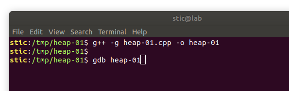
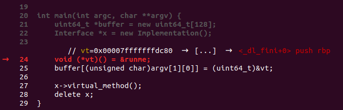
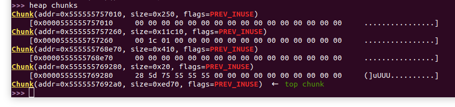
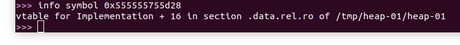
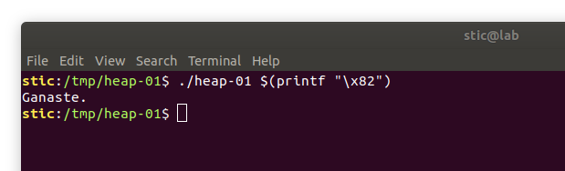

# Heap-01

**Objetivo**: Lograr que el siguiente programa ejecute la función `runme`.

```c++
// heap-01.cpp

#include <iostream>
#include <stdint.h>

class Interface {
public:
    virtual void virtual_method() = 0;
};

class Implementation : public Interface {
public:
    virtual void virtual_method() {
        std::cout << "Intenta de vuelta." << std::endl;
    }
};

void runme() {
  std::cout << "Ganaste." << std::endl;
}

int main(int argc, char **argv) {
    uint64_t *buffer = new uint64_t[128];
    Interface *x = new Implementation();
    
    void (*vt)() = &runme;
    buffer[(unsigned char)argv[1][0]] = (uint64_t)&vt;
    
    x->virtual_method();
    delete x;
}
```


## Solución

Si tenemos presente el funcionamiento del heap este ejercicio debería resultar relativamente sencillo. En principio, sabemos que los bloques en los que se almacenan el buffer y el objeto `x` son contiguos en la memoria. Tenemos adicionalmente la capacidad de escribir la dirección de un puntero a la función `runme` en una dirección relativa al inicio del buffer. Lo que debemos hacer entonces es determinar la distancia en bytes desde el inicio del buffer hasta el puntero a la tabla virtual del objeto `x`. Pasando un índice tal que la escritura sobrescriba el valor de dicho puntero, podremos hacer que la llamada a `virtual_method` ejecute la función `runme`.

Compilamos primero el programa con g++ y lo cargamos en gdb. Ponemos luego un breakpoint pasada la inicialización de las variables `buffer` y `x`, y ejecutamos el programa.




Supongamos entonces que estamos en la siguiente línea:



Ejecutamos ahora "heap chunks" para ver un listado de los bloques existentes en el heap.



Observaremos que hay efectivamente un bloque de unos `0x410` bytes, 1024 para almacenar 128 enteros de 8 bytes, 16 bytes adicionales de overhead. Ese es el bloque al que el puntero `buffer` apunta. Luego hay un bloque de `0x20` (32) bytes, el cuál presumimos almacena el objeto x. Efectivamente, notaremos que los primeros 8 bytes del bloque codifican en este caso la dirección `0x555555755d28` en little endian, la cuál podemos ver corresponde a una vtable:



Las direcciones que el comando "heap chunks" nos muestra son las del inicio del bloque de datos de usuario. Para determinar la distancia en bytes desde el inicio del buffer hasta la dirección que debemos sobrescribir simplemente restamos las direcciones que nos muestra el comando. En este caso calculamos

```
0x555555769280 - 0x555555768e70 = 0x410
```

El índice que debemos pasar como argumento es entonces `0x410` dividido 8, o 130 en decimal, `0x82` en hexadecimal. Procedemos ahora a finalizar el programa con kill, salimos de gdb con quit, y ejecutamos el siguiente comando:

```bash
./heap-01 $(printf "\x82")
```



Observaremos que logramos modificar el puntero a la tabla virtual del objeto `x`, logrando la ejecución de la función `runme`.


## Conclusión

Con este ejercicio lo que se quiere observar es que ciertos desbordes en el heap pueden permitirnos modificar objetos, incluyendo sus atributos y también sus tablas virtuales. La estructura del heap, sin embargo, suele ser más caótica que la del stack. En este caso la solución es muy simple porque ocurren solo dos solicitudes en forma consecutiva, aunque en casos reales la distancia en bytes podría ser más difícil de predecir. En ejercicios posteriores estaremos estudiando técnicas particulares que aplican a la explotación en el heap.