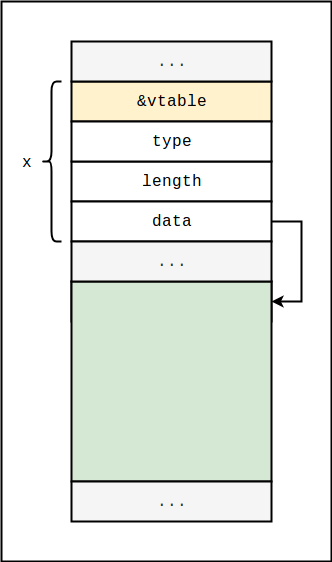
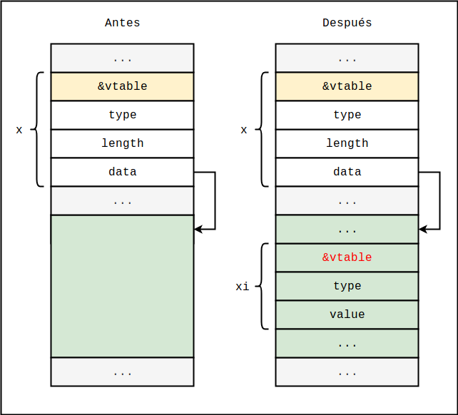
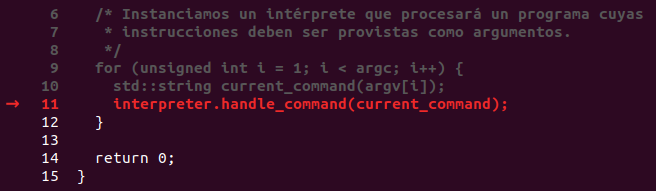
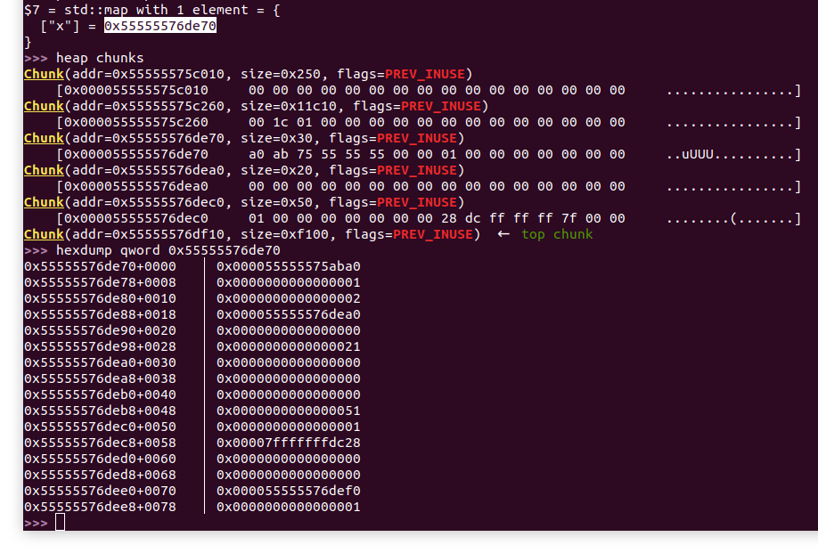
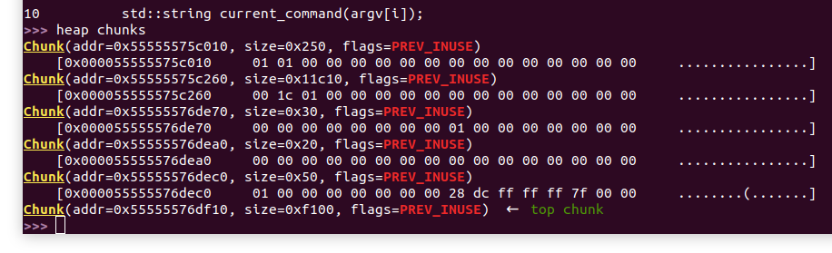
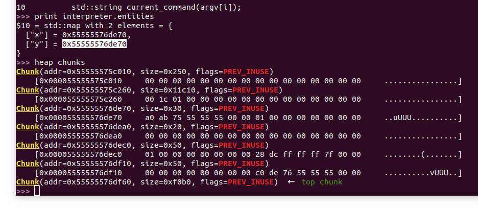
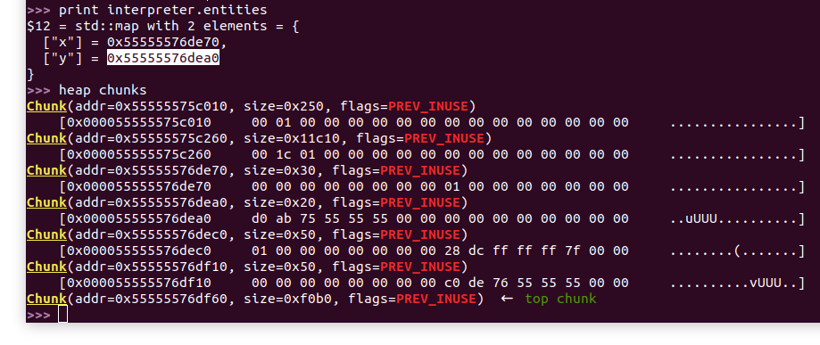
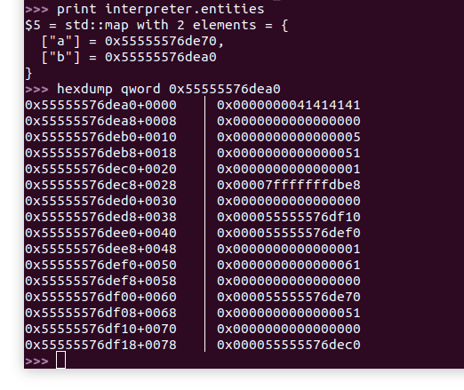

# Heap-02

**Objetivo**: Desarrollar un mecanismo que permita controlar un puntero a vtable de algún objeto en el heap. No es necesario lograr ejecutar shellcode, ni ejecutar algún código particular.

```c++
// Entity.h

#include <iostream>

class Entity {
protected:
  enum Type {
    INTEGER,
    INTEGER_VECTOR
  } type;

  Entity(Type type) {
    this->type = type;
  }

public:
  bool instance_of(Type type) const {
    return this->type == type;
  }

  virtual ~Entity() {}

  virtual void add(const Entity &entity) = 0;
  virtual void print() = 0;

};

class Integer : public Entity {
private:
  unsigned long value;

public:
  Integer(unsigned long value) : Entity(INTEGER) {
    this->value = value;
  }

  unsigned long get_value() const {
    return this->value;
  }

  void add(const Entity &other) {
    if (!other.instance_of(INTEGER)) {
      return;
    }

    const Integer *other_int = static_cast<const Integer*>(&other);
    this->value += other_int->get_value();
  }

  void print() {
    std::cout << this->value << std::endl;
  }

};

class IntVector : public Entity {
private:
  unsigned long length;
  unsigned long *data;

public:
  IntVector(unsigned long length) : Entity(INTEGER_VECTOR) {
    data = new unsigned long[length];
    this->length = length;
  }

  unsigned long get(unsigned long i) const {
    return data[i];
  }

  void set(unsigned long i, unsigned long value) {
    if (i < length)
      data[i] = value;
  }

  unsigned long get_length() const {
    return length;
  }

  void add(const Entity &other) {
    if (!other.instance_of(INTEGER_VECTOR)) {
      return; // El otro elemento no es un vector de enteros.
    }

    const IntVector *other_int_vector = static_cast<const IntVector*>(&other);
    if (other_int_vector->get_length() != this->length) {
      return; // Solo se pueden sumar vectores de la misma longitud.
    }

    // Sumamos in place.
    for (unsigned int i = 0; i < length; i++) {
      data[i] += other_int_vector->get(i);
    }
  }

  void print() {
    for (unsigned int i = 0; i < length; i++) {
      char separator = i < length - 1 ? ',' : ';';
      std::cout << data[i] << separator;
    }
    std::cout << std::endl;
  }

  virtual ~IntVector() {
    delete data;
  }

};
```

```c++
// Interpreter.h

#include <string>
#include <sstream>
#include <map>

#include "Entity.h"

class Interpreter {
private:

  const std::string TOKEN_DECLARE_INT = "int";
  const std::string TOKEN_DECLARE_INT_VECTOR = "int_v";
  const std::string TOKEN_ADD = "add";
  const std::string TOKEN_VECTOR_SET = "set_v";
  const std::string TOKEN_PRINT = "print";
  const std::string TOKEN_DELETE = "delete";

  std::map<std::string, Entity*> entities;

  void create_int(std::istringstream &input_stream) {

    // Obtenemos el identificador (el nombre) de la variable entera.
    std::string int_id;
    std::getline(input_stream, int_id, ' ');

    // Obtenemos el valor de la variable entera.
    unsigned long value;
    input_stream >> value;

    // Creamos la variable y la guardamos en el mapa de entidades.
    entities[int_id] = new Integer(value);
  }

  void create_int_vector(std::istringstream &istream) {
    std::string id;
    std::string current_value;

    // Obtenemos el nombre del vector.
    std::getline(istream, id, ' ');

    // Obtenemos la longitud del vector.
    std::getline(istream, current_value, ' ');
    unsigned long length = std::stol(current_value);

    IntVector *vector = new IntVector(length);

    // Obtenemos los elementos del vector.
    for (unsigned long i = 0; std::getline(istream, current_value, ','); i++) {
      unsigned long current_element = std::stol(current_value);
      vector->set(i, current_element);
    }

    // Guardamos el vector.
    entities[id] = static_cast<Entity*>(vector);
  }

  void add(std::istringstream &input_stream) {
    std::string a_id;
    std::string b_id;

    std::getline(input_stream, a_id, ',');
    std::getline(input_stream, b_id, ';');

    Entity *a = entities.find(a_id)->second;
    Entity *b = entities.find(b_id)->second;

    if (a && b) {
      a->add(*b);
    }
  }

  void vector_set(std::istringstream &input_stream) {
    std::string vector_id;
    std::string current_value;

    std::getline(input_stream, vector_id, ' ');

    if (Entity *entity = entities.find(vector_id)->second) {
      IntVector *vector = static_cast<IntVector*>(entity);

      // Obtenemos el índice donde cambiar el valor.
      std::getline(input_stream, current_value, ' ');
      unsigned long index = stol(current_value);

      // Obtenemos el nuevo valor.
      std::getline(input_stream, current_value, ';');
      unsigned long value = stol(current_value);

      // Cambiamos el valor.
      vector->set(index, value);
    }
  }

  void print(std::istringstream &input_stream) {
    std::string id;
    std::getline(input_stream, id, ';');
    if (Entity *p = entities.find(id)->second) {
      p->print();
    }
  }

  void delete_entity(std::istringstream &input_stream) {
    std::string id;
    std::getline(input_stream, id, ';');
    if (Entity *p = entities.find(id)->second) {
      delete p;
    }
  }

public:

  void handle_command(const std::string &command) {
    std::istringstream input_stream(command);
    std::string token;

    std::getline(input_stream, token, ' ');

    if (TOKEN_DECLARE_INT == token) {
      create_int(input_stream);
    } else if (TOKEN_DECLARE_INT_VECTOR == token) {
      create_int_vector(input_stream);
    } else if (TOKEN_ADD == token) {
      add(input_stream);
    } else if (TOKEN_VECTOR_SET == token) {
      vector_set(input_stream);
    } else if (TOKEN_PRINT == token) {
      print(input_stream);
    } else if (TOKEN_DELETE == token) {
      delete_entity(input_stream);
    }
  }

};
```

```c++
// heap-02.cpp

#include "Interpreter.h"

int main(int argc, char **argv) {
  Interpreter interpreter;

  /* Instanciamos un intérprete que procesará un programa cuyas
   * instrucciones deben ser provistas como argumentos.
   */
  for (unsigned int i = 1; i < argc; i++) {
    std::string current_command(argv[i]);
    interpreter.handle_command(current_command);
  }

  return 0;
}
```


## Solución

Este ejercicio intenta emular un escenario típico que se da en la explotación de browsers. La idea es la siguiente: un atacante puede proveer un script que será ejecutado por un intérprete en el browser de la víctima (e.g. el intérprete de JavaScript). Si bien las capacidades del lenguaje están restrictas, el programa puede explotar una vulnerabilidad en el intérprete, logrando así escapar al sandbox y ejecutar código máquina con los permisos del browser, superando las limitaciones impuestas.

El programa de este ejercicio es un intérprete de un lenguaje muy básico que permite declarar y realizar cálculos con enteros y vectores de enteros. Veamos un ejemplo para que quede claro. Compilamos el programa ejecutando

```bash
g++ heap-02.cpp -o heap-02
```

y procedemos a ejecutar el comando

```bash
./heap-02 "int x 5" "int y 3" "add x,y" "print x"
```


Observaremos que cada argumento provisto al programa es una instrucción. Las primeras dos instrucciones declaran variables `x` e `y`, con valores 5 y 3, respectivamente. La tercera instrucción suma las variables, e implícitamente guarda el resultado en la primera, `x`. La última instrucción muestra en pantalla el valor de `x`, que observaremos termina siendo efectivamente la suma entre las dos variables declaradas.

Las instrucciones disponibles son las siguientes:

* `int x v` : delcara una variable entera de nombre `x` con valor `v`.
* `int_v x n a1,a2,...,an` : declara un vector entero `x` de n elementos `a1`, `a2`, ..., `an`.
* `set_v x i v` : le da al `i`-ésimo elemento de `x` el valor `v`.
* `add x,y` : suma las variables `x` e `y` de ser posible, guardando el resultado en `x`.
* `print x` : muestra en pantalla el valor de la variable `x`, formateado según el tipo de `x`.
* `delete x` : libera la memoria reservada para la variable `x`.


La última instrucción es interesante, no solo porque nos permite tomar participación en la gestión de la memoria del proceso, sino también porque su implementación no es segura. Internamente, el intérprete utiliza un mapa para gestionar las variables creadas; por ejemplo, declarar una variable `x `de tipo entero insertará en el mapa una clave  "x", cuyo correspondiente valor será un puntero a un objeto de tipo `Integer`, almacenado en el heap. La instrucción "delete x" lo que hace entonces es liberar efectivamente la memoria asociada al objeto entero al cuál asociamos el nombre `x`. El problema con esta implementación es que omite un paso importante: el método delete falla en quitar la clave "x" del mapa, lo que permite que la variable pueda seguir siendo utilizada en instrucciones posteriores.

A los errores que permiten utilizar memoria de bloques previamente liberados se los conoce como **use after free** (UAF). Un procedimiento típico para explotar UAFs en C++ es el siguiente:

1. El atacante fuerza la creación de un cierto objeto `q` en el heap. El atacante tiene la capacidad de modificar parte de la memoria propia de `q` (e.g. valores de atributos, datos en buffers, etc.) posiblemente mediante operaciones totalmente legales.
2. El atacante fuerza de alguna forma la liberación del objeto `q` creado en el paso 1. La memoria queda libre para ser utilizada para almacenar otros objetos.
3. El atacante fuerza la creación de uno o más objetos en el heap. Si se dan las condiciones adecuadas, la memoria que antes contenía a `q` estará ahora asociada a estos nuevos objetos.
4. La condición de UAF le da al atacante la posibilidad de seguir utilizando el objeto `q` creado en el paso 1. Utilizando su capacidad de escritura, el atacante modifica la memoria en la región en donde estaba almacenado dicho objeto. En su momento la operación podría haber sido legal y segura; dichas operaciones no le permitirían al atacante modificar datos administrativos de `q` (e.g. punteros a tablas virtuales), ni datos propios de otros objetos. El problema es que ahora en la región hay objetos cuyos datos sensibles podrían estar efectivamente dentro del rango de escritura accesible a las operaciones sobre `q`. Esto puede permitirle al atacante modificar valores de atributos y punteros, obteniendo la eventual capacidad de ejecutar código arbitrario.


Para nuestro ejemplo concreto, imaginemos la siguiente secuencia de instrucciones:

**1**. `int_v x n <secuencia muy larga de n enteros>` . Esta instrucción causará que en el heap se reserven al menos dos bloques: uno para almacenar el objeto `x`, y otro más extenso para almacenar el bloque de datos (el arreglo de enteros propiamente dicho). El esquema del heap podría resultar siendo algo como lo que se muestra en la siguiente captura:





El esquema representa al objeto `IntVector x` almacenado en el heap. Observaremos que tiene su correspondiente puntero a una tabla virtual, y tiene un puntero a su bloque de datos, el cuál se encuentra también en el heap. La sección en verde es aquella sobre la cuál podemos escribir mediante operaciones legales sobre el vector `v` (e.g. `set x <índice> <valor>`).

**2**. `delete x`. Esta instrucción liberará la memoria asociada al objeto `IntVector x` y a su correspondiente buffer de datos. La memoria queda libre para almacenar otros objetos.

**3**. Supongamos ahora una secuencia larga de instrucciones `int x1`, `int x2`, ..., `int xn`. Por cada una de estas instrucciones se creará un objeto de tipo Integer y será almacenado en el heap. El esquema resultante podría ser el siguiente:




Las reservas de objetos de tipo Integer dejan eventualmente uno o más objetos dentro del rango de memoria accesible mediante  `set x <índice> <valor>`, lo que nos permite editar, por ejemplo, valores de punteros a tablas de métodos virtuales. 

Aquí cabe preguntarse, si se libera el objeto `x` completo y no solo su buffer (que está en un bloque del heap separado), ¿porqué la reserva de memoria para nuevos enteros se daría solo sobre el buffer, dejando intactos los atributos del objeto `x`? Hay que tener en cuenta que, para que la estrategia funcione, el puntero data debe permanecer intacto.

Resulta que, oportunamente, el bloque que almacena al objeto `x` es un bloque pequeño y como tal será cacheado por el gestor de memoria. Para los bloques cacheados, el bit que indica que el bloque está en uso permanecerá en 1, incluso luego de liberado, y solo será entregado ante una solicitud si la cantidad de bytes solicitados coincide exactamente con el tamaño efectivo de `b` (el tamaño real del bloque menos los 16 bytes de overhead administrativo). Ya que el objeto `Integer` tiene tamaño distinto al del objeto `IntVector` por tener menos campos, podemos saber que el gestor de memoria no entregará el bloque que contiene los datos originales del objeto `x`, si lo que se intenta reservar es memoria para un objeto `Integer`. El siguiente espacio disponible será, entonces, el espacio que antes estaba destinado para alacenar el bufer de `x`, dejando al nuevo objeto `Integer` completamente dentro del rango de escritura de la operación  `set x <índice> <valor>`.


Procedemos ahora a analizar la secuencia en gdb. Ejecutamos

```bash
g++ -g heap-02.cpp -o heap-02 && gdb heap-02
```

y dentro de gdb ponemos un breakpoint en main:

```
b *main
```

Continuamos lanzamos el programa con el siguiente comando:

```bash
run "int_v x 2 0,0" "delete x" "int_v y 2 0,0"
```

Presionamos "n" varias veces para avanzar, hasta ejecutar eventualmente `handle_command` para la primera instrucción, la que reserva espacio en memoria para el vector `x`.



Presionamos "n" para ejecutar la instrucción y continuamos ejecutando "heap chunks", "print interpreter.entities" y "hexdump qword <dirección del chunk de x>" para ver un esquema del heap:



Observaremos que, según el contenido del mapa `interpreter.entities`, el bloque de `x` se encuentra en la dirección `0x55555576de70`. El dump a partir de esa dirección nos indica que el puntero data tiene el valor `0x55555576dea0`, el cuál apunta efectivamente al bloque de tamaño `0x20` que podemos ver en el listado de chunks.

Veamos ahora qué ocurre si ejecutamos la instrucción "delete x". Presionamos n algunas veces más hasta ejecutar `handle_command` por segunda vez. Si ejecutamos "heap chunks" nuevamente veremos lo siguiente:



Observaremos que, apesar de haber ejecutado delete, los bits `PREV_INUSE` siguen activos para ambos bloques. Esto se debe a que están siendo cacheados. Si continuamos y ejecutamos la tercera instrucción, la declaración de una nueva variable `y` idéntica a la primera, deberíamos poder ver luego algo como lo siguiente:



Observaremos que el nuevo objeto ha sido almacenado exactamente donde antes estaba `x`. Comparemos este resultado con aquel que podemos obtener si ejecutamos

```bash
run "int_v x 2 0,0" "delete x" "int y 5"
```



Observaremos que, en este caso, el nuevo objeto ha sido creado a partir de otra dirección. Concretamente, el bloque elegido por el gestor de memoria es aquel que antes correspondía al bloque de datos de `x`, de `0x20` bytes. En este caso particular ésto se dió porque el tamaño de dicho bloque era el adecuado: el objeto `Integer` ocupa `0x20` bytes, con lo cuál el gestor decidió devolver un bloque de precisamente `0x20` bytes. Al momento de explotar un UAF será necesario tener en cuenta el comportamiento del gestor de memoria para orquestar la secuencia de reservas y liberaciones adecuadamente.

En cualquier caso, consideremos la siguiente secuencia de instrucciones:

1. `int_v a 2 0,0` 
2. `delete a`
3. `int b 0`
4. `set_v a 0 1094795585`


Lanzamos el programa en gdb, ponemos un breakpoint en main y ejecutamos

```bash
run "int_v a 2 0,0" "delete a" "int b 5" "set_v a 0 1094795585"
```

Ejecutamos el programa en gdb hasta la última instrucción y analizamos el estado del heap.



Observaremos que, luego de ejecutar `set_v a 0 1094795585`, el puntero a la tabla virtual del objeto b tiene valor `0x0000000041414141`, la representación hexadecimal del entero `1094795585`. Es decir, con esta secuencia de instrucciones hemos logrado controlar la tabla virtual de b. Evidentemente, si agregamos una instrucción adicional como `print b`, por ejemplo, y el valor ingresado fuese la dirección de una tabla virtual ficticia bajo nuestro control, sería posible llevar a cabo un ataque de reutilización de código como los que ya hemos visto antes.


## Conclusión

Con este ejercicio hemos podido poner en práctica una nueva técnica que permite corromper memoria, distinta a los desbordes que hemos estudiado en los ejercicios anteriores. Algo a tener en cuenta, sin embargo, es que si bien la instrucción "delete" en este caso es explícita, en casos reales la liberación de memoria  es algo que usualmente ocurre como efecto secundario de otras operaciones, las cuáles deben ser identificadas. Lo mismo puede ser dicho sobre las operaciones que permiten explotar la condición de UAF: en este caso, la escritura es una operación explícita; en otros casos podría tratarse de un efecto secundario de alguna otra operación.


## Referencias

[1] Frank Block, Andreas Dewald, “*Linux Memory Forensics: Dissecting the User Space Process Heap*,” Friedrich-Alexander-Universität Erlangen-Nürnberg, Dept. of Computer Science, Technical Reports, CS-2017-02, April 2017.