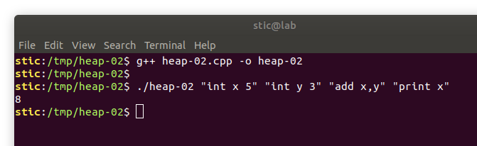

## Heap-02, introducción

Este ejercicio intenta emular un escenario típico que se da en la explotación de browsers y de intérpretes en general. La idea es la siguiente: un atacante puede proveer un script que será ejecutado por un intérprete en el browser de la víctima (e.g. el intérprete de JavaScript). Si bien las capacidades del lenguaje están restrictas, el programa puede explotar una vulnerabilidad en el intérprete, logrando así escapar al sandbox y ejecutar código máquina con los permisos del browser, superando las limitaciones impuestas.

El programa de este ejercicio es un intérprete de un lenguaje muy básico que permite declarar y realizar cálculos con enteros y vectores de enteros. 

> Nota: el programa consiste en los archivos heap-02.cpp, Entity.h e Interpreter.h.

Veamos un ejemplo para que quede claro. Compilamos el programa ejecutando

```bash
g++ heap-02.cpp -o heap-02
```

y procedemos a ejecutar el comando

```bash
./heap-02 "int x 5" "int y 3" "add x,y" "print x"
```



Observaremos que cada argumento provisto al programa es una instrucción. Las primeras dos instrucciones declaran variables `x` e `y`, con valores 5 y 3, respectivamente. La tercera instrucción suma las variables, e implícitamente guarda el resultado en la primera, `x`. La última instrucción muestra en pantalla el valor de `x`, que observaremos termina siendo efectivamente la suma entre las dos variables declaradas.

Las instrucciones disponibles son las siguientes:

* `int x v` : delcara una variable entera de nombre `x` con valor `v`.
* `int_v x n a1,a2,...,an` : declara un vector entero `x` de n elementos `a1`, `a2`, ..., `an`.
* `set_v x i v` : le da al `i`-ésimo elemento de `x` el valor `v`.
* `add x,y` : suma las variables `x` e `y` de ser posible, guardando el resultado en `x`.
* `print x` : muestra en pantalla el valor de la variable `x`, formateado según el tipo de `x`.
* `delete x` : libera la memoria reservada para la variable `x`.

El objetivo de este ejercicio es desarrollar un mecanismo que permitiría controlar el flujo de ejecución, aunque no es necesario lograr ejecutar código arbitrario; controlar un puntero a código o un vptr será suficiente.