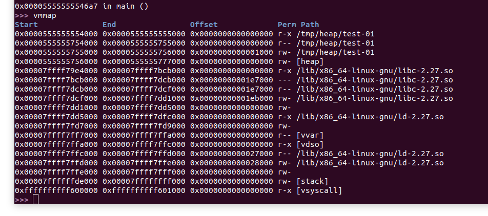
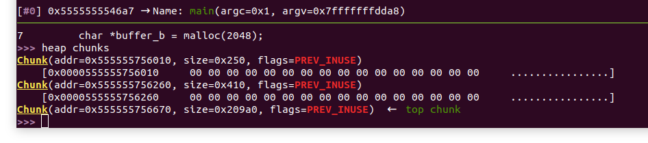
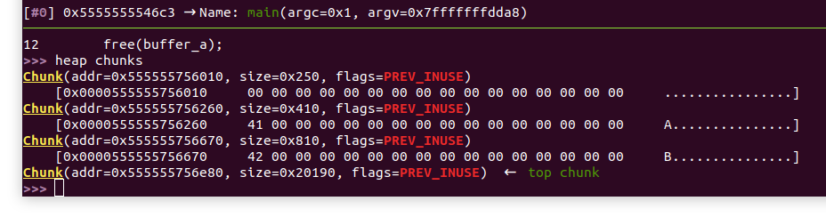
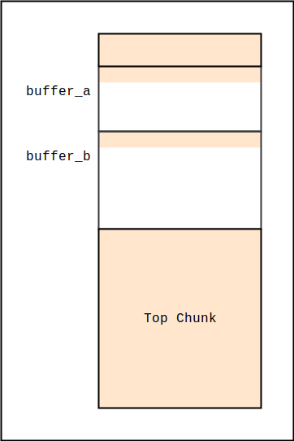
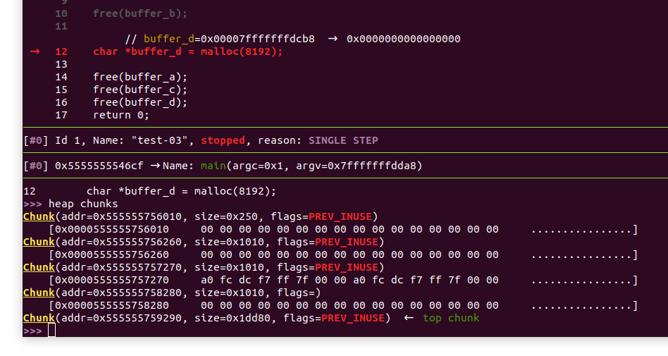
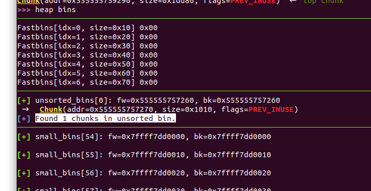
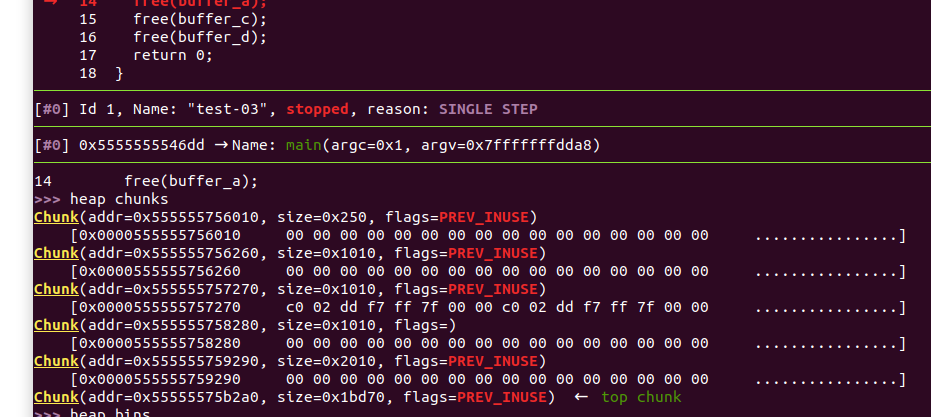
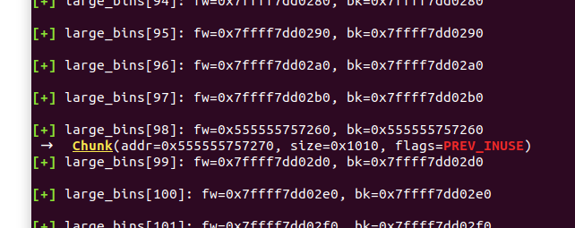
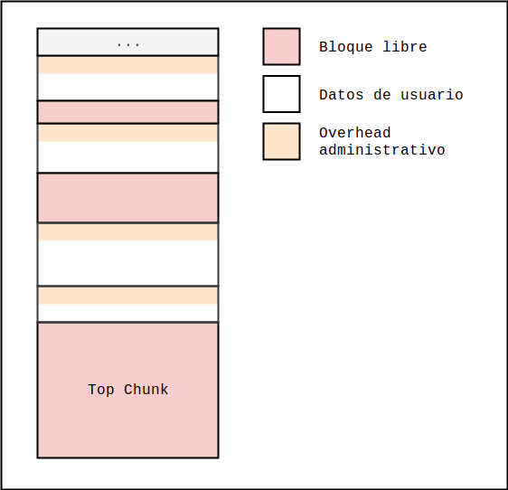

# Heap

Como ya sabemos, para llevar a cabo sus funciones, los programas deben reservar memoria que utilizarán para almacenar datos. La idea de este resumen es introducir los mecanismos de gestión de la región de memoria conocida como el heap. El resumen está basado en el informe técnico [1], que explica la implementación de malloc de glibc 2.23 con lujo de detalles.

El heap se suele utilizar para almacenar datos cuyo tamaño o cantidad no pueden ser determinados en tiempo de compilación. Como recordaremos de los ejercicios anteriores, la pila, la región de memoria con la que venimos trabajando, es gestionada exclusivamente por el compilador; la expansión y la contracción de la pila está implícita en el código del programa, y es el compilador quien decide cuánto espacio reservar y para qué será utilizado. El heap, por otro lado, le ofrece al programador la posibilidad de gestionar bloques de memoria por su propia cuenta.

Básicamente, la interacción entre el programador y el heap se da a través de la interfaz provista por un gestor de memoria. El gestor de memoria que ofrece libc es la implementación de **malloc**, definida en el archivo `malloc.c`. Dicha interfaz incluye las funciones malloc y free, entre otras. La primera se utiliza para solicitar un bloque de memoria contigua de un cierto tamaño. El tamaño debe ser provisto como parámetro a la función; la segunda se utiliza para liberar un bloque previamente reservado, pasando como parámetro el puntero al bloque que devuelve malloc.


Comenzaremos estudiando la disposición del heap en el espacio de memoria. Supongamos que tenemos el siguiente programa escrito en C:

```c
// test-01.c

#include <stdlib.h>

int main(int argc, char **argv) {
  char *buffer = malloc(1024);
  free(buffer);
  return 0;
}
```

Lo compilamos con gcc y lo ejecutamos en gdb/gef. Ponemos un breakpoint luego de la llamada a malloc, ejecutamos el programa, y ejecutamos luego vmmap. Deberíamos observar algo como lo siguiente:



Recordaremos que en gdb por defecto no hay aleatorización del espacio de memoria. Observaremos entonces que el heap comienza justo después del final de la sección de datos del binario test-01. Esto se debe a que el gestor de memoria de malloc utiliza normalmente la llamada al sistema "brk" para reservar espacio para el heap. Según [el manual](https://linux.die.net/man/2/brk), dicha llamada lo que hace es cambiar la posición del final del segmento de datos del proceso, permitiendo así agrandar el espacio de memoria.

Entonces, en el espacio de memoria del proceso, ya hay un segmento de memoria mapeado para almacenar el heap. Dicho segmento, sin embargo, debe ser de alguna forma estructurado y gestionado. Allí es donde entran en juego los algoritmos implementados en el gestor de memoria. En principio, la estructura fundamental de la implementación de malloc es el "pedazo" (chunk) de memoria, al cuál llamaremos simplemente "bloque". Un bloque de memoria consiste en un espacio reservado para almacenar datos del usuario, así como una cabecera destinada a almacenar datos administrativos utilizados por el gestor para realizar tareas de mantenimiento. En principio, una vez mapeado, en el heap hay siempre al menos un bloque denominado "top chunk". Ante un pedido por parte del usuario, dicho bloque puede ser particionado para satisfacerlo. Si el tamaño del bloque solicitado por el usuario es demasiado grande como para ser satisfecho solo particionando el top chunk, se procede a extender el heap nuevamente mediante una llamada a brk. Para pedidos excepcionalmente grandes, el gestor podría utilizar mmap para mapear un bloque especial en el espacio de memoria del proceso, aunque no entraremos en mucho detalle al respecto; para más detalles consultar [1].

Supongamos entonces que tenemos el siguiente código:

```c
// test-02.c

#include <stdlib.h>

int main(int argc, char **argv) {
  char *buffer_a = malloc(1024);
  char *buffer_b = malloc(2048);
    
  buffer_a[0] = 'A';
  buffer_b[0] = 'B';
    
  free(buffer_a);
  free(buffer_b);
  return 0;
}
```

Compilamos con símbolos de debugging con `gcc -g test-02.c -o test-02`, ejecutamos el programa con gdb, y avanzamos hasta ejecutar la primera llamada a malloc. Si ejecutamos entonces el comando "heap chunks" de gef, deberíamos observar algo como lo siguiente:



Observaremos que gef nos muestra el top chunk, así como otros dos bloques. Notaremos el bloque del medio, de 0x410 (1040) bytes, los 1024 reservados mas 16 adicionales. Si ejecutamos el siguiente malloc, avanzamos hasta el primer free (pero no lo ejecutamos), y ejecutamos `heap chunks` nuevamente, deberíamos observar algo como lo siguiente:



Observaremos que se ha creado un nuevo bloque, esta vez de 2064 bytes, los 2048 reservados mas 16 adicionales. Sabemos entonces que los bloques correspondientes a buffer_a y buffer_b son aquellos en las direcciones `0x555555756260` y `0x555555756670`, y que cada bloque parecería tener un overhead constante de 16 bytes cada uno; estos bytes adicionales se utilizan para almacenar datos administrativos utilizados por el gestor de memoria. Notaremos también que, con la segunda reserva, el tamaño del top chunk se ha reducido desde `0x209a0` bytes hasta `0x20190` bytes, justamente los `0x810` bytes reservados para el segundo bloque. Observaremos también que los bloques se encuentran contiguos en memoria, en un esquema como el siguiente:




En naranja se muestra la memoria utilizada por el gestor, en blanco aquella disponible para el usuario. Es decir, el heap consiste en una secuencia de datos administrativos entremezclados con datos de usuario.

Veamos ahora lo que pasa cuando empezamos a liberar bloques. Consideremos el siguiente ejemplo:

```c
// test-03.c

#include <stdlib.h>

int main(int argc, char **argv) {
  char *buffer_a = malloc(4096);
  char *buffer_b = malloc(4096);
  char *buffer_c = malloc(4096);

  free(buffer_b);
    
  char *buffer_d = malloc(8192);

  free(buffer_a);
  free(buffer_c);
  free(buffer_d);
  return 0;
}
```

Compilamos con símbolos, ejecutamos el programa en gdb habiendo puesto un breakpoint en main, y avanzamos hasta el instante anterior a la inicialización de buffer_d, justo luego de la liberación de buffer_b. Si ejecutamos ahora el comando "heap chunks", deberíamos observar algo como lo siguiente:



Observaremos que, habiendo liberado el segundo bloque, el tercero ahora no tiene el flag "PREV_INUSE" activo. La ausencia de dicho flag indica, evidentemente, que el bloque anterior no está siendo utilizado; es decir, confirma que el bloque anterior ha sido liberado. 

Adicionalmente, si ejecutamos el comando "heap bins" deberíamos observar algo como lo siguiente:




Resulta que la implementación de malloc de glibc organiza los bloques libres en listas enlazadas denominadas bins. Existen distintos tipos de bins, principalmente para organizar los bloques libres por tamaño. Esto permite optimizar la respuesta de malloc ante nuevas solicitudes. Si los bloques libres están organizados por tamaño, en particular por tamaños comúnmente solicitados, es posible realizar búsquedas más rápidas para encontrar bloques libres de tamaños específicos que podrán ser reutilizados.

Cuando un bloque es liberado se lo coloca inicialmente en la lista unsorted_bins que contiene bloques de diverso tamaño, sin ordenar. Además de unsorted_bins, también están los denominados bins "pequeños" (small bins) y los bins "grandes" (large_bins). La diferencia radica en que los bins pequeños solo contienen bloques de un mismo tamaño, mientras que los bins grandes contienen bloques dentro de un rango de tamaños. Luego existen también lo que se llama "fastbins", también de tamaños fijos y pequeños, optimizados para realizar búsquedas por bloques más chicos.

Para enlazar la lista, cada uno de los bloques libres debe almacenar un puntero al siguiente, y al anterior en caso de tratarse de una lista doblemente enlazada (los fastbins no son doblemente enlazados). Aprovechando que el bloque ha sido liberado, el espacio que antes se utilizaba para almacenar datos del usuario ahora puede utilizarse para almacenar los punteros fw y bk, que apuntan al nodo siguiente y al anterior, respectivamente. Es decir, los punteros fw y bk se almacenan en el mismo bloque de memoria como datos administrativos.

Como habíamos mencionado antes cuando un bloque es liberado se lo coloca en la lista unsorted_bins, sin ningún orden particular. Quien se encarga de colocar los bloques en los bins más adecuados es malloc, cuando intente responder a una solicitud. Cuando malloc debe responder, primero itera por unsorted_bins, intentando encontrar un bloque de tamaño adecuado para satisfacer la solicitud. En el proceso, aquellos bloques que resulten inadecuados para satisfacer el pedido serán colocados en sus correspondientes bins.

Continuando con el ejemplo anterior, avanzamos una línea más, ejecutando malloc nuevamente. Procedemos ahora ejecutando "heap chunks" y luego "heap bins", para observar lo siguiente:







Observaremos que el tamaño solicitado fue demasiado grande para satisfacer el pedido devolviendo o particionando el bloque antes liberado, con lo cuál debío particionarse el top chunk en cambio. Adicionalmente, el bloque que antes había sido liberado ha sido colocado en uno de los large_bins.

¿Qué ocurre cuando dos bloques contiguos quedan libres? En tal caso, el gestor de memoria los combina en un único bloque. Esto incluye también al top chunk: cuando un bloque justo debajo del top chunk se libera, pasa a ser parte de este último.


Lo que debemos tener en cuenta como atacantes es que la estructura del heap será usualmente algo similar a la siguiente:




Esencialmente, debemos notar que el heap, a pesar de su organización en forma de listas, se trata de una región de memoria contigua. Hay que tener en cuenta que liberar un bloque no implica que los datos almacenados en la memoria del mismo no puedan ser escritos y reutilizados. En los ejercicios de esta sección estaremos estudiando vulnerabilidades que abusan de esta propiedad.

Otro detalle importante a tener en cuenta es que los bloques pequeños de tamaños comúnmente solicitados son cacheados por el gestor de memoria. Cuando se libera un bloque `b` pequeño de tamaño `n`, el flag PREV_INUSE del bloque siguiente sigue activo, y el gestor de memoria podrá devolver `b` ante un nuevo pedido por un bloque de tamaño exactamente igual a `n`. Esto tendrá implicaciones importantes al momento de desarrollar mecanismos de explotación.

Con esto concluimos nuestra introducción al heap. Lo que hemos visto del heap hasta ahora es meramente lo básico y fundamental, necesario para explotar las vulnerabilidades que estaremos estudiando en los ejercicios. Para un estudio detallado de la implementación de malloc en glibc se recomienda continuar con [1].


## Referencias

[1] Frank Block, Andreas Dewald, “*Linux Memory Forensics: Dissecting the User Space Process Heap*,” Friedrich-Alexander-Universität Erlangen-Nürnberg, Dept. of Computer Science, Technical Reports, CS-2017-02, April 2017.