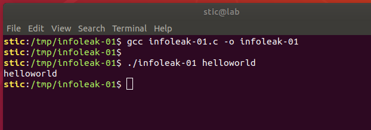
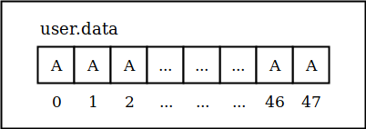
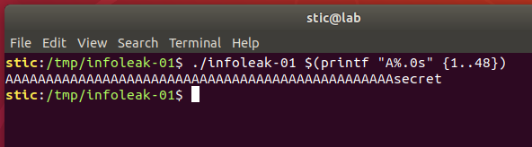

# Infoleak-01

**Objetivo**: Sin editar el código, lograr que el programa listado a continuación muestre por salida estándar el valor del campo "secret_token" del struct "user":

```c
// infoleak-01.c

#include <stdio.h>
#include <stddef.h>
#include <stdint.h>
#include <string.h>

const char* secret = "secret";

typedef struct {
    char data[48];
    char secret_token[16];
} user_t ;

int main(int argc, char **argv) {
    user_t user;
    bzero((void*)&user, 64);
    memcpy(&user.secret_token, secret, 6);
    strncpy((char*)&user.data, argv[1], 48);
    printf("%s\n", (char*)&user.data);
}
```


## Solución

Comenzamos compilando el programa y analizando su comportamiento.

```bash
gcc infoleak-01.c -o infoleak-01
```

A primera vista, parecería que lo único que hace este programa es hacer eco del string en la segunda posición del vector de argumentos. Es decir, si ejecutamos "./infoleak helloworld", veremos que el programa muestra efectivamente el mensaje "helloworld" en pantalla:




Nuestro objetivo final es que el programa emita por salida estándar el contenido del buffer user.secret_token. El problema es que la línea que muestra el mensaje en pantalla no hace referencia a dicho campo; al campo que se hace referencia es user.data, el cuál contendrá en esa instancia hasta 48 caracteres recibidos en el vector de argumentos.

Resulta, sin embargo, que este programa tiene una vulnerabilidad. La vulnerabilidad en cuestión es un **buffer overread** ([CAPEC-540](https://capec.mitre.org/data/definitions/540.html)), el cuál podemos explotar para forzar al programa a mostrarnos el contenido del token secreto. 

Recordaremos que C utiliza bytes nulos para delimitar strings; es decir, funciones como printf que procesan o trabajan con strings saben que no deben leer más allá del primer byte nulo que encuentran en la secuencia. El problema con el código arriba, sin embargo, es que no hace un buen trabajo delimitando el string en user.data. Consideremos el siguiente comando:

```bash
./infoleak-01 $(printf "A%.0s" {1..48})
```

Este comando ejecutará el programa en cuestión pasando un argumento de exactamente 48 caracteres "A". Dado que la función strcpy no delimita el string automáticamente (agregando un byte nulo), el contenido del buffer user.data será el que se esquematiza a continuación:



Resulta, adicionalmente, que user.data y user.secret_token son contiguos en memoria; es decir, el esquema de la memoria será eventualmente similar al que se muestra a continuación:


Dado este esquema, para printf el string que comienza a partir de &user.data no termina hasta el byte 55 en el arreglo, el primer byte nulo originalmente correspondiente al final del string secret. Efectivamente, si ejecutamos el comando arriba mencionado, deberíamos observar una salida como la que se muestra en la siguiente captura:




Logramos entonces, mediante una entrada cuidadosamente elaborada, controlar el comportamiento del programa. Esta es la base de los exploits que estaremos desarrollando en futuros ejercicios.