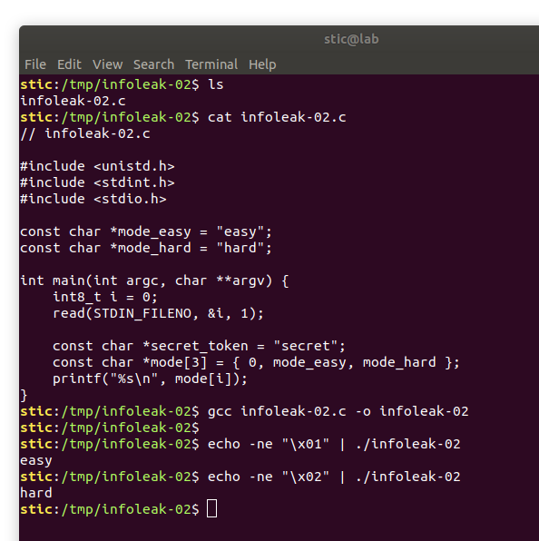
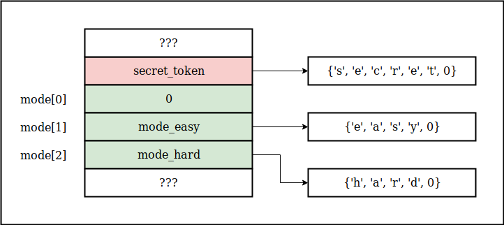
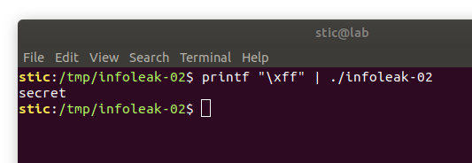
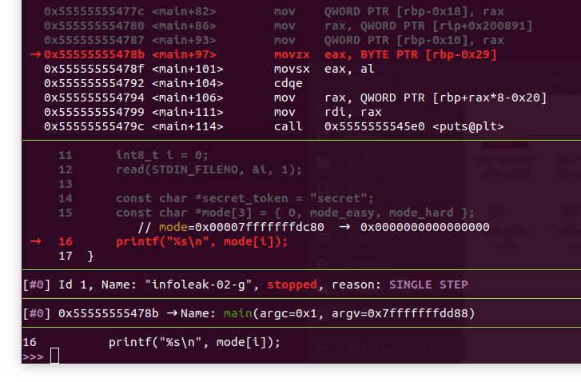
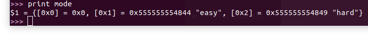
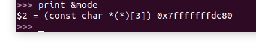
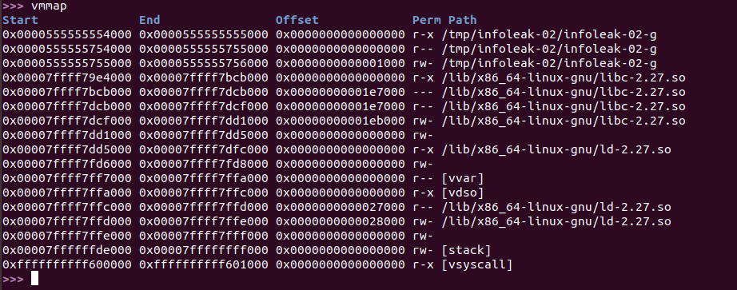
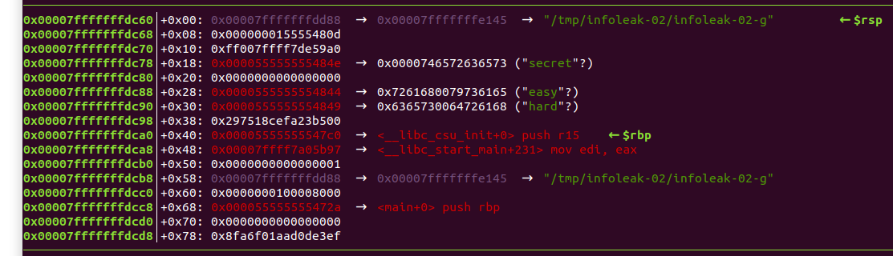

# Infoleak-02

**Objetivo**: Sin modificar el código lograr que el siguiente programa muestre en la terminal el contenido del string secret_token:

```c
// infoleak-02.c

#include <unistd.h>
#include <stdint.h>
#include <stdio.h>

const char *mode_easy = "easy";
const char *mode_hard = "hard";

int main(int argc, char **argv) {
    int8_t i = 0;
    read(STDIN_FILENO, &i, 1);
    
    const char *secret_token = "secret";
    const char *mode[3] = { 0, mode_easy, mode_hard };
    printf("%s\n", mode[i]);
}
```


## Solución

Compilamos el programa con gcc y procedemos a analizar su comportamiento. En principio, podemos ver que el código espera recibir un entero de un byte como argumento. Dicho entero será utilizado para indexar un arreglo, el cuál contiene punteros a strings.  El índice selecciona entonces el string que la llamada a printf emitirá por la salida estándar.

En este ejercicio estaremos utilizando algunas opciones del comando echo para generar datos binarios fácilmente. Por ejemplo, el siguiente comando nos permite emitir la secuencia de cuatro bytes `0xde`, `0xad`, `0xc0`, `0xde`.

```
echo -ne "\xde\xad\xc0\xde"
```


Podemos utilizar este comando para generar los datos de entrada para nuestro programa, pasándoselos al mismo por un pipe, como vemos en la siguiente captura:




Si jugamos un poco con el programa no tardaremos en romperlo, logrando que nos muestre secuencias de datos extrañas o incluso causando errores de segmentación. Evidentemente, el programa no hace ningún esfuerzo por validar que el índice sea efectivamente o 1, o 2, y no otra cosa. La pregunta es, ¿cómo aprovechamos esto para lograr que nos muestre precisamente lo que queremos que nos muestre?

En esta instancia debemos recordar que cada función en ejecución almacena los datos correspondientes a sus variables locales en una estructura denominada "stack frame", contenida en una región de memoria denominada el "stack". Luego veremos en detalle cómo es que se estructura el stack frame de nuestra función, pero por el momento cabe mencionar que las variables y los buffers locales usualmente se encuentran contiguos en memoria; es decir, la disposición en memoria de las variables locales de la función main podría ser la siguiente:




No es difícil ver porqué el siguiente comando causa un error de segmentación:

```bash
printf "\x00" | ./infoleak-02
```

Al intentar acceder al string en la dirección nula mode[0], ocurre un intento de lectura de los datos en la dirección 0. Esta es efectivamente una lectura inválida que causa un error de segmentación.

Entonces, sería natural pensar que, si lo que queremos hacer es mostrar el valor del string al que apunta secret_token, lo que debemos hacer es pasarle al programa un índice -1. La pregunta ahora es cómo hacemos para pasarle al programa un índice negativo, considerando que el valor más bajo que podemos pasar es 0.

Resulta que la variable i es de tipo int8_t, un entero de 8 bits **con signo**. En la arquitectura x86-64 los enteros de 8 bits mayores o iguales a cero se representan con valores desde 0x00 hasta 0x7f inclusive. Los números enteros negativos de 8 bits, por otro lado, se representan con valores que van desde 0x80 hasta 0xff inclusive. En este esquema, el número -1 se representa con el byte 0xff.

Si ejecutamos entonces

```bash
printf "\xff" | ./infoleak-02
```

observaremos efectivamente lo esperado



Con ésto logramos nuestro cometido.

Existen varios tipos de vulnerabilidades que tratan con enteros; en la taxonomía de CAPEC, comprenden en general el patrón de ataque [CAPEC-128](https://capec.mitre.org/data/definitions/128.html), "Integer Attacks". Estos ataques se volverán más relevantes luego cuando desarrollemos primitivas de escritura.


## Análisis en gdb

Para darle concreción a lo que vimos en la sección anterior, procedemos ahora a analizar la función main durante su ejecución utilizando un debugger. El debugger es una herramienta esencial al momento de desarrollar exploits, y nosotros estaremos utilizando gdb, el debugger más popular en plataformas Linux.

Ya que gdb por sí solo puede ser algo áspero, lo acompañaremos con un adendo llamado [gef](https://github.com/hugsy/gef). Dicho adendo mejora la interfaz de gdb, haciéndola más amena.

Primero guardaremos la entrada que le estaremos pasando al programa en un archivo input.bin. Esto nos permitirá iniciar el programa en gdb pasando los datos por entrada estándar:

```bash
printf "\xff" > input.bin
```


Procedemos entonces a compilar el archivo infoleak-02.c con símbolos de debugging ejecutando

```bash
gcc -g infoleak-02.c -o infoleak-02-g
```

y ejecutamos luego el debugger con el comando

```bash
gdb ./infoleak-02-g
```


Asumiendo gef instalado y configurado (ver [guía en el repositorio oficial](https://github.com/hugsy/gef#instant-setup)), procedemos colocando un breakpoint en el principio de la función main con el comando

```
b main
```

y continuamos luego ejecutando

```
run < input.bin
```

para poner el programa en marcha. Veremos entonces cómo gdb para efectivamente en el inicio de la función main, donde hemos puesto nuestro breakpoint.

Presionamos la tecla n unas pocas veces para avanzar hasta la línea que ejecuta printf. Deberíamos estar viendo en la pantalla de gef algo como lo que se muestra a continuación:




Estamos entonces en la línea 16. Si escribimos "print mode" podemos ver el contenido del arreglo mode:



Como era de esperarse, se trata simplemente de un arreglo de direcciones de strings. Por otro lado, podemos mostrar la dirección del propio arreglo mode:

```
print &mode
```



Esta dirección, `0x7fffffffdc80`, se encuentra una región que llamamos el stack. Si ejecutamos el comando "vmmap" de gef la veremos listada cerca del final:



Observamos que la región comprende todas las direcciones desde `0x7ffffffde000` hasta `0x7ffffffff000`, incluyendo efectivamente la dirección del arreglo mode.

>  **Nota:** Es posible que, si están siguiendo la resolución paso a paso, las direcciones que vean en pantalla sean diferentes a las que aquí mostramos. Las direcciones de los distintos objetos en memoria dependen del sistema concreto, del compilador, y de otras cuestiones que estaremos estudiando en secciones posteriores.

Dentro del stack, el arreglo mode se encuentra en esta estructura que llamamos el stack frame de la función main. Convenientemente, gef nos muestra un resumen del stack en la interfaz del debugger:



No es la idea ahora entrar en detalle sobre qué es cada cosa. La [parte teórica](https://fundacion-sadosky.github.io/guia-escritura-exploits/buffer-overflow/1-introduccion.html) puede encontrarse muy bien explicada en la [guía de Teresa Alberto](https://fundacion-sadosky.github.io/guia-escritura-exploits/) [1]. Por el momento nos limitaremos a prestar atención a la dirección `0x7fffffffdc80` donde comienza nuestro arreglo. Vemos que, efectivamente, tiene en el primer elemento el puntero nulo (el valor cero, simplemente), y luego vienen los otros dos punteros que apuntan a los strings "easy" y "hard", 8  y 16 bytes más arriba, respectivamente. No es difícil observar, sin embargo, que ocho bytes debajo del inicio del arreglo se encuentra el puntero al string "secret". Efectivamente, cuando escribimos

```
printf("%s\n", mode[i]);
```

le estamos pasando a printf el valor en la dirección

```
0x7fffffffdc80 + 8*i
```

Es por eso que dándole a la variable i el valor -1 logramos que printf nos muestre en pantalla el valor del string secret. Pasamos ahora los comandos `continue` y `quit` para finalizar la ejecución en gdb.


## Lecturas recomendadas

[1] Teresa Alberto, *Guía de auto-estudio para la escritura de exploits*.<br/>https://fundacion-sadosky.github.io/guia-escritura-exploits/

