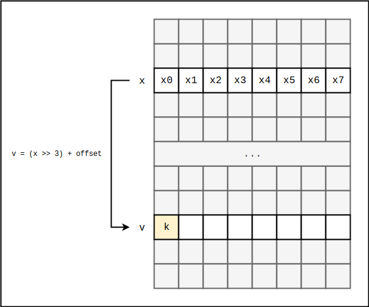
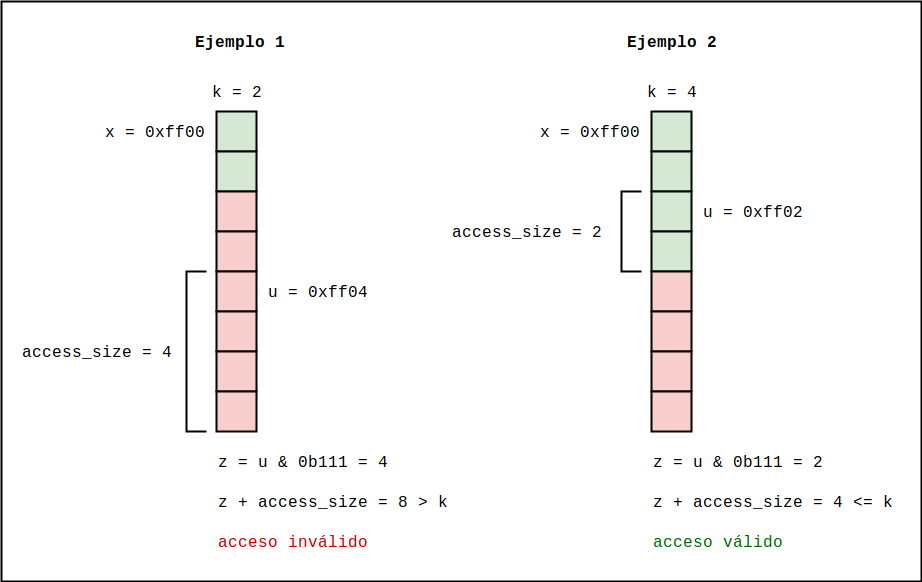
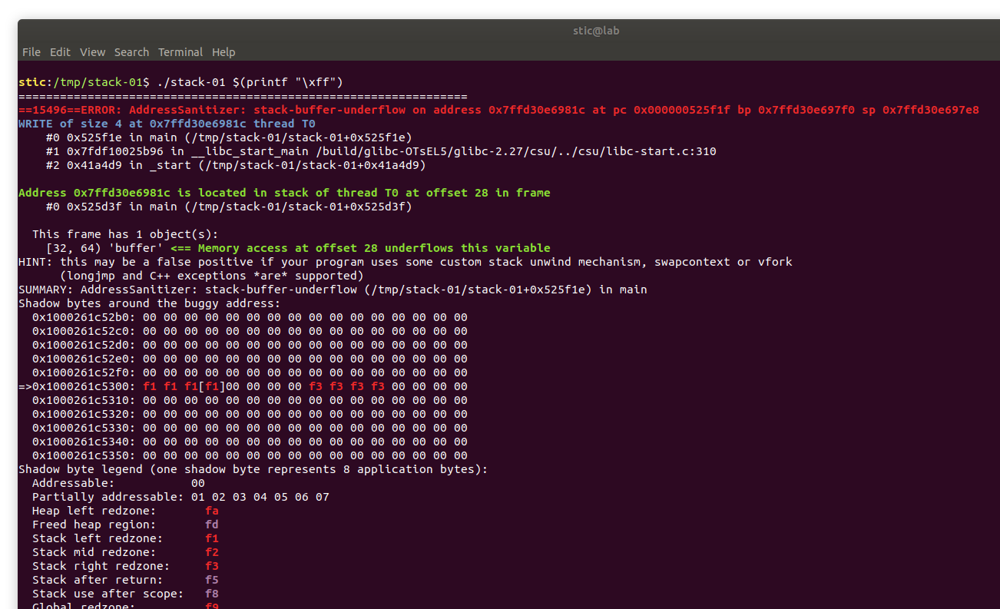

# Address Sanitizer & Shadow Memory

Address Sanitizer (ASan) [1] es un mecanismo basado en shadow memory, memoria sombra, que intenta detectar la corrupción de memoria al momento en que ocurre. ASan ha sido implementado tanto en gcc como en Clang; nosotros estaremos estudiando la implementación de Clang 7, todavía disponible en los repositorios de Ubuntu.

Tal como ocurría con [SCS](../shadow-call-stack/shadow-call-stack.md), la idea de ASan es instrumentar el código del programa con instrucciones adicionales que realizan ciertas validaciones en tiempo de ejecución para poder detectar condiciones de error que de otra forma no hubieran sido detectadas (e.g. overflows).  

Para implementar dichas validaciones, ASan aplica el concepto de **shadow memory**. La idea de shadow memory es almacenar en una región de memoria "sombra", idealmente oculta y solo accesible mediante instrucciones o syscalls particulares, metadatos sobre la memoria "visible" de la aplicación. Por ejemplo, dada una dirección x en el stack, en la memoria sombra podría almacenarse información que indica si x puede ser o no leída o escrita. Con la instrumentación adecuada, shadow memory permite implementar políticas de seguridad flexibles y mucho más granulares que a nivel página (como se hacía por ejemplo con W^X). Por ejemplo, recordaremos que en SCS la memoria sombra se utilizaba para almacenar los valores originales de las direcciones de retorno, y el acceso se daba solo a través del registro gs, el cuál debía ser inicializado en forma segura para no develar la ubicación del shadow stack.

En general, implementar un mecanismo de seguridad con shadow memory presenta al menos los siguientes tres problemas:

1. Dada la dirección x en la memoria de aplicación (e.g. stack, heap, etc.) hay que determinar la dirección z en la memoria sombra donde se guardan los metadatos correspondientes a x. Este procedimiento debe ser temporalmente eficiente, ya que deberá ser ejecutado en todos los accesos instrumentados.
2. Para que una implementación con shadow memory sea espacialmente eficiente, será necesario codificar la información en forma tal de minimizar la cantidad de bits sombra utilizados por cada byte de memoria de aplicación.
3. Tal como ocurría con SCS, si un atacante puede modificar la memoria sombra, la mitigación queda inutilizada. Esto implica que, o debe haber soporte por parte del hardware o del sistema operativo para impedir el acceso salvo con instrucciones o syscalls particulares, o no debe ser posible ubicar el o los segmentos de memoria sombra mediante leaks de información.


Veamos cómo resuelve ASan estos problemas. Supongamos que tenemos, en un programa no instrumentado, un acceso a memoria como el que se muestra a continuación:

```assembly
mov rax,QWORD PTR [rbx]
```

Es decir, queremos cargar al registro rax la palabra de 8 bytes que comienza a partir de la dirección almacenada en el registro rbx, a la cuál llamaremos `x`. Lo que hará ASan entonces es instrumentar el acceso para verificar que se trata efectivamente de un acceso válido. Para ello deberá consultar la memoria sombra que contiene información sobre los 8 bytes a partir de `x` inclusive, la cuál almacenará datos que indican si los bytes pueden o no ser accedidos.

Dada una dirección `u`, ASan determina la dirección `v` donde se guardan metadatos sobre el byte en `u` mediante la transformación 

```
v = f(u) = (u >> 3) + offset
```

El offset es una constante estática (i.e. está hardcodeado en el código instrumentado). El operador `>>` es un bit shift lógico hacia la derecha. 

Con esta transformación es posible determinar la dirección `v` para cualquier valor de `u`. Observaremos, sin embargo, que no se trata de una transformación biyectiva. Por ejemplo, los 8 valores binarios `0b1000` hasta `0b1111` inclusive mapean al mismo valor de `v`: `0b1 + offset`. Esto se debe a que ASan codifica la información tal de requerir un solo byte sombra cada 8 bytes de datos de aplicación. Esto nos lleva a cómo ASan resuelve el segundo problema. Dada una dirección `x` alineada a 8 bytes, lo que indica el valor del byte `k` en la dirección `v(x)` es la cantidad de bytes, entre 0 y 8, a partir de la dirección `x` que son efectivamente accesibles. La codificación es la siguiente:

* `*v(x) == 0`: Los 8 bytes a partir de `x` son accesibles.
* `*v(x) == k`, con `1 <= k <= 7`: Solo `k` bytes a partir de `x` son accesibles.
* `*v(x) < 0`: Ninguno de los 8 bytes a partir de `x` es accesible.

Veamos cómo se refleja ésto en la instrumentación de ASan. Dado un intento de acceso a la palabra de 8 bytes a partir de la dirección `x`, alineada también a 8 bytes, a un alto nivel podemos representar el código a inyectar de la siguiente forma:

```c
// Determinamos la dirección del byte sombra que codifica los permisos
// sobre la palabra de 8 bytes a partir de x.
shadow_address = (x >> 3) + offset;

// Verificamos que los 8 bytes sean todos accesibles.
if (*shadow_address != 0)
    ReportAndCrash(x);

// Acceso válido, continuamos.
```

Ya que se trata de un acceso de 8 bytes, esperaríamos que el byte sombra que codifica los permisos de acceso nos indique que los 8 bytes son efectivamente accesibles. Para ello, su valor debe ser 0. Gráficamente, podríamos representar el esquema de la siguiente forma:



Para que el acceso a los 8 bytes a partir de `x` sea válido, el valor de `k` debe ser 0.


Para un tamaño de acceso inferior a 8 bytes, la instrumentación tiene la siguiente forma. Supongamos que queremos acceder a `access_size` bytes a partir de la dirección `u`, no necesariamente alineada a 8 bytes. Supongamos también que si alineamos `u` a 8 bytes obtenemos la dirección `x`. Tenemos entonces 

```c
/* Determinamos la dirección del byte sombra que codifica los permisos
 * de los bytes a partir de u.
 */
shadow_address = (u >> 3) + offset;

k = *shadow_address;

/* Tomamos los 3 bits menos significativos de la dirección u; estos bits
 * nos indican el primer byte al cuál se quiere acceder de los 8 a partir de x.
 * Llamamos j al número entre 0 y 7 conformado por los 3 bits menos
 * significativos de u (j = u & 0b111 = u & 7). Nuestro acceso a memoria
 * comienza entonces a partir de la dirección x + j.
 *
 * Sabemos que los primeros k bytes a partir de x son accesibles, por lo
 * que, si le sumamos el tamaño del acceso al índice j y el resultado es mayor
 * a k, estaremos intentando acceder a bytes a los cuales no tenemos acceso.
 *
 * Alternativamente, si k es 0, sabemos que todos los bytes son accesibles
 * con lo cual no es necesario validar la suma.
 *
 * La lógica resultante es la que se expresa a continuación.
 *
 */
if (k != 0 && ((u & 7) + access_size > k))
    ReportAndCrash(x);

// Acceso válido, continuamos.
```

En este caso, verificamos primero que `k` no sea 0. Si `k` no es 0 quiere decir que al menos uno de los 8 bytes a partir de `x = u & ~0b111` no es accesible. Debemos proceder entonces a determinar si con el acceso estaremos intentando tocar alguno de aquellos bytes para los cuales el acceso no está permitido. Para ello calculamos `u & 0b111`, con lo cuál obtenemos el índice `j` del byte a partir del cuál se está intentando acceder, con base en `x`. Sumando  `access_size` al valor calculado obtenemos el índice del primer byte fuera del rango del acceso. Si ese valor resulta ser mayor a `k`, estaremos intentando acceder a bytes no accesibles, con lo cuál el programa deberá abortar su ejecución. Quizás los siguientes ejemplos concretos dejen la idea más clara:



En el primer ejemplo se está intentando acceder a los cuatro bytes a partir de `u = 0xff04`. Mediante la transformación ya explicada se determina la dirección `v(u)` y se obtiene el valor del byte `k` que codifica los permisos a partir de la dirección `x = 0xff00 = u & ~0b111`. En este caso, el valor de `k` es 2. Esto implica que solo 2 bytes son accesibles a partir de `x`, con lo cuál el acceso es inválido. Observaremos que el cálculo en el gráfico permite determinar tal condición.

El segundo ejemplo se trata de un acceso válido. En este caso, `k = 4` y se quiere acceder a 2 bytes a partir de `u = 0xff02`. En este caso, se determina que `u & 0b111 + access_size` no es mayor a 4, con lo cuál todos los bytes accedidos están dentro del rango accesible, determinando así que el acceso es efectivamente válido.


Para estudiar la implementación concreta de Clang 7 estaremos utilizando el siguiente programa:

```c
// stack-01.c

#include <stdio.h>
#include <stdint.h>

int main(int argc, char **argv) {
    if (argc != 2) return 1;
    
    int buffer[8];
    int k = 0;
    
    buffer[(int8_t) argv[1][0]] = 1;
    
    if (k == 1) {
        printf("Hello, world!\n");
    } else {
        printf("Try again!\n");
    }
    
    return 0;
}
```

Recordaremos este programa de la primera parte de la guía. Recordaremos también que, si compilamos el programa con gcc 7.3.0 y y lo ejecutamos pasando el valor binario -1 como argumento, lograremos que en pantalla se muestre el mensaje "Hello, world!". En este caso, sin embargo, lo estaremos compilando con el siguiente comando:

```bash
clang-7 -fsanitize=address stack-01.c -o stack-01
```

Este comando generará el binario stack-01, el cuál podemos intentar ejecutar pasando el byte `0xff` como argumento. Ejecutamos entonces el siguiente comando y observamos la salida resultante:

```bash
./stack-01 $(printf "\xff")
```



Observaremos que el programa nos muestra una salida extensa en la cuál nos da un reporte del error detectado. Lo que primero debemos notar es que ASan detectó correctamente que se trata de un buffer underflow, reportándolo en la primera línea del informe. Luego hay algunos detalles sobre el stack trace y sobre el frame de la función que en este caso no nos importan demasiado. Finalmente, vemos que hay un dump de una región de shadow bytes alrededor de la dirección donde se detectó el bug. El valor entre corchetes es el del byte sombra (`k`) que fue evaluado para detectar el underflow. Recordaremos que los valores negativos indican que ninguno de los 8 bytes de la memoria de aplicación correspondiente es accesible; algo que no habíamos mencionado es que ASan usa distintos valores negativos para indicar distintos tipos de regiones no accesibles. En este caso, el valor `0xf1` indica que se trata de una "stack left redzone" (como podemos ver en la leyendo abajo del dump), una zona inaccesible detrás de un buffer en el stack.

Veamos cómo funciona esto a nivel assembly. Utilizamos objdump para obtener un dump de la función main del binario generado:

```
0000000000525d30 <main>:
  525d30:	55                   	push   rbp
  525d31:	48 89 e5             	mov    rbp,rsp
  525d34:	53                   	push   rbx
  525d35:	48 83 e4 e0          	and    rsp,0xffffffffffffffe0
  525d39:	48 81 ec c0 00 00 00 	sub    rsp,0xc0
  525d40:	48 89 e3             	mov    rbx,rsp
  525d43:	31 c0                	xor    eax,eax
  525d45:	89 c1                	mov    ecx,eax
  525d47:	83 3c 25 b0 1e 77 00 	cmp    DWORD PTR ds:0x771eb0,0x0
  525d4e:	00 
  525d4f:	89 7b 7c             	mov    DWORD PTR [rbx+0x7c],edi
  525d52:	48 89 73 70          	mov    QWORD PTR [rbx+0x70],rsi
  525d56:	48 89 4b 68          	mov    QWORD PTR [rbx+0x68],rcx
  525d5a:	0f 84 10 00 00 00    	je     525d70 <main+0x40>
  525d60:	b8 60 00 00 00       	mov    eax,0x60
  525d65:	89 c7                	mov    edi,eax
  525d67:	e8 24 88 f0 ff       	call   42e590 <__asan_stack_malloc_1>
  525d6c:	48 89 43 68          	mov    QWORD PTR [rbx+0x68],rax
  525d70:	48 8b 43 68          	mov    rax,QWORD PTR [rbx+0x68]
  525d74:	48 83 f8 00          	cmp    rax,0x0
  525d78:	48 89 c1             	mov    rcx,rax
  525d7b:	48 89 43 60          	mov    QWORD PTR [rbx+0x60],rax
  525d7f:	48 89 4b 58          	mov    QWORD PTR [rbx+0x58],rcx
  525d83:	0f 85 12 00 00 00    	jne    525d9b <main+0x6b>
  525d89:	48 89 e0             	mov    rax,rsp
  525d8c:	48 83 c0 a0          	add    rax,0xffffffffffffffa0
  525d90:	48 83 e0 e0          	and    rax,0xffffffffffffffe0
  525d94:	48 89 c4             	mov    rsp,rax
  525d97:	48 89 43 58          	mov    QWORD PTR [rbx+0x58],rax
  525d9b:	48 8b 43 58          	mov    rax,QWORD PTR [rbx+0x58]
  525d9f:	48 89 83 88 00 00 00 	mov    QWORD PTR [rbx+0x88],rax
  525da6:	48 89 c1             	mov    rcx,rax
  525da9:	48 83 c1 20          	add    rcx,0x20
  525dad:	48 c7 00 b3 8a b5 41 	mov    QWORD PTR [rax],0x41b58ab3
  525db4:	48 ba 10 f1 53 00 00 	movabs rdx,0x53f110
  525dbb:	00 00 00 
  525dbe:	48 89 50 08          	mov    QWORD PTR [rax+0x8],rdx
  525dc2:	48 ba 30 5d 52 00 00 	movabs rdx,0x525d30
  525dc9:	00 00 00 
  525dcc:	48 89 50 10          	mov    QWORD PTR [rax+0x10],rdx
  525dd0:	48 89 c2             	mov    rdx,rax
  525dd3:	48 c1 ea 03          	shr    rdx,0x3
  525dd7:	48 89 d6             	mov    rsi,rdx
  525dda:	48 81 c6 00 80 ff 7f 	add    rsi,0x7fff8000
  525de1:	48 bf f1 f1 f1 f1 f8 	movabs rdi,0xf8f8f8f8f1f1f1f1
  525de8:	f8 f8 f8 
  525deb:	48 89 ba 00 80 ff 7f 	mov    QWORD PTR [rdx+0x7fff8000],rdi
  525df2:	c7 82 08 80 ff 7f f3 	mov    DWORD PTR [rdx+0x7fff8008],0xf3f3f3f3
  525df9:	f3 f3 f3 
  525dfc:	c7 83 a4 00 00 00 00 	mov    DWORD PTR [rbx+0xa4],0x0
  525e03:	00 00 00 
  525e06:	44 8b 43 7c          	mov    r8d,DWORD PTR [rbx+0x7c]
  525e0a:	44 89 83 a0 00 00 00 	mov    DWORD PTR [rbx+0xa0],r8d
  525e11:	48 8b 53 70          	mov    rdx,QWORD PTR [rbx+0x70]
  525e15:	48 89 93 98 00 00 00 	mov    QWORD PTR [rbx+0x98],rdx
  525e1c:	83 bb a0 00 00 00 02 	cmp    DWORD PTR [rbx+0xa0],0x2
  525e23:	48 89 43 50          	mov    QWORD PTR [rbx+0x50],rax
  525e27:	48 89 4b 48          	mov    QWORD PTR [rbx+0x48],rcx
  525e2b:	48 89 73 40          	mov    QWORD PTR [rbx+0x40],rsi
  525e2f:	0f 84 0f 00 00 00    	je     525e44 <main+0x114>
  525e35:	c7 83 a4 00 00 00 01 	mov    DWORD PTR [rbx+0xa4],0x1
  525e3c:	00 00 00 
  525e3f:	e9 34 01 00 00       	jmp    525f78 <main+0x248>
  525e44:	48 8b 43 40          	mov    rax,QWORD PTR [rbx+0x40]
  525e48:	c7 40 04 00 00 00 00 	mov    DWORD PTR [rax+0x4],0x0
  525e4f:	c7 83 94 00 00 00 00 	mov    DWORD PTR [rbx+0x94],0x0
  525e56:	00 00 00 
  525e59:	48 8b 8b 98 00 00 00 	mov    rcx,QWORD PTR [rbx+0x98]
  525e60:	48 83 c1 08          	add    rcx,0x8
  525e64:	48 89 ca             	mov    rdx,rcx
  525e67:	48 c1 ea 03          	shr    rdx,0x3
  525e6b:	80 ba 00 80 ff 7f 00 	cmp    BYTE PTR [rdx+0x7fff8000],0x0
  525e72:	48 89 4b 38          	mov    QWORD PTR [rbx+0x38],rcx
  525e76:	0f 84 09 00 00 00    	je     525e85 <main+0x155>
  525e7c:	48 8b 7b 38          	mov    rdi,QWORD PTR [rbx+0x38]
  525e80:	e8 0b c5 fc ff       	call   4f2390 <__asan_report_load8>
  525e85:	48 8b 43 38          	mov    rax,QWORD PTR [rbx+0x38]
  525e89:	48 8b 08             	mov    rcx,QWORD PTR [rax]
  525e8c:	48 89 ca             	mov    rdx,rcx
  525e8f:	48 c1 ea 03          	shr    rdx,0x3
  525e93:	40 8a b2 00 80 ff 7f 	mov    sil,BYTE PTR [rdx+0x7fff8000]
  525e9a:	40 80 fe 00          	cmp    sil,0x0
  525e9e:	48 89 4b 30          	mov    QWORD PTR [rbx+0x30],rcx
  525ea2:	40 88 73 2f          	mov    BYTE PTR [rbx+0x2f],sil
  525ea6:	0f 84 1e 00 00 00    	je     525eca <main+0x19a>
  525eac:	48 8b 43 30          	mov    rax,QWORD PTR [rbx+0x30]
  525eb0:	48 83 e0 07          	and    rax,0x7
  525eb4:	88 c1                	mov    cl,al
  525eb6:	8a 53 2f             	mov    dl,BYTE PTR [rbx+0x2f]
  525eb9:	38 d1                	cmp    cl,dl
  525ebb:	0f 8c 09 00 00 00    	jl     525eca <main+0x19a>
  525ec1:	48 8b 7b 30          	mov    rdi,QWORD PTR [rbx+0x30]
  525ec5:	e8 16 c3 fc ff       	call   4f21e0 <__asan_report_load1>
  525eca:	48 8b 43 30          	mov    rax,QWORD PTR [rbx+0x30]
  525ece:	48 0f be 08          	movsx  rcx,BYTE PTR [rax]
  525ed2:	48 c1 e1 02          	shl    rcx,0x2
  525ed6:	48 8b 53 48          	mov    rdx,QWORD PTR [rbx+0x48]
  525eda:	48 01 ca             	add    rdx,rcx
  525edd:	48 89 d1             	mov    rcx,rdx
  525ee0:	48 c1 e9 03          	shr    rcx,0x3
  525ee4:	40 8a b1 00 80 ff 7f 	mov    sil,BYTE PTR [rcx+0x7fff8000]
  525eeb:	40 80 fe 00          	cmp    sil,0x0
  525eef:	48 89 53 20          	mov    QWORD PTR [rbx+0x20],rdx
  525ef3:	40 88 73 1f          	mov    BYTE PTR [rbx+0x1f],sil
  525ef7:	0f 84 22 00 00 00    	je     525f1f <main+0x1ef>
  525efd:	48 8b 43 20          	mov    rax,QWORD PTR [rbx+0x20]
  525f01:	48 83 e0 07          	and    rax,0x7
  525f05:	48 83 c0 03          	add    rax,0x3
  525f09:	88 c1                	mov    cl,al
  525f0b:	8a 53 1f             	mov    dl,BYTE PTR [rbx+0x1f]
  525f0e:	38 d1                	cmp    cl,dl
  525f10:	0f 8c 09 00 00 00    	jl     525f1f <main+0x1ef>
  525f16:	48 8b 7b 20          	mov    rdi,QWORD PTR [rbx+0x20]
  525f1a:	e8 b1 c6 fc ff       	call   4f25d0 <__asan_report_store4>
  525f1f:	48 8b 43 20          	mov    rax,QWORD PTR [rbx+0x20]
  525f23:	c7 00 01 00 00 00    	mov    DWORD PTR [rax],0x1
  525f29:	83 bb 94 00 00 00 01 	cmp    DWORD PTR [rbx+0x94],0x1
  525f30:	0f 85 19 00 00 00    	jne    525f4f <main+0x21f>
  525f36:	48 bf 60 f0 53 00 00 	movabs rdi,0x53f060
  525f3d:	00 00 00 
  525f40:	b0 00                	mov    al,0x0
  525f42:	e8 19 28 f2 ff       	call   448760 <__interceptor_printf>
  525f47:	89 43 18             	mov    DWORD PTR [rbx+0x18],eax
  525f4a:	e9 14 00 00 00       	jmp    525f63 <main+0x233>
  525f4f:	48 bf a0 f0 53 00 00 	movabs rdi,0x53f0a0
  525f56:	00 00 00 
  525f59:	b0 00                	mov    al,0x0
  525f5b:	e8 00 28 f2 ff       	call   448760 <__interceptor_printf>
  525f60:	89 43 14             	mov    DWORD PTR [rbx+0x14],eax
  525f63:	c7 83 a4 00 00 00 00 	mov    DWORD PTR [rbx+0xa4],0x0
  525f6a:	00 00 00 
  525f6d:	48 8b 43 40          	mov    rax,QWORD PTR [rbx+0x40]
  525f71:	c7 40 04 f8 f8 f8 f8 	mov    DWORD PTR [rax+0x4],0xf8f8f8f8
  525f78:	8b 83 a4 00 00 00    	mov    eax,DWORD PTR [rbx+0xa4]
  525f7e:	48 8b 4b 50          	mov    rcx,QWORD PTR [rbx+0x50]
  525f82:	48 c7 01 0e 36 e0 45 	mov    QWORD PTR [rcx],0x45e0360e
  525f89:	48 8b 53 60          	mov    rdx,QWORD PTR [rbx+0x60]
  525f8d:	48 83 fa 00          	cmp    rdx,0x0
  525f91:	89 43 10             	mov    DWORD PTR [rbx+0x10],eax
  525f94:	0f 84 25 00 00 00    	je     525fbf <main+0x28f>
  525f9a:	48 b8 f5 f5 f5 f5 f5 	movabs rax,0xf5f5f5f5f5f5f5f5
  525fa1:	f5 f5 f5 
  525fa4:	48 8b 4b 40          	mov    rcx,QWORD PTR [rbx+0x40]
  525fa8:	48 89 01             	mov    QWORD PTR [rcx],rax
  525fab:	48 89 41 08          	mov    QWORD PTR [rcx+0x8],rax
  525faf:	48 8b 43 60          	mov    rax,QWORD PTR [rbx+0x60]
  525fb3:	48 8b 50 78          	mov    rdx,QWORD PTR [rax+0x78]
  525fb7:	c6 02 00             	mov    BYTE PTR [rdx],0x0
  525fba:	e9 12 00 00 00       	jmp    525fd1 <main+0x2a1>
  525fbf:	48 8b 43 40          	mov    rax,QWORD PTR [rbx+0x40]
  525fc3:	48 c7 00 00 00 00 00 	mov    QWORD PTR [rax],0x0
  525fca:	c7 40 08 00 00 00 00 	mov    DWORD PTR [rax+0x8],0x0
  525fd1:	8b 43 10             	mov    eax,DWORD PTR [rbx+0x10]
  525fd4:	48 8d 65 f8          	lea    rsp,[rbp-0x8]
  525fd8:	5b                   	pop    rbx
  525fd9:	5d                   	pop    rbp
  525fda:	c3                   	ret 
```

Lo primero que notaremos es que el código es bastante extenso para lo poco que está haciendo (desde el punto de vista de la funcionalidad propia del programa). Concretamente, enfoquémonos en la implementación de la sentencia

```c
buffer[(int8_t) argv[1][0]] = 1;
```

El primer paso para llevar a cabo esta instrucción es leer el segundo elemento del arreglo argv. Las instrucciones relevantes del assembly son las siguientes:

```
   0x0000000000525e59 <+297>:	mov    rcx,QWORD PTR [rbx+0x98]
   0x0000000000525e60 <+304>:	add    rcx,0x8
   0x0000000000525e64 <+308>:	mov    rdx,rcx
   0x0000000000525e67 <+311>:	shr    rdx,0x3
   0x0000000000525e6b <+315>:	cmp    BYTE PTR [rdx+0x7fff8000],0x0
   0x0000000000525e72 <+322>:	mov    QWORD PTR [rbx+0x38],rcx
   0x0000000000525e76 <+326>:	je     0x525e85 <main+341>
   0x0000000000525e7c <+332>:	mov    rdi,QWORD PTR [rbx+0x38]
   0x0000000000525e80 <+336>:	call   0x4f2390 <__asan_report_load8>
   0x0000000000525e85 <+341>:	mov    rax,QWORD PTR [rbx+0x38]
   0x0000000000525e89 <+345>:	mov    rcx,QWORD PTR [rax]
```

Las primeras dos instrucciones cargan en el registro rcx la dirección `&argv[1]`. Las siguientes tres instrucciones copian la dirección a la cuál se está intentando acceder al registro rdx, realizan el bit shift y la suma de un offset estático (`0x7fff8000` en este caso) para determinar la dirección del byte correspondiente en la shadow memory (el byte `k`), y comparan el valor de dicho byte con 0. Ya que se trata de una lectura de 8 bytes, no es necesario implementar la segunda condición; para que la lectura sea válida, el byte leído debe ser indefectiblemente nulo. Observaremos que, en caso de ser el valor obtenido igual a 0, la ejecución continúa a partir de `main+341`, cargando en rcx el puntero `argv[1]`. En caso contrario, se llama a la función `__asan_report_load8` pasando la dirección a la cuál se intentó acceder como parámetro; dicha función generará el reporte de error.

Lo que sigue luego es la carga del primer byte del string al que rcx ahora apunta. El código es en concreto el siguiente:

```
   0x0000000000525e8c <+348>:	mov    rdx,rcx
   0x0000000000525e8f <+351>:	shr    rdx,0x3
   0x0000000000525e93 <+355>:	mov    sil,BYTE PTR [rdx+0x7fff8000]
   0x0000000000525e9a <+362>:	cmp    sil,0x0
   0x0000000000525e9e <+366>:	mov    QWORD PTR [rbx+0x30],rcx
   0x0000000000525ea2 <+370>:	mov    BYTE PTR [rbx+0x2f],sil
   0x0000000000525ea6 <+374>:	je     0x525eca <main+410>
   0x0000000000525eac <+380>:	mov    rax,QWORD PTR [rbx+0x30]
   0x0000000000525eb0 <+384>:	and    rax,0x7
   0x0000000000525eb4 <+388>:	mov    cl,al
   0x0000000000525eb6 <+390>:	mov    dl,BYTE PTR [rbx+0x2f]
   0x0000000000525eb9 <+393>:	cmp    cl,dl
   0x0000000000525ebb <+395>:	jl     0x525eca <main+410>
   0x0000000000525ec1 <+401>:	mov    rdi,QWORD PTR [rbx+0x30]
   0x0000000000525ec5 <+405>:	call   0x4f21e0 <__asan_report_load1>
   0x0000000000525eca <+410>:	mov    rax,QWORD PTR [rbx+0x30]
```

En principio, el código instrumentado comienza como en el caso anterior: se toma la dirección a la cuál se quiere acceder, inicialmente en el registro rcx, y se la rota tres bits hacia la derecha sumando también un offset estático. Con ello se obtiene la dirección del correspondiente byte sombra, cuyo valor se almacena en el registro sil. Observaremos que a partir de `main+362` se verifica si el valor en sil es efectivamente igual a 0; de serlo, los 8 bytes a partir de la dirección en rcx son accesibles y la ejecución continúa a partir de `main+410`; en caso contrario, y ya que se trata de un acceso de un solo byte, se procede a evaluar la segunda condición para determinar si el acceso es válido. Notaremos cómo a partir de `main+384` se realiza primero la operación "and" para determinar el índice del byte al cuál acceder desde la dirección base. Dicho byte se almacena luego en el registro cl. La instrucción en `main+390` carga en el registro dl el valor del byte `k`, el cuál fue copiado a `rbx+0x2f` en `main+370`. Ya que se está intentando leer un byte, con que el valor en cl sea menor al valor en dl es suficiente para que el acceso sea válido; esto se refleja en la comparación en `main+393`. Como era de esperarse, si no se cumplieron ninguna de las dos condiciones el acceso se determina inválido y la ejecución continúa con una llamada a `__asan_report_load1`. En caso de ser el acceso válido, la ejecución continúa finalmente con el acceso al entero de cuatro bytes `buffer[(int8_t) argv[1][0]]`:

```
0x000000000051227e main+414 movsx  rcx,BYTE PTR [rax]
0x0000000000512282 main+418 shl    rcx,0x2
0x0000000000512286 main+422 mov    rdx,QWORD PTR [rbx+0x40]
0x000000000051228a main+426 add    rdx,rcx
0x000000000051228d main+429 mov    rcx,rdx
0x0000000000512290 main+432 shr    rcx,0x3
0x0000000000512294 main+436 mov    sil,BYTE PTR [rcx+0x7fff8000]
0x000000000051229b main+443 cmp    sil,0x0
0x000000000051229f main+447 mov    QWORD PTR [rbx+0x20],rdx
0x00000000005122a3 main+451 mov    BYTE PTR [rbx+0x1f],sil
0x00000000005122a7 main+455 je     0x5122cf <main+495>
0x00000000005122ad main+461 mov    rax,QWORD PTR [rbx+0x20]
0x00000000005122b1 main+465 and    rax,0x7
0x00000000005122b5 main+469 add    rax,0x3
0x00000000005122b9 main+473 mov    cl,al
0x00000000005122bb main+475 mov    dl,BYTE PTR [rbx+0x1f]
0x00000000005122be main+478 cmp    cl,dl
0x00000000005122c0 main+480 jl     0x5122cf <main+495>
0x00000000005122c6 main+486 mov    rdi,QWORD PTR [rbx+0x20]
0x00000000005122ca main+490 call   0x4e3290 <__asan_report_store4>
0x00000000005122cf main+495 mov    rax,QWORD PTR [rbx+0x20]
0x00000000005122d3 main+499 mov    DWORD PTR [rax],0x1
```

Observaremos que en rcx se guarda el índice del elemento del arreglo al cuál queremos acceder. Ya que se trata de un vector de enteros de cuatro bytes, se ejecuta un bit shift de dos hacia la izquierda para multiplicar el índice por cuatro, en `main+418`. Luego, a partir de `main+422`, se carga la dirección del buffer en rdx y se realiza la suma con rcx para obtener la dirección del elemento del arreglo al cuál estamos queriendo acceder. Habiendo determinado la dirección del elemento en cuestión, se procede con el código generado por el instrumentador de ASan, a partir de `main+429`. Como siempre, el procedimiento comienza con el desplazamiento 3 bits a la derecha y la suma de una constante estática para obtener el valor del correspondiente byte sombra que será almacenado en sil. Sigue luego la comparación con cero, y en caso de no ser el valor nulo continúa la evaluación de la segunda condición, esta vez con un detalle interesante. Ya que se trata de una lectura de cuatro bytes, hay un paso adicional en `main+469` que consiste en sumarle lo que parecería ser el tamaño del acceso *menos uno* al índice del byte al cuál se quiere acceder a partir de la dirección base. Se suma uno menos porque la condición que se evaluará será diferente a la que propone el paper [1]. La condición original que determina que el acceso es válido es la siguiente:

```c
(u & 7) + access_size <= k
```

donde `u` es la dirección a la cuál se quiere acceder, `access_size` es la cantidad de bytes a acceder, y `k` es el valor del byte sombra. La condición implementada es en cambio

```c
(x & 7) + access_size - 1 < k
```

que notaremos es equivalente.


Con esto ya hemos visto el funcionamiento básico de ASan, si bien hay algunos detalles adicionales que no hemos visto. Podríamos ponernos a analizar las posibles vulnerabilidades específicas del mecanismo, y quizás lo hagamos en resúmenes posteriores. Por el momento, sin embargo, nos limitaremos a mencionar lo siguiente: el slowdown reportado en [1] por la utilización de ASan es 73%. Recordemos que SCS tenía un impacto en el rendimiento de hasta 13% dependiendo del benchmark, y eso ya se consideraba elevado. Adicionalmente, el consumo de memoria reportado por la utilización del sanitizador es 3.4 veces aquel sin ASan. Ciertamente, utilizar ASan es costoso.

¿Quiere decir esto que ASan está en peligro de extinción? Probablemente no. Si bien el rendimiento de ASan podría ser inadmisible en producción, en un entorno de pruebas el mecanismo puede ser muy útil para detectar bugs que de otra forma no hubieran sido detectados. Una sesión de fuzzing puede beneficiarse significativamente si se utiliza ASan, permitiendo detectar bugs que en otras condiciones no causarían un ningún crash. Adicionalmente, Clang implementa otros sanitizadores además de AddressSanitizer, como ThreadSanitizer y UndefinedBehaviorSanitizer (UBSan) que también pueden resultar convenientes. Por el momento, sin embargo, continuaremos estudiando otras mitigaciones que han visto más adopción en entornos productivos. Primero volveremos a CFI para hablar de implementaciones concretas. Luego estaremos hablando de un concepto diferente denominado CPI. Ambas ideas han sido adoptadas por Clang, si bien la segunda todavía se encuentra en desarrollo. Desgraciadamente, como veremos pronto, en su conjunto estas dos técnicas todavía no son capaces de detener a un atacante que cuenta con primitivas de escritura y lectura arbitrarias.


## Referencias

[1] Serebryany, Bruening, Potapenki & Vyukov (2012). *AddressSanitizer: A Fast Address Sanity Checker*.

[2] https://clang.llvm.org/docs/AddressSanitizer.html