# Implementaciones de CFI

La idea de este resumen es estudiar los conceptos detrás de distintas implementaciones concretas de CFI, y sus correspondientes limitaciones. Existen muchas más implementaciones de las que podemos cubrir en un resumen corto, y para las implementaciones que cubrimos, habrá detalles que no podremos llegar a ver. En cualquier caso, estaremos estudiando en forma bastante detallada algunas implementaciones que fueron significativas, así como las ideas que fueron propuestas para vencerlas. Estaremos hablando un poco también sobre las cuestiones que impidieron el despliegue masivo de CFI en su versión original, y cómo las implementaciones actuales han debido evolucionar para llegar a ser prácticas.


## CFI en teoría

Como ya habíamos mencionado en [el resumen sobre CFI](cfi.md), un programa que presenta la propiedad de CFI es aquel tal que el flujo de ejecución permanece confinado a un grafo de flujos válidos en forma tal de no ejecutar caminos no predeterminados. Esencialmente, queremos que el programa pueda hacer lo que fue diseñado para hacer, pero nada más.

Supongamos que tenemos el siguiente programa:

```c
void a(char *string) {
    // ...
}

void b(char *string) {
    // ...
}

void f(char *string) {
    a(string);
    b(string);
}

void g(char *string) {
    printf("%s\n", string);
}

int main(int argc, char **argv) {
    char *string = argv[1];
    f(string);
    g(string);
    return 0;
}
```


Si lo que queremos hacer es garantizar la propiedad de CFI para este programa, lo que podemos hacer es, en concepto, construir un grafo de control de flujo como el siguiente:

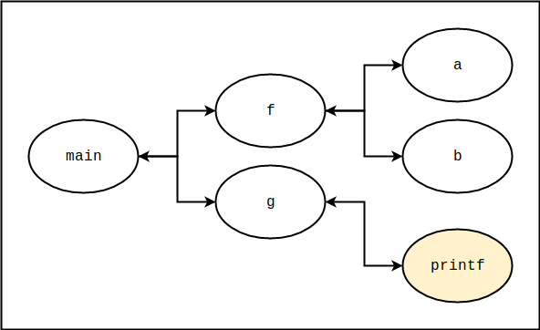

Este grafo indica que las funciones `f` y `g` pueden ser llamadas solo desde `main`, y solo pueden retornar a `main`. Análogamente, las funciones `a` y `b` solo pueden ser llamadas desde `f`, y solo pueden retornar a `f`. La función `printf`, por otro lado, solo puede ser llamada desde `g`, y solo puede retornar a `g`. Nótese que `printf` es parte de un binario externo. Para un binario típico, la integridad de las llamadas directas estará garantizada en virtud de estar estas embebidas en las instrucciones del código. Por otro lado, como ya sabemos, no podemos garantizar que una función esté realmente retornando al punto desde el cuál fue llamada. Supongamos entonces que podemos forzar estas condiciones mediante técnicas de instrumentación (los detalles por ahora no importan). Es decir, el código del binario incluye instrucciones adicionales que de alguna forma verifican estos supuestos en los momentos relevantes. Supongamos luego que, mediante un desborde en el stack, un atacante logra inyectar una cadena de ROP como las que ya hemos visto a partir de, digamos, la dirección de retorno de `a`; supongamos un intento de llamar a `system`, que de alguna forma el atacante pudo ubicar. En tal caso, al momento finalizar la función, el código instrumentado observará que `a` está intentando retornar a un lugar no admisible y finalizará la ejecución, caso en el cuál el ataque habrá sido frustrado.

Si bien lo que vimos tiene potencial, lo ideal es que el grafo de control de flujo sea lo más preciso posible. En caso contrario, un atacante podría abusar de las ambigüedades para lograr ejecutar ciertos ataques. Idealmente, lo que queremos es un **CFI granular**, donde para cada punto de origen los posibles destinos están identificados con la mayor precisión posible. Para mejorar el control de flujo de nuestro ejemplo podríamos proponer un esquema como el siguiente:

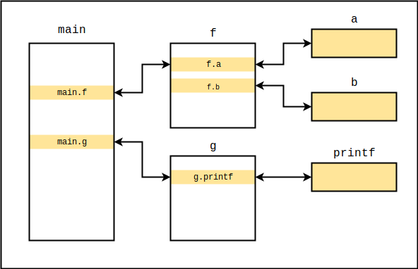

En este caso, la función `a` puede retornar únicamente a la etiqueta `f.a`, la función `b` puede retornar solo a `f.b`, y así. En este caso asumimos que es posible instrumentar libc tal de garantizar que `printf` solo puede retornar a `g.printf` (aunque, como veremos luego, se trata de un supuesto generoso). Nótese que este ejemplo no incluye saltos ni llamadas indirectas (i.e. a través de punteros) pero esos también deberían ser instrumentados.

Para los saltos indirectos (forward-edge), el paper original [1] sugiere una instrumentación (para x86) como la que se detalla a continuación. Dados, por ejemplo, los bloques de destino y origen

```assembly
; destino
mov eax, [esp+4]
```

```assembly
; origen
jmp ecx
```

una de las instrumentaciones sugeridas es la siguiente:

```assembly
; destino
db <identificador estático X, 4 bytes>
mov eax, [esp+4]
```

```assembly
; origen
cmp [ecx], <identificador estático X>
jne invalid_flow_detected
lea ecx, [ecx+4]
jmp ecx
```

Es decir, el bloque de destino se desplaza cuatro bytes hacia adelante y en el hueco que queda se insertan cuatro bytes que identifican el punto de destino. Al momento de efectuar el salto, se verifica que en la dirección de destino haya un identificador que coincide con aquel embebido en la instrucción `cmp` en el punto de origen. Si el identificador en el punto de destino no coincide con el identificador en el punto de origen, el salto se determina inválido y la ejecución deberá ser abortada. De haber coincidencia, se suma cuatro a la dirección de destino (para apuntar al código y no al identificador) y se ejecuta el salto.

¿Qué ocurre en el caso de los retornos? Para gestionar el correcto retorno de las funciones, el paper original [1] propone utilizar un shadow call stack como el que ya hemos visto en el [resumen de SCS](../shadow-call-stack/shadow-call-stack.md). Tenemos entonces que el mecanismo de los identificadores estáticos puede utilizarse para lograr **forward-edge CFI** (los destinos de los saltos son válidos), y el shadow call stack se utiliza (o puede utilizarse, no es un requisito) para lograr **backward-edge CFI** (las funciones retornan al lugar desde donde fueron llamadas).

En concepto, la idea parecería funcionar. En teoría, debería prevenir ataques basados en controlar el puntero a instrucción para ejecutar secuencias de ROP o JOP que llevarían al programa por flujos inválidos mediante la utilización de transferencias indirectas de flujo (e.g. saltos indirectos, llamadas indirectas, instrucciones de retorno). Los problemas surgen, sin embargo, al momento de intentar implementar esto en la realidad, como veremos en la próxima sección.

Algo a tener en cuenta es que las implementaciones de CFI no eliminan los problemas de corrupción de memoria; lo único que garantiza CFI es que el flujo del programa estará confinado a un cierto grafo predeterminado, y la seguridad del esquema depende de la correctitud y de la granularidad del grafo en cuestión. Existen, por otro lado, mecanismos que directamente intentan eliminar la corrupción de memoria (e.g. [AddressSanitizer](../asan-sm/asan-sm.md)). El problema es que las implementaciones existentes tienen un impacto importante en el rendimiento, lo que impide que sean ampliamente adoptadas en entornos productivos.


## CFI en la práctica

#### CFI relajado

Como ya mencionamos antes, la seguridad de CFI está limitada por la correctitud y la granularidad del grafo de control de flujo. Dadas las limitaciones de las técnicas de análsis estático, el grafo generado (o implícito en las políticas implementadas) será en general una sobre-aproximación del grafo más granular posible [2]. Es decir, un atacante podría tener cierta flexibilidad en cuanto a los flujos de ejecución por los cuales podría llevar al programa, lo cuál podría en ciertas condiciones permitirle ejecutar un ataque exitoso.

Adicionalmente, las implementaciones de CFI han demostrado tener problemas de rendimiento, y la dificultad de generar el grafo de control de flujo parecería también limitar el rango de aplicabilidad. Veamos que opinaron los autores de **CCFIR** (2013) [3], una implementación de CFI para Windows:

>Unfortunately, despite its long history (the original paper proposing it was in 2005), CFI has not seen wide industrial adoption. CFI suffers from a perception of complexity and inefficiency: reported overheads (average/max) have been as high as 7.7%/26.8% and 15%/46%. Many
>CFI systems require debug information that is not available in COTS applications, and cannot be deployed incrementally because hardened modules cannot interoperate with unhardened modules.


Históricamente, uno de los problemas fundamentales de CFI, que desde sus inicios impidió su despliegue masivo, es el siguiente: es difícil construir un grafo de control de flujo preciso si no se cuenta con información de debugging o con código fuente, pero más difícil es, sin embargo, lograr la interoperabilidad en sistemas heterogéneos. 

Para apreciar la dificultad del problema, supongamos que somos desarrolladores y que proveemos una biblioteca que implementa una interfaz como la siguiente:

```c
void async_process(char *data, void (*callback)(char*));
```

Internamente, la biblioteca procesaría los datos provistos en forma asincrónica y luego, cuando el procedimiento finaliza, llamaría al callback a través del puntero provisto. Por supuesto, no podemos pretender que los usuarios de la biblioteca deban compilar nuestro código fuente ni que deban enlazarlo en forma estática; si estamos desarrollando un framework o una biblioteca del sistema, esto no sería siquiera deseable. En el mundo de Windows, por ejemplo, utilizar bibliotecas dinámicas para las cuales no se posee código es algo común; incluso en Linux, hay muchas bibliotecas en los repositorios tal que los binarios y el código fuente se proveen en paquetes separados. Nuestra biblioteca sería distribuida entonces como un archivo binario: un .so para Linux, o un .dll para Windows, por ejemplo, con sus correspondientes cabeceras.

Supongamos ahora que queremos proteger nuestra biblioteca con CFI. Aquí surge la pregunta clave: ¿cuales son los destinos válidos para el puntero callback? Pues la verdad es que en tiempo de compilación no podemos saberlo, salvo que contemos también con el programa cliente que estará utilizando la biblioteca. Incluso en tal caso, la implementación de CFI acoplaría el software cliente a la biblioteca. Recordaremos que la instrumentación sugerida por Abadi et. al. en [1] requiere una sincronización entre el punto de origen del salto y el punto de destino. Evidentemente, tal cosa no es deseable: la idea de una biblioteca es justamente desacoplar el código para que sea reutilizable a través de múltiples clientes. Alternativamente, podemos definir un identificador de destino arbitrario y pretender que los usuarios de la biblioteca de alguna forma compilen su software con un mecanismo compatible con el nuestro que haga posibles las llamadas; un plugin para el compilador o algo similar, por ejemplo. El problema es que ahora la mitigación pierde transparencia: es el programador quien debe conocer y asegurarse de compilar con los mecanismos adecuados para nuestra implementación de CFI; recordaremos que ASLR, W^X y SP son totalmente transparentes al programador: el esfuerzo adicional está en desactivarlas, no en activarlas. Adicionalmente, ¿que tal si el identificador que elegimos ya fue utilizado por otra biblioteca o por el cliente? Para resolver el problema se podría quizás agregar alguna capa de indirección, lo cuál requeriría más coordinación entre las partes, impactaría en el rendimiento, y haría que la solución alcance niveles de complejidad poco agradables, alimentando la idea de que CFI es efectivamente algo complejo. ¿Qué tal si proveemos el código fuente y que todo se compile junto? En tal caso, todo el mundo debería proveer su código fuente; sabemos que no todos están dispuestos a hacerlo. Adicionalmente, si cada programa tiene su propia versión de las distintas bibliotecas, se dificultaría o se imposibilitaría la reutilización de código mediante mapeos virtuales. Ni mencionar que, en tal caso, arreglar un problema en la biblioteca implicaría recompilar TODO el software que depende de ella. ¿Qué tal si son los clientes los que deben encargarse de modificar el binario provisto con un identificador adecuado? O mejor aún... ¿qué tal si son los clientes los que deben implementar CFI en nuestro binario para que interopere adecuadamente con sus sistemas? Curiosamente, alguien consideró que esto último no es tan descabellado como suena: CCFIR se basa justamente en la reescritura de binarios y no requiere código fuente ni información de debugging. El problema ahora, sin embargo, es el que reiteramos: es difícil construir un grafo de control de flujo preciso si no se cuenta con información de debugging o con código fuente. Esto lleva a un análisis laxo, que genera un grafo poco preciso, que no ofrece las garantías de seguridad que se esperarían de CFI. CCFIR utiliza solo tres identificadores, y como  Göktaş et. al. reportan en [4], esto no es suficiente para prevenir ROP. Veamos los detalles.


En principio, CCFIR se basa en la utilización de una tabla en memoria denominada **springboard**, la cuál contiene stubs o bloques de código similares a los de la PLT. La idea de CCFIR es modificar todos los saltos indirectos, llamadas indirectas e instrucciones de retorno para que pasen primero por el springboard, e instrumentarlos adicionalmente con código que verifica que la dirección de destino está  efectivamente en esta región. Para construir el springboard, CCFIR realiza un pase de análisis por el binario identificando todos los puntos que podrían ser destinos válidos de llamadas a funciones, y por cada uno de ellos crea un bloque en el springboard. Entonces, si un atacante toma posesión de un puntero a código o de una dirección de retorno, los únicos destinos válidos a los que puede apuntar son bloques en el springboard, que eventualmente llevarán la ejecución a destinos válidos.

Como habíamos comentado antes, CCFIR utiliza tres tipos de identificadores. Más precisamente, define tres tipos de bloque en el springboard; como dijimos, los bloques del springboard son los únicos destinos válidos para las transferencias de flujo indirectas. Los tres tipos de bloques definidos son los siguientes:

**Bloques de punteros a funciones**. Son bloques que se utilizan como intermediarios para realizar saltos y llamadas a través de punteros. Todo puntero a código debe apuntar a un bloque de este tipo, y la instrumentación de CCFIR se asegurará, al momento de ejecutar el salto, de que así sea. Entonces, si un atacante toma control de un puntero a código, estará limitado a hacerlo apuntar a un bloque de este tipo. Cada uno de estos bloques redirecciona eventualmente a un destino válido (e.g. al principio de una función). Entonces, si bien el atacante tiene la posibilidad de redireccionar a cualquiera de estos bloques, está limitado a seleccionar solo de entre posibles destinos válidos (i.e. no puede ejecutar gadgets arbitrarios). Por supuesto, no podemos asumir que un atacante no podrá construir un payload conveniente encadenando solo destinos válidos. Es por ello que CCFIR aleatoriza el orden de los bloques en el springboard al momento de inicializar el proceso, para dificultar su utilización en un payload. Desgraciadamente, entre los supuestos propuestos en [3] está el siguiente:

>Limited information disclosure vulnerabilities are available to attackers. If intended functionality or a separate information-disclosure bug allows attackers to read entire memory regions such as the Springboard, or to selectively reveal Springboard stub addresses of their choice, the protection provided by randomization can be negated.

Esencialmente, se supone que el atacante no tiene capacidad de lectura arbitraria. A esta altura, sin embargo, ya deberíamos sospechar que esto no debe ser necesariamente cierto. Como ya mencionamos, CFI no impide a un atacante desarrollar primitivas de lectura y de escritura arbitrarias. En un modelo de amenazas más realista podemos asumir entonces que un atacante *tiene efectivamente* la capacidad de leer el contenido del springboard y de redireccionar el flujo a cualquier bloque válido.

**Bloques de retorno normales**. CCFIR hace la distinción entre dos tipos de funciones: funciones sensibles y funciones normales. Las primeras son aquellas como system, execl, execv, y también varias específicas de la API de Windows como VirtualProtect, VirtualAlloc, LoadLibrary, entre otras. Las segundas son todas aquellas funciones que no se consideran sensibles. Según notan los autores de CCFIR, si bien las funciones sensibles podrían normalmente retornar a otras funciones sensibles o a funciones normales, no se han observado casos en software real en los que una función normal deba retornar a una función sensible. Forzar esta política implica que un atacante con control sobre una dirección de retorno de una función normal (lo típico) no podría enviar la ejecución, por ejemplo, a VirtualProtect (el análogo de mprotect en Windows) por estar intentando retornar desde una función normal a una función sensible. Entonces, la instrumentación de CCFIR fuerza a las funciones normales a retornar únicamente a bloques de retorno normales, los cuales a su vez llevarán la ejecución a un destino válido.

**Bloques de retorno sensibles**. Las funciones sensibles, por otro lado, pueden retornar a bloques de retorno normales o a bloques de retorno sensibles. Como ya se mencionó, esto podría ser efectivamente un flujo válido. Ocurre que es inusual que un atacante controle direcciones de retorno de funciones sensibles, con lo cuál esto no significaría un riesgo mayor.


Esencialmente, se trata de un CFI con tres identificadores. La instrumentación de CCFIR fuerza un flujo como el que esquematizamos a continuación (similar al que se provee en [3]). Las flechas punteadas representan saltos indirectos, las flechas sólidas representan saltos directos.

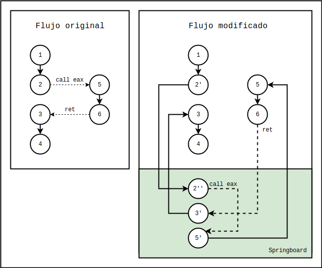

A la izquierda en la figura podemos observar el flujo original, el cuál consiste en una transferencia de flujo al nodo 5 a través de una llamada indirecta en el nodo  2 mediante el registro eax, con el correspondiente retorno desde el nodo 6 al nodo 3. Sin la protección de CFI, un atacante que controla eax en 2, o que controla la dirección de retorno en 6, puede redireccionar la ejecución a gadgets arbitrarios.

El flujo modificado incorpora el springboard. Lo que antes era un salto indirecto en 2 ahora es un salto directo 2' a un bloque 2'' en el springboard. Es en 2'' donde ahora se encuentra el salto indirecto. En este caso, los destinos posibles están confinados a bloques de tipo "punteros a funciones". Habrá uno de estos bloques por cada destino válido para una llamada indirecta; los destinos válidos deberán ser identificados en la fase de análisis estático. En este caso el salto se daría hacia 5', el cuál redirecciona al destino válido 5. Observaremos que el springboard también intercepta los retornos de funciones, insertando bloques de retorno por cada punto de retorno válido.

La instrumentación detallada en [3] es concretamente la que pasamos a describir. Dado el código original sin instrumentar:

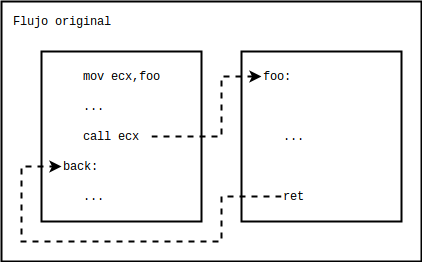

CCFIR transforma el flujo en algo como lo siguiente:

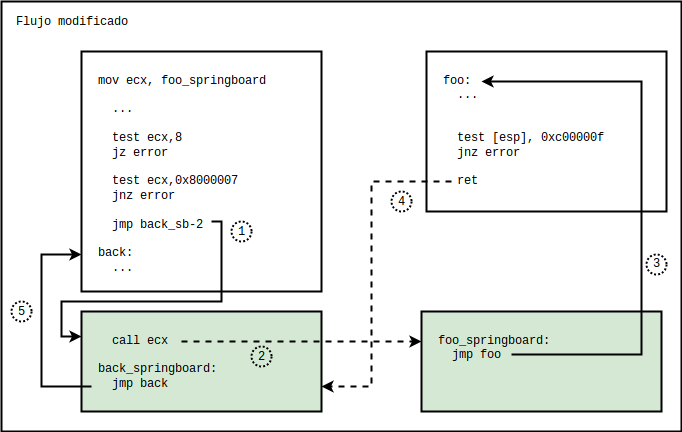

Previamente habíamos dicho que CCFIR implementa tres identificadores. Lógicamente, se podría ver de esta forma. A nivel implementación, sin embargo, para identificar los distintos tipos de bloque en el springboard, no se utilizan en realidad identificadores, sino que se utilizan sus propiedades de alineamiento. El springboard está diseñado para que cada tipo de bloque tenga distintas propiedades de alineamiento, las cuales se describen a continuación:

* Una dirección en memoria ejecutable tal que su bit 27 es 0 debe ser parte del springboard. Es decir, CCFIR particiona el espacio virtual de memoria en segmentos de 128 MB tal que las secciones del springboard están en segmentos pares y el resto de las secciones de código están en segmentos impares. En términos de instrumentación, una dirección x en el springboard cumple que `x & 0x8000000` es igual a cero.
* Un bloque de tipo puntero a función (e.g. el destino del salto 1), es aquel tal que su dirección está alineada a 8 bytes, pero no a 16. Es decir, dada la dirección x de un bloque tipo puntero a función, `x & 0x8` no es cero y `x & 0x7` sí es cero. Combinando esta condición y la anterior, llegamos a que, dada una dirección en ecx, podemos forzarla a apuntar a un bloque de este tipo mediante las instrucciones `test ecx, 8; jz error; test ecx, 0x8000007; jnz error`, las cuáles podemos observar previo al primer salto en el diagrama de arriba. En caso de no cumplir la dirección en el registro las condiciones impuestas, el programa finalizará.
* Un bloque de retorno a una función sensible debe estar alineado a 16 bytes. Podemos identificar estos bloques porque sus direcciones x cumplen que `x & 0x800000f` es igual a cero.
* Cualquier otro bloque de retorno debe estar alineado a 16 bytes y el bit 26 debe ser 0 (en adición al bit 27 por estar en el springboard). Podemos identificar estos bloques porque sus direcciones x cumplen que `x & 0xc00000f` es igual a cero. Observaremos que, en el diagrama de arriba, la función foo retorna a un bloque de este tipo.

En el paper original [3] se describen también casos adicionales de instrumentación, en particular aquellos para gestionar la interacción con bibliotecas externas, resolviendo el problema del despliegue incremental. Por el momento, sin embargo, no es necesario hablar más al respecto. Lo importante es notar que el grafo implícito en la instrumentación de CCFIR, al igual que el de muchas otras implementaciones, es un grafo laxo que fuerza un CFI coarse-grained.


Si bien es innegable que implementar CCFIR levanta la vara para el atacante, como ya mencionamos antes resulta que esta implementación no termina de eliminar los ataques de reutilización de código. Veamos cuál fue la propuesta de Göktaş et. al. en su paper [4]:

>Two main problems have prevented CFI from being deployed in practice. First, many CFI implementations require source code or debug information that is typically not available
>for commercial software. Second, the technique is expensive with overheads that may be as high as 25% to 50%. It is for this reason that much of the recent research focuses on making it fast and practical. Specifically, recent work on practical CFI is applicable on binaries, **but it enforces a looser**
>**notion of control flow integrity**.
>
>It is crucial to question what the implications of such looser notions of CFI are for the security of the system. **Can they still prevent code-reuse attacks, like return-to-libc and ROP? If not, how hard are they to bypass?** Because of the importance of CFI and its potential benefits, it is imperative that we can answer these questions.

En dicho paper se muestra que, incluso forzando las políticas de CCFIR, todavía es posible aplicar ROP, si bien el trabajo resulta ser más arduo. Para vencer a la mitigación, asumiendo conocimiento total del espacio de memoria del proceso (i.e. habiendo vencido a los mecanismos de aleatorización), los autores definen dos tipos nuevos de gadgets: gadgets tipo "call site" (CS), precedidos por una instrucción call y que terminan en ret, y gadgets tipo "entry point" (EP),  que comienzan al inicio de una función y terminan con un salto indirecto o una llamada indirecta. Se supone que los gadgets EP son destinos válidos para llamadas indirectas, y que los gadgets CS son destinos de retorno válidos. Si bien este modelo aplica a una familia más grande de implementaciones laxas de CFI y no solo a CCFIR, esta última también queda comprendida si se considera pasar por el springboard entre medio de cada gadget.

Si el atacante controla un salto indirecto o una llamada indirecta, deberá comenzar su payload con un gadget tipo EP (para permanecer dentro del grafo de control de flujo). Podrá continuar entonces encadenando varios gadgets tipo EP, ejecutando esencialmente lo que se denomina "Call Oriented Programming" (COP), o podrá transicionar a gadgets de tipo CS a través de una función con una llamada indirecta en el medio, que ayude a configurar el stack para continuar con un ROP tradicional. Alternativamente, si el atacante controla una dirección de retorno, deberá comenzar la cadena con un gadget tipo CS, continuando con varios gadgets CS o transicionando posiblemente a gadgets tipo EP a través de un gadget CS que termine con una llamada indirecta. Para resolver el problema de la inyección de código, en vez de retornar a un bloque de shellcode inyectado en algún segmento de datos (que no es posible por no ser un destino válido), lo que hacen los autores es hacer escribible algún destino válido y escribirle encima el shellcode, para luego enviar allí la ejecución. Finalmente, para demostrar la viabilidad de las técnicas, los autores detallan el proceso de explotación de una vulnerabilidad en un Internet Explorer protegido por CCFIR, y analizan la disponibilidad de los gadgets requeridos en distintas aplicaciones. Por más detalles consultar [4].


#### Heurísticas y aproximaciones

Existen también mitigaciones alternativas que intentan aproximar CFI mediante heurísticas más simples. Por ejemplo, **kBouncer** [5] para Windows hace uso de una característica de los procesadores Intel llamada "Last Branch Record" (LBR) para evaluar en puntos clave del programa si el flujo de ejecución fue recientemente comprometido. El LBR es, esencialmente, un conjunto de pares de registros, donde cada par contiene información sobre un salto recientemente tomado. Concretamente, en una entrada del LBR están la dirección de origen y la dirección de destino de un salto particular. Lo que hace kBoucer entonces es inyectar previo a cada llamada al sistema (mediante un mecanismo de instrumentación para Windows llamado "Detours") un bloque de código que, antes de ejecutar el servicio provisto por el kernel, verifica que desde cada dirección de origen en el LBR que corresponda a una instrucción de retorno, se haya saltado a una dirección que esté justo luego de una instrucción call. Razonablemente, según las convenciones ampliamente adoptadas hoy día, y salvo en las aplicaciones más específicas, una instrucción ret debería indefectiblemente retornar a la instrucción siguiente a una call. kBouncer limitaría entonces el impacto que podría tener un payload de ROP: al momento de intentar ejecutar una llamada al sistema operativo para realizar trabajo útil para el atacante, kBouncer notará que recientemente se ejecutaron gadgets de ROP (en general no precedidos por una instrucción call) y abortará la ejecución. Es decir, en vez de verificar la integridad previo a cada salto, kBouncer verifica que los saltos más recientes hayan sido íntegros en base a un historial provisto por el hardware.

kBouncer fue en su momento muy bien recibida; su creador, Vasilis Pappas, recibió un generoso cheque por US$ 200.000 en 2012 tras ganar con su mitigación el premio BlueHat de Microsoft. Desgraciadamente, en [6] se muestra que con gadgets precedidos por instrucciones call disponibles en bibliotecas estándar usualmente enlazadas todavía sería posible desarrollar payloads de ROP Turing Complete, en condiciones incluso más restrictivas que aquellas impuestas por el mecanismo.


#### Otras técnicas para lograr CFI

En [7] se detallan algunos mecanismos adicionales para lograr un CFI parcial. Estos mecanismos han sido implementados en Clang y en gcc. Algunos detalles de la implementación de CFI en Clang los estaremos viendo en la próxima sección. Por el momento, sin embargo, estaremos estudiando solo el concepto general de las técnicas propuestas en [7]. Considerando lo que ya hemos visto de CFI, la más novedosa de estas propuestas es probablemente VTB, la verificación de tablas virtuales en tiempo de ejecución. En cualquier caso, estaremos hablando un poco de cada una de las medidas sugeridas.


**Virtual-Table Verification (VTB)**, implementada en gcc desde la versión 4.9: la idea de VTB es garantizar que la tabla virtual utilizada por cada llamada virtual protegida sea válida para el programa y también correcta para el sitio de llamada; es decir, dada una llamada a un método virtual a través de un puntero, VTB verifica que la tabla virtual a utilizar sea una tabla válida en la jerarquía de clases del tipo al que el puntero apunta.

Por ejemplo, supongamos que tenemos una clase `Rectangle` que hereda de la clase `Shape`. Ambas definen el método virtual `draw`. Supongamos luego que tenemos la siguiente secuencia:

```c++
Shape *shape = get_some_shape();
shape->draw();
```

VTB verificará justo antes de la llamada a `draw` que la tabla virtual a utilizar sea o la de `Shape` o la de alguna de sus clases herederas (`Rectangle`, en este caso). En [7] se reporta un overhead de rendimiento entre 2.0% y 8.7%.

Desgraciadamente, si intentamos compilar un programa básico con g++ en Ubuntu 18.04 pasando el flag `-fvtable-verify=std`, notaremos que el compilador nos muestra un error como el siguiente:

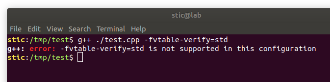

Indagando un poco, llegamos a [un post en bugzilla.redhat.com](https://bugzilla.redhat.com/show_bug.cgi?id=1525581), donde se indica que RedHat observa aparentemente el mismo defecto. Quien pregunta sugiere que el compilador quizás no fue compilado pasando el flag `--enable-vtable-verify` que habilitaría VTB. La primera respuesta dice lo siguiente:

> --enable-vtable-verify is intentionally not used, this feature AFAIK effectively requires everything to be built with that option, slowing everything down. Doesn't -fsanitize=vptr do everything you care about anyway?

Veamos entonces la alternativa sugerida. La opción `-fsanitize=vptr` implementa un mecanismo que verifica que los objetos referenciados sean del tipo dinámico correcto al momento de realizar llamadas a funciones virtuales; parecería hacer esencialmente lo mismo que hace VTB. La pregunta es, ¿cómo impacta este sanitizador vptr en el rendimiento? Veamos el siguiente ejemplo:

```c++
// vptr-test.cpp

#include <iostream>
#include <cstdlib>
#include <time.h>

class Base {
public:
  virtual int random() = 0;
  virtual ~Base() {}
};

class Derived : public Base {
public:
  int random() {
    return rand() % 100;
  }
};

int main(int argc, char **argv) {
  unsigned long n = 10000000;
  unsigned long long count = 0;

  srand(time(NULL));

  for (unsigned long i = 0; i < n; i++) {
    Base *b = new Derived();
    count += b->random();
    delete b;
  }

  std::cout << count << std::endl;
}
```


Compilaremos primero sin el sanitizador, y ejecutaremos el programa varias veces para medir cuánto tiempo tarda en finalizar. Ejecutamos entonces

```bash
g++ vptr-test.cpp -o vptr-test && time ./vptr-test
```

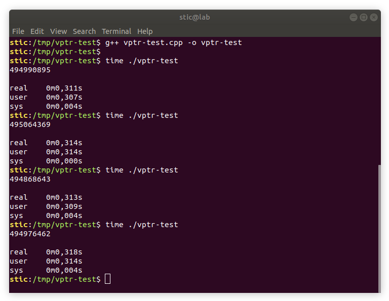


Procedemos ahora a compilar con sanitización y a medir el tiempo de ejecución nuevamente:

```bash
g++ vptr-test.cpp -fsanitize=vptr -o vptr-test && time ./vptr-test
```

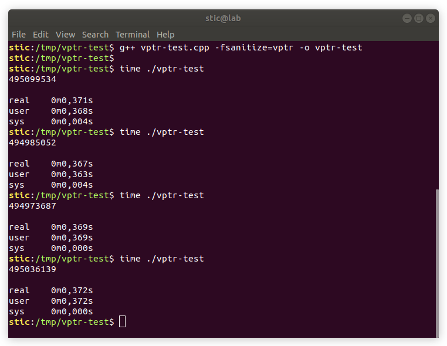

Observaremos que el overhead temporal parecería estar, para este ejemplo particular, cerca del 26%. Siendo justos, las validaciones incorporadas por el sanitizador representan una fracción importante del código ejecutado; en aplicaciones reales, el overhead podría ser mucho menor. Más allá de la representatividad que pueda tener este experimento, resulta evidente que incorporar el mecanismo puede tener un impacto no despreciable en el rendimiento, en especial en código que depende de una jerarquía de clases compleja, con muchos métodos virtuales. La adición del flag al comando de compilación causa que la función main, que en caso contrario ocuparía unos 212 bytes, pase a ocupar 783 bytes. Todos esos bytes adicionales son parte de instrucciones que deben ser ejecutadas. Considerando los contextos en los que C++ suele utilizarse, esto podría no ser aceptable. Esto implica que habrá muchos programas críticos (e.g. sistemas operativos, exploradores, entornos de virtualización, firmware) que no serán protegidos por el mecanismo por decisión propia de los desarrolladores (y del mercado, indirectamente). Podemos asumir que es poco probable que un mecanismo con un overhead demasiado elevado llegue a ser aplicado por defecto en forma más amplia como lo son ASLR, Stack Protector y W^X. En cualquier caso, podrían haber aplicaciones particulares para las que que se decida adoptarlo.


**Indirect Function-Call Checks** (IFCC), implementada en LLVM desde la versión 3.4: La idea de IFCC es proteger las llamadas indirectas generando tablas de salto para los posibles destinos válidos. Los saltos indirectos luego se instrumentan para permitirles solo apuntar a entradas en las tablas de salto. En concepto, IFCC parecería ser muy similar a CCFIR, y al igual que este último, también utiliza las propiedades de alineamiento de las tablas de salto para realizar las validaciones necesarias. La ventaja que tiene IFCC sobre CCFIR es que, al estar implementado a nivel compilador, puede permitirse un análisis más detallado para identificar los destinos válidos de salto. Según se documenta en [7], los destinos válidos de salto son funciones cuya dirección es tomada (e.g. la dirección de la función se asigna a algún puntero). 

Para organizar los destinos válidos en conjuntos (es decir, para determinar los identificadores de CFI), los autores implementaron dos esqumas alternativos:

1. Se colocan todas las funciones que son destinos válidos en un único conjunto. En este caso, todas las funciones tendrían el mismo identificador.
2. Se asignan funciones a conjuntos de acuerdo a la cantidad de argumentos que reciben. En este caso, una función que recibe n argumentos estaría identificada por el n-ésimo identificador.

Si bien no hemos analizado IFCC en detalle, probablemente sea posible vulnerarlo con las mismas técnicas aplicadas en [4] y en [6].


**FSan**, Indirect-Call-Check Analysis, incorporado a UBSan desde LLVM 3.4. Se trata de un componente adicional para el sanitizador UBSan que detecta violaciones de CFI en tiempo de ejecución para llamadas indirectas. En [7] se menciona, sin embargo, que FSan no fue diseñado para ser una mitigación, sino que es más bien una herramienta de desarrollo diseñada para identificar violaciones de CFI que podrían llevar a problemas de seguridad. Como ya habíamos mencionado antes en el resumen de ASan, una sesión de fuzzing puede beneficiarse de la utilización de sanitizadores, por lo cuál vale la pena mencionarlo.


#### Implementaciones en uso hoy en día

A continuación estaremos hablando sobre dos implementaciones de CFI que hoy día están siendo utilizadas: Control Flow Guard (CFG) de Microsoft, y la implementación de Clang. Esta última la estaremos analizando con relativo detalle. Cabe mencionar que estas implementaciones, si bien prácticas, se han debido distanciar considerablemente de la implementación original propuesta por Abadi et. al. Adicionalmente, cabe mencionar que ambas implementaciones todavía tienen sus limitaciones y sus defectos, con lo cuál la carrera por robustecer nuestros esquemas de CFI todavía sigue en curso.


**Control Flow Guard** (CFG) de Microsoft es un mecanismo de forward-edge CFI para proteger llamadas indirectas. Según el análisis provisto en [8], CFG utiliza un mapa de bits donde cada bit representa el estado de un grupo de 8 bytes en el espacio de memoria del proceso. Hay un bit en el mapa por cada 8 bytes en el espacio de memoria, y existe un mapeo biyectivo entre bits del mapa y grupos disjuntos de 8 bytes en el espacio de memoria. Si un grupo de 8 bytes contiene el inicio de una función, su correspondiente bit en el mapa de bits es 1, lo cuál hace al grupo un destino válido para un salto indirecto. Es decir, justo antes de ejecutar un salto indirecto, CFG toma la dirección de destino y en base a ella determina la posición de un bit en el mapa de bits. Si ese bit es uno, el salto es admisible; en caso contrario, el programa termina. Por el momento no entraremos en los detalles de CFG; veremos más al respecto en una sección exclusivamente sobre Windows que será publicada más adelante. En cualquier caso, ya han habido varias publicaciones sobre ataques contra CFG, y [Microsoft ha mencionado que será necesario extender y mejorar el diseño del mecanismo](https://blogs.technet.microsoft.com/srd/2018/06/21/announcing-changes-to-microsofts-mitigation-bypass-bounty/). Algo que quizás vale la pena mencionar es que CFG ha recibido críticas por parte de los usuarios, quienes buscan formas de deshabilitarlo debido al impacto que ha tenido en el rendimiento de ciertas aplicaciones, principalmente aplicaciones gráficas (e.g. [hilo en foros GeForce](https://forums.geforce.com/default/topic/1059635/geforce-drivers/disabling-windows-control-flow-guard-fixes-bad-performance-stuttering-in-windows-10-1709-1803/), [hilo en reddit](https://www.reddit.com/r/PUBATTLEGROUNDS/comments/8jgz6g/disabling_control_flow_guard_in_windows_defender/)).


Pasaremos a hablar ahora sobre la [implementación de la de **Clang**](https://clang.llvm.org/docs/ControlFlowIntegrity.html),  la cuál ya hemos mencionado y ahora estaremos analizando a nivel assembly. La mitigación puede ser habilitada por completo pasando los flag `-fsanitize=cfi -flto -fvisibility=hidden` al momento de compilar el programa. El [documento de diseño](https://clang.llvm.org/docs/ControlFlowIntegrityDesign.html) describe los detalles sobre la implementación del esquema.

Uno de los mecanismos que se describen en el documento es el de **CFI para llamadas virtuales**, esencialmente equivalente a lo que vimos sobre VTB.  La idea es verificar, ante una llamada a un método virtual, que la vtable referenciada por el objeto sobre el cuál se está intentando invocar el método sea una compatible con el tipo de puntero utilizado. El mecanismo implementando por Clang está basado en [9].

Por un ejemplo concreto, veamos el siguiente código:

```c++
// cfi-test.cpp

#include <iostream>

class Greeter {
public:
  virtual void say_hello() = 0;
  virtual void say_goodbye() = 0;
  virtual ~Greeter() {}
};

class SpanishGreeter : public Greeter {
public:
  void say_hello() {
    std::cout << "Hola, mundo!" << std::endl;
  }
  void say_goodbye() {
    std::cout << "Chau, mundo!" << std::endl;
  }
};

class EnglishGreeter : public Greeter {
public:
  void say_hello() {
    std::cout << "Hello, world!" << std::endl;
  }
  void say_goodbye() {
    std::cout << "Bye, mundo!" << std::endl;
  }
  void tea_time() {
    std::cout << "Having tea." << std::endl;
  }
};

int main(int argc, char **argv) {
  Greeter *greeters[] = {new SpanishGreeter(), new EnglishGreeter()};
    
  for (int i = 0; i < 2; i++) {
    greeters[i]->say_hello();
    greeters[i]->say_goodbye();
    delete greeters[i];
  }
  
  return 0;
}
```


Compilamos el programa con el siguiente comando:

```
clang++-7 -g -fsanitize=cfi -flto -fvisibility=hidden cfi-test.cpp -o cfi-test
```

Cargamos el programa en gdb/gef y ponemos un breakpoint en main. Ejecutamos el programa y avanzamos hasta la primer llamada a say_hello. Deberíamos estar viendo algo como lo siguiente:

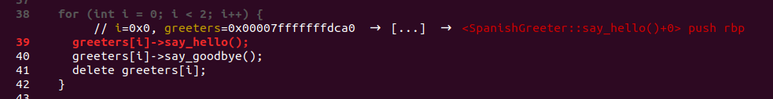

El código assembly correspondiente a esta línea es el siguiente:

```asm
movabs rcx,0x400eb0                         ; main+120
add    rcx,0x10                             ; main+130
movsxd rax,DWORD PTR [rbp-0xc]              ; main+134
mov    rdi,QWORD PTR [rbp+rax*8-0x20]       ; main+138
mov    rax,QWORD PTR [rdi]                  ; main+143
mov    rdx,rax                              ; main+146
sub    rdx,rcx                              ; main+149
mov    rcx,rdx                              ; main+152
shr    rcx,0x6                              ; main+155
shl    rdx,0x3a                             ; main+159
or     rcx,rdx                              ; main+163
cmp    rcx,0x2                              ; main+166
jbe    0x400a6e <main(int, char**)+174>     ; main+170
ud2                                         ; main+172
call   QWORD PTR [rax]                      ; main+174
movabs rcx,0x400eb0                         ; main+176
add    rcx,0x10                             ; main+186
```

Las primeras dos instrucciones cargan en el registro rcx la dirección `0x400ec0`, la cuál analizaremos en breve. Las instrucciones desde main+130 hasta main+138 inclusive cargan en rdi la dirección del objeto sobre el cuál se está trabajando, un SpanishGreeter en este caso. La instrucción en main+143 carga el puntero a la tabla virtual del objeto en el registro rax. Entre main+146 y main+172 inclusive podemos ver el código que verifica que la llamada sea válida. Veamos esto último paso por paso.

**1**. `mov rdx,rax`: Esta instrucción simplemente carga en rdx la dirección de la vtable del objeto sobre el cuál estamos trabajando, que recordamos fue previamente cargada en rax. En este caso particular, la dirección en cuestión es `0x400f40`, la vtable del tipo SpanishGreeter.

**2**. `sub rdx,rcx`: Esta instrucción resta al valor cargado en rdx la dirección cargada en rcx, la cuál dijimos es la constante estática `0x400ec0`. Esta constante no es otra cosa que la dirección de la tabla virtual del tipo Greeter. Si escribimos `hexdump qword 0x400ec0 24` deberíamos poder ver algo como lo siguiente:

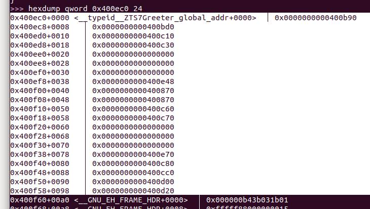

Si analizamos las direcciones listadas en la tabla veremos que se trata efectivamente de punteros a métodos virtuales en la jerarquía de clases debajo de Greeter. Es decir, a partir de la dirección representada por el símbolo  `__typeid__ZTS7Greeter_global_addr` se encuentran en forma consecutiva las tablas virtuales de los tipos herederos de Greeter. Efectivamente, notaremos que la dirección `0x400f40`, donde el vptr de nuestro SpanishGreeter apunta, está solo unos bytes más arriba. Lo que está haciendo la instrucción **2** entonces es colocar en rdx el desplazamiento en bytes desde la base de esta estructura `__typeid__ZTS7Greeter_global_addr`  hasta la tabla virtual de SpanishGreeter, el tipo del objeto con el cuál estamos trabajando. En este caso el delta es `0x80`.

**3**. `mov rcx,rdx`: Se copia a rcx el delta que calculamos en la instrucción anterior.

**4**. Analicemos el siguiente bloque de instrucciones todo junto; dicho bloque es el encargado de determinar, en base al desplazamiento calculado, si el acceso es válido o no.

```asm
shr    rcx,0x6                              ; main+155
shl    rdx,0x3a                             ; main+159
or     rcx,rdx                              ; main+163
cmp    rcx,0x2                              ; main+166
jbe    0x400a6e <main(int, char**)+174>     ; main+170
ud2                                         ; main+172
call   QWORD PTR [rax]                      ; main+174
```

Sabemos que tanto en `rcx` como en `rdx` está la constante `0x80`, el desplazamiento en bytes desde la tabla virtual de Greeter hasta la tabla virtual del objeto sobre el cuál estamos queriendo invocar un método. En bits, el valor es `0b10000000`. 

**4.1** `shr rcx,0x6` lo que hace esencialmente es colocar en rcx el índice del bloque de 64 bytes al cuál estamos intentando acceder, relativo a  `__typeid__ZTS7Greeter_global_addr`. En este caso particular, el índice es 2, porque `0x80 >> 6`, equivalente a `0x80/0x40`, es efectivamente igual a 2.

**4.2** `shl rdx,0x3a` es un desplazamiento de 58 bits a la izquierda. Lo que hace esencialmente es reemplazar los 6 bits más significativos del registro por lo que antes eran los menos significativos. El resto de los bits quedan en 0. El porqué de esta instrucción lo veremos a continuación.

**4.3** `or rcx, rdx`  combina los dos resultados obtenidos y los guarda en el registro rcx, obteniendo entonces un valor tal que los bits menos significativos contienen el índice del bloque de 64 bytes al cuál apunta nuestro vptr, relativo a  `__typeid__ZTS7Greeter_global_addr`, y los 6 bits más significativos son iguales a los 6 bits menos significativos del delta que habíamos calculado.

**4.4** Con esto dicho, podremos notar que lo que la secuencia `cmp rcx,0x2; jbe` está haciendo esencialmente es verificar dos cosas: **1.** que el índice del bloque de 64 bytes relativo a la tabla de Greeter sea 2 o menor, es decir, que la tabla a la cuál se está intentando acceder sea o la tabla de SpanishGreeter, o la de EnglishGreeter, o la de Greeter, los tipos admisibles para un puntero a Greeter y **2**. que los 6 bits menos significativos del desplazamiento sean 0; es decir, que la dirección de la tabla a la cuál se está intentando acceder esté alineada a 64 bytes.

Notaremos que esta secuencia es la misma independientemente del tipo concreto del objeto con el cuál estamos trabajando; es decir, dentro del ciclo iterativo, todos los objetos a los que el puntero greeter apunta deben ser tales que su vptr apunta hasta 192 bytes por encima de la tabla virtual del tipo Greeter, y el valor del vptr debe estar alineado a 64 bytes.


Veamos ahora como Clang protege las llamadas indirectas. Para ello estaremos analizando el siguiente programa:

```c
// icall-test.c

#include <stdio.h>

int say_hi() {
    printf("Hello, world!\n");
    return 0;
}

int decir_hola() {
    printf("Hola, mundo!\n");
    return 0;
}

int main(int argc, char **argv) {
    int (*buffer[])() = {say_hi, decir_hola};
    return buffer[argv[1][0]]();
}
```

Compilamos el programa con el siguiente comando:

```bash
clang-7 -g -fsanitize=cfi -flto -fvisibility=hidden icall-test.c -o icall-test
```

Analicemos el código de la segunda línea de main, `return buffer[argv[1][0]]()`:

```assembly
; Cargamos en rax el índice provisto como argumento
; al programa (rax <- argv[1][0]).
;
mov    rax,QWORD PTR [rbp-0x8]           ; main+46
mov    rax,QWORD PTR [rax+0x8]           ; main+50
movsx  rax,BYTE PTR [rax]                ; main+54

; Guardamos en rcx la dirección de la función
; que estaremos intentando llamar.
;
mov    rcx,QWORD PTR [rbp+rax*8-0x20]    ; main+58

; rax = &say_hi
;
movabs rax,0x400580                      ; main+63

; Ponemos también en rdx la dirección de la función
; que estaremos intentando llamar.
;
mov    rdx,rcx                           ; main+73

; De procede de forma análoga a como se hacía para
; validar llamadas virtuales. Más detalles abajo.
;
sub    rdx,rax                           ; main+76
mov    rax,rdx                           ; main+79
shr    rax,0x3                           ; main+82
shl    rdx,0x3d                          ; main+86
or     rax,rdx                           ; main+90
cmp    rax,0x1                           ; main+93
jbe    0x400575 <main+101>               ; main+97
ud2                                      ; main+99
mov    al,0x0                            ; main+101
call   rcx                               ; main+103
```

Podremos notar a partir de `main+76` que la instrumentación es muy similar a la que vimos antes para la validación de tablas virtuales. Como recordaremos, dicha validación requiere que los destinos válidos a los que puede apuntar el puntero estén dispuestos en forma contigua en el espacio de memoria del proceso. Para tablas virtuales esto  es feasible; para el código es más complicado. Para ver como resuelve el problema Clang, procedemos a desensamblar el código a partir de la dirección `&say_hi`, cargada en rax (`0x400580`) en `main+63`. Notaremos entonces que no se trata en realidad del código de la función `say_hi`:

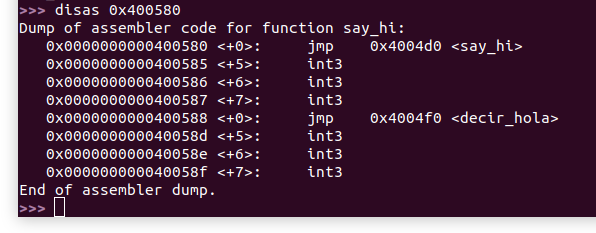

Lo que estamos viendo es en realidad una tabla de saltos. Clang agrega un paso de indirección tal que todas las llamadas indirectas pasen por esta tabla, permitiendo implementar así validaciones similares a aquellas utilizadas para validar tablas virtuales.


Podremos notar que Clang implementa un CFI muy preciso y granular. Dicho eso, vale la pena destacar que se trata también de una implementación relativamente eficiente. Ciertamente, incorporar este esquema dificultará significativamente la escritura de exploits. Desgraciadamente, en esta instancia debemos citar una frase de la NSA estadounidense:  "*Attacks* always *get better*; *they* never *get worse*."

Para confirmarlo, existe [un repositorio en GitHub](https://github.com/0xcl/clang-cfi-bypass-techniques) en el cuál se demuestran tres técnicas de explotación utilizadas en 2017 para evadir el CFI de Clang en exploits reales. Una de ellas es meramente un ROP; como ya mencionamos, el CFI de Clang es solo forward-edge, con lo cuál no puede prevenir un ROP clásico en el stack. Otra abusa de una particularidad en Chromium: el browser mantiene una región de memoria donde escribe el código generado por su compilador JIT; dicha región puede ser escrita, es ejecutable, y el código puede ser invocado ejecutando una función JavaScript, lo cuál permite evadir CFI totalmente. Siendo justos, estos dos ataques no vencen realmente al CFI de Clang, sino que explotan fallas en otros frentes. El tercer ataque, sin embargo, abusa de una particularidad de la implementación para realmente vencer a la mitigación: la implementación de Clang tiende en algunos casos a volcar valores de registros al stack, cuando dichos valores deberían ser inmutables; lo que logra el ataque entonces es corromper estos valores almacenados para modificar la política impuesta por CFI, haciendo que pasen las validaciones cuando en realidad no deberían.

Es evidente que un ataque contra un CFI granular requiere no solo una sofisticación elevada, sino también un programa objetivo que provea los recursos adecuados. En general, podríamos decir que el CFI de Clang es una buena adición para robustecer nuestros programas contra exploits. 

Para finalizar, veamos un pequeño detalle sobre el CFI de Clang que conviene tener presente, ya que podría dificultar la adopción mecanismo en proyectos extensos, en particular si no se está al tanto de su influencia.

```c
// icall-test-prime.c

#include <stdio.h>

int say_hi() {
    printf("Hello, world!\n");
    return 0;
}

int decir_hola() {
    printf("Hola, mundo!\n");
    return 0;
}

int main(int argc, char **argv) {
    int (*buffer[])(void) = {say_hi, decir_hola};
    return buffer[argv[1][0]]();
}
```

Se trata esencialmente del mismo ejemplo icall-test que habíamos analizado antes, esta vez con un pequeño y semánticamente irrelevante cambio:

```c
int (*buffer[])(void /* antes el void no estaba */) = {say_hi, decir_hola};
```

Uno diría que esto no debería impactar de ninguna forma la funcionalidad de la aplicación. De hecho, si compilamos el programa sin flags observaremos que funciona adecuadamente:

```bash
clang icall-test-prime.c -o icall-test-prime && ./icall-test-prime $(printf "\x01")
```

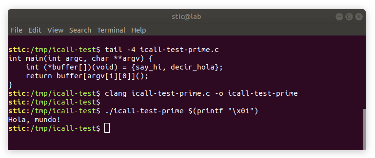

¿Qué ocurre, sin embargo, si compilamos con CFI tal como lo hicimos para el ejemplo original?

```bash
clang-7 -g -fsanitize=cfi -flto -fvisibility=hidden icall-test-prime.c -o icall-test-prime
```

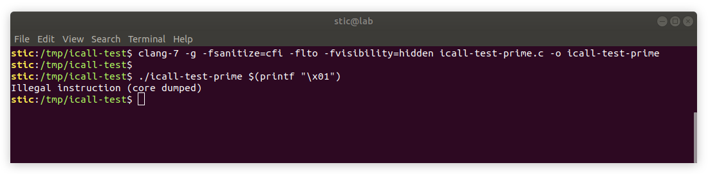

Si volcamos el código de la función main con objdump, veremos lo siguiente:

```
0000000000400510 <main>:
  400510:	55                   	push   rbp
  400511:	48 89 e5             	mov    rbp,rsp
  400514:	48 83 ec 20          	sub    rsp,0x20
  400518:	31 c9                	xor    ecx,ecx
  40051a:	c7 45 f0 00 00 00 00 	mov    DWORD PTR [rbp-0x10],0x0
  400521:	89 7d f4             	mov    DWORD PTR [rbp-0xc],edi
  400524:	48 89 75 f8          	mov    QWORD PTR [rbp-0x8],rsi
  400528:	48 8b 04 25 10 06 40 	mov    rax,QWORD PTR ds:0x400610
  40052f:	00 
  400530:	48 89 45 e0          	mov    QWORD PTR [rbp-0x20],rax
  400534:	48 8b 04 25 18 06 40 	mov    rax,QWORD PTR ds:0x400618
  40053b:	00 
  40053c:	48 89 45 e8          	mov    QWORD PTR [rbp-0x18],rax
  400540:	48 8b 45 f8          	mov    rax,QWORD PTR [rbp-0x8]
  400544:	48 8b 40 08          	mov    rax,QWORD PTR [rax+0x8]
  400548:	48 0f be 00          	movsx  rax,BYTE PTR [rax]
  40054c:	48 8b 44 c5 e0       	mov    rax,QWORD PTR [rbp+rax*8-0x20]
  400551:	f6 c1 01             	test   cl,0x1
  400554:	75 02                	jne    400558 <main+0x48>
  400556:	0f 0b                	ud2    
  400558:	ff d0                	call   rax
  40055a:	48 83 c4 20          	add    rsp,0x20
  40055e:	5d                   	pop    rbp
  40055f:	c3                   	ret 
```

Si prestamos atención, notaremos que la secuencia

```
400518:	31 c9                	xor    ecx,ecx
        ; ...
        ; Instrucciones en las que no se toca ecx.
        ; ...
400551:	f6 c1 01             	test   cl,0x1
400554:	75 02                	jne    400558 <main+0x48>
400556:	0f 0b                	ud2    
```

inevitablemente terminará con la ejecución de la instrucción ud2, causando el error que hemos podido observar. Es decir, Clang está generando, para sentencias que deberían funcionar correctamente, un código que terminará indefectiblemente con un error; es decir, la aplicación generada no funciona.

Lo importante es que, para aplicar el CFI de Clang, la aplicación debe ser correcta. En términos simples, no debe haber "malinterpretaciones" de los distintos objetos en memoria; malos casteos y tipos de datos incorrectos pueden llevar a que CFI no reconozca destinos válidos en situaciones en las cuáles debería. En bases de código legacy muy extensas, este podría ser un factor limitante que impediría la adopción del mecanismo.


## Conclusión

Hemos hablado bastante de CFI. Hemos estudiado el concepto teórico, y como han surgido a lo largo del tiempo distintas implementaciones para intentar superar las barreras que separan la teoría de la práctica. Si bien la tecnología todavía no es perfecta, es innegable que su incorporación fortalece significativamente las defensas de nuestros binarios. Hay que tener en cuenta, sin embargo, que los ataques se están volviendo cada vez más sofisticados, y ya han habido casos de ataques exitosos incluso con estas mitigaciones activas. Hasta que no exista un remedio definitivo, no podemos descartar la posibilidad de que un atacante motivado aproveche los huecos existentes para desarrollar un exploit funcional.


## Referencias

[1] Abadi, Budiu, Erlingsson & Ligatti (2005). *Control-Flow Integrity*.

[2] Burrow, Carr, Nash, Larsen, Franz, Brunthaler & Payer (2017). *Control-Flow Integrity: Precision, Security, and Performance*.

[3] Zhang, Wei, Chen, Duan, Szekeres, McCamant, Song, Zou (2013). *Practical Control Flow Integrity & Randomization for Binary Executables*.

[4] Göktaş, Athanasopoulos, Bos & Portokalidis (2014). *Out of Control: Overcoming Control-Flow Integrity*.

[5] Pappas (2012). *kBouncer: Efficient and Transparent ROP Mitigation*.

[6] Davi, Sadeghi, Lehmann & Monrose (2014). *Stitching the Gadgets: On the Ineffectiveness of Coarse-Grained Control-Flow Integrity Protection*.

[7] Tice, Roeder, Collingbourne, Checkoway, Erlingsson, Lozano, Pike (2014). *Enforcing Forward-Edge Control-Flow Integrity in GCC & LLVM*.

[8] Tang, Trend Micro Threat Solution Team (2015). *Exploring Control Flow Guard in Windows 10*.

[9] Bounov, Kıcı & Lerner (2016). *Protecting C++ Dynamic Dispatch Through VTable Interleaving*.