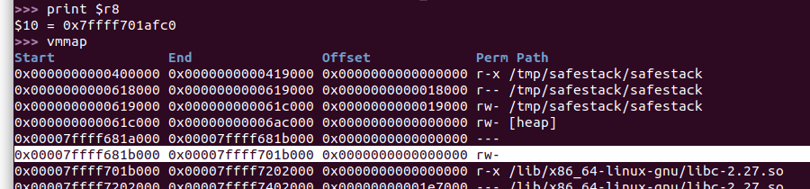
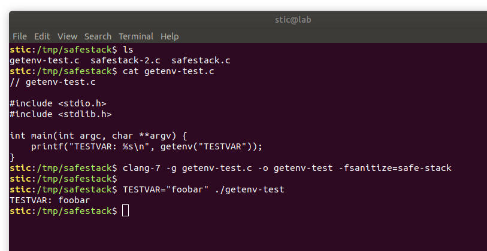
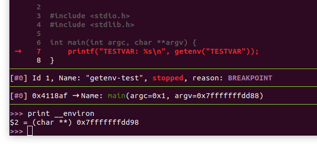
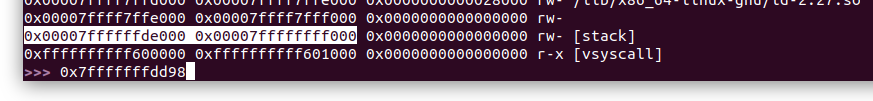
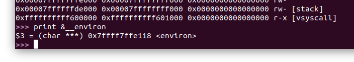
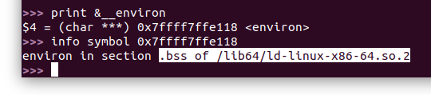
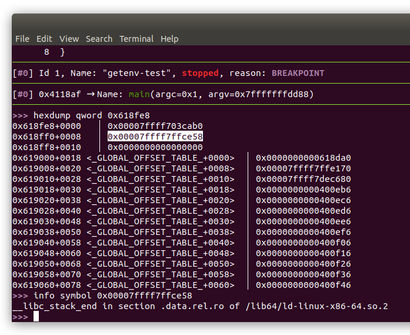

# Code Pointer Integrity

En este resumen estaremos estudiando un nuevo concepto denominado **Code Pointer Integrity** (CPI) [1]. Al igual que CFI, CPI es una propiedad que puede tener un programa. Recordaremos que CFI garantiza que el flujo de un programa permanece confinado a un grafo predeterminado. Un programa que presenta CPI, por otro lado, lo que cumple es que sus punteros a código (e.g. direcciones de retorno, punteros utilizados para llamar funciones) permanecen íntegros; es decir, un programa con CPI no permite la corrupción de punteros a código. CPI ofrece, en teoría, garantías más fuertes que CFI ante ataques de corrupción de memoria, y es un concepto independiente.


## El concepto de CPI

Antes de hablar de los detalles de CPI, hablaremos un poco sobre memory safety. Conceptualmente, un programa se dice "memory safe" cuando todos sus accesos a memoria son seguros. Esto quiere decir que los datos modificados mediante la desreferenciación de un puntero pueden ser solo datos del objeto o elemento en el cuál el puntero está basado. El elemento en el cuál un puntero está basado se determina a nivel código fuente. Por ejemplo, el siguiente código 

```c
char *buffer = (char*) malloc(1024);
buffer[2048] = 0;
```

... en un programa memory safe es una violación de seguridad, por estar intentando usar el puntero buffer para acceder a memoria que no corresponde al buffer en sí. 

Existen mecanismos para hacer programas escritos en C memory safe, muy similares a lo que vimos con [ASan](../asan-sm/asan-sm.md). Estos mecanismos suelen instrumentar todos los accesos a memoria con instrucciones adicionales que verifican metadatos asociados a la dirección siendo accedida y al puntero siendo utilizado. Posibles metadatos incluyen direcciones mínimas y máximas admisibles, longitudes de buffers, etc. Por ejemplo, la segunda asignación en el código de arriba podría ser instrumentada con código que verifica que la dirección a la cuál se está intentando acceder esté entre la dirección base del buffer en el heap, y la dirección base mas su longitud. Por supuesto, la inicialización del buffer deberá ser también instrumentada con código que registra estos metadatos en algún lado.

Está de más decir que instrumentar todos los accesos a memoria tendrá inevitablemente un impacto significativo en el rendimiento. Según [1], las implementaciones existentes de memory safety para C++ tendrían un overhead superior al 100%. Para hacer al mecanismo más eficiente, lo que intenta CPI es instrumentar solamente los accesos a memoria que sean críticos para prevenir los ataques de reutilización de código. Es decir, CPI implementa memory safety solo para lo que denomina "punteros sensibles". Un puntero sensible es un puntero a código, o un puntero que pueda ser usado para acceder a otro puntero sensible en un acceso memory safe.

Por ejemplo, supongamos que tenemos el siguiente struct:

```c
typedef struct {
    char *module_name;
    void (*initialization_handler)();
} module_definition_t;
```

CPI identificará el puntero `initialization_handler` como un puntero sensible. Adicionalmente, todo puntero a tipo `module_definition_t` será un puntero sensible por poder ser potencialmente utilizado para modificar un puntero `initialization_handler` en un acceso memory safe. También será sensible todo puntero que pueda ser utilizado legalmente para modificar algún puntero a `module_definition_t` , y así recursivamente.

Según lo que se reporta en [1], en el benchmark SPECCPU2006 solo el 6.5% de todas las operaciones con punteros requieren protección de CPI, con lo cuál el impacto por implementar el esquema es mucho menor al producido por las implementaciones típicas de memory safety.


## Implementación propuesta

Para implementar CPI, [1] propone particionar el espacio de memoria en dos regiones: la región regular y la región segura. La idea es esencialmente la que vimos con shadow memory; la región regular es memoria típicamente accesible; la región segura, por otro lado, está escondida y protegida ante accesos inseguros. Según [1], todo acceso a la región segura debe ser o demostrado memory safe en tiempo de compilación, o verificable como tal en tiempo de ejecución. Todo objeto que incluya algún puntero sensible será almacenado en la región segura; la región regular, por otro lado, puede ser usada para almacenar todo el resto de los datos, como buffers, structs no sensibles, etc., y puede ser accedida sin overhead adicional.

Otro mecanismo propuesto en [1] es el del **SafeStack**, el cuál ya ha sido implementado en Clang. La idea es la siguiente: en adición a su stack regular, cada hilo tendrá también un stack protegido en la región segura, al cuál llamaremos safe stack. En el safe stack se almacenarán direcciones de retorno, estructuras con punteros sensibles, y registros volcados (i.e. registros que el compilador decide copiar temporalmente al stack para poder utilizarlos durante la ejecución de la función, y que luego serán restaurados).

En x86-64, ya que en general no se cuenta con soporte del hardware, la región segura debe estar escondida en el espacio de memoria, y será necesario asegurarse de que no hayan quedado punteros a la región que puedan ser leídos por un atacante.


## Implementación en Clang

Como ya hemos mencionado, Clang [implementa SafeStack](https://clang.llvm.org/docs/SafeStack.html) como parte del [proyecto CPI](https://dslab.epfl.ch/proj/cpi/). Veamos cómo se comporta el siguiente programa cuando lo compilamos con SafeStack:

```c
// safestack.c

#include <stdio.h>
#include <stdlib.h>
#include <string.h>

typedef struct {
    char name[64];
    void (*run)();
} service_t;

void service_main() {
    printf("foo\n");
}

int main(int argc, char **argv) {
    char service_name[64]; // stack regular
    
    // Copiamos el primer argumento al stack regular.
    strcpy(service_name, argv[1]);
    
    // Creamos un struct sensible y un puntero sensible.
    service_t *service = (service_t*) malloc(sizeof(service_t));
    
    // Limpiamos la memoria del struct.
    memset((void*)service, 0, sizeof(service_t));
    
    // Copiamos el primer argumento al stack sensible.
    strcpy((char*)&service->name, argv[1]);
    
    // Utilizamos los punteros sensibles.
    service->run = service_main;
    service->run();
    
    free(service);
    return 0;
}
```


Compilamos el programa con el siguiente comando:

```bash
clang-7 -g safestack.c -o safestack -fsanitize=safe-stack
```

Cargamos el programa en gdb, ponemos un breakpoint en main+0, y procedemos a ejecutar el programa pasando un argumento con el comando `run RandomService`. Pasamos a analizar el código del programa, paso por paso.

```assembly
; main
push   rbp
mov    rbp,rsp
sub    rsp,0x40
```

La función main comienza como lo haría regularmente, guardando rbp en el stack y disminuyendo el valor almacenado en rsp en una cierta cantidad fija. Analizando el valor en rsp con el debugger, determinamos que el registro apunta a la región que vmmap típicamente etiqueta como "[stack]". Es decir, hasta aquí no ha habido ningún cambio con respecto a la ejecución sin la mitigación.

El siguiente bloque es el encargado crear un nuevo frame en el safe stack:

```assembly
xor    eax,eax
mov    rcx,QWORD PTR [rip+0x20763f] ; # <__safestack_unsafe_stack_ptr@@Base+0x618fc8>
mov    rdx,QWORD PTR fs:[rcx]
mov    r8,rdx
add    r8,0xffffffffffffffc0
mov    QWORD PTR fs:[rcx],r8
```


Notaremos que en una dirección `0x20763f` por encima de la segunda instrucción hay un valor de 8 bytes que será cargado en rcx. Concretamente, dicho valor se encuentra en la sección .got mapeada en memoria, la cuál es de solo lectura. El valor es concretamente `0xfffffffffffffff8`, o -8 en complemento a dos. Notaremos luego que dicho valor se utiliza como offset relativo al registro fs para cargar en rdx lo que parecería ser el offset desde la base hasta el tope de uno de los dos stacks, el cuál pronto veremos que es el stack inseguro. Podemos confirmarlo notando la instrucción add que resta 64 bytes a dicho valor, para que luego vuelva a ser almacenado en `fs:[-8]`, esencialmente creando un nuevo frame para contener el buffer `service_name` de `main`. Es decir, el registro rsp apunta al safe stack, el puntero en `fs:[-8]` apunta al stack inseguro o regular, y ambos stacks crecen hacia abajo. Si por casualidad nos quedaran dudas, podemos confirmar el supuesto leyendo la etiqueta `<__safestack_unsafe_stack_ptr@@Base+0x618fc8>` embebida por el compilador.

Es decir, lo que ha hecho esta secuencia es reservar 64 bytes en el stack regular para almacenar nuestro buffer `service_name`, el cuál sabemos no es sensible. Adicionalmente, el puntero al tope del stack regular a quedado almacenado en r8; en otras palabras, r8 será por el momento el equivalente al rsp en el stack regular.

Concretamente, el stack regular (o los stacks regulares en caso de haber múltiples hilos) se ubican en la región resaltada en la siguiente captura, justo entre el heap y el inicio de los módulos ejecutables:




Volvamos al assembly. La  secuencia que sigue simplemente almacena los argumentos recibidos por el programa en el safe stack. Hay un detalle de seguridad a tener en cuenta aquí.  Los argumentos para el programa, así como las variables de entorno, son almacenados en el safe stack. Esto implica que el puntero `argv` debe ser almacenado también en el safe stack; en caso contrario, un atacante podría leer `*argv` para determinar direcciones de strings almacenados en el safe stack, develando así la posición del mismo.

```assembly
mov    DWORD PTR [rbp-0x4],0x0
mov    DWORD PTR [rbp-0x8],edi
mov    QWORD PTR [rbp-0x10],rsi
```


Lo que sigue es una copia de un string desde el safe stack (como dijimos, los argumentos están allí) al stack regular. Observaremos que se ejecuta sin mucha novedad:

```assembly
; strcpy(service_name, argv[1]);

; Cargamos el puntero argv[1] en rsi.
;
mov    rsi,QWORD PTR [rbp-0x10]
mov    rsi,QWORD PTR [rsi+0x8]

; Cargamos la dirección del tope del stack regular en r8;
; recordaremos que es allí donde comienza nuestro buffer service_name.
;
mov    rdi,r8

; Se vuelcan los valores de los registros rcx, rdx y eax también al safe stack.
; Esto no afecta la copia de datos.
;
mov    QWORD PTR [rbp-0x20],rcx ; <__safestack_unsafe_stack_ptr@@Base+0x618fc8>
mov    QWORD PTR [rbp-0x28],rdx ; Dirección previa del tope del safe stack.
mov    DWORD PTR [rbp-0x2c],eax

; Se ejecuta strcpy como sería típico, con la dirección de destino en rdi,
; y la dirección de origen en rsi.
;
call   400f70 <strcpy@plt>
```


Continuamos con la creación de un struct tipo `service_t`, que recordaremos contiene un puntero a código. Estrictamente, `service_t` es un struct sensible, con lo cuál debería ser almacenado en la región segura. Desgraciadamente, la implementación de Clang por el momento solo cubre SafeStack; ya que el struct creado se encuentra en el heap, no hay nada que Clang pueda hacer por el momento para protegerlo. Por otro lado, el puntero `service`, un puntero sensible por apuntar a un struct que contiene un puntero a código, se encuentra efectivamente en el stack, con lo cuál puede ser protegido por el compilador que decide almacenarlo en el safe stack:

```assembly
; service_t *service = (service_t*) malloc(sizeof(service_t));

; Cargamos la longitud del struct service_t en rdi, el primer argumento para malloc.
;
mov    r9d,0x48
mov    edi,r9d

; En este instante, el valor en rax es el puntero antes retornado por strcpy,
; que apuntaría a service_name. Aparentemente, estaría siendo almacenado en 
; el safe stack.
;
mov    QWORD PTR [rbp-0x38],rax

; Se ejecuta la llamada a malloc, y el puntero devuelto se copia al safe stack.
;
call   400fe0 <malloc@plt>
mov    QWORD PTR [rbp-0x18],rax
```


Lo que sigue es la ejecución de `memset`, una escritura al safe stack. En cualquier caso, no hay mucho para mencionar sobre esta escritura mas que, para implementar memset de forma eficiente, se utilizan los registros XMM de 16 bytes, aunque eso no tiene que ver con SafeStack.

```assembly
; memset((void*)service, 0, sizeof(service_t));

; Se carga la dirección base del struct en el registro rax.
mov    rax,QWORD PTR [rbp-0x18]

; xmm = 0 (0x10 bytes).
xorps  xmm0,xmm0

; Se llena la memoria del struct con ceros en bloques de 16 bytes,
; con un último bloque de 8 bytes al final.
movups XMMWORD PTR [rax+0x30],xmm0
movups XMMWORD PTR [rax+0x20],xmm0
movups XMMWORD PTR [rax+0x10],xmm0
movups XMMWORD PTR [rax],xmm0
mov    QWORD PTR [rax+0x40],0x0
```


En el siguiente bloque vemos como la copia de memoria desde el safe stack al heap se ejecuta sin novedades. Como ya mencionamos, el puntero sensible `service` está almacenado en el safe stack.

```assembly
; strcpy((char*)&service->name, argv[1]);

mov    rdi,QWORD PTR [rbp-0x18]
mov    rax,QWORD PTR [rbp-0x10]
mov    rsi,QWORD PTR [rax+0x8]
call   400f70 <strcpy@plt>
```

Notaremos que los accessos tanto al stack regular como al safe stack no llevan ningún overhead adicional; esta es la ventaja esencial del mecanismo con respecto a otras alternativas. La copia de valores constantes al safe stack, como sería de esperarse, tampoco tiene ningún overhead adicional:

```assembly
; service->run = service_main;

mov    rcx,QWORD PTR [rbp-0x18]
mov    QWORD PTR [rcx+0x40],0x411960
```


La ejecución continúa con la llamada indirecta. Observaremos que no hay validaciones de integridad de ningún tipo, se asume que los valores en el safe stack son íntegros:

```assembly
; service->run();

; Se carga el valor del puntero service->run en rcx.
mov    rcx,QWORD PTR [rbp-0x18]
mov    rcx,QWORD PTR [rcx+0x40]

; Se mueven algunos registros y se vuelca rax al safe stack, 
; aunque no parecería impactar en el flujo de ejecución.
xor    r9d,r9d
mov    r10b,r9b
mov    QWORD PTR [rbp-0x40],rax
mov    al,r10b

; Se ejecuta la llamada indirecta a través de rcx.
call   rcx

; free(service);
mov    rdi,QWORD PTR [rbp-0x18]
call   400f60 <free@plt>
```


La función finaliza con un último bloque que observaremos restaura el valor de `fs:[-8]`, el tope del stack regular; es decir, se está desapilando el frame del stack regular creado para contener al buffer `service_name`:

```assembly
; return 0;

; Se carga el offset <__safestack_unsafe_stack_ptr@@Base+0x618fc8> en rcx;
; recordaremos que el valor fue almacenado en [rbp-0x20] en una instrucción anterior.
; Entonces, el valor en fs[rcx] será la dirección del tope del stack inseguro.
;
mov    rcx,QWORD PTR [rbp-0x20]

; Se carga en rdx la dirección anterior del tope del stack inseguro.
;
mov    rdx,QWORD PTR [rbp-0x28]

; Se restablece el puntero al tope del stack inseguro al valor que tenía antes
; de comenzar la ejecución de la función, esencialmente desapilando el frame.
;
mov    QWORD PTR fs:[rcx],rdx

; La función retorna normalmente.
;
mov    eax,DWORD PTR [rbp-0x2c]
add    rsp,0x40
pop    rbp
ret
```

Notaremos que la implementación de SafeStack es bastante eficiente. Solo se requieren unas pocas instrucciones adicionales al principio y al final de la función. El núcleo de la instrumentación está en la utilización de un registro como un stack pointer al stack regular, y la utilización de los registros rsp y rbp como punteros al stack protegido. El resto de las instrucciones no requieren instrumentación adicional, solo deben utilizar el stack adecuado.


Antes de continuar, veamos cómo maneja la implementación de Clang los structs sensibles en el stack. Veamos el siguiente código:

```c
// safestack-2.c

#include <stdio.h>
#include <stdlib.h>
#include <string.h>

typedef struct {
    char name[64];
    void (*run)();
} service_t;

void service_main() {
    printf("foo\n");
}

int main(int argc, char **argv) {
    char service_name[64]; // stack regular
    service_t service;     // stack protegido
    
    // Copiamos el primer argumento al stack regular.
    strcpy(service_name, argv[1]);
    
    // Copiamos un buffer desde el stack regular al stack sensible.
    strcpy((char*)&service.name, (char*)&service_name);

    // Utilizamos los punteros sensibles.
    service.run = service_main;
    service.run();
    return 0;
}
```


El código comentado de la función `main`, compilado el binario con SafeStack, es el siguiente:

```assembly
; main
;
; Se reservan 0x40 (64) bytes en el safe stack. El registro rsp apuntará al tope
; del stack protegido, rbp apuntará a la base.
;
push   rbp
mov    rbp,rsp
sub    rsp,0x40

; Se reservan 0x90 (144) bytes en el stack regular. El registro rdx 
; apuntará a la base del stack regular.
;
xor    eax,eax
mov    rcx,QWORD PTR [rip+0x2076cf] # <__safestack_unsafe_stack_ptr@@Base+0x618fc8>
mov    rdx,QWORD PTR fs:[rcx]
mov    r8,rdx
add    r8,0xffffffffffffff70
mov    QWORD PTR fs:[rcx],r8
mov    DWORD PTR [rbp-0x4],0x0
mov    DWORD PTR [rbp-0x8],edi
mov    QWORD PTR [rbp-0x10],rsi

; strcpy(service_name, argv[1]);
;
; Se copia un string (al que el puntero argv[1] apunta) desde el stack protegido 
; al stack regular. Notaremos que el buffer service_name está en rdx-0x40.
;
mov    rsi,rdx
add    rsi,0xffffffffffffffc0
mov    r8,QWORD PTR [rbp-0x10]
mov    r8,QWORD PTR [r8+0x8]
mov    rdi,rsi                   ; rdi (destino) = base del stack regular - 0x40
mov    QWORD PTR [rbp-0x18],rsi
mov    rsi,r8                    ; rsi (origen) = argv[1]
mov    QWORD PTR [rbp-0x20],rdx
mov    QWORD PTR [rbp-0x28],rcx
mov    DWORD PTR [rbp-0x2c],eax
call   400ef0 <strcpy@plt>

; strcpy((char*)&service.name, (char*)&service_name);
;
mov    rcx,QWORD PTR [rbp-0x20]
add    rcx,0xffffffffffffff78
mov    rdi,rcx                   ; rdi (destino) = base del stack regular - 0x88
mov    rsi,QWORD PTR [rbp-0x18]  ; rsi (origen)  = base del stack regular - 0x40
mov    QWORD PTR [rbp-0x38],rax
call   400ef0 <strcpy@plt>

; service.run = service_main;
;
mov    rcx,QWORD PTR [rbp-0x20]
mov    QWORD PTR [rcx-0x48],0x4118d0 ; service.run en el stack protegido

; service.run();
;
mov    rdx,QWORD PTR [rcx-0x48]
xor    r9d,r9d
mov    r10b,r9b
mov    QWORD PTR [rbp-0x40],rax
mov    al,r10b
call   rdx

; return 0
;
mov    rcx,QWORD PTR [rbp-0x28]
mov    rdx,QWORD PTR [rbp-0x20]
mov    QWORD PTR fs:[rcx],rdx
mov    eax,DWORD PTR [rbp-0x2c]
add    rsp,0x40
pop    rbp
ret  
```

Podremos notar que, si bien parte del código actúa como si el struct service estuviera almacenado por completo en el stack protegido (la línea `service.run = service_main`, concretamente), el buffer del struct se almacena en realidad en el stack regular. Es decir, la implementación de Clang sabe hacer la distinción entre qué datos guardar en una región u otra, incluso para tipos de datos compuestos como structs.


## Ataques propuestos

Si bien CPI es un mecanismo de seguridad bastante sólido, a la implementación de Clang no le faltan sus bemoles, como muestran Göktaş et. al. en [2] (el video de la charla está disponible en YouTube). 

Entre las ideas propuestas en [2] está la búsqueda de punteros que descuidadamente hayan quedado apuntando a estructuras almacenadas en el safe stack. Según nos muestra Göktaş, por entonces había una buena cantidad de punteros descuidados, lo que permitiría a un atacante con las primitivas adecuadas leer el valor de alguno de ellos para obtener así alguna dirección en el stack protegido; una vez filtrada dicha dirección, sería posible utilizar una escritura arbitraria para editar el contenido del safe stack. Este es un hecho sabido y comentado en la [documentación oficial del SafeStack de Clang](https://clang.llvm.org/docs/SafeStack.html), en donde se menciona lo siguiente:

> The safe stack pointer hiding is not perfect yet either: system library functions such as `swapcontext`, exception handling mechanisms, intrinsics such as `__builtin_frame_address`, or low-level bugs in runtime support could leak the safe stack pointer. In the future, such leaks could be detected by static or dynamic analysis tools and prevented by adjusting such functions to either encrypt the stack pointer when storing it in the heap (as already done e.g., by `setjmp`/`longjmp` implementation in glibc), or store it in a safe region instead.


A priori podríamos descartar el problema de los punteros descuidados como fácilmente resoluble, aunque en realidad no es algo tan simple como en principio podría parecer; estaremos hablando más al respecto luego. Por el momento, veamos las otras dos estrategias propuestas en [2], las cuáles son más difíciles de mitigar; afortunadamente, también son más difíciles de ejecutar. La segunda estrategia comentada por Göktaş es la de **thread spraying**. La idea es crear una cantidad enorme de hilos, reduciendo la entropía al momento de adivinar una dirección en algún safe stack (recordemos que hay uno por hilo), haciendo que el ataque por adivinación sea feasible. La tercera idea es la del **allocation oracle**. Un allocation oracle es una primitiva de explotación que le permite al atacante intentar reservar una cantidad arbitraria de memoria en el espacio de memoria del proceso. El oráculo debe permitirle al atacante determinar si ĺa reserva fue exitosa o no. Una primitiva como esta le permitiría a un atacante determinar la distancia en bytes desde un segmento en memoria regular hasta hasta un safe stack mediante una búsqueda binaria, permitiendo así computar direcciones en el stack protegido en base a direcciones que pueden ser obtenidas explotando vulnerabilidades típicas.

Está de más decir que ejecutar este tipo de ataques en la realidad no es fácil, ya que requieren consumir, al menos virtualmente, una fracción importante de la memoria disponible en el espacio de memoria del proceso. En cuanto al thread spray, el programa objetivo debe ofrecer la posibilidad de crear una cantidad enorme de hilos (en términos prácticos no debe imponer límites), sin liquidar al sistema en el proceso. Con el oráculo, por otro lado, si bien más feasible, hay que confirmar que la memoria reservada sea copy-on-write, y que no sea escrita durante la ejecución de la primitiva, al menos en su totalidad, porque la cantidad de memoria que habrá que reservar para encontrar el safe stack muy probablemente no quepa en memoria física. Adicionalmente, también debe ser posible liberar la memoria reservada por la primitiva, y por supuesto, debe ser posible ejecutarla varias veces en forma sucesiva. Siendo más estrictos, explotar esta primitiva usualmente tendrá sentido en una fase previa al control del puntero a instrucción, con lo cuál la primitiva debe ser de alguna forma una operación legal del programa (aunque se puede abusar de primitivas de lectura y de escritura en las regiones no escondidas para desarrollar el oráculo si es necesario).


Más allá de la sofisticación que pueda tener un ataque con thread spraying o con allocation oracles, no podemos tampoco despreciar el problema de los punteros descuidados. A continuación pondremos dicho problema en evidencia con un ejemplo muy simple.

Veamos el siguiente programa:

```c
// getenv-test.c

#include <stdio.h>
#include <stdlib.h>

int main(int argc, char **argv) {
    printf("TESTVAR: %s\n", getenv("TESTVAR"));
}
```

Procedemos ejecutando los siguientes comandos en la terminal:

```bash
# Compilamos el programa con SafeStack.
clang-7 -g getenv-test.c -o getenv-test -fsanitize=safe-stack 

# Ejecutamos el programa.
TESTVAR="foobar" ./getenv-test
```



Curiosamente, el programa funciona sin ningún problema. La pregunta clave es, ¿cómo es que hace `getenv` para obtener el valor de la variable de entorno TESTVAR cuando las variables de entorno están almacenadas en el stack protegido? La función debe ser de alguna forma capaz de encontrar el inicio de la lista de variables sin ninguna pista adicional. Iterar byte por byte desde el tope del stack apunta hasta encontrar la lista de variables ciertamente no es una opción. La función debe de alguna forma contar con un puntero que le permita ubicar la lista rápidamente, o tener los mecanismos para acceder a uno.

Revisando el archivo `getenv.c` en el [código fuente de glibc 2.27](https://www.gnu.org/software/libc/sources.html) (tag `release/2.27/master`) encontramos que la función utiliza un puntero `__environ` accesible globalmente. Procedemos entonces a lanzar el programa `getenv-test` en gdb, poniendo antes un breakpoint en main.

Una vez en main, escribimos el comando `print __environ`:



Veremos que dicho puntero existe, y no debería sorprendernos que apunte al safe stack:



Ahora, la pregunta es, ¿dónde es que está este puntero `__environ`? Escribimos `print &__environ`, deberíamos ver algo como lo siguiente:



Observaremos que se trata de un puntero en la sección .bss del módulo del linker:



Para determinar la ubicación del módulo ld, se puede leer la global offset table, donde podemos encontrar punteros al linker:



Evidentemente, mientras este puntero exista, un atacante con capacidad de lectura arbitraria que haya ubicado la GOT no tendrá problemas en develar también la posición del safe stack. Recordaremos que, con solo SafeStack, no hay nada que le impida a un atacante desarrollar primitivas de escritura o lectura arbitrarias, explotando UAFs en el heap por ejemplo, o corrompiendo punteros a datos en el stack regular.

Podríamos intentar debatir diciendo que solo es cuestión de eliminar los punteros al safe stack. Resulta en realidad que esto no es tan fácil. El problema fundamental está en que los módulos que no han sido compilados con SafeStack verán al stack protegido como un stack regular, y guardarán allí valores y estructuras a los que probablemente apuntarán desde otros lugares (i.e. punteros globales, punteros en el heap). Estos punteros pueden por supuesto ser leídos sin nuevas invenciones. Esencialmente, si queremos eliminar los punteros al safe stack en forma definitiva, debemos o compilar todo con safe stack, o replantear la implementación del esquema. Recordaremos que "tener que compilar todo con" fue uno de los factores que por mucho tiempo impidieron que CFI pudiera ser ampliamente adoptado.

¿Qué ocurrirá cuando Clang termine finalmente de implementar un CPI completo? Podríamos estimar la situación planteando el siguiente experimento mental. Supongamos que un atacante controla lo que podríamos suponer será un "heap regular" o el stack regular que ya vimos, y desarrolla primitivas de lectura y de escritura  arbitrarias. Hasta ahora no hemos violado ningún supuesto de CPI, que asume atacantes con estas capacidades. De hecho, podríamos suponer que CPI facilitará la tarea de desarrollar estas primitivas: sin canarios y con las direcciones de retorno fuera del stack regular, un desborde típico podrá extenderse sin dificultades fuera del frame de la función de origen sin causar errores de segmentación, permitiendo alcanzar punteros a datos que sin SafeStack serían inaccesibles. Luego, supongamos que el problema del puntero `__environ` no ha sido resuelto, o que existen punteros equivalentes en algún otro módulo; como dijimos, el problema de los punteros descuidados no es un problema trivial de resolver. El atacante deberá proceder entonces a ubicar el módulo ld (o el módulo que contenga el puntero). Posiblemente, primero deba ubicar la GOT. A priori podría parecer una tarea bastante difícil, porque gracias a CPI todos los punteros a código estarán en la región segura. Desgraciadamente, en la región regular pueden haber también punteros a datos y a estructuras globales, los cuales pueden develar la ubicación de secciones como .rodata o .bss, a partir de las cuáles se puede ubicar tanto el código como la GOT. Dichos punteros tampoco son particularmente raros; sin ir demasiado lejos, los punteros a strings literales son sumamente ubicuos, y como sabemos, dichos strings se almacenan en el segmento de datos estáticos. Entonces, mientras exista al menos un puntero descuidado, nada le impide a un atacante desarrollar un exploit totalmente funcional, incluso con un CPI completo, esencialmente con las mismas herramientas que utilizaría hoy día.

Supongamos ahora que se logra una implementación completa de CPI sin punteros descuidados, en  la cuál la región segura está perfectamente escondida. En este caso, todavía no podemos descartar las estrategias propuestas por Göktaş et. al. en [2], allocation oracles y thread spraying. Yendo más allá, podríamos hablar también de un conjunto de técnicas muy potentes y muy costosas de mitigar que empezaron a salir a la luz en 2017 [3] [4] [5]. Dichas técnicas permitirían filtrar información sobre el espacio de memoria de procesos vecinos mediante side channel attacks. Por vecinos, nos referimos a procesos ejecutándose en la misma computadora. Si bien suena limitado, hay que tener en cuenta que en los entornos en la nube hay muchas aplicaciones de distintos orígenes, en general no verificados, compartiendo un mismo hardware; es en esos contextos donde estos problemas de seguridad tienen mayor relevancia.


## Referencias

[1] Kuznetsov, Szekeres, Payer, Candea, Sekar, Song (2014). *Code-Pointer Integrity*.

[2] Göktaş, Economopoulos, Gawlik, Kollenda, Athanasopoulos, Portokalidis, Giuffrida, Bos (2016). *Bypassing Clang's SafeStack for Fun and Profit*. Black Hat 2016.

[3] https://en.wikipedia.org/wiki/Spectre_(security_vulnerability)

[4] https://en.wikipedia.org/wiki/Meltdown_(security_vulnerability)

[5] https://en.wikipedia.org/wiki/Row_hammer