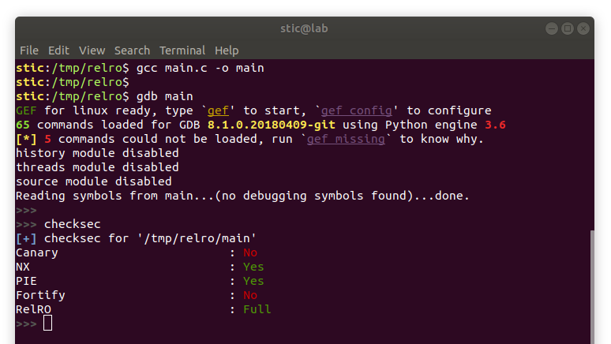

# Relocation Read Only

La mitigación RelRO (Relocation Read Only) es bastante simple de entender si se tiene presente el funcionamiento de las tablas de reubicación (relocation tables). Oportunamente, el nivel 3 de la guía de escritura de exploits de Teresa trata la [teoría](https://fundacion-sadosky.github.io/guia-escritura-exploits/buffer-overflow/3-got.html) de dichas tablas con lujo de detalle, concretando luego en la [práctica](https://fundacion-sadosky.github.io/guia-escritura-exploits/buffer-overflow/3-practica.html) con un ataque de escritura de la GOT.

Observaremos que dicho ataque solo podrá ser exitoso si la GOT puede ser escrita en tiempo de ejecución. La mitigación RelRO lo que hace es justamente evitar que ésto sea posible: con RelRO activa, la GOT será de solo lectura al momento de iniciar la ejecución del código del usuario.

Evidentemente, si la GOT es de solo lectura, no será posible resolver las direcciones de funciones a demanda como se explica en la parte teórica. En tal caso, todas las direcciones de funciones externas deberán ser resueltas al momento de iniciar el programa; una vez resueltas todas, la tabla puede hacerse solo legible y el código de aplicación puede iniciar normalmente.

Cabe mencionar que RelRO tiene dos modos de operación: completo (Full RelRO) y parcial. Solo el modo completo protege a los procesos contra ataques de escritura de la GOT. La versión 18.04 de Ubuntu Desktop ya viene configurada para producir binarios enlazados con full RelRO por defecto; podría darse también que haya otras distribuciones migrando o que ya hayan migrado a full RelRO. Para determinar si un binario es full RelRO podemos usar checksec, que viene también incorporado con gef para gdb:

En cualquier caso, es importante mencionar que la GOT sigue estando en la memoria, y todavía puede resultar útil al momento de escribir exploits. Como mencionamos en el resumen de [ASLR](../aslr/aslr.md), leer la GOT puede servir para obtener direcciones de funciones en bibliotecas externas.
