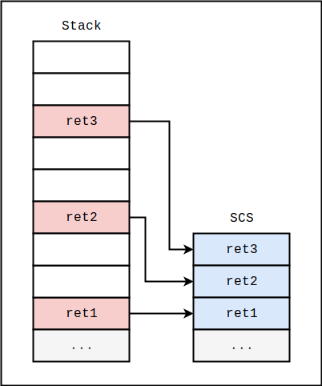
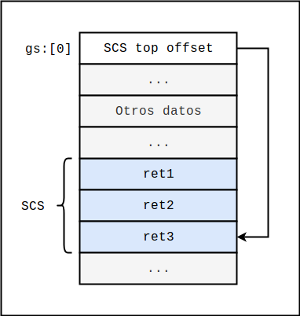

# Shadow Call Stack

En el resumen anterior introducimos el concepto de [CFI](../cfi/cfi.md) [1]. CFI no es una mitigación en sí, sino una propiedad que puede tener un programa. Un programa que presenta esta propiedad garantiza un flujo de ejecución íntegro, imposibilitando aquellos ataques que requieren controlar dicho flujo. Hubieron ya muchos intentos de lograr que nuestros programas tengan esta propiedad de CFI, al menos parcialmente, y el **Shadow Call Stack** (SCS) es uno de ellos. Un SCS intenta garantizar lo que se conoce como backward-edge CFI: las funciones pueden retornar solamente al lugar desde donde fueron llamadas.

En concepto, un SCS es una estructura muy simple. En su forma más básica, el SCS es una pila tal que, a medida que las direcciones de retorno van siendo apiladas en el stack regular, el típico stack que conocemos, copias de ellas se apilan también en el SCS. Luego, al momento de retornar, se verifica que la dirección de retorno en el tope del stack regular coincida con la dirección de retorno en el tope del SCS; si las direcciones no coinciden, quiere decir que la memoria del stack regular está corrupta y es necesario abortar la ejecución. Un esquema gráfico podría ser el siguiente:



Observaremos que, al estar separados, un desborde en el stack regular no puede afectar las direcciones almacenadas en el SCS. Idealmente, el SCS es solo accesible mediante un procedimiento específico que impide que un atacante con capacidades de lectura y escritura arbitrarias pueda modificarlo. Es decir, el SCS debería ser robusto incluso ante un atacante con poder absoluto sobre el espacio de memoria del proceso. Para lograr esto, lo ideal es contar con soporte del hardware; si bien hay algunas arquitecturas que ofrecen tal soporte, x86-64 no es una de ellas. En 2016, sin embargo, Intel reportó estar trabajando en lo que denominó "Control-Flow Enforcement Technology" [2], una tecnología que, entre otras cosas, ofrece soporte en hardware para shadow stacks.

Alternativamente, es posible implementar SCS puramente en software, incluso sin la asistencia específica del sistema operativo, siempre y cuando se tomen las medidas adecuadas para evitar que un atacante pueda encontrar y modificar el segmento. Esto implica no dejar punteros en memoria, ni en secciones de datos ni en secciones de código, que apunten al shadow stack. La idea es usualmente almacenar la dirección base del SCS en algún registro x, y utilizar luego mecanismos de direccionamiento relativo a x para acceder a los datos.  Para referenciar al SCS en x86-64 se pueden utilizar los registros gs/fs, mas un offset dependiente del elemento al cuál se quiere acceder.

Por un ejemplo concreto veamos la [implementación de Clang 7](https://clang.llvm.org/docs/ShadowCallStack.html) [3]. Clang es un compilador de C/C++ basado en LLVM, un conjunto de módulos reutilizables para la generación y optimización de código máquina para distintas arquitecturas. Clang 7 está disponible en los repositorios de Ubuntu, para instalarlo solo basta ejecutar

```bash
sudo apt-get install clang-7
```

Alternativamente, se puede recurrir a los [repositorios oficiales](https://apt.llvm.org/) para instalar una versión más reciente. Irónicamente, el SCS de Clang fue deprecado hace poco por ser considerado ineficiente e inseguro, y las versiones más recientes podrían ya no tenerlo; estaremos mencionando más al respecto luego. Consideremos el siguiente programa:

```c
// stack-02-scs.c

#include <stdio.h>
#include <stdint.h>
#include <stdlib.h>

void write(uint64_t *buffer, int8_t index, uint64_t value) {
    buffer[index] = value;
}

void runme() {
    printf("Hello, world!\n");
    exit(0);
}

int main(int argc, char **argv) {
    if (argc != 2) return 1;
    
    void (*buffer[8])(void);
    write((uint64_t*)&buffer, (int8_t)argv[1][0], (uint64_t)runme);
    return 0;
}
```

Podremos identificar este programa como una versión modificada del ejercicio stack-02 de la primera parte de la guía. La modificación hace a la función main una función no hoja. Esto se debe a que la implementación del SCS de Clang solo instrumenta validaciones para funciones no hoja. El porqué no queda del todo claro; quizás sea una cuestión de eficiencia, más que nada considerando que una función hoja no es necesariamente inmune a los ataques que la mitigación quiere prevenir.

Pasamos ahora a compilar el programa con la mitigación habilitada.

```bash
clang-7 -fsanitize=shadow-call-stack stack-02-scs.c -o stack-02-scs
```

Veamos ahora qué apariencia tiene el código assembly de la función main. Utilizamos objdump:

```bash
objdump -d -M intel ./stack-02-scs
```

```
00000000004005b0 <main>:
  4005b0:	4c 8b 14 24          	mov    r10,QWORD PTR [rsp]
  4005b4:	4d 31 db             	xor    r11,r11
  4005b7:	65 49 83 03 08       	add    QWORD PTR gs:[r11],0x8
  4005bc:	65 4d 8b 1b          	mov    r11,QWORD PTR gs:[r11]
  4005c0:	65 4d 89 13          	mov    QWORD PTR gs:[r11],r10
  4005c4:	55                   	push   rbp
  4005c5:	48 89 e5             	mov    rbp,rsp
  4005c8:	48 83 ec 50          	sub    rsp,0x50
  4005cc:	c7 45 fc 00 00 00 00 	mov    DWORD PTR [rbp-0x4],0x0
  4005d3:	89 7d f8             	mov    DWORD PTR [rbp-0x8],edi
  4005d6:	48 89 75 f0          	mov    QWORD PTR [rbp-0x10],rsi
  4005da:	83 7d f8 02          	cmp    DWORD PTR [rbp-0x8],0x2
  4005de:	0f 84 0c 00 00 00    	je     4005f0 <main+0x40>
  4005e4:	c7 45 fc 01 00 00 00 	mov    DWORD PTR [rbp-0x4],0x1
  4005eb:	e9 28 00 00 00       	jmp    400618 <main+0x68>
  4005f0:	48 8d 45 b0          	lea    rax,[rbp-0x50]
  4005f4:	48 8b 4d f0          	mov    rcx,QWORD PTR [rbp-0x10]
  4005f8:	48 8b 49 08          	mov    rcx,QWORD PTR [rcx+0x8]
  4005fc:	48 89 c7             	mov    rdi,rax
  4005ff:	0f be 31             	movsx  esi,BYTE PTR [rcx]
  400602:	48 ba 80 05 40 00 00 	movabs rdx,0x400580
  400609:	00 00 00 
  40060c:	e8 2f ff ff ff       	call   400540 <write>
  400611:	c7 45 fc 00 00 00 00 	mov    DWORD PTR [rbp-0x4],0x0
  400618:	8b 45 fc             	mov    eax,DWORD PTR [rbp-0x4]
  40061b:	48 83 c4 50          	add    rsp,0x50
  40061f:	5d                   	pop    rbp
  400620:	4d 31 db             	xor    r11,r11
  400623:	65 4d 8b 13          	mov    r10,QWORD PTR gs:[r11]
  400627:	65 4d 8b 12          	mov    r10,QWORD PTR gs:[r10]
  40062b:	65 49 83 2b 08       	sub    QWORD PTR gs:[r11],0x8
  400630:	4c 39 14 24          	cmp    QWORD PTR [rsp],r10
  400634:	0f 85 01 00 00 00    	jne    40063b <main+0x8b>
  40063a:	c3                   	ret    
  40063b:	0f 0b                	ud2    
  40063d:	0f 1f 00             	nop    DWORD PTR [rax]
```

En esencia, SCS es una mejora del mecanismo del canario. La función comienza con un pre protocolo  que guarda la dirección de retorno en el stack sombra:

```
  4005b0:	4c 8b 14 24          	mov    r10,QWORD PTR [rsp]
  4005b4:	4d 31 db             	xor    r11,r11
  4005b7:	65 49 83 03 08       	add    QWORD PTR gs:[r11],0x8
  4005bc:	65 4d 8b 1b          	mov    r11,QWORD PTR gs:[r11]
  4005c0:	65 4d 89 13          	mov    QWORD PTR gs:[r11],r10
```

Esta secuencia almacena en el tope del SCS la dirección de retorno de la función. Observaremos que la implementación de Clang utiliza el registro gs. Antes de que esta secuencia sea ejecutada, dicho registro deberá ser inicializado para apuntar a una estructura de datos propia del thread en ejecución; como podremos notar, si queremos que la mitigación funcione adecuadamente, cada hilo deberá tener su propio SCS. Hablaremos más sobre la inicialización de gs luego; por el momento, podemos intuir que la estructura a la cuál gs apunta puede ser algo como lo que se esquematiza a continuación:



Observaremos que la instrucción en `0x4005b7` accede a `gs:[0]` y suma 8 al valor allí almacenado. Luego, dicho valor se carga en el registro r11 y la dirección de retorno, almacenada en r10, se guarda finalmente en `gs:[r11]`. Es decir, se actualiza la dirección del tope del SCS y allí se almacena la nueva dirección de retorno.

Por supuesto, al final de la función está el procedimiento inverso:

```
  400620:	4d 31 db             	xor    r11,r11
  400623:	65 4d 8b 13          	mov    r10,QWORD PTR gs:[r11]
  400627:	65 4d 8b 12          	mov    r10,QWORD PTR gs:[r10]
  40062b:	65 49 83 2b 08       	sub    QWORD PTR gs:[r11],0x8
  400630:	4c 39 14 24          	cmp    QWORD PTR [rsp],r10
  400634:	0f 85 01 00 00 00    	jne    40063b <main+0x8b>
  40063a:	c3                   	ret    
  40063b:	0f 0b                	ud2
```

En este caso, la dirección de retorno en el tope del SCS se almacena en el registro r10. Luego, al offset  hasta el tope del shadow stack se le resta 8. Si la dirección recuperada del tope del SCS coincide con aquella en el tope del stack regular, la función retorna sin novedades; en caso de ser diferentes, se ejecuta una "undefined instruction" ud2 que hará finalizar el programa con un error.


Desgraciadamente, si intentamos ejecutar el programa en Ubuntu 18.04 x64, veremos que finaliza rápidamente con un error de segmentación cuando se intenta ejecutar la instrucción `add QWORD PTR gs:[r11],0x8`. Según la documentación oficial de SCS [3], el soporte para la adecuada inicialización del registro gs y de las correspondientes estructuras de datos no está provisto por defecto, con lo cuál la aplicación en cuestión, o el sistema operativo, deben proveer el suyo propio. Más información [aquí](http://llvm.1065342.n5.nabble.com/llvm-dev-Is-shadow-call-stack-in-llvm-7-ok-td123919.html). Considerando que la seguridad del esquema descansa en la incapacidad del atacante de predecir la ubicación del SCS, dejar la implementación al programador de la aplicación no parecería ser lo apropiado; un SCS en el espacio del usuario, si no se toman las precauciones para inicializarlo apropiadamente, puede ser vulnerado por un atacante que cuenta con las primitivas adecuadas. Por ejemplo, el siguiente programa funciona, pero tiene un problema fundamental:

```c
// stack-02-scs.c

#include <stdio.h>
#include <stdint.h>
#include <stdlib.h>
#include <unistd.h>
#include <sys/mman.h>
#include <sys/syscall.h>
#include <sys/types.h>
#include <asm/prctl.h>

int run(int argc, char **argv) {
    /*
     * Aquí estaría la ejecución del programa principal.
     *
     */
    return 0;
}

int main(int argc, char **argv) {
    
    // Obtenemos un espacio donde almacenar el SCS.
    void *scs_base = mmap(0, 4096, PROT_READ | PROT_WRITE, MAP_PRIVATE | MAP_ANONYMOUS, 0, 0);
    
    // Guardamos la dirección base del SCS en el registro gs.
    syscall(SYS_arch_prctl, ARCH_SET_GS, scs_base);
    
    // Ejecutamos el programa propiamente dicho.
    return run(argc, argv);
}
```

Si prestamos atención notaremos que el puntero scs_base nunca es eliminado del stack. Un atacante con las primitivas adecuadas podría leer el valor del puntero y así ubicar al SCS en el espacio de memoria. Si bien el problema de los punteros descuidados parecería ser uno menor, pronto veremos que resolverlo no es precisamente una cuestión trivial.

Para implementar un SCS, lo ideal sería que, en falta de un soporte en hardware, el que provea el soporte sea el sistema operativo. Ubuntu 18.04, sin embargo, evidentemente no lo provee.

>  **Nota**: Al día de escribir esto, Ubuntu 18.10 ya ha sido liberado, y Ubuntu 19.04 será liberado pronto.    Quizás sean adoptados para ejercicios posteriores.

Según [este commit](https://github.com/llvm-mirror/llvm/commit/863ea8c618b1f88ba8c9ec355a07cb3783481642), SCS en LLVM fue una funcionalidad experimental y, considerando que el entorno de ejecución nunca fue provisto, su eliminación en x86-64 no debería tener mayor impacto. El texto del commit lee

```
Summary:

ShadowCallStack on x86_64 suffered from the same racy security issues as
Return Flow Guard and had performance overhead as high as 13% depending
on the benchmark. x86_64 ShadowCallStack was always an experimental
feature and never shipped a runtime required to support it, as such
there are no expected downstream users.
```

Curiosamente, el commit fue creado cinco días antes de comenzar a escribir este resumen.

En resúmenes posteriores estaremos estudiando posibles ataques contra shadow stacks y contra shadow memory en general (consultar referencias en [3]). Primero, sin embargo, estaremos estudiando el concepto general de shadow memory y su implementación (afortunadamente todavía no deprecada) en LLVM. También estaremos viendo implementaciones concretas de CFI, un concepto nuevo denominado CPI, una tecnología relacionada denominada SafeStack, y más técnicas de explotación.


## Referencias

[1] Abadi, Budiu, Erlingsson & Ligatti (2005). *Control-Flow Integrity*.

[2] Intel (2017). *Control-Flow Enforcement Technology Preview*.

[3] https://clang.llvm.org/docs/ShadowCallStack.html