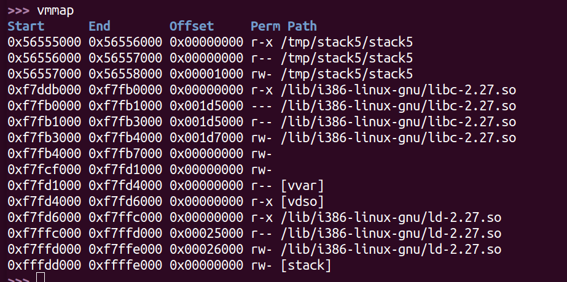
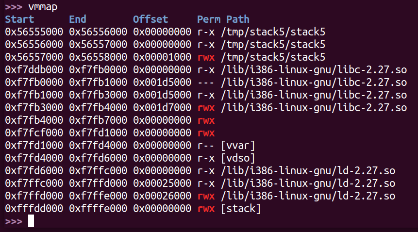

# Write XOR Execute

Si recordamos el procedimiento de explotación del stack overflow clásico, la idea fundamental era inyectar shellcode en algún buffer del stack y redireccionar la ejecución al mismo, usualmente modificando la dirección de retorno en algún frame. Evidentemente, un supuesto fundamental en el que se basa este procedimiento es que el stack debe ser ejecutable. 

La idea de Write XOR Execute (W^X) es que, por defecto, ninguna página de memoria que pueda ser escrita pueda también ser ejecutada. Es decir, cuando el sistema operativo carga el proceso en memoria y define su tabla de páginas, se asegurará de que las regiones ejecutables no puedan ser escritas y viceversa. Esto implica que el stack por defecto no es ejecutable.

Supongamos que abrimos con gdb/gef un cierto ejecutable compilado con gcc sin ningún flag adicional (llamemoslo stack5), ponemos un breakpoint en main, ejecutamos el programa, y ejecutamos luego el comando vmmap. Deberíamos observar algo como lo siguiente:

Lo que vemos en la captura es un mapa de la memoria del proceso en ejecución: cada línea es un segmento del espacio de memoria del proceso. La columna "Start" nos indica la dirección de inicio del segmento; la columna "End" nos indica donde termina el segmento; la columna "Path" nos muestra la ruta del binario mapeado al segmento (de haber alguno), y sino nos muestra el nombre de la región (e.g. stack); la columna "Offset" nos indica a partir de dónde en el binario comienza el mapeo, y la columna "Perm" nos indica los **permisos** de las páginas del segmento. Si observamos, no hay ningún segmento que tenga permisos tanto de escritura (w) como de ejecución (x).

La implementación de W^X se hace en parte a nivel sistema operativo con ayuda del hardware, y en parte a nivel compilador. La responsabilidad principal está con los primeros, que se encargan de gestionar los accesos a memoria virtual y sus correspondientes permisos. El compilador (el linker más bien) tiene sin embargo la capacidad de generar ejecutables que pueden optar por no usar W^X. Con gcc podemos generar un binario sin W^X pasando el flag `-z execstack`. En tal caso, el mapa de memoria del proceso podría verse como el siguiente:

**Nota**: Si utilizamos checksec para verificar si un binario fue enlazado o no con W^X, debemos observar el flag NX. NX (no-execute) es el nombre de la tecnología de hardware que permite separar entre memoria ejecutable y no ejecutable, y es lo que utilizan hoy en día las implementaciones de W^X para proveer sus servicios.

Es inusual, por supuesto, que alguien opte por enlazar sus binarios sin W^X. Como atacantes debemos entonces desarrollar mecanismos para vencer la mitigación.

**¿Cómo hacemos entonces para vencer a W^X?** Resulta que hay programas que requieren indefectiblemente que haya segmentos que pueden ser tanto escritos como ejecutados (un compilador JIT, por ejemplo). Para tales casos existe una función en la biblioteca estándar de C llamada **mprotect**, que sirve para cambiar permisos de páginas en tiempo de ejecución.

La idea entonces es la siguiente: si queremos vencer a W^X debemos por un lado inyectar nuestro shellcode, y por otro lado hacerlo ejecutable mediante una llamada a mprotect. Las técnicas concretas para lograr ésto las veremos en ejercicios posteriores; por el momento cabe aclarar que no es necesario que el programa que estamos atacando use mprotect intencionalmente; solo basta con que esté enlazado con libc, la biblioteca estándar de C.

Para un ejemplo concreto de utilización de mprotect se pueden revisar los [ejercicios sobre shellcode](../../shellcode/shellcode-01/shellcode-01.c), en los cuáles se utiliza la función para hacer ejecutable al buffer donde se almacena el shellcode del usuario.
