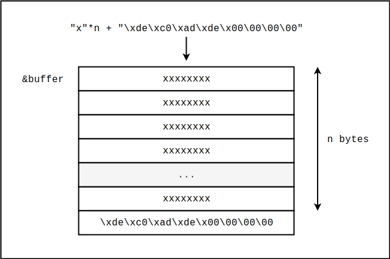

# Primitivas


## Introducción

Si ponemos junto todo lo que vimos hasta ahora, podríamos decir que para explotar un proceso usualmente será necesario desarrollar primitivas o mecanismos de **lectura** y de **escritura** que nos permitan interactuar con el espacio de memoria del proceso que estamos atacando. Los mecanismos de lectura nos permiten por un lado vencer a ASLR y/o a Stack Protector, y por otro nos permiten filtrar datos potencialmente sensibles como contraseñas o claves criptográficas. Los mecanismos de escritura, por otro lado, nos permiten modificar ciertos datos para lograr el eventual control del flujo de ejecución del programa. Esencialmente, cuando explotemos un proceso, lo que haremos es encadenar la utilización de estos mecanismos, posiblemente en una sesión interactiva, hasta lograr la eventual ejecución de código arbitrario en el espacio del proceso objetivo.

Los ejercicios en esta sección se enfocan principalmente en la búsqueda de vulnerabilidades y en el desarrollo de primitivas. Los ejercicios en la siguiente sección (ataques de corrupción de memoria) se enfocarán en la utilización de primitivas en combinación con técnicas de explotación para lograr la eventual ejecución de código arbitrario en software verídico.


## Un ejemplo concreto: una primitiva de escritura

Supongamos que tenemos el ejemplo más clásico y trivial de explotación de software:

```c
// ex.c

void main() {
  char buffer[64];
  gets(buffer);
}
```

La función gets lee datos de la entrada estándar hasta encontrar un salto de línea, y lo que lee lo almacena en el buffer que recibe como parámetro. A esta altura ya podemos imaginarnos que un atacante que controla la entrada estándar no tendrá dificultad para desbordar el buffer y pisar eventualmente la dirección de retorno. En un entorno sin mitigaciones dicho atacante podría  modificar la dirección de retorno para que apunte al buffer, en donde habrá inyectado shellcode que podría, por ejemplo, establecer una conexión con un servidor remoto ofreciendo una shell.

Nosotros, sin embargo, no nos enfocaremos en el procedimiento de explotación, sino que nos enfocaremos en el recurso que el atacante utiliza para modificar la dirección de retorno. Supongamos entonces que la distancia entre el inicio del buffer y la dirección de retorno es de `n` bytes. Sabemos entonces que, para cambiar la dirección de retorno por otra dirección `r` de su elección, el atacante puede pasar `n` bytes cualquiera seguidos efectivamente de los 8 bytes de `r` en formato little endian (en x64). 

Imaginemos la siguiente función de Python:

```python
def write_deadc0de(n):
  return "x"*n + "\xde\xc0\xad\xde\x00\00\00\00"
```

Si pasamos la entrada generada por `write_deadc0de(n)` al programa en cuestión sabemos que estaremos escribiendo el número hexadecimal de 64 bits `0x00000000deadc0de` en little endian a partir de la dirección `&buffer + n`.

Gráficamente, podemos verlo de la siguiente forma:




En forma más abstracta, podríamos decir que tenemos un mecanismo que nos permite escribir datos arbitrarios a partir de una cierta dirección relativa a `&buffer`. Podemos decir que tenemos un mecanismo `w(n, d)` que escribe la secuencia de bytes `d` hasta el primer salto de línea, a partir de la dirección `&buffer + n` en el espacio de memoria del proceso. Este mecanismo abstracto es lo que llamamos una **primitiva de escritura**. En este caso concreto podemos decir que se trata de una primitiva de escritura de datos casi arbitrarios a partir de una dirección relativa. Escribe datos casi arbitrarios porque, como dijimos, copiará toda la secuencia `d` hasta encontrar un salto de línea. La escritura es a partir de una dirección relativa porque en ningún momento estamos hardcodeando una dirección absoluta en la entrada; lo que estamos pasando es meramente un offset, la cantidad de bytes desde `&buffer` hasta la dirección a partir de la cuál queremos escribir. También podemos decir que esta primitiva tiene un efecto colateral: todos los datos en el intervalo de direcciones [`&buffer` , `&buffer + n + len(d)`) se verán también modificados, no solo los bytes de lo que realmente queremos escribir (e.g. la dirección de retorno). Alternativamente, podríamos ver el mecanismo como una primitiva de escritura de datos casi arbitrarios a partir de la dirección `&buffer`, sin desplazamiento. También podemos decir que esta primitiva no puede ser utilizada en forma interactiva; evidentemente, el programa recibirá la entrada, la procesará, y terminará sin ofrecer la posibilidad de proveer entradas adicionales.


## Otros tipos de primitivas

En la sección anterior vimos lo que podría ser, como dijimos, una primitiva de escritura de datos casi arbitrarios a partir de una dirección relativa a un elemento en el stack. Detrás de la primitiva lo que hay es simplemente una entrada paramétrica con un cierto formato que logra explotar una vulnerabilidad en el código del programa objetivo. Usando esta primitiva podemos modificar cualquier dato en el stack que esté por encima de la dirección `&buffer`, siempre teniendo en cuenta el efecto colateral: estaremos también pisando todo lo que esté entre el inicio del buffer y el inicio del elemento que queremos modificar.

Una primitiva como la que vimos, por ejemplo, no sería capaz de vencer a Stack Protector. Existen otros tipos de primitivas, sin embargo, que tienen otras propiedades. Por ejemplo, podemos imaginar una primitiva de escritura de enteros de 64 bits a partir de una dirección relativa a un cierto elemento en el stack, sin el efecto colateral que afectaba a la primitiva anterior. Por ejemplo, supongamos que en la siguiente línea tenemos control sobre los enteros signados `i` y `n`:

```
buffer[i] = n;
```

donde `buffer` es un arreglo de enteros de 64 bits. En este caso, la primitiva que podríamos desarrollar no estaría restricta por Stack Protector: podríamos, por ejemplo, modificar la dirección de retorno o los valores de variables locales. La limitación de esta primitiva es que la longitud de lo que escribimos está limitada a 8 bytes. Evidentemente, si queremos inyectar shellcode en algún lado, será necesario o poder ejecutar la primitiva repetidas veces (en forma interactiva, por ejemplo), o utilizar algún otro tipo de primitiva.

Las dos primitivas que vimos hasta ahora permiten la escritura de datos a partir de direcciones relativas. Existen también ciertas vulnerabilidades que permiten desarrollar primitivas de escritura a partir de direcciones absolutas. Es decir, en nuestra entrada maliciosa estaríamos colocando efectivamente la dirección absoluta a partir de la cuál queremos escribir. Esto puede servirnos, por ejemplo, para modificar alguna entrada en la GOT.

Como hay primitivas de escritura, también hay primitivas de lectura, las cuáles pueden tener también distintas propiedades (e.g. en los delimitadores que manejan, en la longitud máxima de los datos que pueden leer, en el mecanismo de direccionamiento, etc.). Usualmente, cuando explotemos software, será necesario desarrollar varias primitivas tanto de lectura como de escritura. En principio será necesario comenzar con primitivas simples, desarrolladas usualmente en base a errores también simples. Luego, en base a las puertas que nos abren estas primitivas más sencillas, podremos ir desarrollando primitivas más sofisticadas  llegando eventualmente a escribir o a leer datos arbitrarios, de longitud arbitraria, a partir de direcciones arbitrarias. Muchas veces, sin embargo, no es necesario obtener tanto poder para llevar a cabo una explotación exitosa; hay veces que con mecanismos más básicos es suficiente para desarrollar un exploit robusto.


## Búsqueda de vulnerabilidades y desarrollo de primitivas

Entonces, ¿cómo desarrollamos primitivas? Para comenzar a desarrollar una primitiva será necesario encontrar vulnerabilidades en el código del programa que estamos analizando. 

Entonces, ¿cómo encontramos vulnerabilidades? En general, podríamos decir que las vulnerabilidades surgen en base a supuestos generosos en los que se basa un programa, cuando el programa no hace el esfuerzo por validarlos rigurosamente. Por generosos queremos decir que no necesariamente deben cumplirse; en particular, un atacante malintencionado puede violarlos fácilmente. Por ejemplo, volvamos al ejemplo típico del buffer overflow:

````c
void readline(char *buffer) {
  gets(buffer);
}
````

Supongamos que hay código productivo que realmente ejecuta gets y guarda los datos recibidos en un buffer de tamaño fijo. Podemos suponer que el programador, cuando desarrolló esta función, supuso que por la entrada estandar llegaría un salto de línea antes de llenar el buffer. En la mayoría de los casos ésto calificaría como un supuesto generoso: jamas podemos confiar en que los datos provenientes del exterior tengan la estructura que esperamos. Desgraciadamente, gets no provee mucho en términos de capacidad para validar la integridad de los datos de entrada, por lo que hoy en día se considera una función insegura y el compilador nos mostrará una alerta si intentamos usarla.

Entonces, para identificar vulnerabilidades, lo que debemos hacer es analizar el programa en busca de aquellos bloques de código que procesan datos potencialmente en control del atacante. Luego debemos analizar dichos bloques para identificar los supuestos que hacen sobre la estructura o las propiedades de los datos de entrada. El siguiente paso consiste en determinar si existe algún bloque de código que realmente verifique esos supuestos antes de que los datos sean procesados. Si determinamos que el código simplemente tiene "fe" en sus supuestos, podemos proceder a analizar que ocurre si dichos supuestos son violados. Ocasionalmente llegaremos a desarrollar entradas paramétricas que fuerzan al programa por ciertos flujos de ejecución, logrando el eventual desborde de algún buffer y quizás obteniendo la posibilidad de desarrollar alguna primitiva en base a ellas. En los ejercicios que siguen podremos estudiar el procedimiento en más detalle. Adicionalmente, en la guía hay una sección sobre fuzzing. Fuzzing es una técnica muy utilizada para automatizar la detección de problemas de corrupción de memoria causados por entradas malformadas.
