# Vuln-01

**Objetivo**: Desarrollar una primitiva de escritura que permita escribir datos arbitrarios a partir de direcciones arbitrarias. El código del programa objetivo se divide en dos archivos, [file.h](file.h) y [vuln-01.c](vuln-01.c). El primero define una estructura de datos que abstrae el concepto de un archivo compuesto por bloques de datos. El segundo orquesta la utilización de la estructura.


## Solución

Antes que nada, comencemos estudiando nuestro programa objetivo. El programa vuln-01.c emula en memoria una operación sobre un archivo definido por la estructura de datos `file`. Lo que hace el programa es crear un objeto `file` compuesto por dos bloques con datos dummy, y luego sobre ese archivo aplica una operación "patch".

Si verificamos en la definición de patch, se trata de una operación que reemplaza el contenido del archivo a partir de una cierta posición dada. No se trata de una inserción, sino de un reemplazo; es decir, la operación pisa el contenido del archivo a partir del índice provisto como parámetro. Los nuevos datos debemos proveerlos por entrada estándar.

Lo que debemos hacer entonces es, controlando el índice y los datos a insertar, desarrollar un mecanismo que nos permita escribir datos arbitrarios a partir de direcciones arbitrarias.


#### Compilando y ejecutando el programa

Compilamos y ejecutamos el programa con distintos argumentos para estudiar su comportamiento:

```bash
gcc vuln-01.c -o vuln-01
```

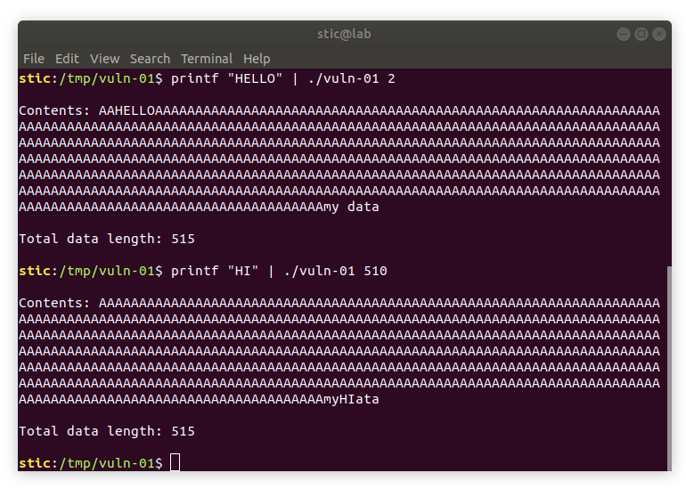

Observamos que los datos son reemplazados tal como esperaríamos. ¿Qué ocurre si pasamos un índice demasiado grande?


Nada. Si nos pasamos del límite, parecería no haber escritura. ¿Qué ocurre si pasamos un índice dentro de rango con datos que harían exceder la longitud del archivo?

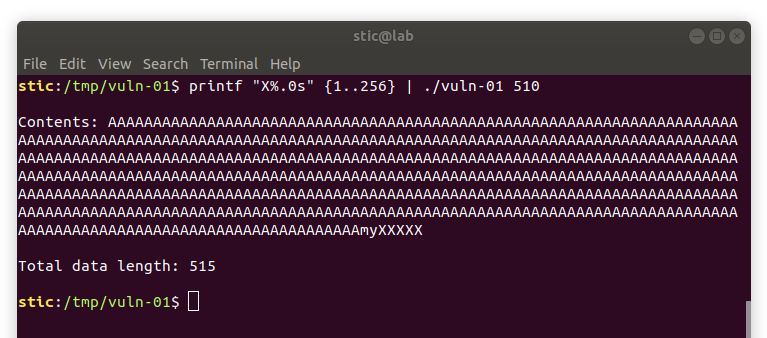

Nada. Como habíamos dicho se trata de un reemplazo; el algoritmo no hace ningún esfuerzo por insertar nuevos datos en caso de haber algún excedente. ¿Qué pasa si intentamos pasar de un bloque a otro? Sabemos que el archivo está compuesto por dos bloques: el primero contiene todos esos caracteres 'A' mientras que el segundo contiene el string 'my data'. El archivo completo es la concatenación de los dos bloques.

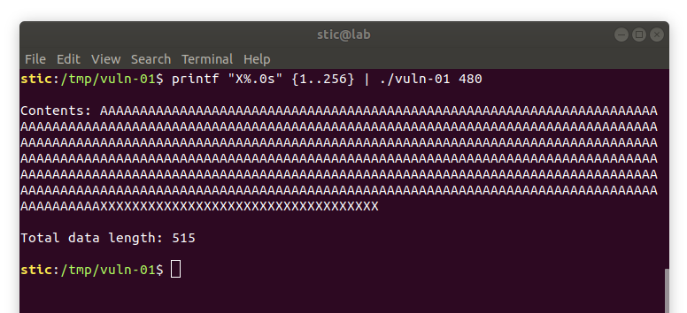

Nada. ¿Usan las operaciones de la estructura alguna función como strcpy o gets para procesar la entrada? Parecería que no. Parecería, de hecho, que se hacen esfuerzos activos para controlar la longitud de los datos de entrada.


#### Búsqueda de vulnerabilidades

Lo que haremos entonces es analizar el código en detalle para intentar encontrar alguna vulnerabilidad que podamos aprovechar para desarrollar alguna primitiva. Podemos comenzar entonces mapeando el flujo de nuestros datos de entrada por la aplicación. El grafo de llamadas con dependencia en nuestros datos es el siguiente:

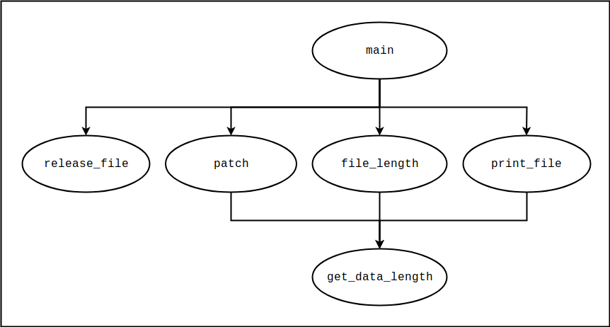

Nótese que nos estamos enfocando únicamente en las operaciones asociadas a la estructura de datos, particularmente aquellas que dependen de nuestros datos de entrada. El porqué patch aparece en el grafo es bastante evidente; recibe nuestros argumentos directamente como parámetros. Las demás funciones, sin embargo, operan sobre un objeto que podría potencialmente haber sido corrompido por la operación de patch, por lo que en este contexto también vale la pena analizarlas. Por supuesto, no estaría mal priorizar y comenzar estudiando patch: es la primera función encargada de procesar nuestra entrada, y además es la que está más cerca del origen de los datos. Mientras más cercana sea la llamada al origen de los datos, menos validaciones habrán sufrido éstos al momento de comenzar la ejecución de la función.

Antes de analizar el código, sin embargo, conviene tener presente la idea básica de la estructura que estamos analizando. En principio, `file` se trata esencialmente de una lista enlazada de bloques. Cada bloque tiene su propio contenido, y tiene también un puntero al bloque siguiente.

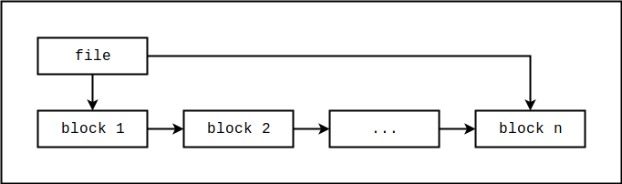

Las operaciones que vemos en el grafo de llamadas presumimos iteran por los bloques para obtener la visión completa del archivo. Estimamos que patch deberá, en base al índice, encontrar el bloque adecuado donde colocar el nuevo contenido, y deberá tomar medidas para controlar el pasaje de un bloque a otro.


Analizamos entonces la función patch, cuyo código listamos a continuación:

```c
void patch(file *f, long position, char *data, size_t data_length) {
   long base = 0;
   long accumulated_size = 0;
   block *b = f->first_block;
   while (b != 0) {
       base = accumulated_size;
       accumulated_size += get_data_length(b);
       if (position < accumulated_size) {
           long patch_position = position - base;
           long block_size = accumulated_size - base;
           long remainder = block_size - patch_position;
           long length = 0;

           if (data_length < remainder) {
             length = data_length;
           } else {
             length = remainder;
           }

           if (length < remainder) {
               memcpy(b->data + patch_position, data, length);
               return;
           } else {
               memcpy(b->data + patch_position, data, remainder);
               data += remainder;
               position += remainder;
               data_length -= remainder;
           }
       }
       b = b->next_block;
   }
}
```

Según lo que vimos en la [introducción](../intro/intro.md), habiendo determinado un bloque de código a analizar, conviene enumerar los supuestos en los que se basa para su correcto funcionamiento. Algunos supuestos interesantes, aunque no los únicos, son los siguientes:

* El puntero `first_block` del archivo debe apuntar a un bloque válido.
* El último bloque de la lista enlazada debe tener un puntero `next_block` nulo.
* La posición donde se realizará la escritura debe estar dentro de los confines del archivo.

¿Hay alguno de estos supuestos que no esté siendo rigurosamente verificado? Pues la verdad ninguno está siendo verificado en forma efectiva. A simple vista podríamos notar que la posición a partir de la cuál comienza la escritura debe ser efectivamente menor al tamaño del archivo, pero debemos observar también que la variable es de tipo entero signado, lo cuál debería llamarnos la atención: un índice en este contexto no debería ser negativo. De hecho, podemos rápidamente probar lo siguiente:

```
printf "A" | ./vuln-01 -1
```

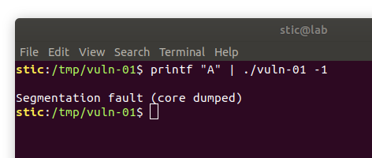

Con esto ya tenemos una puerta a la corrupción de la memoria del proceso. Lo que queremos hacer, sin embargo, es desarrollar una primitiva de escritura de datos arbitrarios a partir de direcciones arbitrarias. Esencialmente, lo que queremos es poder proveer a conciencia una entrada que escriba la secuencia de bytes `x` a partir de la dirección `y`, ambas variables con valores arbitrariamente definidos por nosotros. Veremos cómo hacer eso en la siguiente sección.


#### Desarrollo de la primitiva

Supongamos que compilamos el programa con símbolos de debugging (`gcc -g ...`) y con gdb ponemos un breakpoint en patch. Luego mostramos en pantalla el contenido del primer bloque del archivo. Deberíamos ver algo como lo siguiente:

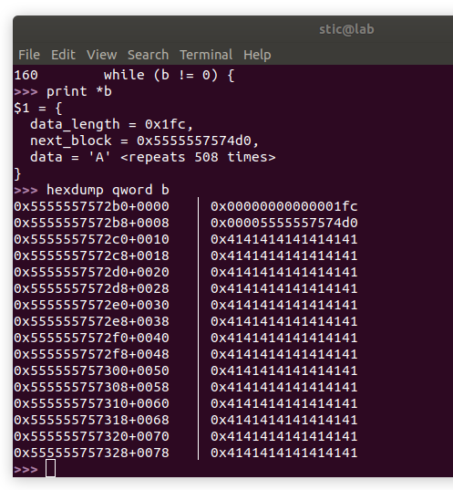

Intuimos que lo que ocurre es lo siguiente: al pasar como índice -1, estamos modificando la dirección del bloque siguiente al primero, causando un eventual acceso a memoria inválida debido a que, o la dirección no es válida, o a que el bloque en la nueva dirección corrupta tiene alguna estructura incorrecta (e.g. un tamaño demasiado grande) que causa otros errores, produciendo un efecto avalancha que lleva a un eventual intento de acceso a memoria inválida.

Entonces, ¿cómo aprovechamos ésto para desarrollar nuestra primitiva? Analicemos la estructura del archivo en detalle. Podríamos esquematizar el archivo en cuestión de la siguiente forma:

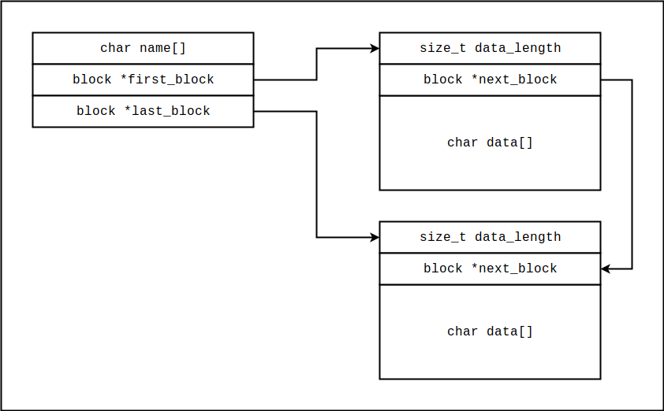


Observamos que tenemos la capacidad de sobrescribir el puntero `next_block` del primer bloque. ¿Qué ocurriría entonces si hacemos a `next_block` apuntar a un bloque "fantasma" o "virtual", en forma tal de que el buffer de datos del bloque ficticio comience en la dirección a partir de la cuál queremos escribir? ¿Qué ocurriría si en adición pasamos una secuencia de datos suficientemente larga como para escribir todo el primer bloque, haciendo que el algoritmo intente continuar la escritura a partir del segundo bloque?

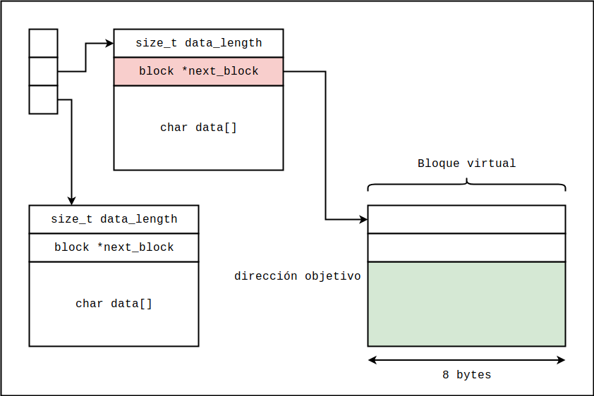


Lo que ocurrirá es que probablemente logremos sobrescribir los datos en el buffer de datos de nuestro bloque ficticio, pisando efectivamente los datos a partir de la dirección unos 16 bytes encima de aquella que nosotros pongamos en el puntero `next_block` del primer bloque.

Con esto tendríamos efectivamente un mecanismo que nos permitiría escribir datos arbitrarios a partir de direcciones arbitrarias *con una pequeña restricción*. Será inusual que las primitivas que desarrollemos no tengan ninguna restricción o ningún efecto secundario, y esta no es la excepción. Debemos contemplar que, para que el algoritmo de escritura funcione correctamente, el valor del atributo `data_length` de nuestro bloque ficticio debe ser mayor a la longitud de los datos que queremos escribir. Garantizar ésto no debería ser muy complicado: supongamos que queremos escribir a partir de la dirección `x`; en tal caso, solo debemos encontrar alguna dirección `y <= x - 16`  tal que los primeros 8 bytes a partir de `y` puedan ser interpretados como un número signado muy grande. Luego solo bastaría proveer suficientes bytes "filler" para llegar desde `y + 16` hasta `x`, y a partir de allí ingresar los datos a escribir. Evidentemente, todo lo que esté entre `y + 16` y `x` será también sobrescrito; preferentemente, la dirección `y` debería ser lo más alta posible para minimizar el impacto de dicho efecto secundario. Veamos el siguiente esquema del frame de la función patch:

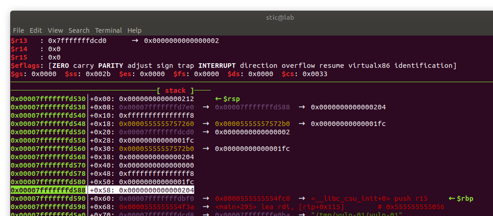

La dirección de retorno de patch se encuentra en `0x7fffffffd598`. Si modificaramos `next_block` para apuntar a la dirección resaltada (`0x7fffffffd588`) podríamos escribir datos arbitrarios a partir de la dirección de retorno. Cuando patch retorne, podríamos tomar control del flujo de ejecución del programa.


Procedemos entonces a probar nuestro mecanismo de escritura. Detrás de esta primitiva hay una entrada que en general puede ser generada mediante el siguiente script de Python:

```python
# Dirección de nuestro bloque fantasma.
target_address = "\x88\xd5\xff\xff\xff\x7f\x00\x00"

# Datos a escribir.
data = "hello, world!"

# Emitimos la secuencia completa por salida estándar.
print(target_address + 'X'*508 + data)
```

Luego solo debemos asegurarnos de pasar el índice -8 al programa como primer argumento.

Observaremos que la dirección objetivo que definimos en el script, donde comenzará nuestro bloque ficticio, es la dirección que habíamos resaltado en el dump de gdb (en formato little endian). Recordaremos de los resúmenes sobre mitigaciones que, por el efecto de ASLR, las direcciones varían de una ejecución a otra; en gdb, sin embargo, la aleatorización del espacio está deshabilitada por defecto, lo que nos permitirá probar nuestra primitiva. Si probamos esta entrada en gdb deberíamos lograr escribir el string "hello, world!" a partir de la dirección de retorno de la función patch.

Generamos primero la entrada:

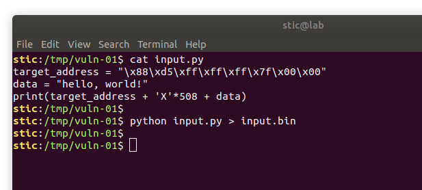

Ejecutamos luego gdb. Colocamos un breakpoint en la dirección de retorno de patch y ejecutamos luego el programa pasando por entrada estándar el archivo input.bin, y -8 como primer argumento. 

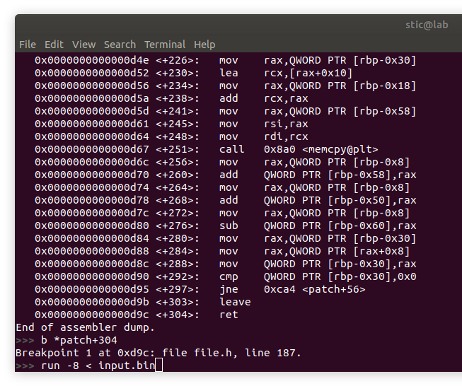

Deberíamos observar eventualmente algo como lo siguiente:

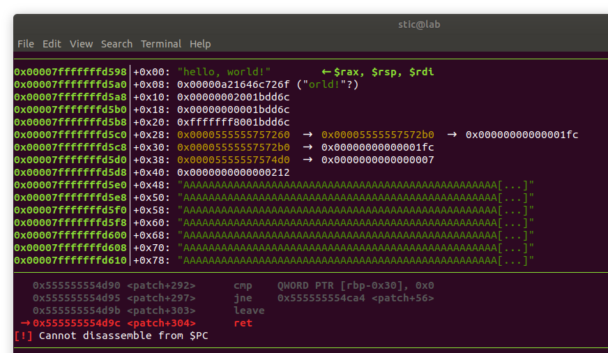

Observamos que, al momento de llegar a la instrucción ret, en el tope del stack se encuentra el string "hello, world!". Efectivamente, nuestro mecanismo fue capaz de escribir la secuencia a partir de la dirección de retorno del frame. Con esto hemos desarrollado un mecanismo que nos permite escribir una secuencia de datos arbitrarios a partir de una dirección arbitraria en el espacio de memoria del proceso objetivo.

Cabe mencionar ahora que, cuando logramos desarrollar un mecanismo de lectura o de escritura, conviene estudiarlo en detalle para entender sus limitiaciones y sus potenciales fallas. La restricción que habíamos mencionado antes sobre la longitud del bloque no es, de hecho, la única. Por ejemplo, ¿qué habría pasado si el valor de `data_length` de nuestro bloque ficticio hubiese sido tan grande que hubiese desbordado `accumulated_size`? En tal caso el índice `position` habría resultado mayor a `accumulated_size`, y el flujo de ejecución habría continuado con un acceso al bloque siguiente a nuestro bloque ficticio, en la dirección `0x7fffffffdbf0`. Difícilmente podemos predecir qué habría ocurrido exactamente, aunque el programa habría terminado probablemente con un error de segmentación. Es por eso que, para desarrollar exploits robustos, es necesario entender las características y las limitaciones de las primitivas que desarrollamos.


## Conclusiones

Con este ejercicio pudimos practicar el proceso de desarrollo de una primitiva que nos permite interactuar con el espacio de memoria del proceso objetivo. En este caso no podemos hacer mucho más que eso: para desarrollar un exploit nos faltaría la capacidad de intercambiar más mensajes con el proceso; difícilmente podemos atacar un proceso no persistente que expone una interfaz tan reducida. En los siguientes ejercicios estaremos desarrollando exploits completos para obtener ejecución de código arbitrario en servidores interactivos.
