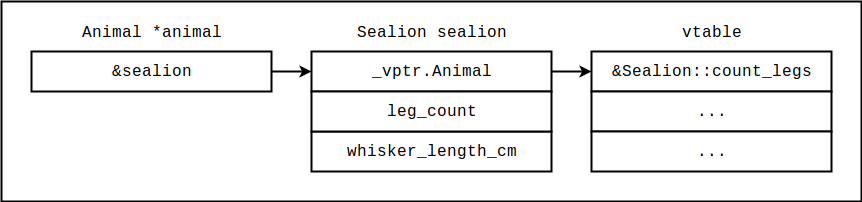
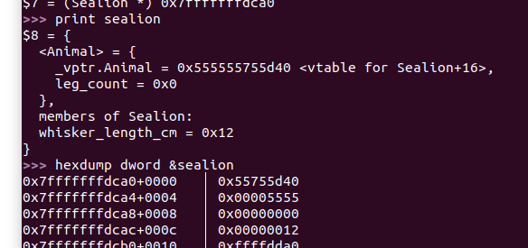

# C++

La idea de este resumen es introducir la representación a nivel assembly de los programas escritos en C++ y compilados con g++ versión 7.3.0. Concretamente, nos estaremos enfocando en la representación de clases, objetos, y en el mecanismo de herencia y polimorfismo. Conocer la implementación típica de dichas características resultará conveniente al momento de desarrollar exploits.


#### Clases y objetos

Veamos primero el siguiente programa:

```c++
// cpp1.cpp

#include <iostream>

//========================================================
// Writer
//--------------------------------------------------------

class Writer {

private:
  int n;
   
public:
   
  Writer(int n) {
    this->n = n;
  }
   
  void write() {
    std::cout << n << std::endl;
  }
   
};

//========================================================
// main
//--------------------------------------------------------

int main() {
  Writer writer(10);
  writer.write();
  return 0;
}
```

Compilaremos el programa con g++ y procederemos a analizar el código de `main` con objdump:

```bash
g++ cpp1.cpp -o cpp1 && objdump -M intel -d ./cpp1
```

```
00000000000008fa <main>:
 8fa:	55                   	push   rbp
 8fb:	48 89 e5             	mov    rbp,rsp
 8fe:	48 83 ec 10          	sub    rsp,0x10
 902:	64 48 8b 04 25 28 00 	mov    rax,QWORD PTR fs:0x28
 909:	00 00 
 90b:	48 89 45 f8          	mov    QWORD PTR [rbp-0x8],rax
 90f:	31 c0                	xor    eax,eax
 911:	48 8d 45 f4          	lea    rax,[rbp-0xc]
 915:	be 0a 00 00 00       	mov    esi,0xa
 91a:	48 89 c7             	mov    rdi,rax
 91d:	e8 86 00 00 00       	call   9a8 <_ZN6WriterC1Ei>
 922:	48 8d 45 f4          	lea    rax,[rbp-0xc]
 926:	48 89 c7             	mov    rdi,rax
 929:	e8 92 00 00 00       	call   9c0 <_ZN6Writer5writeEv>
 92e:	b8 00 00 00 00       	mov    eax,0x0
 933:	48 8b 55 f8          	mov    rdx,QWORD PTR [rbp-0x8]
 937:	64 48 33 14 25 28 00 	xor    rdx,QWORD PTR fs:0x28
 93e:	00 00 
 940:	74 05                	je     947 <main+0x4d>
 942:	e8 69 fe ff ff       	call   7b0 <__stack_chk_fail@plt>
 947:	c9                   	leave  
 948:	c3                   	ret 
```

Esperaríamos observar cómo el código instancia de alguna forma un objeto de tipo `Writer` y de alguna forma ejecuta la función `write`. Enfoquemonos primero en las cuatro instrucciones a partir del offset `0x911`:

```
 911:	48 8d 45 f4          	lea    rax,[rbp-0xc]
 915:	be 0a 00 00 00       	mov    esi,0xa
 91a:	48 89 c7             	mov    rdi,rax
 91d:	e8 86 00 00 00       	call   9a8 <_ZN6WriterC1Ei>
```

Lo que notaremos es que esta secuencia carga en el registro rdi una dirección en el stack, en el registro rsi el valor 10, y luego llama a una función de curioso nombre `_ZN6WriterC1Ei`, evidentemente autogenerado. Observando el argumento `0xa` podríamos sospechar que esta secuencia es la que efectivamente ejecuta el constructor de `Writer`; lo curioso, sin embargo, es que el valor entero que debemos pasarle al constructor no es, a nivel assembly, el primer argumento sino el segundo. 

Lo que ocurre es que, en la implementación típica de C++, los objetos a nivel assembly se representan esencialmente como structs. Si bien a nivel fuente vemos al código de la clase y a sus atributos como un conjunto, a nivel assembly el código deberá estar en alguna sección ejecutable, y los datos deberán estar separados, en alguna sección que permita la escritura, como el stack o el heap. A nivel assembly el código es esencialmente compartido entre todas las instancias de una misma clase, y para identificar la identidad del objeto concreto sobre el cuál se debe ejecutar un cierto método se utiliza el puntero `this`, que a nivel assembly se provee como primer argumento en el registro rdi. Entonces, el constructor que a nivel código fuente recibe un solo argumento, un entero `n`, a nivel assembly recibe dos, el puntero al objeto que está siendo construido y luego el valor entero. En este caso, el objeto en cuestión estará siendo almacenado en `rbp-0xc`, en el stack.

Para darle más concreción a la idea, veamos el código de la función `_ZN6WriterC1Ei`, lo que suponemos es el constructor de `Writer`:

```
00000000000009a8 <_ZN6WriterC1Ei>:
 9a8:	55                   	push   rbp
 9a9:	48 89 e5             	mov    rbp,rsp
 9ac:	48 89 7d f8          	mov    QWORD PTR [rbp-0x8],rdi
 9b0:	89 75 f4             	mov    DWORD PTR [rbp-0xc],esi
 9b3:	48 8b 45 f8          	mov    rax,QWORD PTR [rbp-0x8]
 9b7:	8b 55 f4             	mov    edx,DWORD PTR [rbp-0xc]
 9ba:	89 10                	mov    DWORD PTR [rax],edx
 9bc:	90                   	nop
 9bd:	5d                   	pop    rbp
 9be:	c3                   	ret    
 9bf:	90                   	nop
```

Observaremos que la primera instrucción luego del prólogo de la función (offset `0x9a8`) guarda el puntero `this` en la dirección `rbp-0x8`. El el atributo `n` del método se copia también al stack (en la instrucción siguiente). Estos pasos son meramente para guardar los argumentos en el stack. Observaremos luego, sin embargo, que en las instrucciones desde `0x9b3` hasta `0x9ba` el valor de `n` se copia a los primeros cuatro bytes a partir de la dirección a la que `this` apunta. Es decir, para almacenar los atributos del objeto se usa esencialmente un struct, identificado por el puntero `this`. Para confirmar esto podemos continuar analizando el siguiente bloque de código en la función `main`:

```
 922:	48 8d 45 f4          	lea    rax,[rbp-0xc]
 926:	48 89 c7             	mov    rdi,rax
 929:	e8 92 00 00 00       	call   9c0 <_ZN6Writer5writeEv>
```

Este bloque llama a `write` de la clase `Writer`, codificado en el nombre `_ZN6Writer5writeEv`. Observaremos que en el registro rdi se carga la dirección de lo que habíamos dicho es el objeto instanciado. No entraremos en los detalles de las llamadas a `cout` que ocurren internamente, pero si analizamos las primeras cuatro instrucciones luego del prólogo de `write`, veremos que el valor entero que había sido almacenado en el objeto en el stack se carga primero en eax para luego ser copiado a esi. Estas instrucciones son las que se muestran a continuación:

```
 9c8:	48 89 7d f8          	mov    QWORD PTR [rbp-0x8],rdi
 9cc:	48 8b 45 f8          	mov    rax,QWORD PTR [rbp-0x8]
 9d0:	8b 00                	mov    eax,DWORD PTR [rax]
 9d2:	89 c6                	mov    esi,eax
```

Este valor será luego provisto a los métodos de `cout` para realizar la emisión por salida estádar. Lo importante de este primer ejemplo es entender que los atributos de los objetos se almacenan en estructuras esencialmente similares a structs, y el código es compartido por todas las instancias. A nivel assembly, la instancia sobre la que se ejecuta un método particular se define pasandole al método la dirección del objeto en cuestión como primer argumento.


#### Herencia y polimorfismo

Veamos ahora el siguiente ejemplo:

```c++
// cpp2.cpp

#include <iostream>

//========================================================
// Animal
//--------------------------------------------------------

class Animal {

private:
  unsigned int leg_count;

protected:

  Animal(unsigned int leg_count) {
    this->leg_count = leg_count;
  }

public:
  
  virtual unsigned int count_legs() {
    return leg_count;
  }

};

//========================================================
// Penguin
//--------------------------------------------------------

class Penguin : public Animal {
public:
  Penguin() : Animal(2) {}
};

class Sealion : public Animal {
private:
    unsigned short whisker_length_cm;
    
public:
    
  Sealion() : Animal(0) {
    this->whisker_length_cm = 18;
  }
    
  unsigned int count_legs() {
    std::cout << "They're flippers, dude." << std::endl;
    return 0;
  }
  
};

//========================================================
// main
//--------------------------------------------------------

int main() {
  Sealion sealion;
  Animal *animal = &sealion;
  animal->count_legs();
  return 0;
}
```

Es decir, estamos definiendo una clase base y dos clases herederas. Una de ellas redefine el funcionamiento del método virtual `count_legs`.

Compilamos entonces este programa y analizamos el código con objdump:

```bash
g++ cpp2.cpp -o cpp2 && objdump -M intel -d ./cpp2
```

```
0000000000000a9a <main>:
 a9a:	55                   	push   rbp
 a9b:	48 89 e5             	mov    rbp,rsp
 a9e:	48 83 ec 30          	sub    rsp,0x30
 aa2:	64 48 8b 04 25 28 00 	mov    rax,QWORD PTR fs:0x28
 aa9:	00 00 
 aab:	48 89 45 f8          	mov    QWORD PTR [rbp-0x8],rax
 aaf:	31 c0                	xor    eax,eax
 ab1:	48 8d 45 e0          	lea    rax,[rbp-0x20]
 ab5:	48 89 c7             	mov    rdi,rax
 ab8:	e8 cd 00 00 00       	call   b8a <_ZN7SealionC1Ev>
 abd:	48 8d 45 e0          	lea    rax,[rbp-0x20]
 ac1:	48 89 45 d8          	mov    QWORD PTR [rbp-0x28],rax
 ac5:	48 8b 45 d8          	mov    rax,QWORD PTR [rbp-0x28]
 ac9:	48 8b 00             	mov    rax,QWORD PTR [rax]
 acc:	48 8b 00             	mov    rax,QWORD PTR [rax]
 acf:	48 8b 55 d8          	mov    rdx,QWORD PTR [rbp-0x28]
 ad3:	48 89 d7             	mov    rdi,rdx
 ad6:	ff d0                	call   rax
 ad8:	b8 00 00 00 00       	mov    eax,0x0
 add:	48 8b 4d f8          	mov    rcx,QWORD PTR [rbp-0x8]
 ae1:	64 48 33 0c 25 28 00 	xor    rcx,QWORD PTR fs:0x28
 ae8:	00 00 
 aea:	74 05                	je     af1 <main+0x57>
 aec:	e8 6f fe ff ff       	call   960 <__stack_chk_fail@plt>
 af1:	c9                   	leave  
 af2:	c3                   	ret  
```

Observaremos entonces que cerca del principio de la función se inicializa un objeto `Sealion`:

```
 ab1:	48 8d 45 e0          	lea    rax,[rbp-0x20]
 ab5:	48 89 c7             	mov    rdi,rax
 ab8:	e8 cd 00 00 00       	call   b8a <_ZN7SealionC1Ev>
```

El objeto con sus correspondientes datos estará siendo almacenado en `rbp-0x20` en el stack frame de `main`. Sabemos que luego deberá proseguir la llamada al método virtual `count_legs` a través de un puntero no a `Sealion`, sino a tipo `Animal`.

```
 abd:	48 8d 45 e0          	lea    rax,[rbp-0x20]
 ac1:	48 89 45 d8          	mov    QWORD PTR [rbp-0x28],rax
 ac5:	48 8b 45 d8          	mov    rax,QWORD PTR [rbp-0x28]
 ac9:	48 8b 00             	mov    rax,QWORD PTR [rax]
 acc:	48 8b 00             	mov    rax,QWORD PTR [rax]
 acf:	48 8b 55 d8          	mov    rdx,QWORD PTR [rbp-0x28]
 ad3:	48 89 d7             	mov    rdi,rdx
 ad6:	ff d0                	call   rax
```

Observaremos que aquí la llamada al método se efectúa a través de un salto indirecto. Esto tiene sentido porque, en tiempo de compilación, el compilador no puede saber a qué tipo de objeto estará apuntando el puntero `animal`: podría tratarse de un objeto `Sealion`, aunque podría tratarse también de alguna otra implementación concreta de la clase `Animal`. Dependiendo del tipo concreto, la implementación del método `count_legs` a utilizar será diferente, por lo que el código a ejecutar deberá determinarse en tiempo de ejecución.

Para lograr la resolución en tiempo de ejecución se utiliza lo que se denominan tablas de métodos virtuales, o vtables. Si observamos el código assembly de arriba, notaremos que, luego de haber cargado la dirección del objeto en cuestión en el registro rax, ocurre una doble desreferencia (en las instrucciones en `0xac9` y `0xacc`) que carga en rax la dirección de la versión de `count_legs` a ejecutar (lo podemos confirmar notando el salto indirecto en la instrucción `0xad6`). En concreto, ocurre que cada instancia de un objeto en memoria, de alguna clase que podría implementar métodos virtuales, tiene un puntero `vptr` a una tabla que es esencialmente un arreglo de punteros a funciones. Dicha tabla se utiliza para identificar las implementaciones concretas de cada uno de los métodos virtuales que el objeto debe utilizar. El esquema en este caso es el siguiente:




Podemos confirmarlo compilando el programa con símbolos y usando gdb:



Observaremos que los primeros 8 bytes desde `&sealion` corresponden a la dirección de la tabla virtual. Luego están los atributos del tipo `Animal` (`leg_coung`, cero en este caso), y finalmente los atributos del tipo `Sealion` (`whisker_length`, `0x12` en este caso).

Entonces, dado un puntero a un objeto `Sealion` en una dirección x, si queremos llamar a `count_legs` debemos tomar la dirección en los primeros 8 bytes a partir de x, ir a esa dirección para encontrar la tabla de métodos virtuales, y en esa tabla buscar la dirección de la implementación concreta de `count_legs` que los objetos tipo `Sealion` deben utilizar.

La parte importante a tener en cuenta aquí es la siguiente: entremezclados con los datos de aplicación hay punteros que guían el flujo de ejecución del programa. No debería ser difícil prever la dirección que empezarán a tomar nuestros ataques a partir de ahora. En los próximos ejercicios estaremos practicando ataques con punteros. En particular, estaremos viendo una técnica que nos permitirá lanzar secuencias de ROP sin modificar direcciones de retorno. También estaremos hablando del concepto más general de "ataques de reutilización de código", de los cuales ROP es solo un caso concreto.