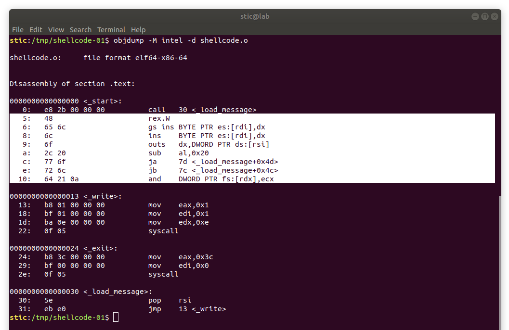
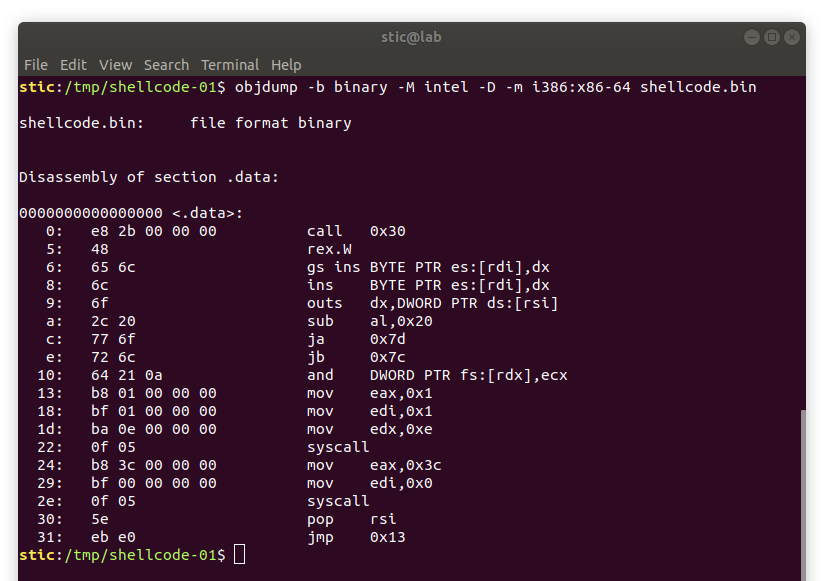
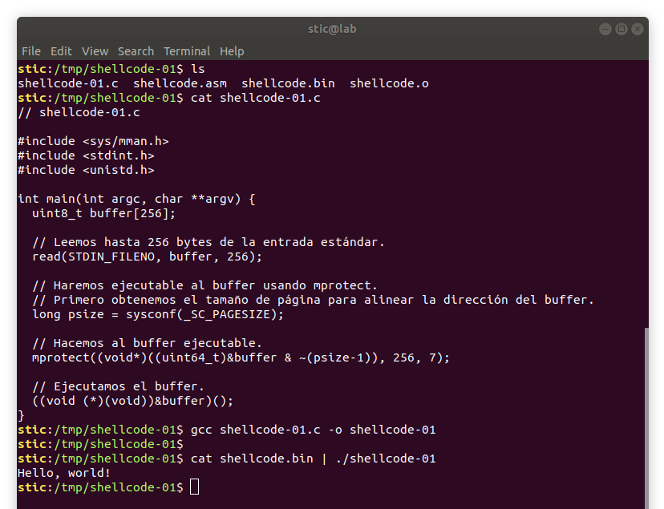

# Shellcode-01

**Objetivo**: Lograr, sin  modificar el código ni el binario generado por el compilador, que el siguiente programa muestre "hello, world!" en la terminal y luego finalice sin error:

```c
// shellcode-01.c

#include <sys/mman.h>
#include <stdint.h>
#include <unistd.h>

int main(int argc, char **argv) {
  uint8_t buffer[256];
    
  // Leemos hasta 256 bytes de la entrada estándar.
  read(STDIN_FILENO, buffer, 256);
    
  // Haremos ejecutable al buffer usando mprotect.
  // Primero obtenemos el tamaño de página para alinear la dirección del buffer.
  long psize = sysconf(_SC_PAGESIZE);
    
  // Hacemos al buffer ejecutable.
  mprotect((void*)((uint64_t)&buffer & ~(psize-1)), 256, 7);
    
  // Ejecutamos el buffer.
  ((void (*)(void))&buffer)();
}
```

**Hint**: Para resolver el ejercicio sirve generar lo que se conoce como [shellcode](https://en.wikipedia.org/wiki/Shellcode). Conviene apuntar a desarrollar shellcode autocontenido, independiente de direcciones absolutas y de estructuras externas al mismo.


## Solución

Estaremos resolviendo este ejercicio en una arquitectura x86-64, en un Ubuntu 18.04. La idea del ejercicio es notar que, en el espacio de memoria de un proceso, la diferencia entre datos y código es meramente lógica. Si el puntero a instrucción llegara a apuntar eventualmente a un buffer en el stack, el procesador intentaría ejecutar el contenido del buffer como si fuesen instrucciones.

El programa del ejercicio recibe una secuencia de bytes por entrada estándar, los guarda en el buffer, hace al buffer ejecutable, y luego ejecuta el contenido del buffer. Lo que debemos hacer entonces es proveer una secuencia de bytes que el procesador pueda interpretar como instrucciones; es decir, debemos proveer código máquina por entrada estándar. Por supuesto, lo que debería hacer este programa en código máquina (nuestro shellcode) es, efectivamente, mostrar "hello, world!".

El problema es entonces producir de alguna forma ese código máquina. Ciertamente, programar a nivel bits no es algo particularmente cómodo, por lo que buscaremos mecanismos alternativos. Concretamente, en este ejercicio estaremos ensamblando un pequeño programa y extrayendo el código máquina del binario con herramientas estándar de Linux. En ejercicios posteriores incorporaremos herramientas adicionales de la suite de Metasploit.


## Escribiendo nuestro shellcode a mano

En esta primera parte lo que haremos es escribir un pequeño programa en assembly x86-64 que mostrará un mensaje en pantalla y luego finalizará limpiamente.

¿Porqué escribimos un programa en assembly y no en C o en C++? ¿Porqué tampoco en Java o en Python? En principio, lenguajes como Java o Python no son tan apropiados para nuestro propósito porque los programas no son compilados directamente a código máquina, que es lo que queremos obtener eventualmente, sino que pasan por intérpretes intermediarios que encapsulan la interacción con el sistema operativo. Lo que necesitamos para resolver nuestro ejercicio es código que pueda ser interpretado directamente por el procesador. Lenguajes como assembly, C o C++, por otro lado, nos resultarán útiles porque se compilan efectivamente a código nativo. Dentro de las tres opciones mencionadas, elegimos assembly porque nos permite generar código pequeño y autocontenido, independiente de estructuras externas. Resulta que los compiladores de C y C++ agregan a los programas generados mucho código "boilerplate" encargado de inicializar el entorno de ejecución (e.g. preparar el stack, las variables de entorno, enlazar bibliotecas, etc.) que para nuestros fines no es necesario. Adicionalmente, los programas generados por dichos compiladores dependen de las funciones en la biblioteca estándar de C. Dicha biblioteca debe ser enlazada en forma dinámica, lo que requiere contar con ciertos datos concretos, en ciertas estructuras de datos, en ciertas ubicaciones en el espacio de memoria del proceso. Como dijimos antes, idealmente nuestro código debería ser independiente de estructuras externas al mismo, por lo que el enlace dinámico no es algo particularmente conveniente. Alternativamente se pueden compilar binarios estáticos, aunque dichos binarios pueden ser bastante extensos; debemos recordar que nosotros solo contamos con un buffer de 256 bytes. En aplicaciones reales usualmente no contaremos con más de unos pocos kilobytes; idealmente, deberíamos diseñar nuestro shellcode para ser lo más pequeño posible. 

Entonces utilizaremos assembly. Para ensamblar y enlazar assembly x86-64 podemos usar nasm, disponible en los repositorios de Ubuntu. Algo que debemos tener en cuenta es que, si queremos que nuestro shellcode haga algo útil, resultará necesario consumir los servicios provistos por el sistema operativo. Los programas escritos en C o en C++ interactuan con el sistema operativo usualmente a través de la biblioteca estándar de C, la cuál encapsula dicha interacción. Como habíamos dicho, sin embargo, nuestro shellcode no debería depender de bibliotecas externas; será necesario entonces interactuar solo mediante la interfaz provista a nivel assembly: las llamadas al sistema o syscalls. Una tabla con las llamadas al sistema provistas por Linux x86-64, con sus correspondientes argumentos, se encuentra disponible en [[1]](http://blog.rchapman.org/posts/Linux_System_Call_Table_for_x86_64/).

El programa puntual que estaremos ensamblando es el siguiente:

```assembly
; shellcode.asm

section .text
    global _start

_start:
    call _load_message
    db "Hello, world!",0xa

_write:
    mov rax, 1
    mov rdi, 1
    mov rdx, 14
    syscall
    
_exit:
    mov rax, 60
    mov rdi, 0
    syscall

_load_message:
    pop rsi
    jmp _write
```

El programa comienza cargando en el registro rsi la dirección del string "Hello, world!", continua ejecutando la llamada al sistema 0x1 (write), y finaliza con una llamada exit. Observaremos que todos los datos necesarios están embebidos dentro de la misma sección de texto, no hay direcciones absolutas, ni símbolos externos. El shellcode es completamente auto suficiente (más allá de la dependencia con el sistema operativo, implícita en las llamadas al sistema).


Para ensamblar el programa con nasm ejecutamos

```bash
nasm -f elf64 -o shellcode.o shellcode.asm
```

Contaremos entonces con un binario shellcode.o que contiene efectivamente nuestro código. Podemos usar objdump para verificar que la sección .text contiene nuestro programa:

```bash
objdump -M intel -d shellcode.o
```



La sección resaltada son los bytes del mensaje "Hello, world!\n" interpretados como instrucciones. Como habíamos mencionado antes, la diferencia entre datos e instrucciones es meramente lógica; podríamos perfectamente intentar ejecutar el mensaje "Hello, world!\n", y las instrucciones que se ejecutarían serían esas seleccionadas. En cualquier caso, el programa está diseñado para que el mensaje nunca sea ejecutado; la primera instrucción llevará la ejecución a _load_message, y luego el salto llevará la ejecución a _write, habiendo evadido la ejecución del string, pero habiendo cargado la dirección del mismo en el registro rsi.


El siguiente paso consiste en extraer la sección .text; debemos recordar que el archivo generado es una estructura de datos que contiene no solo nuestro código sino también datos administrativos que el sistema operativo utiliza para interpretarlo. Nosotros necesitamos solo el código. Ejecutamos

```bash
objcopy -O binary --only-section=.text shellcode.o shellcode.bin
```

para obtener un archivo shellcode.bin que contiene únicamente el código máquina correspondiente a las instrucciones en la sección .text del binario.


Para verificar el contenido del archivo shellcode.bin podemos ejecutar

```bash
objdump -b binary -M intel -D -m i386:x86-64 shellcode.bin
```




Con nuestro shellcode en su lugar compilamos y ejecutamos nuestro programa shellcode-01, pasando el código máquina por entrada estándar. Deberíamos observar algo como lo que se muestra a continuación:




## Aplicaciones

Con este ejercicio pudimos observar que no es imposible inyectar código ejecutable en procesos vivos a través de mecanismos normales de IPC (en este caso la entrada estándar, aunque podrían ser también el vector de argumentos, archivos en disco, sockets, memoria compartida, pipes en general, y posiblemente otras cosas).

Si bien no es usual que un programa simplemente tome código del exterior y lo ejecute, las habilidades para manejar shellcode resultarán importantes en ejercicios posteriores cuando estemos estudiando las vulnerabilidades de corrupción de memoria que los atacantes explotan para lograr ejecutar código arbitrario en sistemas ajenos.

## Referencias

[1] Linux System Call Table for x86 64<br/>http://blog.rchapman.org/posts/Linux_System_Call_Table_for_x86_64/
