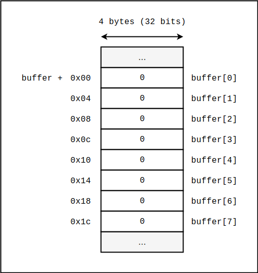
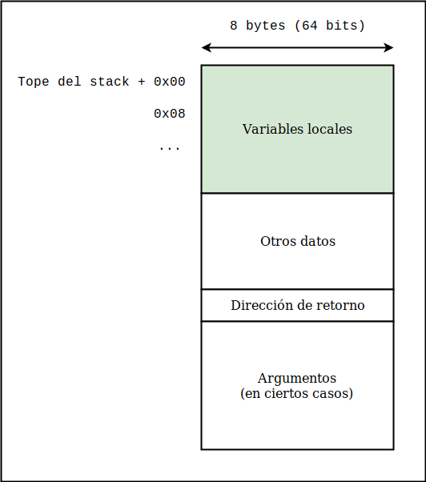
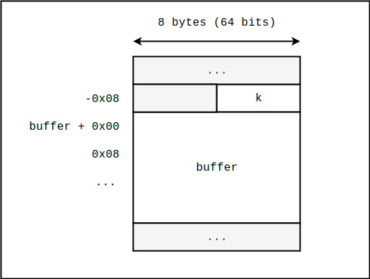
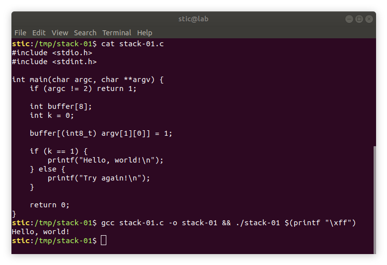

# Stack-01

**Objetivo**: Lograr, sin modificar el código fuente ni el binario compilado, que el siguiente programa muestre en la terminal el mensaje "Hello, world!".

```c
// stack-01.c

#include <stdio.h>
#include <stdint.h>

int main(char argc, char **argv) {
    if (argc != 2) return 1;
    
    int buffer[8];
    int k = 0;
    
    buffer[(int8_t) argv[1][0]] = 1;
    
    if (k == 1) {
        printf("Hello, world!\n");
    } else {
        printf("Try again!\n");
    }
    
    return 0;
}
```


## Solución

La solución de este ejercicio es muy similar a la de [infoleak-02](../../infoleak/infoleak-02/infoleak-02.md). En este caso debemos notar que, controlando el argumento que recibe el programa, podemos obtener una escritura relativa a la dirección de buffer.

Supongamos que, en el instante anterior a ejecutar la asignación relativa a buffer el esquema de memoria es el siguiente:



Evidentemente, ya que el índice a utilizar para indexar el buffer es un argumento provisto por nosotros, tenemos la posibilidad de elegir cuál de todos los enteros de 4 bytes entre buffer[0] y buffer[7] inclusive tomará el valor 1. Resulta, de hecho, que no estamos restrictos a ese rango de direcciones; si observamos el código, no hay nada que nos impida pasarle al programa cualquier valor entre -128 y 127 inclusive.

¿Cómo podemos aprovechar esta particularidad del programa para obtener el resultado deseado? Primero debemos tener en cuenta la estructura del stack frame de la función. Como habíamos mencionado en infoleak-02, los datos administrativos de las funciones en ejecución (e.g. variables locales, argumentos, dirección de retorno) se almacenan en una estructura de datos denominada  stack frame o frame. Los frames viven a su vez en una estructura tipo pila, que se construye en una región del espacio de memoria del proceso denominada stack. En Linux x86-64 el stack frame de la función en ejecución tiene usualmente la siguiente estructura:




A nosotros nos interesa la región indicada en verde, donde se almacenan las variables locales. Las variables locales de la función main de nuestro programa incluyen tanto al buffer como a la variable k, a la cuál debemos asignarle el valor 1 para resolver el problema. Por cuestiones de seguridad que estudiaremos luego, los arreglos suelen almacenarse por encima (en direcciones de memoria más altas) que las variables enteras. Por ejemplo, la sección de variables locales de la función main de nuestro programa podría verse en parte de la siguiente forma:




Lo que debemos hacer entonces es escribir un 1 en la dirección buffer-4, equivalente a buffer[-1]. Efectivamente, observemos que ocurre si ejecutamos

```bash
./stack-01 $(printf "\xff")
```




## Conclusiones

Con este ejercicio tuvimos una primera aproximación a lo que es el abuso de escrituras fuera de los confines de un buffer, dependientes de datos de entrada controlados por nosotros, para controlar el flujo de ejecución de un programa. En ejercicios posteriores estaremos analizando casos cada vez más sofisticados, hasta llegar a la eventual explotación remota de un servidor TCP, inyectando shellcode y obteniendo así una shell remota tal como lo hicimos en el ejercicio [shellcode-02](../../shellcode/shellcode-02/shellcode-02.md).


## Referencias

 [1] Teresa Alberto, STIC. *Guía de auto-estudio para la escritura de exploits: Introducción*.<br/>https://fundacion-sadosky.github.io/guia-escritura-exploits/buffer-overflow/1-introduccion.html

[2] Anley, Heasman, Lindner & Richarte (2007). *The Shellcoder's Handbook*, 2nd edition. Wiley.
