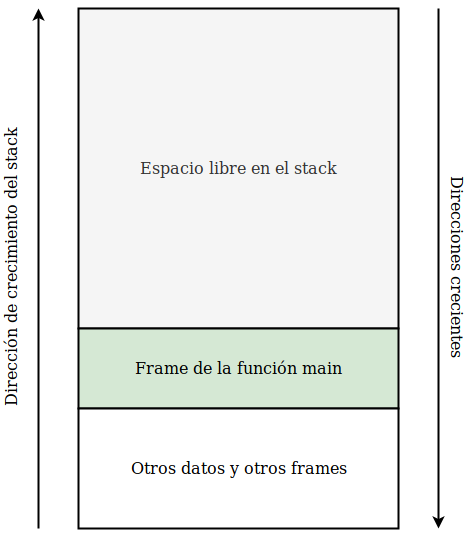
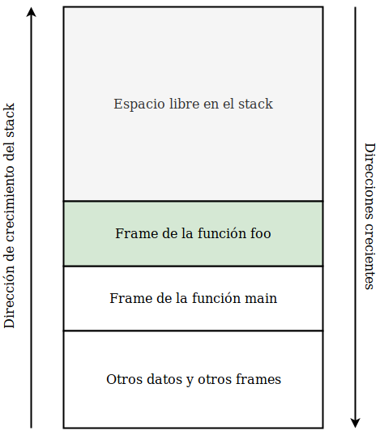
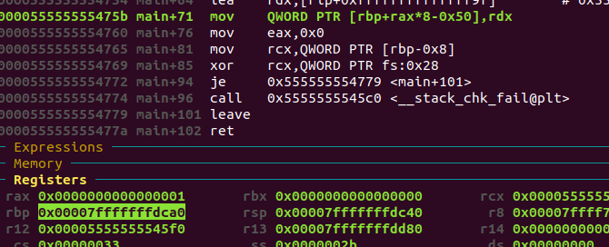
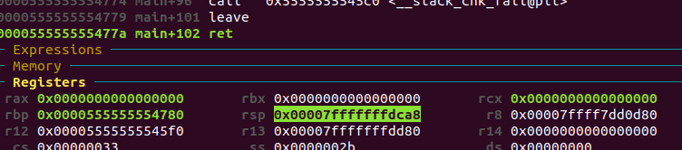
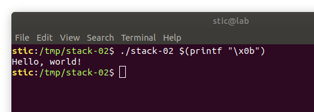

# Stack-02

**Objetivo**: Lograr, sin modificar el código ni el binario compilado, que el siguiente programa ejecute la función runme.

```c
// stack-02.c

#include <stdio.h>
#include <stdint.h>
#include <stdlib.h>

void runme() {
    printf("Hello, world!\n");
    exit(0);
}

int main(char argc, char **argv) {
    if (argc != 2) return 1;
    
    // Creamos un arreglo de punteros a funciones.
    void (*buffer[8])(void);
    
    buffer[(int8_t) argv[1][0]] = runme;
    return 0;
}
```


## Solución

>Para resolver este ejercicio (a conciencia) debemos entender cómo es que se gestiona el flujo de ejecución de un proceso. En esta solución intentamos proveer una explicación más bien de alto nivel de los mecanismos relevantes. Si esta explicación resultara difícil de seguir, en la [introducción teórica a la guía de Teresa Alberto](https://fundacion-sadosky.github.io/guia-escritura-exploits/buffer-overflow/1-introduccion.html) [1] hay una explicación más detallada y más concreta que cubre detalles adicionales que aquí estaremos en cierto modo obviando.
>
>Si bien la introducción en [1] trata con arquitecturas x86, las diferencias entre x86 y x86-64 no son  demasiado significativas. Las diferencias más relevantes son probablemente las siguientes:
>
>* Las direcciones son ahora de 64 bits, no de 32. Adicionalmente, es usual que todas las direcciones tengan al menos dos bytes nulos (e.g. `0x0000____________`).
>* Los registros tienen más capacidad. Antes había registros eax, ebx, ecx, ..., de 32 bits, mientras que ahora hay registros rax, rbx, rcx, ..., de 64 bits. Los registros de x86 siguen pudiendo ser referidos como subregistros.
>* Los argumentos se pasan usualmente en registros, no en el stack. El stack solo se utiliza para pasar argumentos cuando la cantidad supera un cierto mínimo.


Como habíamos mencionado en las soluciones de los ejercicios anteriores, una función en ejecución tiene un correspondiente frame en el stack. Habíamos dicho que un frame es una estructura de datos que almacena datos administrativos de una función en ejecución, y que el stack es la región de memoria donde estos frames se almacenan en forma de pila. Ahora veremos en más detalle cómo es que evoluciona la ejecución de un proceso, y cómo es que podemos abusar de ciertas características del mecanismo para controlar el flujo de ejecución de un programa.


Supongamos que tenemos un cierto programa cuyo comportamiento concreto no nos importa demasiado. Lo único que nos interesa es que el programa tiene una función main, que llama a su vez a una cierta función foo. Nuestro programa podría ser algo como lo siguiente:

```c
void foo() {
    // ...
}

int main(int argc, char **argv) {
    // ...
    foo();
    return 0;
}
```

Supongamos que compilamos el programa y que lo ejecutamos desde la terminal. El sistema operativo creará entonces un nuevo proceso y cargará el binario del programa. Dicho proceso tendrá su propio espacio de memoria virtual, incluyendo su propia región para el stack. Eventualmente, el scheduler del SO decidirá que es tiempo de ejecutar el programa y le asignará tiempo de procesador, comenzando así la ejecución del mismo. La ejecución del programa comenzará a partir de una dirección denominada punto de entrada, definida en la estructura del binario ejecutable. El punto de entrada no necesariamente debe coincidir con la dirección de la función main. Es normal que los compiladores agreguen código adicional que se ejecuta antes de la función main y que se encarga de preparar el entorno de ejecución; uno de los preparativos consiste justamente en inicializar el stack del proceso. Una vez finalizados todos estos preparativos, la ejecución salta a la función main para ejecutar así el programa del usuario. 

Una vez en main, las primeras instrucciones de la función lo que harán es inicializar un frame en el stack para almacenar el estado de ejecución de la misma (e.g. variables, datos administrativos). Dichas instrucciones no son definidas explícitamente por nosotros sino que son insertadas por el compilador. Habiendo finalizado ese proceso de inicialización, el stack del proceso podría verse algo así como lo siguiente:




El stack crece desde las direcciones más altas de memoria hacia las direcciones más bajas. Cuando hablamos del fondo del stack, estamos hablando de las direcciones más altas de la región. En el fondo del stack hay datos y frames que por el momento no nos interesan demasiado. Dichos frames corresponden a las mencionadas funciones de inicialización que se encargan de inicializar el entorno y de eventualmente llamar a main. También podemos mencionar que en el fondo del stack se encuentran las variables de entorno y el vector de argumentos del proceso, aunque por el momento eso es meramente anecdótico; nosotros nos enfocaremos en lo que ocurre desde la función main en adelante.

Supongamos entonces que la ejecución continúa y que eventualmente ocurre la llamada a la función foo. En tal caso, como sería de esperarse, la ejecución saltará a la primera instrucción de foo. Tal como ocurrió con main, las primeras instrucciones de foo crearán un nuevo frame en el stack, produciendo un esquema como el siguiente:




En esta instancia, el frame de la función main todavía existe. Si bien el puntero a instrucción apunta a código en la función foo, conceptualmente la función main todavía está en ejecución. Esto es importante porque, cuando foo termine, la ejecución deberá retornar a main y será necesario recuperar los valores de las variables locales y de otros datos administrativos. En general, cuando una función está por terminar, se ejecuta código que desarma su frame y que eventualmente devuelve el control a la función que la llamó. Nuevamente, el que se encarga de generar el código máquina que maneja todo este procedimiento es el compilador.

Supongamos entonces que está terminando la ejecución de foo y que debemos retornar a main. Es decir, es necesario restablecer el valor del puntero a instrucción para que apunte a la siguiente a instrucción de main a ejecutar. En la [solución del ejercicio stack-01](../stack-01/stack-01.md) habíamos mencionado que en el frame de una función se almacena algo que se llama la "dirección de retorno". La dirección de retorno de un frame es efectivamente la dirección de la siguiente instrucción a ejecutar luego de que la función dueña del frame retorne. Recordamos entonces el esquema:


Este podría ser entonces el esquema del frame de la función foo. Si logramos modificar entonces el valor de la dirección de retorno (abusando de una posibilidad de escribir fuera de los confines de un buffer, por ejemplo), podemos controlar el flujo de ejecución del programa; cuando la función retorne, la ejecución saltará a la dirección que nosotros definamos.


¿Cómo hacemos entonces para resolver el ejercicio en cuestión? Como habíamos mencionado antes, la función main no es la primera función en ejecutarse. Cuando main termina, la ejecución vuelve a una función llamada __libc_start_main. Esto implica que en el frame de la función main hay efectivamente una dirección de retorno, la cuál podemos modificar abusando de nuestra capacidad de escribir fuera de los confines del buffer. En este caso es muy sencillo, ya que no debemos conocer la dirección de la función runme; la dirección de runme es parte de la instrucción de asignación. 

El problema ahora es determinar el índice que debemos pasar como argumento. La forma más simple sería probar valores uno por uno. En este caso funciona porque es un ejemplo muy sencillo; cuando trabajemos con vulnerabilidades reales, sin embargo, necesitaremos algún mecanismo que nos permita estudiar el espacio de memoria del proceso en detalle para desarrollar una entrada adecuada. La herramienta por defecto en entornos Linux es inevitablemente gdb.

Compilamos stack-02 y ejecutamos gdb. En nuestro entorno tenemos en adición a gdb dos complementos que se integran con el debugger: gef y dashboard. El segundo no lo estaremos utilizando ahora; el primero es el que genera la interfaz gráfica que veremos en las capturas.

```bash
gcc stack-02.c -o stack-02 && gdb stack-02
```


Si ejecutamos `disas main` veremos un dump como el siguiente:

```
   0x0000000000000714  <+0>:	push   rbp
   0x0000000000000715  <+1>:	mov    rbp,rsp
   0x0000000000000718  <+4>:	sub    rsp,0x60
   0x000000000000071c  <+8>:	mov    eax,edi
   0x000000000000071e <+10>:	mov    QWORD PTR [rbp-0x60],rsi
   0x0000000000000722 <+14>:	mov    BYTE PTR [rbp-0x54],al
   0x0000000000000725 <+17>:	mov    rax,QWORD PTR fs:0x28
   0x000000000000072e <+26>:	mov    QWORD PTR [rbp-0x8],rax
   0x0000000000000732 <+30>:	xor    eax,eax
   0x0000000000000734 <+32>:	cmp    BYTE PTR [rbp-0x54],0x2
   0x0000000000000738 <+36>:	je     0x741 <main+45>
   0x000000000000073a <+38>:	mov    eax,0x1
   0x000000000000073f <+43>:	jmp    0x765 <main+81>
   0x0000000000000741 <+45>:	mov    rax,QWORD PTR [rbp-0x60]
   0x0000000000000745 <+49>:	add    rax,0x8
   0x0000000000000749 <+53>:	mov    rax,QWORD PTR [rax]
   0x000000000000074c <+56>:	movzx  eax,BYTE PTR [rax]
   0x000000000000074f <+59>:	movsx  eax,al
   0x0000000000000752 <+62>:	cdqe   
   0x0000000000000754 <+64>:	lea    rdx,[rip+0xffffffffffffff9f]
   0x000000000000075b <+71>:	mov    QWORD PTR [rbp+rax*8-0x50],rdx
   0x0000000000000760 <+76>:	mov    eax,0x0
   0x0000000000000765 <+81>:	mov    rcx,QWORD PTR [rbp-0x8]
   0x0000000000000769 <+85>:	xor    rcx,QWORD PTR fs:0x28
   0x0000000000000772 <+94>:	je     0x779 <main+101>
   0x0000000000000774 <+96>:	call   0x5c0 <__stack_chk_fail@plt>
   0x0000000000000779 <+101>:	leave  
   0x000000000000077a <+102>:	ret 
```

La última instrucción de la función main es ret. Ret toma el valor de 64 bits en el tope del stack y lo guarda en el puntero a instrucción. Para ese momento el stack frame de main habrá sido desarmado casi por completo: en el tope del stack solo quedará la dirección de retorno. En general también podría darse que luego de la dirección de retorno haya argumentos, aunque quien se encarga de sacarlos de la pila es la función que llama (que es también la que los apila), y no la que está finalizando. En x64, los argumentos se pasan por defecto en registros; el stack solo se utiliza para pasar argumentos si la cantidad a pasar es mayor a un cierto mínimo.

Continuando, lo que queremos obtener esencialmente es la distancia desde el inicio del buffer hasta la dirección de retorno. Si leemos un poco el código observaremos que, al momento de ejecutar main+71, la dirección del buffer (mas un offset de 0x50 bytes) estará almacenada en el registro rbp. Lo que podemos hacer entonces es lo siguiente: ponemos breakpoints en main+71 y en main+102, y ejecutamos el programa con algún argumento cualquiera.

```
b *main+71
b *main+102

run $(printf "\x01")
```

Observaremos primero algo como lo siguiente:



En el panel superior está el código del programa. La próxima instrucción a ejecutar es efectivamente aquella en main+71. El panel inferior, "Registers", muestra el valor de todos los registros. Deducimos entonces que el buffer comienza a partir de `0x7fffffffdca0 - 0x50`.

Si ahora escribimos `continue` deberíamos observar algo como lo siguiente:



La ejecución corta en main+102, justo antes de ejecutar ret. Notamos entonces que el registro rsp tiene el valor `0x7fffffffdca8`. Normalmente, rsp apunta al tope del stack. En este momento, lo que hay en el tope del stack es efectivamente la dirección de retorno. La distancia en bytes desde el inicio del buffer hasta la dirección de retorno debe ser entonces 

```
0xdca8 - (0xdca0 - 0x50) = 0x58
```


Los punteros en x64 son valores de 8 bytes, así que el índice que debemos pasar (que indexa a un arreglo de punteros) es `0x58/8 = 0xb`. Finalizamos entonces la ejecución con `quit` y ejecutamos

```bash
./stack-02 $(printf "\x0b")
```



Observamos que, efectivamente, la función runme fue ejecutada.


**Nota 1**: Si intentamos reproducir este experimento varias veces notaremos que las direcciones absolutas varían de ejecución a ejecución. Esto es algo normal. Estaremos analizando el fenómeno en más detalle luego cuando estudiemos técnicas de explotación y mitigaciones. Por el momento cabe mencionar que si bien las direcciones absolutas suelen variar de una ejecución a otra, las direcciones relativas (e.g. los offsets, las distancias de un elemento a otro) dentro de una misma sección (e.g. el stack) suelen permanecer constantes entre ejecuciones.

**Nota 2**: Es importante mencionar que la estructura del stack frame depende del código del programa. El código a su vez depende del compilador. Versiones de compiladores distintas podrían generar código diferente, y podría darse que la distancia entre elementos también sea diferente. Distintas opciones de compilación también podrían generar código distinto. Cuando estemos desarrollando exploits tendremos que tener muy presente la versión del software con el cuál estamos trabajando, incluyendo versión del compilador, del sistema operativo, de las bibliotecas del sistema, etc.


## Conclusiones

Con este ejercicio pudimos ver como a veces es posible controlar el flujo de ejecución de un programa simplemente pasando una entrada adecuada. En ciertas condiciones un atacante puede proveer una entrada cuidadosamente diseñada para lograr que un programa ajeno se comporte según su intención. Estas entradas son provistas usualmente a través de archivos, o mediante mensajes enviados a través de la red. Tendremos la oportunidad de explorar estas posibilidades en más detalle en ejercicios posteriores.


## Lecturas recomendadas

[1] Alberto, Teresa (STIC). *Guía de auto-estudio para la escritura de exploits: Introducción*.<br/>https://fundacion-sadosky.github.io/guia-escritura-exploits/buffer-overflow/1-introduccion.html