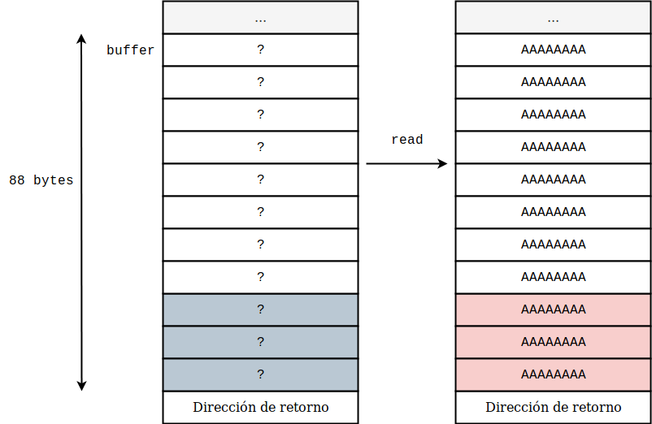
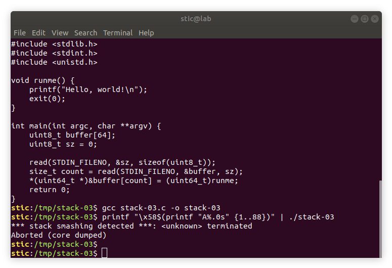
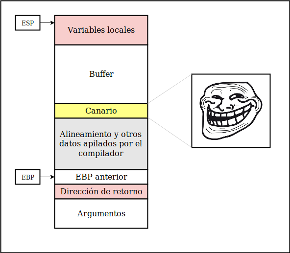
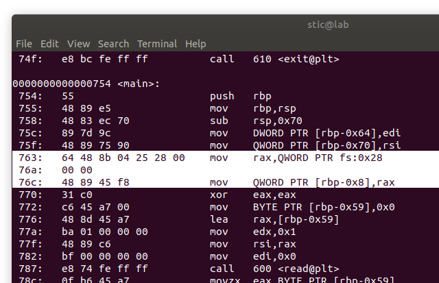
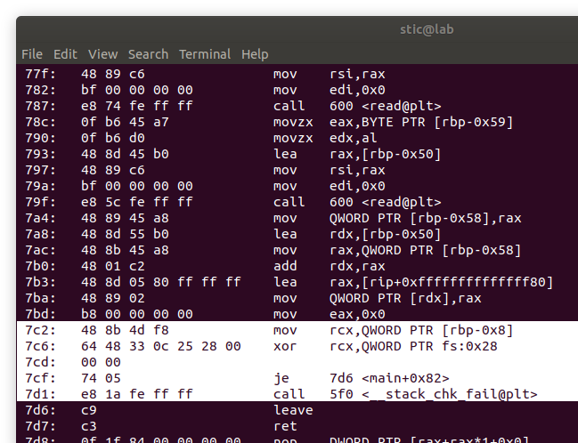
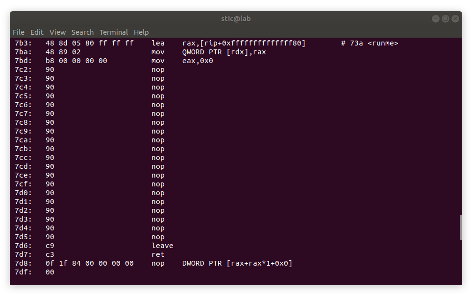
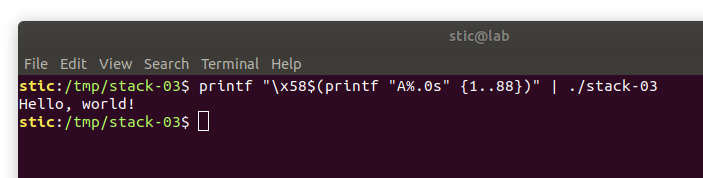

# Stack-03

**Objetivo**: Lograr, sin editar el código, que el siguiente programa ejecute la función runme. Se permite editar el binario. Los detalles están comentados en el código:

```c
/*
 * stack-03.c
 *
 * Nuestro objetivo final es lograr, sin modificar el código fuente,
 * que el programa ejecute la función runme.
 *
 * Instrucciones:
 * 
 * 1. Compilar el programa con gcc stack-03.c -o stack-03
 *
 * 2. Desarrollar una entrada que cambie la dirección de retorno de main 
 *    para que apunte a runme. ¿Porqué no funciona? ¿Porqué main no retorna a runme?
 *
 * 3. Parchear el binario para lograr que main retorne a runme.
 *
 */

#include <stdio.h>
#include <stdlib.h>
#include <stdint.h>
#include <unistd.h>

void runme() {
    printf("Hello, world!\n");
    exit(0);
}

int main(int argc, char **argv) {
    uint8_t buffer[64];
    uint8_t sz = 0;

    read(STDIN_FILENO, &sz, sizeof(uint8_t));
    size_t count = read(STDIN_FILENO, &buffer, sz);
    
    *(uint64_t *)&buffer[count] = (uint64_t)runme;
    
    return 0;
}
```


## Solución

Lo que tenemos aquí es un ejemplo simplificado y más bien didáctico de una vulnerabilidad clásica llamada **stack overflow**. Dicha vulnerabilidad se popularizó con un paper de Aleph One, publicado en la revista Phrack en 1996 [1]. La idea del stack overflow clásico es aprovecharse de los supuestos generosos en los que se basa un programa para desbordar un buffer y lograr así la eventual escritura de la dirección de retorno, lo cuál permite a su vez el eventual control del flujo de ejecución del programa. 

En este caso concreto vemos que el programa lee el primer byte de la entrada estándar y utiliza ese valor para determinar cuántos bytes continuar leyendo. La entrada, sin embargo, está potencialmente en control de un atacante: nada le impide al atacante pasar un primer byte con valor mayor a 64, lo cuál causaría que read desborde el buffer y continue escribiendo a direcciones más altas, pisando eventualmente la dirección de retorno.

Supongamos que la distancia en bytes desde el inicio del buffer hasta la dirección de retorno es de 88 bytes. Tendríamos entonces que la entrada generada por

```
printf "\x58$(printf "A%.0s" {1..88})"
```

 (un byte 88 seguido de una secuencia de 88 caracteres 'A') resulta en el siguiente esquema:





Lo que ocurririá en el caso concreto de este ejercicio es que, habiendo leído 88 bytes, la última asignación reemplazará la dirección de retorno por la dirección de runme, logrando la eventual ejecución de la función cuando main retorne.

Clásicamente, en el desborde de Aleph One, uno continuaría escribiendo hasta pisar la dirección de retorno inclusive. La idea original era reemplazar la dirección de retorno por la dirección del buffer logrando así que, cuando main retornara, la ejecución saltara efectivamente al buffer. En el buffer no habría entonces caracteres 'A', sino que habría shellcode que ejecutaría las acciones designadas por el atacante. Este es el primer ejemplo completo que vemos en la guía de un ataque que logra explotar una escritura fuera de los confines de un buffer para ejecutar shellcode inyectado por el atacante. A este tipo de exploits se los llama "de ejecución de código arbitrario", porque le permiten al atacante ejecutar código sin ningún tipo de restricción más allá de los recursos disponibles y de los permisos del proceso vulnerado.

El paper de Aleph One, sin embargo, ya tiene más de 20 años. Razonablemente, con el tiempo fueron surgiendo diversas mitigaciones que evitan que ataques tan simples sean exitosos. En este ejercicio seremos expuestos a una de las mitigaciones más relevantes y más ampliamente adoptadas. Si compilamos el programa y ejecutamos

```bash
printf "\x58$(printf "A%.0s" {1..88})" | ./stack-03
```



Observaremos que la ejecución termina con un error inesperado:

```
*** stack smashing detected ***
```


La causa de este problema es una mitigación llamada **Stack Protector**. Dicha mitigación se implementa a nivel compilador. Lo que hace Stack Protector es lo siguiente: cuando el compilador detecta que una cierta función tiene un buffer más grande que una cierta cantidad de bytes, se toma algunas precauciones al momento de generar el código de la misma. En principio, el código que arma el frame de la función colocará las variables locales en direcciones por debajo del inicio del buffer; es decir, los arreglos comienzan a partir de direcciones más altas que el resto de las variables locales. Esto impide que un desborde como el que vimos en este ejercicio le permita a un atacante pisar variables locales que puedan servirle para controlar el flujo de ejecución del programa, al menos en forma limitada (e.g. un booleano "autorizado" o "no autorizado", como ejemplo sencillo). Esto no impide, sin embargo, que el desborde le permita al atacante pisar eventualmente la dirección de retorno. Allí es donde toma relevancia otra componente de Stack Protector: el sistema del canario. Los canarios funcionan de la siguiente forma: al inicio de la ejecución de una función protegida hay un stub de código insertado por el compilador que lo que hace es apilar en el stack un valor denominado **canario**. Luego, cuando la función está por finalizar, hay un stub de código adicional que desapila el valor del canario y verifica que el valor desapilado coincida con el valor original. El valor original se almacena en una estructura de datos del proceso, fuera del stack, por lo que un desborde como el que vimos no puede modificarlo. Si los valores difieren al momento de compararlos, el programa finaliza con un error como el que se muestra en la captura anterior. Resumiendo gráficamente, el esquema del frame de una función protegida es usualmente algo similar al que se muestra a continuación:





Un desborde como el de este ejercicio pisa todo desde el inicio del buffer hasta la dirección que queremos escribir, con lo cuál estaremos inevitablemente pisando también el canario. Con ello, la función no retornará y no podremos controlar el flujo de ejecución.

¿Implica esto que ya no es posible modificar la dirección de retorno?  No, no necesariamente. Como vimos en ejercicios anteriores, hay ciertas escrituras que no necesariamente requieren pisar el canario para sobrescribir la dirección de retorno. En general existen distintos casos de escritura fuera de los confines de un buffer, cada una con sus particularidades. Estaremos estudiando varias alternativas luego cuando hablemos de primitivas de escritura. El caso concreto de este ejercicio, sin embargo, fue particularmente relevante porque se manifestaba muy usualmente cuando se utilizaban funciones que hoy se consideran inseguras, como strcpy o gets. En la guía de Teresa Alberto hay una [explicación muy detallada](https://fundacion-sadosky.github.io/guia-escritura-exploits/buffer-overflow/2-practica.html#ataque-smash-the-stack-con-inyección-de-código) [2] del proceso clásico de explotación de un stack overflow en x86 que logra ejecutar código arbitrario en un entorno sin mitigaciones. Se recomienda fuertemente familiarizarse con el procedimiento clásico antes de estudiar las técnicas que veremos en ejercicios posteriores.

Para este ejercicio, por otro lado, nos limitaremos a parchear el binario para lograr que nuestra entrada no alerte a Stack Protector. La finalidad del ejercicio es meramente analizar el funcionamiento del canario en detalle; en general, a un atacante no le será posible modificar el binario que quiere atacar. Usualmente, los ataques se dan o a través de la red (e.g. explotando una vulnerabilidad en un servidor remoto a través de un socket), o mediante archivos (e.g. una víctima abre un archivo malicioso que explota una vulnerabilidad en el software lector), o localmente, atacando procesos que se ejecutan con privilegios elevados y cuyos correspondientes binarios no pueden ser modificados por cualquier usuario.


Si utilizamos objdump para desensamblar el programa observaremos algo como lo siguiente:

```bash
objdump -M intel -d ./stack-03
```



Vemos que al principio de la función main hay un procedimiento un tanto sospechoso. Vemos que se toma una qword de "fs:0x28" y se la guarda en el frame de la función, 8 bytes bajo la dirección a la que apunta rbp. Luego, si observamos cerca del final de la función, veremos lo siguiente:



Vemos que el código toma el valor que antes había sido almacenado en el frame y lo compara con el valor original en fs:0x28. Si los valores son iguales la ejecución salta a 7d6, la finalización normal de la función. Si los valores difieren, por otro lado, se ejecuta una función "__stack_chk_fail". Dicha función no es otra que la encargada de finalizar el programa mostrando antes el mensaje de error que habíamos visto antes, "stack smashing detected".

Para finalizar el ejercicio podemos, entre otras posibilidades, reemplazar todo desde 7c2 hasta 7d5 inclusive (el código resaltado en la última captura) por instrucciones nop (byte 0x90). Para parchear el binario podemos usar radare2, aunque también podríamos utilizar el siguiente comando:

```bash
printf "\x90%.0s" {1..20} | dd of=./stack-03 bs=1 seek=1986 count=20 conv=notrunc
```


El dump resultante, obtenido usando objdump nuevamente, debería ser algo como lo siguiente:




Si probamos la entrada nuevamente observaremos cómo esta vez el programa finaliza como lo esperaríamos, sin el mensaje de error de __stack_chk_fail.

```bash
printf "\x58$(printf "A%.0s" {1..88})" | ./stack-03
```




## Conclusión

En este ejercicio planteamos la posibilidad de explotar una escritura fuera de los confines de un buffer en algún proceso remoto para controlar el flujo de ejecución del programa, redireccionando la ejecución a shellcode inyectado previamente para lograr ejecutar código arbitrario. También mencionamos que hoy en día existen mitigaciones que impiden que el ataque sea tan fácil de ejecutar. En ejercicios posteriores estaremos viendo estas mitigaciones en detalle, y estaremos viendo también las técnicas más usualmente utilizadas para vencerlas.


## Referencias

[1] Aleph One (1996). *Smashing the Stack for Fun and Profit*. Phrack Magazine, Issue 49.

[2] Alberto, Teresa. *Guía de auto-estudio para la escritura de exploits: Ataque "Smash the Stack" II*.<br/>https://fundacion-sadosky.github.io/guia-escritura-exploits/buffer-overflow/2-practica.html#ataque-smash-the-stack-con-inyección-de-código
