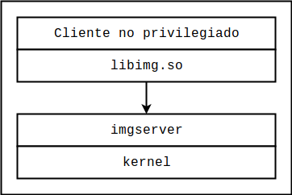

# ABO++ : Final Boss, Intro

La idea de esta introducción es documentar el programa que sirve como ejercicio final a la segunda parte de ABO++. La idea es explotar el programa activando todas las mitigaciones que vimos en la primera parte, en adición a otras dos mitigaciones implementadas por Clang: CFI y SafeStack, las cuales ya hemos estudiado.


## Concepto

Como existen exploits de ejecución remota de código, que permiten inyectar código en sistemas remotos vulnerables, también existen exploits locales, usualmente orientados a escalar privilegios para adquirir capacidades que de otra forma no estarían disponibles. Por ejemplo, un atacante que ya ha obtenido ejecución remota de código comprometiendo algún servidor con bajos privilegios podría luego explotar alguna vulnerabilidad en el kernel mediante syscalls para lograr control total sobre el sistema objetivo.

[En una charla en la ekoparty 2017](https://www.youtube.com/watch?v=s4oreYAKikg), por ejemplo, Nicolas Economou describió un mecanismo de explotación que permitiría desarrollar primitivas de lectura y escritura arbitrarias en el kernel de Windows mediante la explotación del mecanismo de gestión de objetos gráficos. Este ejercicio está en parte inspirado por dicha presentación.


La idea del ejercicio es la siguiente: el programa objetivo que estaremos atacando consiste en un servidor (imaginemos privilegiado) que gestiona la presentación de imágenes en algún dispositivo cuyos detalles, para los fines del ejercicio, no son importantes. El servidor expone una interfaz que le permite a procesos no privilegiados gestionar la creación de imagenes para mostrarlas en pantalla. El servidor se llama `imgserver`, y la interacción con el servidor se da a través de una biblioteca llamada `libimg.so`. La arquitectura es como la que se muestra a continuación:



Si bien no es demasiado relevante para el ejercicio (en el código simplemente hay una función vacía), podemos suponer que `imgserver` tiene permisos para interactuar con el sistema de gestión de la pantalla que las aplicaciones no privilegiadas no tienen, implementando internamente las tareas necesarias e interactuando con el kernel para mostrar eventualmente las imágenes en el dispositivo. En cualquier caso, el objetivo del ejercicio es, concretamente, explotar el mecanismo de gestión de imágenes de `imgserver` para lograr ejecutar código arbitrario en el contexto del proceso.


## Componentes

El sistema consiste en tres componentes:

* `imgserver`: Un servidor que funciona con stream sockets de UNIX. Para simplificar el ejercicio, el servidor crea un socket `/tmp/imgserver`, y cada conexión es un solo mensaje. En cualquier caso, la interacción con el servidor está encapsulada en la biblioteca libimg, la cuál detallaremos luego. El código del servidor consiste en los siguientes archivos:

  * `imgserver.cpp`: El archivo principal, donde se define la función `main` y los procedimientos de inicialización del servidor.
  * `imgserver-handler.cpp` e `imgserver-handler.h`: Estos archivos definen el sistema de gestión de pedidos y su interfaz.
  * `imgserver-types.cpp` e `imgserver-types.h`: Estos archivos definen los objetos que representan imágenes. Se define una clase abstracta `Image` de la que todos los objetos tipo imagen heredan; para simplificar el ejercicio, sin embargo, solo se define una clase concreta `GrayscaleImage`, con un formato de imagen muy simple en el que hay un byte por pixel, y cada byte representa la intensidad del pixel en cuestión, de 0 a 255.
  * `imgcommon.h`: Este archivo define tipos de datos comunes entre el servidor y la biblioteca.

* `libimg.so`: Esta biblioteca implementa la interacción con el servidor. Consiste en dos archivos `libimg.h` y `libimg.c`. En adición, la biblioteca utiliza también el archivo `imgcommon.h`. Las funciones expuestas por la biblioteca para ser utilizadas por los clientes se listan a continuación; por documentación más detallada, consultar `libimg.h`.

  * `img_init`: Esta función inicializa el sistema de comunicación con el servidor, y debe ser llamada antes que cualquier otra.
  * `make_grayscale_image`: Permite crear una imagen del lado del servidor. La función recibe ancho y alto en píxeles, y recibe también un arreglo de ancho*alto bytes. La función devuelve un handle que puede ser utilizado en llamadas posteriores para operar sobre la imagen en cuestión.
  * `free_grayscale_image`: Esta función permite liberar imágenes que ya no están en uso. La función recibe un handle que identifica a una imagen previamente creada mediante `make_grayscale_image`.
  * `get_grayscale_image_bytes`: Esta función permite recuperar las dimensiones y los bytes asociados a la imagen identificada por un cierto handle. La imagen debe haber sido creada previamente mediante una llamada a `make_grayscale_image`.
  * `set_grayscale_image_bytes`: Esta función permite establecer una nueva secuencia de bytes para la imagen identificada por el handle provisto como argumento. Nuevamente, la imagen debe haber sido creada previamente.

* Cliente. El cliente es el que debe enlazarse con `libimg.so` y utilizar las funciones expuestas para consumir los servicios provistos por el servidor. El cliente puede ser cualquier aplicación arbitraria que pueda hacer uso  `libimg.so`.

  > Hint: Alternativamente, el cliente puede implementar sus propios mecanismos de comunicación, o modificar los existentes. Al momento de escribir un exploit, puede resultar conveniente descartar las capas de abstracción y operar en el nivel más bajo directamente. En cualquier caso, modificar la biblioteca libimg es también una operación válida.

Por información adicional, consultar el código fuente del servidor y de la biblioteca.


## Compilación y ejecución

Para compilar el servidor se puede usar el script `compile-server-n-lib.sh`:

```bash
#!/bin/bash

# Compilamos el servidor con SafeStack y CFI.
clang++-8 -g imgserver.cpp imgserver-handler.cpp imgserver-types.cpp -pie -fstack-protector -fsanitize=safe-stack -fsanitize=cfi -flto -fvisibility=hidden -Wl,-z,relro,-z,now -o imgserver

# Compilamos la biblioteca.
clang-8 -g libimg.c -shared -fPIC -o libimg.so
```

Observamos que se usa el compilador de C++ de Clang. Observaremos también que se habilitan explícitamente todas las mitigaciones que estudiamos en la primera parte, y también CFI y SafeStack. El segundo comando compila la biblioteca (en C) como un .so dinámicamente enlazado.

Para ejecutar el servidor, solo hace falta ejecutar el binario generado `imgserver` desde la terminal. El archivo `libimg.so` será utilizado luego al momento de compilar el cliente.

Para compilar el cliente, podemos usar el script `compile-client.sh`:

```bash
#!/bin/bash

# Compilamos el cliente, enlazando con libimg.so
clang-8 client.c -g -L. -limg -o client
```

La opción `-L.` le indica al compilador que debe buscar las bibliotecas dinámicas en el directorio de trabajo. La opción `-limg` le indica al compilador que busque una biblioteca `libimg.so`. Desarrollar un cliente adecuado (y eventualmente un exploit que logre ejecutar código arbitrario) es la tarea del ejercicio.

Para ejecutar el cliente sin tener que copiar bibliotecas se puede definir la variable de entorno `LD_LIBRARY_PATH`. Por ejemplo, suponiendo que se cuenta con un cliente compilado `client`, se puede ejecutar de la siguiente forma:

```bash
LD_LIBRARY_PATH=. ./client
```

Esto le indica al linker que busque las bibliotecas a enlazar dinámicamente en el directorio de trabajo. Por supuesto, la biblioteca `libimg.so` debe estar allí.